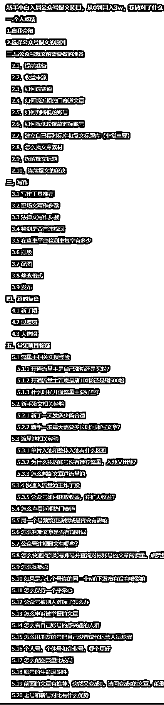

# 新手小白入局公众号爆文项目，从 0 到月入 3w，我做对了什么

> 原文：[`www.yuque.com/for_lazy/thfiu8/tvyaprbs8o9figi2`](https://www.yuque.com/for_lazy/thfiu8/tvyaprbs8o9figi2)

## (82 赞)新手小白入局公众号爆文项目，从 0 到月入 3w，我做对了什么

作者： 苓枫

日期：2024-03-28

大家好，我是苓风，目前主业是开发工程师，副业公众号爆文。

1 月份参加生财公众号爆文航海实战，航海期间总收益 5000+，获取航海第三名，爆文单篇阅读量最高 20w。

航海结束之后我依然保持着每天复盘的习惯，不断的研究，不断的测新号，终于做到千万爆文创作者，月入 3w

做爆文项目之前，我也做过拼多多虚拟电商、抖店、小红书教资、直播切片、短剧 CPS，中视频、漫画解说等，总的来说亏得比较多，1 月前，我还是一个公众号爆文项目新手，这篇文章我会把我在航海期间学的东西，全都分享一遍，包括我自己是如何在航海结束后进行复盘的，希望对大家能有一点小小的帮助。

本文大约 12500 字，阅读大约需要 10 分钟

《新手小白入局公众号爆文项目，从 0 到月入 3w，我做对了什么》：

[新手小白入局公众号爆文项目，从 0 到月入 3w，我做对了什么](https://nq8z5e1mte.feishu.cn/docx/VsjEdZ1BQoDEVJxILOpcNqamnUf?from=from_copylink)

大纲如下，如果本篇帖子对你有帮助的话，麻烦动动你的小手点个赞

最后，@智慧和@靠谱姐的指导，也感谢生财这个平台，提供的实战航海，让我们这些观望的人都有机会去实操

* * *

评论区：

Yye-柏寒 : 牛逼哥，按照哥的标准做，月入三万不是梦！
苓枫 : 寒哥也牛批，志愿者小组第一，视频号老年变现赛道一周就爆了[强]
浪久 : 🐮
张稳健 : 00 后小凤哥，年纪轻轻，大有可为[强][强][强]
苓枫 : 哈哈，谢稳健哥夸赞，我也是看了你的精选文章，感悟颇深
逍遥公子 : 优秀[强]
皕芊 : 优秀
苓枫 : 🍺

* * *