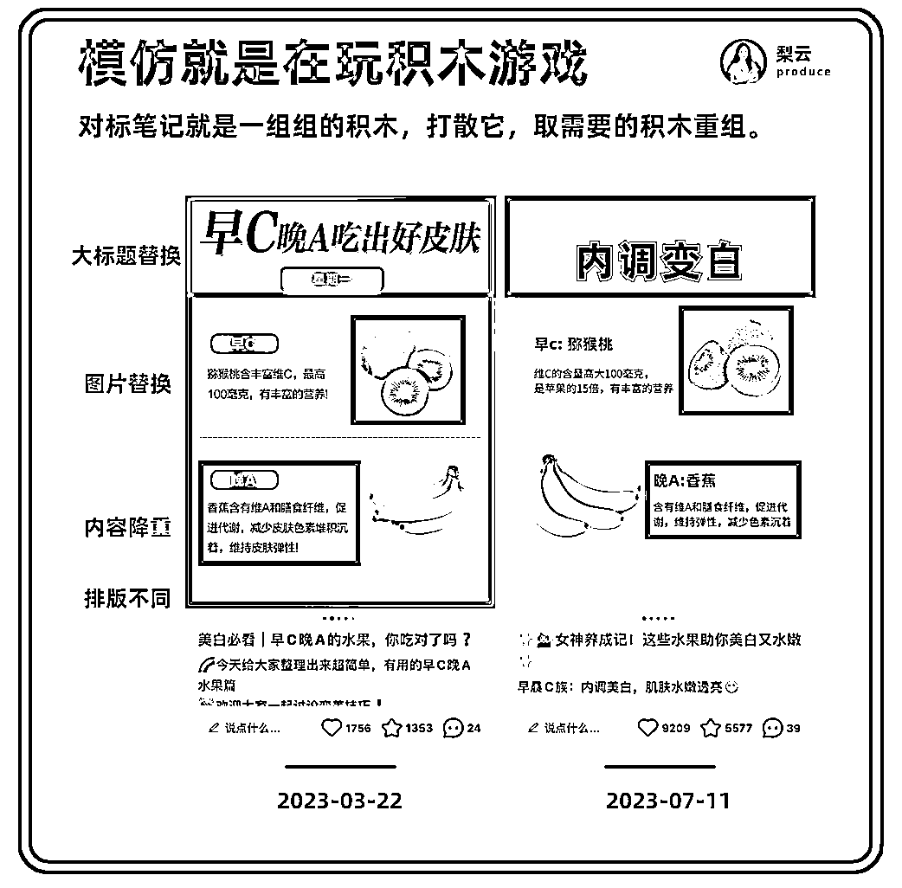

# 小红书越做越没流量？像素级带你高效模仿爆款笔记

> 原文：[`www.yuque.com/for_lazy/thfiu8/qfrw3ulkpc4el2dx`](https://www.yuque.com/for_lazy/thfiu8/qfrw3ulkpc4el2dx)

## (199 赞)小红书越做越没流量？像素级带你高效模仿爆款笔记

作者： 梨云

日期：2024-03-29

圈友们好，我是梨云，自媒体创业者。

小红书上春晚了，今年红利大势所趋。

下意识你会认为，更多人入局小红书了，它会十倍增长的卷，不过，当你入局就会发现，你已经超过 60%的人了，因为很多人其实都在观望，并没有下场。

当你发布第一篇笔记，你就超过了 70%的人，因为很多人卡在定位、对标、笔记创作上；当你发布第 10 篇笔记，你就超过了 80%的人，因为再跑的过程中，又有很多人半途而废。

为什么很多人没法坚持？因为他花了一天时间，辛辛苦苦做了自认为不错的笔记，发出去 2、3 个赞，你说崩不崩溃？坚持发了 5、6 篇没涨粉，直接放弃。

为什么会这样？因为你不愿意承认自己是普通人。既然不是天才，就别想着发 1 篇就爆款，发 10 篇就爆单，尤其是新人，你一定要敢于接受试错和失败，在复盘的基础上，反复迭代，才能更靠近成功。

有些人发个笔记就很多点赞评论，说明他本身就能融入小红书这个平台，并且网感基础很不错，但更多人他对于用户的理解、内容的运营，还把握不住。

有人在坚持的时候，总是疑虑，风口过啦，红利没啦，坚持还有没有意义啦？

很多新人总是在换项目，其实老项目依然可以赚钱，红利褪去，赚钱依然在赚钱，比如我团队助理虚拟资料搞了一年，依然还在盈利，商单变现尽量去选择高净值赛道，广告报价能去到粉丝量 10%以上，比如美妆、护肤、家居、家电、珠宝等，后文也会具体讲 14 个推荐赛道 50 个对标方向。

一定要敢在正确的道路上走下去，而在小红书里，内容红利日益向上，为了让大家把握这个点，此前，我在[`t.zsxq.com/188bLAuq7`](https://t.zsxq.com/188bLAuq7)讲过，**我们在做内容创作的时候，需要追求内容和形式的统一的，并且讲了素材如何搜集。**

那么今天，梨云会从认知到方法，3 个模块，和大家分享它的姊妹篇——如何做好小红书内容运营，珠联璧合，所向披靡！

## **一、怎样才能写出爆款**

我们都承认，这是一个内容为王的时代，换位思考一下，是不是连你自己，都希望在生财，看到高质量精华帖，那么在小红书的用户，又何尝不是如此？

但是，当我们作为创作者，却常常不知道什么是好内容，于是，掏心掏肺、有话直说，认为花时间打磨出来的笔记，就是好内容，就得出爆款，发出去，事与愿违。

#### 1、**好内容只有用户说了算**

我曾经看过一个段子，大概意思是：你按照自己的喜好打磨出来的产品，最后就只能卖给你自己。

这真的太 TM 生动了！放到小红书也是这样，原因就在于，你没有真正理解，什么是好内容。

是不是好内容的评判标准，从来不在你的手上，也不在平台手上，而是在用户手上。

用户愿意为你的内容点赞、转粉，品牌方愿意因此给你合作，就是好内容！

用户愿意跟到你的私域里面去，愿意被你私域转化去买产品，就是好内容！

用户愿意通过你的笔记，点击商品的购买链接，去快速下单，就是好内容！

总结起来就是，让用户认可的，就是好内容，把用户转化的，就是好内容。

这时候，你突然顿悟了，原来要写出好内容、要写出爆款，就是要围着用户转，围着他们的需求、喜好转。

你听完后立马去做，发了一篇笔记，回来像焉了的茄子：梨云你说的不对！我内容都围绕用户转了，为什么还没爆款？

#### 2、爆款是综合作用的结果

很多人在做小红书的时候，会陷入到一种“做了 A 必然 B”的直线因果思维。

我健身了一下午，怎么还没八块腹肌？这想法你觉得很离谱吧，但放到小红书，就是新人常见的内心 SO：

我套用了爆款模板，它怎么没爆款？我参考的爆款标题，它怎么没爆款？我发了 10 篇笔记，它怎么没爆款！

为什么会这样？因为新人没有认识到一个客观事实：爆款是综合作用的结果。

你在刷小红书的时候，一定会发现这样的神奇现象：明明一样的内容，但数据表现完全不同，你一定非常疑惑。

一个笔记之所以能爆，是内容、数量、排版等可控因素，和突发热点、初始推荐用户、匹配性等不可控因素，共同起效的结果。

所以，不存在说我把某个点做到位，就一定能爆款。

记得当时，不管是早期 3 个月涨粉 1w 的心理学号，还是后来 3 个月涨粉 18w 的学习号，我都是从发布笔记的第一天开始，就连续日更了 100 天！

这就要求我们，一定要用概率的思维去看问题。

#### 3、如何去增加爆款的概率

用概率的思维来看，想要提升爆款，就要把握自己可控的爆款要素。

从全面的角度出发，内容运营、账号运营、用户运营、数据运营，这四块包含了基础的爆款要素。

如何得知自己对这些内容的了解呢？梨云在过年的时候，没有放假，给大家整理了 100 个小红书基础运营知识，就是为此而生。

飞书链接直达：[小红书运营实战 100 问](https://yqv4i1yj9z.feishu.cn/docx/ThYhdB1BDoIezexqrhgcamtanTg?from=from_copylink)

你可以看题不看答案，测一测自己会做多少，**欢迎在评论区分享你的正确率~**

当然了，在这所有的要素里面，对标爆款，是增加爆款概率，最快的捷径。

## 二、如何高效对标爆款

在讲怎么找对标之前，我得先打破新人做小红书的一个致命思维，否则，你下场必死无疑。

#### 1、不找对标必然走向死路

对标很重要，但是！很多人刚入局小红书，写笔记有很严重的原创情节，就是不愿意对标模仿。

结果就是，笔记写的辛辛苦苦，流量来的零零星星。

在我看来，原创和模仿，一点都不对立，它不应该成为你做小红书的阻碍。

我们学写字，都知道临摹字帖，1 比 1 像素级模仿，这个小学都会的思维，怎么长大后，就全忘了。

为了打破新人这个心理卡点，我便规划了小红书博主成长三阶段，带出了 守破离 这个模型。

##### **守，就是像素级模仿**

刚入门的新人，以及不知道怎么运气好，就把小红书做起来的人，都在这个阶段。

你需要的是认认真真看生财的小红书手册，体系化地去学习小红书运营，掌握它的底层规律，和基础方法论，在做笔记的时候，去向爆款看齐，去像素级模仿，理解他们为什么这样做，理解每一个细节的作用。

##### **破，就是思考差异化**

在这个阶段，你已经获得一些成功了，比如千赞、千粉、跑完变现闭环。

这时候，你已经开始离开新手村，慢慢的，随着你超越的对标号越来越多，你发现可以模仿的人变少了。

到这个点，你就要把视线往外挪，不要只盯着这个赛道，其他赛道，其他平台，也可以开始去了解、调研了。

##### **离，就是向创新出发**

离，关乎能力，更关乎个人追求。

除了过往能力的积累，大量的思考实战来支撑迭代外，它并不是每个博主的必然选择，不是说你做小红书，就一定要做到引领潮流的高度。

当然，如果你能做到，它的天花板和护城河依然是更高的。我们常说的做原创，一般都是站在这一层，才去做的事情。所以，在做原创之前，先看看自己在哪一层。

如果你在守的层面，那就老老实实打基础、认认真真找对标，然后好好拆解，好好模仿。

#### **2、三个地方找到对标笔记**

很多人找对标，笔记都不知道要去哪里找，拿着我此前开发的凌云采集器，一顿爬取猛如虎，然后带着一种拥有大量数据的满足，和无从下手的迷茫，交织成复杂的感觉，面对密密麻麻的链接表格发呆。

我知道你出发点是好的，但你出发了你就不好了。

其实，要找到对标笔记特别简单，你只要锁定这三个地方就可以：搜索框、对标号、评论区。

##### ①搜索框

一生万物的关键词拓展法，谁用谁尖叫！

比如你是新手，要做养生赛道，啥也不知道，只知道【养生】这个关键词，怎么开局？

特别简单，只需要输入关键词，得到搜索结果后，再一次输入新的关键词。

它不仅仅可以用来找对标，还可以让你打开上帝视角，快速了解整个赛道的情况，具体操作我在这篇帖子展示过：[`articles.zsxq.com/id_zbf7txfxll3i.html`](https://articles.zsxq.com/id_zbf7txfxll3i.html)

##### **②对标号**

你顺着一条爆款笔记，就可以跟到一个博主的账号，点进它的主页，就是天然的选题库。

因为他一直在围绕他的定位、他的赛道，在进行输出。

这时候，就要看你和他赛道的重合度高不高了，如果完全重合，那么他出过的爆款选题，都值得你再对标一遍。

如果重合度低，就要进行筛选，找出他笔记中和你赛道重合度高的，进行对标模仿。

##### **③评论区**

评论区也是一个挖选题的好地方，很多人都忽略了。

前段时间，我们团队跑家电数码赛道，千粉单月能跑出 2000 的商单变现，就有采用评论区选题法。

当你浏览评论区的时候，就会发现，用户愿意在这里表达最真实的需求，爆款选题，也是切中了用户的需求，所以，我们可以通过评论区，挖掘爆款选题。

比如评论区里面有人问：8GB 够玩原神吗?我玩原神都用了 30GB。

这背后的需求，就是希望有能玩原神流畅的手机，最好有性价比。

那么，我们可以提炼一个选题出来：专门为原神游戏而生的手机。

你去搜索后会发现，真的有这个选题，并且爆款了，有需求且被验证，那么这个选题，你也可以写。

又比如评论区有人说：去 app 水印要交费 18 元。

这里表现的，就是对免费去水印这个有需求。

我们提炼选题：免费去水印工具推荐，同样发现它是一个被验证的爆款选题。

发现没有，评论区又是一个天然的选题库！

如果手动去刷，去复制粘贴，那真的太费劲了，大家还记得去年 8 月，我开发的凌云采集器吧，基于刚才的需求，我又使唤 GPT，给我开发出评论区采集器。

使用方法也特别简单，在油猴插件配置好之后，打开小红书链接，就能看到右下角的按钮，下滑评论区，就可以实时采集啦！

点击导出评论，就可以获得一个表格。

注意，是小红书链接，这种蓝色的，如下图，不是在小红书网页版直接点开笔记，那样无法唤起评论区采集器。

如何配置油猴插件+评论区采集器脚本：[凌云采集器 3.1：小红书搜索网页导出/评论区采集/图文下载/搜索跳转脚本安装教程](https://lvcj32c4z9.feishu.cn/docx/LOJedZaP6ooW2gx5r27cAwiunQd?from=from_copylink)

如果你也想要解锁自己的 GPT 开发脚本的能力，可以看下我之前写的：[`t.zsxq.com/18cGfTV3X`](https://t.zsxq.com/18cGfTV3X) 以及视频细节：[`t.zsxq.com/1868FIL4B`](https://t.zsxq.com/1868FIL4B)

找到对标笔记之后，接下来就是要开始模仿了。

## 三、怎样有效模仿爆款

很多人他模仿不到位也就算了，有的更过分，别说模仿了，内容原封不动，直接复制粘贴。

你看看，这笔记整的，别说平台了，就算是唐僧来了，他也得起杀心啊。

但有人跳出来说了，我搬运，不仅没违规，还爆款了，怎么说？

这时候，就要来讲一下小红书的查重机制了，同时，你也会感受到有效模仿的牛逼之处。

总之，对于没违规者笑哈哈，我的态度就是，搬运并非长久之计，做事不要心存侥幸。

投机取巧能带来短期收益，同样带来的危害是长期的，你跳过了本该扎实的阶段，未来跌倒的痛苦，就不止十倍增长了。

#### 1、模仿就是在玩积木游戏

你之所以觉得模仿难，看着对标无从下笔，是因为没有掌握其中的技法，所以接下来，我将和你分享爆款的葵花宝典：积木写作法。

先说思路再上案例，核心就是十六字诀：爆款内容，抽拉出来，重新组合，稍微调整。

口诀记住了吧，然后我们结合案例给你演示一下。

确定一个选题：吃什么皮肤能变白，然后，我带你拆解模仿爆款的秘密。

找到该选题下的爆款笔记，并且标记时间：

2022-11-29[`www.xiaohongshu.com/explore/6385e60f000000001801349f`](https://www.xiaohongshu.com/explore/6385e60f000000001801349f)

2023-03-22[`www.xiaohongshu.com/explore/641a78bb00000000130340e6`](https://www.xiaohongshu.com/explore/641a78bb00000000130340e6)

2023-05-23[`www.xiaohongshu.com/explore/646c2a2f000000001303080e`](https://www.xiaohongshu.com/explore/646c2a2f000000001303080e)

2023-07-11[`www.xiaohongshu.com/explore/64ad1a01000000003100ad19`](https://www.xiaohongshu.com/explore/64ad1a01000000003100ad19)

通过时间先后排序，可知最新发布的笔记，有参考先前发布的笔记，再来细致看一下，他们是怎么模仿的。

替换图片、改变排版，都比较简单，在文字这一块，我在专门拎出来讲一下。

##### **①内容模仿**

降重，就是用自己的话，改变句子的表达，但不改变意思，比如【梨云做小红书很厉害】降重后【在做小红书这件事情上，梨云做的特别棒】

这里的博主用的降重比较简单，就是删减词汇，调换顺序。

我们把对标笔记原文进行断句，句意断句比较难，我们来个简单的，按每一个标点符号断一次，加上序号。

①香蕉含有维 A 和膳食纤维

②促进代谢

③减少皮肤色素堆积沉着

④维持皮肤弹性

然后，对这些断句，进行增减、替换的操作。

①~~香蕉~~含有维 A 和膳食纤维

②促进代谢

③减少~~皮肤~~色素~~堆积~~沉着

④维持~~皮肤~~弹性

最后，去掉序号，调换一下顺序，就完成了。

含有维 A 和膳食纤维，促进代谢，维持弹性，减少色素沉着。

这是对内容上，进行积木的重组，我们还可以结合形式，让降重变得更厉害。

##### **②形式模仿**

比如快捷键这个选题，它的内容至少有 4 种图文呈现形式：图文排版，手绘、电子表格版、手抄版。

又比如月子餐这个选题，它也有 4 种图文呈现形式：纸质表格版、电子表格版、图集、图文排版。

延展一个点，每次涉及到讲形式的选择，就会有人犯难：我是做图文好呀？还是做视频好呀？

有的人对文字特别敏感，有的人是对图片，有的人喜欢视频，既有喜欢精悍的短视频，也有喜欢娓娓道来的长视频，而有的人特别会表达，甚至有的人天生就是演讲家。

所以，那肯定是适合自己的最好，从让自己做的舒服的形式开始。

##### **③迁移模仿**

如果你觉得前面讲的模仿太过于简单，我再分享一个升级版，叫做迁移模仿，直接打开你更多思路。

迁移模仿的核心，就是把别的赛道的爆款选题，迁移到你自己的赛道上来。

比如，你刷育儿赛道，看到育儿书单，就可以提炼【赛道+书单】来进行迁移。

迁移到女性成长赛道，就是自我成长书单。

迁移到写作赛道，就是文笔提升书单。

迁移到社交赛道，就是社恐书单。

除了同平台不同赛道的迁移，还可以跨平台迁移。

在抖音上，有一个 31w 赞的爆款视频，选题是朕的 app 后宫，那么提炼选题，就是【赛道+app 后宫】。

迁移到留学赛道，就是留学生的 app 后宫。

迁移到小说赛道，就是小说的 app 后宫。

上面的方法，都是点对点的操作，如果你要批量重组模仿，就需要构建内容库了。

内容库和选题库不同，选题库，是对标笔记成系统的分类归纳，而内容库，是对内容系统的分类归纳，它一旦成型，内容是可以直接抽拉出来，重组成笔记的。

如此，我们将会得到一个可以无限输出的内容工厂。

我们依然拿上面的“吃什么皮肤能变白”这个选题，来进行内容库的搭建。

对标内容当然是搜集的越多越好，因为这意味着你的内容素材多，组合变化就越多样。

我们直接把爆款笔记的内容，用微信的截图转文字，复制粘贴到表格里，就行，特别简单。

当你搜集了 20 种水果，再写“吃什么水果美白”这种笔记，不就是从里面随机抽 8 个组合，更厉害的是，每个水果，都有至少 3 种介绍表达给你降重，这组合技打出来，那只能说是 up 玩倒立，nb！

#### 2、如何找到想模仿的赛道

只要彻底掌握了积木写作法，你也可以像我梨云一样，去切入任意赛道，因为它就是底层能力，有最强的适配性。

本着学以致用的习惯，相信你现在已经跃跃欲试了，你要是已经在做号了，今天晚上写笔记就可以用起来。

如果你还没有想好做什么赛道，你先别慌，听梨云继续往下讲。

在今年 1 月份，我在小红书航海直播里面，讲了一个三圈模型，一个好的赛道，是喜欢+擅长+有市场。

后来，我把它一分为二，喜欢擅长是知己，有市场是知彼。

喜欢就是没收益我也愿意做，让你做号本身就快乐有动力的，擅长就是你做号的时间成本比别人低，刻意练习可以让你不擅长的变成擅长，有市场就是挑有需求的赛道去做。

根据自己的喜欢擅长去挑赛道，容易出现自己想要做的赛道没市场，或者很冷门，不好赚钱。

所以，这一次，我们不妨逆向思维，从有市场的角度，找到热门赛道，然后在一一匹配自己的喜欢擅长。

这里，我手动筛选给大家推荐，2024 最值得做的 14 条小红书赛道，50 个对标方向。

既有一路长虹的护肤赛道、母婴赛道、减肥赛道，也有这些年异军突起的养生赛道、AI 赛道、极简赛道。

看到这些赛道时，有些人内心可能会升起恐惧：我知道很赚钱，但会不会很难啊，要出镜？要拍视频？要……

我也考虑到了这一点，所以筛选出来的笔记形式，全都是图文流，并且进行了制作难度的标记，方便大家更好地找到适合自己的选择。

飞书链接直达：[赛道推荐](https://yqv4i1yj9z.feishu.cn/sheets/MmuNshHDkh4znIt4WfecKeP9nfg?from=from_copylink)

了解了这些热门赛道之后，我们可以从多个维度来评估自己更倾向于做哪个赛道。

下面给你绘制了表格，方便你找到适合自己的赛道。

梨云从兴趣擅长、对赛道和用户的了解，以及你的经验积累，划分出了一共 10 个维度。

**赛道兴趣程度**：你对该赛道的兴趣程度越高，你的内在动力越足。

**上手轻松程度**：你越擅长这个赛道的制作形式，你制作笔记就越轻松。

**学习制作意愿**：如果你不擅长制作，有强烈的学习意愿后面会让你制作更轻松。

**了解赛道程度**：你越了解这个赛道，写内容的时候越轻松。

**了解赛道意愿**：如果你不了解这个赛道，有强烈的了解意愿后面会让你写内容更轻松。

**了解用户程度**：你越了解这些用户，做爆款选题就越得心应手。

**了解用户意愿**：如果你不了解这些用户，有强烈的了解意愿后面会让你做选题更轻松。

**赛道相关经验**：如果你的赛道相关经验越丰富，切入这个赛道就更轻松。

**赛道背书强度**：如果你的赛道背书越强，你越能获取粉丝的信任。

**网感能力**：如果你的网感能力越强，你做小红书的爆款概率就会更高。

每个维度满分 10 分，程度、意愿、经验、强度、能力越高，给分越多。

最后得出自己综合得分最高的前三个赛道，就是比较适合你的赛道啦！

但是，就在这个时候，往往新的卡点，又出现了。

#### 3、互联网没有真正的原创

纵使掌握了模仿笔记的方法论，也有了自己想做的赛道，很多人还是过不了心理那一关：这不是抄袭嘛！

##### ①抗拒抄袭

我经历过一些事，它们化作两把枷锁，于是走了原创写了 6 年公众号，涨粉 2000 的弯路。

我在初中，就掌握了写出高分作文的秘诀：看大量课外书，把好内容背下来，考试往作文里面默写就完事了。

高一我故伎重演，对标的内容来自我的同桌，她看了很生气，骂我抄袭可耻，从此，我对这个方法有了阴影，就不太愿意用了。

这是第一把枷锁：不愿意去模仿对标，怕被说抄袭。

高中的课业很重，根本没时间摄取课外内容，于是，大家的作文开始同质化，写来写去绕不开素材四大天王：宫刑司马迁，苏轼又被贬，自刎楚霸王，韩信钻裤裆。

老师看的人都麻了，一直强调：能不能不要用和别人一样的素材，你能不能与众不同一点！

这是第二把枷锁：总想着标新立异，和别人不同。

这两把枷锁，如果被你信奉，那完犊子了，完全忘了一切的起步，就是模仿。

##### ②理解抄袭

做公众号死性不改，在小红书又屡次失败，最后山穷水尽时，才顿悟了其中的玄机，它直接让我做号开挂！我希望你知道以后，也能跨过这个坎，甚至能让你原地起飞！

从来就没有人告诉过你，关于抄袭的定义，其实有三种：

平台认为你抄袭，结果就是限流笔记，甚至下架笔记。

用户认为你抄袭，结果就是评论区说下你，然后离开。

你认为自己抄袭，结果就是不敢下场，错失平台红利。

当你能够从三个视角，客观来看待“抄袭”的时候，你就会发现，自认抄袭，不敢发笔记，是你赚钱最大的阻碍。

##### ③超越抄袭

用户认为你抄袭，往往是因为你没有注明出处，或者声称自己是原创导致的，这个解决方案很简单，你大大方方承认，我学习了很棒的干货，所以忍不住想要分享给大家，这就可以了。

而我们只要运用积木写作法，过了平台的查重机制，就完事了。

有时候，你绞尽脑汁想到的绝妙选题，以为是原创，结果一搜，早就有人写过了。

我在抖音刷到《中华小当家》的动漫解说，里面讲到有一个徒弟，为了做出和师父不一样的菜，走遍大江南北，历遍艰难万苦，绕了一大圈顿悟的绝招菜，竟是师父几年前的招牌菜，知道真相的他气的差点原地去世。

如果你善于思考，你肯定会有这种经历：经历了一些事情，顿悟到了人生真谛，是自己想出来的，所以自己是原创，准备告知天下，不久之后，发现先辈早已著书立传。

真的没必要重复造轮子，我们都是站在巨人的肩膀上前行。

我们常说原创，是指你是第一个这么表达的，第一个这么组合变化的，并不是说，你是无源之水、无根之木凭空诞生的。

人无法创造出自己没见过的东西，就连龙，都是鹰爪、鱼鳞、蛇尾等不同动物部位组成的。

就拿我的梨云绿来说，经典的大字报封面，也是参考 20 世纪 80 年代墙报的主流形式，参考了治愈系动漫的配色。

但，因为我是第一个这么组合，这么用它做出爆款的，所以，我可以说，这是我的原创。

未来，会有越来越多的人，在深耕的力量下，拥有原创的能力。

那时候，你会面对另一个甜蜜的烦恼：被抄袭。

如果你是大博主，平台会为你维权，如果你是 MCN 重点扶持对象，机构会为你维权，那么作为个人博主，你想要去防止被抄袭，那它们都是南来的燕，北来的风，你挡也挡不住呀。

之前我看到有人拿着我的梨云绿模板，说是他自己设计的，换做以前，我会源文件截图过去和他掰扯：到底谁才是原创！

但是现在，我成长了，并没有去辩驳什么，你只要看过这篇文章[`t.zsxq.com/181j7QDH5`](https://t.zsxq.com/181j7QDH5)，就会特别认同这句话：

**所有的细节，只有创造它的人，才知道。**

今天的小红书分享就到这里，里面案例很有意思，希望能给到大家一些启发和帮助，坚持下去，你一定会有所收获。有帮助的话，记得点个赞哦~也欢迎交流+v：lyy520061

更多小红书干货，可以关注公众号：梨云读书

**往期精华文章推荐：**

《小红书三个月涨粉 17w，变现 10w+，我做对什么？》

[`t.zsxq.com/07Fqr3jQ7`](https://t.zsxq.com/07Fqr3jQ7)

《小红书 60 天用原创拿下 20 多篇 10w+，如何流程化创作爆款内容？》

[`t.zsxq.com/09ev8Jjgj`](https://t.zsxq.com/09ev8Jjgj)

《在小红书上，如何挖掘出 1000 个适合普通人的赚钱项目》

[`t.zsxq.com/0eRD32jY6`](https://t.zsxq.com/0eRD32jY6)

* * *

评论区：

洺 : 云云出品，必属精品👍
晴朗☀️ : 云云出品，必属精品👍
老彭 : 太厉害了，云云做小红书商单肯定广告超多
梨云 : 低调[偷笑][偷笑]
梨云 : [加油][加油]
梨云 : [咖啡][咖啡]
老彭 : 不要低调，求带飞圈友啊
梨云 : 快吃透这篇帖子，等你告诉我百问百答对了几题[666]

* * *