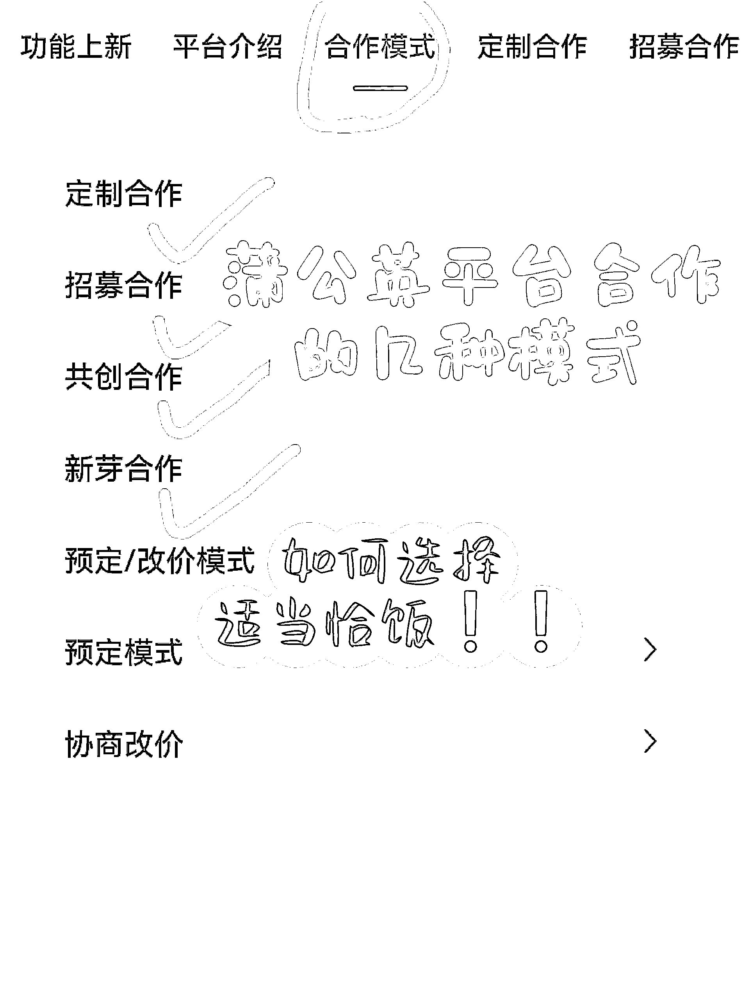
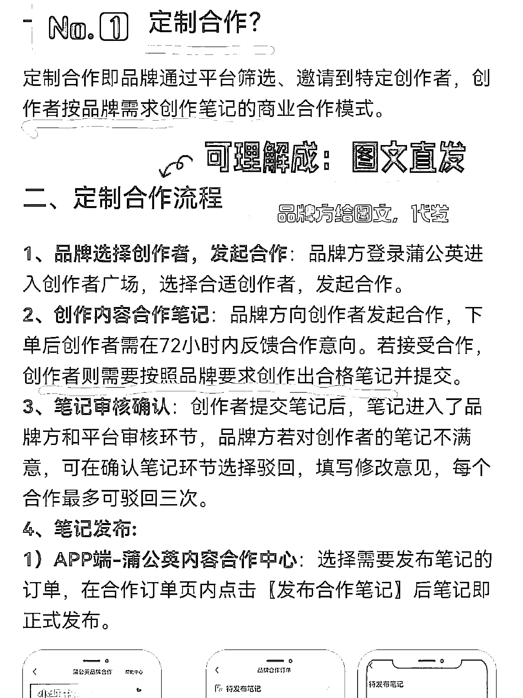
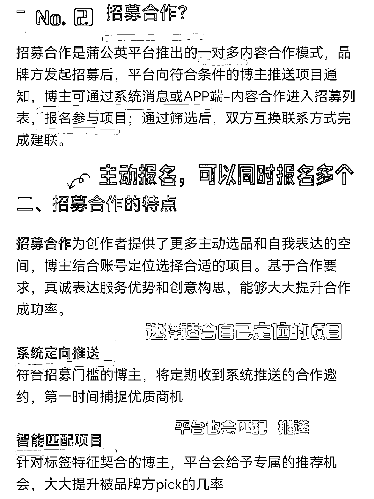
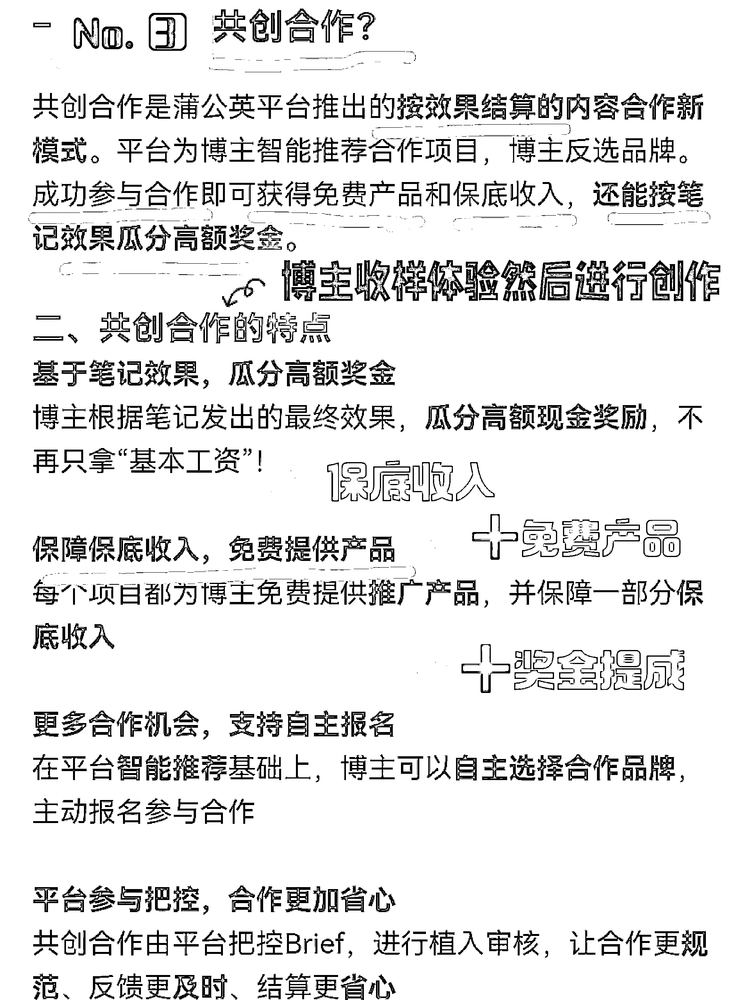
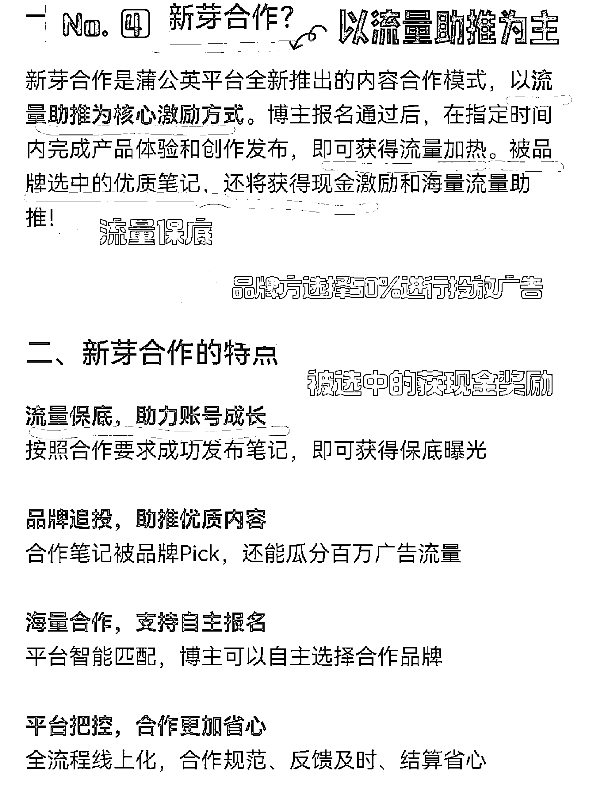

# 小红书商单-招募合作、共创合作、新芽合作区别

> 原文：[`www.yuque.com/for_lazy/thfiu8/eqqgfqb05g8m7ycd`](https://www.yuque.com/for_lazy/thfiu8/eqqgfqb05g8m7ycd)

## (16 赞)小红书商单-招募合作、共创合作、新芽合作区别

作者： 棠溪

日期：2024-03-28

各位星友，大家好，我叫棠溪。目前主做小红书商单项目，做了 3 个千粉账号。想分享一些经验给大家。

今天主要分享小红书商单 4 种合作招的类型，让你不再走弯路。

合作广告一般有 4 种合作:**定制合作、招募合作，共创合作，新芽合作**

**定制合作**:定制合作就是通过品牌筛选、邀请到特定创作者，创作者按照品牌需求发布图文即可。可以直接理解为“图文直发”，一般找中介接的都是这种广告。这种内容不需要自己创作，直接复制粘贴发送就行。

**招募合作**:招募合作可以自己去报名，这是品牌或个人 pr 发布的招募信息。如果你符合这个要求

报名即可。

可以同时报名多个活动，等品牌方筛选通过后，会得到联系方式，沟通合作即可

**共创合作**:共创合作一般是有一个底价加奖池，底价即是你发布后就能够拿到手的佣金一般为 100.150。

奖池即是根据流量来的，例如此共创合作商家设定 5000 元的奖池，一共有 20 人参加。那么就是 20 人去瓜分 5000，根据流量瓜分，即流量越高分的佣金越多。这个会给你寄样品，收到样品之后，进行独自创作，创作完毕之后发给品牌方审核。可以获得保底收入+免费样品+奖金提成(根据笔记效果计算)

**新芽合作**:一般不建议报名，因为没有佣金，只有流量扶持。这一类合作是商家最能省钱的方式。但是这种广告并非一无是处，在你广告数据特别不好的时候可以考虑。因为很多商家投放广告的时候会去看你的数据，这个时候如果你有一条非常不错的广告数据，是很容易接广的。

以上就是 4 种合作的方式，其中招募合作通过后不会对账号有任何影响。但是共创合作和新芽合作报名通过后，需要在规定时间内，进行上传。如果没有及时上传，会导致账号违规，影响下个月的蒲公英等级。

我自己接的最多的还是定制广告，直接图文直发就可以，简单方便，如果有接广方面不懂的问题，可以来问我。

* * *

评论区：

暂无评论

* * *