# 都说养老行业是风口，为何很少人敢做？

> 原文：[`www.yuque.com/for_lazy/thfiu8/rne1n10hiyhg4zlu`](https://www.yuque.com/for_lazy/thfiu8/rne1n10hiyhg4zlu)

## (47 赞)都说养老行业是风口，为何很少人敢做？

作者： 楚涵

日期：2024-03-29

养老最真实的现状是有需求、无市场。

人人都说养老行业好，但愿意踏实在养老行业工作的人都是少之又少，加上近几年，打着卖养老床位、投资养老院等名义骗人的项目太多，导致很多人对养老院有偏见，哪怕很多人看到了机会也很少入局。

还记得我刚转行时，很多前同事和朋友第一反应是：做什么不好，赚老人的钱。其实真正从事老年事业，能做出市场站稳脚跟的，最重要的就是靠爱心和责任心。

我用了四年时间，能从一个行业小白到完成第一个养老机构，开出千张床位，营业一年时间入住率达到 80%，远超同行的入住人数并实现盈利也是靠这些，努力为退休人群提供适老化的空间和各类服务，不集资不卖卡，合法合规经营，不坑老人、不坑员工。

今天也借着这个机会，和大家分享我从零开始进入养老行业，开出第一家医养结合机构的经历，从转行、定位、调研、开店、选址、装修、定价等方面，让大家对养老行业有更全面的了解，也帮助一些想转行做养老产业的朋友少走弯路。

从事养老创业后，每年都会收到很多朋友咨询养老行业有什么工作机会和创业可能，他们有人一直在咨询从来没行动的，有了解后果然放弃选择其他行业的，有听取建议结合自己的优势进入养老行业工作的，也有开启养老行业轻创业的朋友。

还有半途而废的。无论结果如何，但初心是好的。正是有了大家的好奇、果敢、坚定和努力养老事业的道路上的同路人才倍感温暖，老年人的晚年生活才有滋有味。

**人人家里有老人，我们也都会变老，分享我在服务老人和变老路上酸甜苦辣咸的经历，让大家对养老和养老院的概念能有进一步的了解，让一些想转行进入养老行业朋友们看看从业者的故事，让有选择进入养老院生活的家庭对养老院有更全面的认识和了解。**

我是从一个对养老行业毫不了解的小白到今天拥有自己的养老机构，小白为什么转行、怎么做跨行决定、怎么调研养老行业，幸运得找到了合伙人开启养老行业的创业，希望这段经历对每个想转行的朋友有借鉴意义。

分享的乐趣是在过程中找到更好的自己，遇见更多的朋友，期待更多的遇见。

**一、背景**

2023 年 11 月 23 日，96 岁的外婆因急性心衰合并器官衰竭入院，距离上次住院已经过去 12 年了。接到妈妈电话第一时间赶回老家，我是外婆带大的，她给了我美好的童年记忆，**从事养老行业原因之一也是希望外婆的晚年生活能够尽可能的舒服、少点病痛折磨。**

连续照顾外婆 10 天后出院回家，看得见的状态在好转，看不见的器官衰竭更严重。2024 年 1 月 5 日又接到妈妈的电话，让我马上回老家，医院待了 14 我们又回家了，这段时间我每天 8 小时陪伴在外婆身边。

而这次家人对老年人专业护理和生死有了更多的体会与认知，七年从业经验换来家人赞许是对我最大的认可。

我以家属身份收获的感受与认知，反哺回养老从业者的视角可以更真切的做好服务与管理，在养老这条路上走的更踏实、更稳健。

**进入养老行业开养老院给自己定了个目标，每年在一线工作不少于 30 天。**

过去照顾我接待家属、与老人一切面对分离焦虑症、帮认知症患者找到安全人等，这次是照顾我最爱的外婆。以家属的身份去观察外婆病情的变化、医生的治疗方案、舅舅与妈妈等家属的心态和决策原因、请护工的焦作不安、面对死亡外婆和家人的态度、邻居们不管三七二十一的管闲事和瞎操心等等。

**这是最真实的养老现状，有心无力，有需求，无市场。**陪伴外婆这段时间是幸福的，在未来某一天我的回忆不仅有外婆带我长大的时光，也有我陪她暮年的岁月。是一位 96 岁老太太一辈子温良恭俭让的时光机，更是一位长者对尊严的坚守。

正如阿图·葛文德在《最好的告别》讲述衰老与死亡的书中所说：**“生活中最好的事情，就是能自己上厕所”。**

2024 年 1 月 15 日，国务院办公厅印发《关于发展银发经济增进老年人福祉的意见》，这是中国首个以“银发经济”命名的政策文件。

2024 年 1 月 17 日，国务院新闻办公室举行的新闻发布会介绍了 2023 年国民经济运行情况。全国人口规模其中 **60 岁以上人口 29697 万人，占全国人口的 21.1%，65 岁及以上人口 21676 万人，占全国人口的 15.4%。**

**国家卫健委预测，中国将在 2035 年左右步入重度人口老龄化阶段。**

国内人口形势在近几年发生了较大的变化，出现了人口负增长和老龄化速度加快的情况。新生儿数量从 2016 年开始明显减少，并在 2022 年迎来“死亡交叉”。

根据国家统计局数据显示，截至 2022 年年末全国人口数量约为 14.11 亿人，比 2021 年减少 85 万人；新生儿出生人数为 956 万人，而死亡人口数量为 1041 万人，死亡人数高于出生人数，两者出现 85 万人的差值，也标志着中国正式进入人口负增长时代。

**国际上普遍将 65 岁以上人口占总人口的比例用来衡量老龄化的程度**，**比重达到 7%为轻度老龄化，达到 14%为中度老龄化，20%为重度老龄化。**

近几年国内 65 岁及以上的老年人口占比呈明显的提升趋势，截至 2021 年年底，中国 65 岁以上人口在 2 亿以上，占总人口的 14.2%，而 2011 年的占比为 9.1%，目前中国处于中度老龄化社会。

中国的老龄化从轻度到中度的时间仅用了 21 年，日本用了 24 年，英国用了 46 年，法国用了 126 年。而国内第二轮婴儿潮（1962 年 -1975 年出生的人口）的养老阶段即将到来，这是我国最大的婴儿潮，年均出生人口超 2500 万，目前他们正处于 48 岁至 61 岁；

与此同时，中国的人口自然增长进入负增长，新生儿数量减少，未来 5-10 年中国人口老龄化程度将快速深化。国家卫健委预计，我国将在 2035 年左右进入重度老龄化阶段。

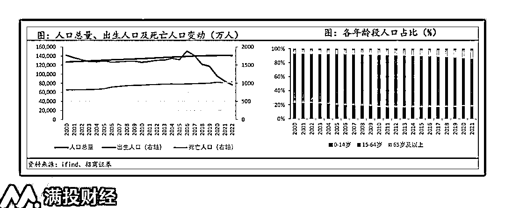

老龄化的加剧必然会导致劳动力减少，社会产出出现产量下降和创新受限；同时增加社会保障和医疗保障等方面的支出，给财政带来压力；以及随着年龄的增长，健康问题的增长给医疗保障系统带来挑战等问题。

但老龄化带来的老年人需求也催生了潜力巨大的银发经济，围绕着老年人的衣食住行、康复护理等消费场景应运而生。

目前，中国的银发经济已经初具规模，根据艾媒咨询数据，2020 年银发经济的市场规模约为 5.4 万亿元，2016-2021 年 CAGR 达 15%。此外，根据东吴证券研究所的研报数据，预计我国银发经济的市场规模在 2026 年将达到 10 万亿元。

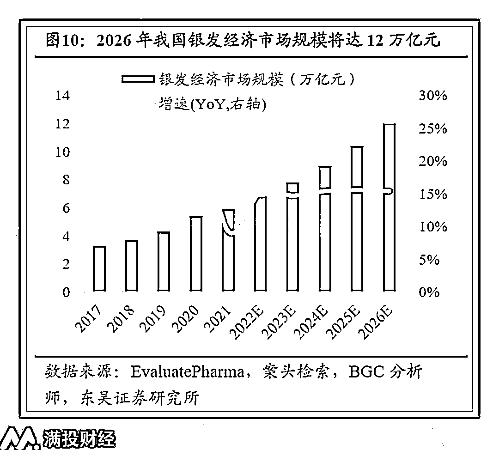

2016 年我所在的行业竞争非常激烈，几乎没有增量市场，作为职业经理人我考虑更多的是团队怎么平稳的过渡退出，公司怎么进入新的赛道和行业。

通过一年多的筛选与调研，公司最后选择了大健康赛道和智能化 RPA，我开启了自己的创业之路。2017 年这一年我思考最多的几个问题：

1、我有什么优势，这些优势在未来不论什么行业都会有价值；

2、选择什么行业，未来 10 年甚至更长时间会持续正增长、有持续的现金；

3、选定行业后，如何快速的了解行业上下游，找到适合自己的切入点；

4、找什么样的合伙人。

通过前 2 个问题的回答，锁定了养老行业。国内的老龄化趋势和国外几十年的老龄化市场让我看到了机会，并进一步的进行市调。

一年多的时间里，实地走访了湖南长沙所有的医养结合机构、养老院、健康管理中心、营养餐公司、陪护公司、保健品产品和销售公司、家政公司、智慧养老公司等老年人有关的公司，跟他们的中层管理层了解情况，用不同的方式了解了他们的业务逻辑，也认识了我的领路人。

实地走访后，会形成自己的调研报告，包含的内容如下：

1.  企业基本概况与历史沿革；

2.  创始人的履历，过往经历对他现在创业的帮助有哪些；

3.  该公司的行业壁垒是什么，有什么合作的契机；

4.  哪些公司需要进一步与高管或创始人深入交流，交流的重点是什么。

理论上，把国内外养老及大健康有关的上市公司招股说明书看完（重点看风险因素、业务与技术、同业竞争、财务会计信息、业务发展目标），再通过招股说明书中的数据和分析，筛选出进一步调研的切入点。

招股说明书是我对陌生领域全面了解最常用的工具，辅以每年的半年报、年报就能对该领域的动态及时更新升级。

养老是民生大事，离不开对政策的熟悉，在国家卫健委、民政部/老龄委、国家发改委三大部委的官网，下载学习了近三年所有与养老、老年人有关的政策文件，把握政策的风向标，才会少走弯路。

上市公司数据结合实地调研公司的情况，2017 年的养老行业经历了一轮的发展仍在初级阶段，国内没有成熟的商业模式、95%上的企业都是亏损状态，行业从业者年纪偏大，不合规违法经营的比重大，从业者和服务对象对行业的认知偏差非常大，有很大的误区。

这些不足也是行业的机会，在调研过程中也认识了我的第一位合伙人，他已经进入养老行业 5 年，经营着 1 家养老院和 1 家医养结合中心。

他对行业非常熟悉，尤其擅长项目的筹开和护理管理，弥补了我的短板，给我搭建了很好的学习机会。我们一起去了北京、上海、广州三大老博会，与优秀的企业面对面，听行业的研究者报告分析。

通过全面和相对充分的调研，开启了我的创业之路。

用 18 个月时间，开出了我的第一家医养结合中心，专注于服务失能失智和有术后康复需求的长者。见我是怎么从零开始进入养老行业，开出第一家医养结合机构，我是怎么从零开始进入养老 2020 年。

用了四年时间，完成了我的第一个养老项目，营业一年时间入住率达到 80%，远超同行的入住人数并实现盈利。

传统项目有了样板，我也有了新的追求，不仅仅要满足刚需养老的需求，更要服务全年龄段的老年人，让他们享受一站式的医康养护餐食娱的老年生活，于是就了做新项目的想法。

而新项目启动了才意识到过去的经验和积累用不上，一切需要从头开始。同时大项目带来的压力铺面而来。项目在湖南株洲，我生活在湖南长沙。

从 2021 年 8 月启动装修到 2022 年 12 月底我一直住项目上，办公室和宿舍在同一层，每天工作时间不少于 16 小时，通过勤奋和时间来弥补短板和不足。全身心投入好像进入了心流状态，对养老的理解也在不断提升。

回看总结，还有很多不足要优化和完善，一路上的修修补补才是这个过程最真实的底色。

**二、选址选的好，投资才会对；放弃比前行更难**

第一个项目在老城中心，是做刚需养老极佳的位置。阳光康养的位置距离老城区中心近 6 公里，属于城乡结合部，在四五线城市的居民习惯性的忽略这个位置，只有老城区才是他们生活、医疗和养老首选。

阳光康养所在位置是由两栋 32 层的住宅式公寓和一栋 3 层楼的商业，总面积接近 8 万平方米（项目体量：2 栋住宅式公寓的 16 层及以下部分和 3 层商业共计 4 万多平方米）。

如此大的体量，不能只服务刚需的失能失智老人，我们需要活力老人、短疗客户、旅居游客、老年人团建群体等，交通距离的重要性就降低了，周边环境、配套和交通便利性的占比提升了。

项目选址是开养老院最重要的因素之一，我们要从以下几个维度去评估租赁的房产物业，绝不能凭借感性评判：

1.  明确房产的土地性质：住宅、商住、商业、养老、医疗用地等；

2.  做消防专项预审（消防验收不达标，拿不到养老备案，不能营业）；

3.  周边居民对养老和医疗的态度；

4.  距离市中心的公共交通时间在 50 分钟以内；

5.  距离三甲或者地区最高等级医院 30 分钟左右；

6.  房屋建筑改造和加固成本和出床的效率；

7.  10 公里老年人口数量、竞品收费水平和入住率。

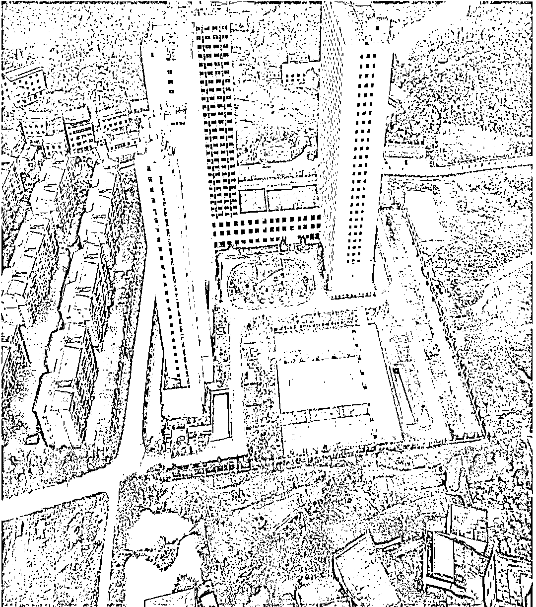

（选址阶段航拍项目全景图）

以上 7 个维度是我们在评判选址是否基本达标的因素，不要 100%的满足要求，而是不踩坑，没有致命的短板无法弥补。

做养老的这些年，我看过的房产物业超过 100 多个，能进入下一步评估的不超过 10 个，有足够筛选的标的物才能找到合适的，选择比改造更重要。养老院有 30%是因为选址的硬伤无法开业，40%的项目经营成本居高，1-2 年就会经营不下去。

做养老这些年，我在选址上花的精力远大于后期的运营。**养老院也是商业项目，宁错过也不要勉强，放弃比前行更难。**

**三、定位定方向，定位定效率**

选址确定后，我们要对项目进行定位。定位定的是商业模式、赢利模式、目标客群，好的顶层设计可以事半功倍。

**我们是为退休人群提供适老化的空间、心理慰藉和各类服务，按月收费不集资不卖卡，合法合规经营，不坑老人、不坑员工。**

还记得刚转行创业的时候，以前的同事朋友听到我去开养老院时的反应：做什么不好，赚快钱赚老人的钱。近 10 年，打着卖养老床位、投资养老院等名义骗人的项目太多，很多中老年人的棺材本都被骗走了。

**从事老年事业，爱心和责任心是最重要的，赚应得的钱。**

“9064”养老模式，即 90%居家养老，6%社区养老，4%机构养老。我们做的是机构社区（属于养老机构的范畴）。

我们为全地域（长、株、潭地区）、全年龄（60-69 岁低龄、70-79 岁中龄、80 岁以上高龄）、全业态（活力长者、失能半失能、失智、术后康复、短期疗养、旅居）的长者提供一站式的医、康、养、护、餐、食、娱服务，打造专属于老年人的退休社区，总床位 1500 余张。

超过 500 张床位就属于超大规模的养老机构，我们总床位 1500 张，项目设计、经营管理都是巨大的挑战。

当地 4%的总人口才会选择养老机构，如何分步、有节奏的落地实施是最大的难点。我们设定通过 5-7 年的努力把理想照进现实，实现入住老人超 800 人，不前瞻顾后，不好高骛远。

一开始我们心理是没底的，好在一线城市已经有了不少对标的项目。更开心的是在我们立项阶段，有家上海的同行通过两年多的努力在长沙给我们做了最好的样板，每次困惑、迷茫的时候就会去参观样板项目，向他们院长请教。

他们给我最大的启示是：中上水平的配套与服务，中下水平的收费，让用户和客户都觉得物超所值，快速打开了在长沙的养老市场。

这一启示沿用到了我们的项目，我们收费符合当地老人的退休工资，他们的退休金基本能自给自足。**现在全国养老机构的平均入住率低于 50%，很重要的原因是未富先老，缺乏支付能力。**

退休金、子女补贴、长期照护险（全国只有 20 多个城市在试行）、其他投资收益等是老年人最重要的收入来源。当用户和客户都觉得物超所值时，决策时间会大大缩减。我们做完投资测算后，我们采用市场定价法，希望尽快打开株洲的市场。

我们经历了拍脑袋、依葫芦画瓢到一点点找到自己项目的节奏，回望有迷茫、有苦楚、有死扛、有成长、有庆幸，养老社区慢慢长成理想中的样子，自己也在过程中慢慢的变好。

收费水平对应了基础配套、装修投入、照护服务要有一致性，经过大量的商讨、实施、推翻、再实施，我们配套了一个护理院（老年病医院）

一个活力长者照护区、护理长者照护区、认知症长者照料区、短期疗养照护区、旅居照护区、一所老年大学（配有书画室、棋牌室、KTV、电影院、乒乓球室、佛堂、等综合娱乐室）

果蔬基地、鱼塘等户外休闲场地，实用的适老化、舒适性、实用性是最重要的。我们坚持专业至上，让长者享受中上的服务，不仅仅养老，更能够享老。

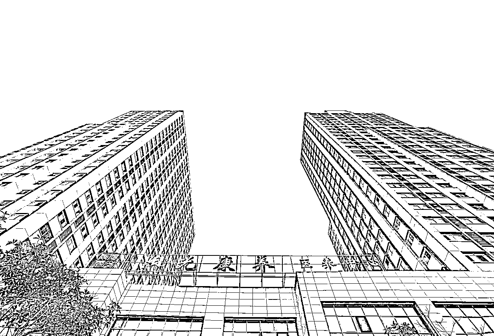

（仰拍项目门头）

**四、搭建核心团队，启动装修**

在项目立项到启动装修阶段，组建了四个人的筹备小组：合伙人、我、护理部负责人、综合部负责人（后来拆分为后勤、人事、工程）。

护理部负责人从公立医院退休，做过护士长、后勤科长、工程科长、采购科长等，并在养老院工作近二年，对医疗和养老的理解比较深刻，在初期给了我们很多不错的建议。

综合部负责人是我在上个项目从零培养的，对养老有基本认知，也有丰富的办公室、后勤、人事的工作经验。他们在初期协助我们做了项目在发改委的立项备案、各部门手续资料的办理、人员的招聘、办公场地的搭建、各种第三方单位对接等工作。

两位年纪偏大，综合能力、变通性、稳定性比较好，对我们筹开是很大的助力。我合伙人负责公共关系和装修工程。

我们的核心团队主要是几个部门的牵头人：院长（我自己兼任）财务、护理、后勤、营销、人事、工程，他们从一开始就要参与进来。

在四线城市招聘工程量巨大，对养老行业有了解的少，有养老行业经验的更是凤毛麟角，大家对养老行业的认知也有误区：

1.  养老行业工作是伺候人的事；

2.  从业者年纪普遍超过 50 岁；

3.  给老人吃饱、穿暖就够了，精神娱乐活动不重要；

4.  到养老院工作可以躺平，给自己找一个可以养老的工作。

招聘工作至今仍然是养老院最重要的工作之一，人事需要对行业有一定的认知、对公司的业务清晰、对岗位工作内容熟悉，很基础的要求换到我们所在的四线城市都是不低的要求。

我们经历了选、用、育、留的各种问题和收获，**至今养老行业是人人都说好，但愿意踏实在养老行业工作的人都是少之又少。优秀的从业者，是公司的成本中心，也是利润中心，我们愿意在过程中筛选出更多的事业伙伴。**

前三个月招聘相当的不容易，部门牵头人到岗后，我们花费了大量的时间进行培训。筹开是养老院从无到有的过程，工作多如牛毛还还事无巨细，要不是坚定的想要在养老行业发展的人是很难熬过去的。

虽然难，我们通过筹开阶段，留下了几位很优秀的小伙伴，他们从零进入养老行业到如今能够独当一面。行业经验在发展的眼光下不一定是好事，我们更愿意培养新人，成就彼此。

另一个工作量巨大的就是设计和装修工程。我们沟通了从北京、上海、广州一线的设计公司，到省级设计院、各医养行业知名设计工作室等 30 余家。

通过与专业团队的沟通，知道了我们需要的是有丰富的民营医院和大量的综合型养老院设计经验，能从建筑的结构、功能布局、平面设计、消防设计、护理服务、装修成本等方面综合考虑并能在现场及时沟通调整的团队。

30 多家中我们选择了 5 个团队合作了 5 个小模块进行打样，最后筛选出一家有湖南省建筑设计院做医院和养老院设计经验的公司，他们有各类民营医院、养老院、养老地产的设计经验。

确定设计团队后，他们对现场和周边环境、同行竞品做了大量的调研工作，对用户的使用需求反复沟通确认。

设计阶段也是项目进一步梳理的过程，我们根据用户的身体情况进行分区管理，设置了活力长者照护区、护理长者照护区、认知症长者照料区、短期疗养照护区、旅居照护区。

每个区域的侧重点都不一样，比如护理长者照护区，从使用功能上独立卫生间不是必备的，在楼层设置公共卫生间和洗浴间，可以减少房间的异味。而养老机构等级评定上对居住空间配置独立卫浴的占比有要求，就这样我们封掉了两层楼的独立卫生间，之后就敲掉重新进行改造，类似这样的返工多入牛毛。

装修工程我们自己组建的施工队，找了靠谱的监理公司。项目进度和质量是有保证的，工程管理比较复杂，由我合伙人负责管理，我们分工合作。

养老行业的消防规范不停地在升级，8 万多平方米的房屋我们最后只租赁了 2 栋住宅式公寓 16 层及以下与商业部分。体量太大，我们分批进行图审，希望早点开业。分批图审的计划没有问题，但计划赶不上变化。

在我们装修阶段有 1.8 衡阳医养中心火灾事故、望城 429 事故等，致使消防规范提高，我们在消防的预算增加了几百万，营业时间也延迟了。

养老消防等级不断地提高，增加了投资也提高了投资的门槛。未来 3-5 年会有大量的养老机构因为消防强条无法整改或整改后投资回报周期过长而关停。

在项目选址阶段做好消防预评估是非常重要的，施工阶段动态跟进施工和完成综合验收是投入使用的前提。

**五、早起跑、快入住（边建设、边宣传、边蓄客）**

装修是投入，那收入才能何而来？没错，当我们签订房屋租赁协议就启动了营销工作。

在最短的时间内完成样板间和营销中心的布置，让客户和用户能够在实体项目中了解我们，了解未来居住的环境和提供的服务。

样板间和营销中心我们参考借鉴了房地产售楼部的功能设计，让客户在第一时间找到我们，了解我们，解答他们的疑问，打消顾虑，锁定第一批意向用户。客户在参观过程中提出的需求和意见，我们会统计分析，也采纳了一部分好的建议。

在项目未达到可入住条件前，我们通过自媒体平台〖公众号（悦享润康年华）、抖音（株洲阳光康养医养中心）、小红书（阳光康养养老中心、楚涵）、视频号（阳光康养）、今日头条〗对项目的装修过程、体验活动、养老观念、健康科普等进行分享，试营业前六个月，我们线上点击量一千多万，有效咨询的表单 2000 多条，到访 800 多人次，线上宣传人群主要是 45 岁以上的子女和少部分高龄活力长者。

养老顾问对客户及时邀约参观、沟通，转化。逐步建立了跟进转化标准，从客户 2 小时内首访、到 1、3、7、14 天跟进、到上门家访、签约、转介绍全套流程。

养老顾问也从 2 人发展到 8 人。此外，养老顾问的录用标准也不断优化，我们更多的录用老年服务专业的应届毕业生。

线上营销是养老机构宣传的重要渠道，我们也没有抛弃传统的地推。

六个月时间内，我们对长株潭地区派发宣传单页近百万份，获得有效咨询近 500 多条，到访 300 多人次，让更多的非互联网用户的老年人知道了我们。

通过和社区和异业合作，我们每周进社区为老年人提供不限于义诊、理发、健康宣讲、修脚、健康评估等公益活动，让潜在用户更进一步的体验我们的服务。

此外，我们项目离最近的公交车站有 400 米，为了打通公共交通，我们在赞助了公交线路，将终点站设置到项目门口，方便老人出行。

同时该线路所有车辆的车身上都是我们的宣传，形成流动的广告位，也让更多的人看到了我们。

目前在住我们养老社区的长者平均年龄 86 岁，通过数据分析发现，有 10%左右的咨询是 90、00 后的年轻人，他们有为爷爷奶奶咨询了解养老院的，也有想提前体验老年生活的。

线上线下相结合的宣传，能更全面、更高效的、更低成本的获得用户。

切记，完成装修、获得消防合格证以后，到所在区级的民政局，进行养老机构备案，或者备案许可后方可收住老人，提供服务。

**六、价灵活、全渠道**

除了自媒体宣传和传统地推，我们还与社区民政专干、楼栋长、社区书记、志愿者、医院护工、保洁、护士长，老年人文娱团体、各单位离退休办搭建了合作关系，给他们提供薅羊毛的体验活动和转介绍机制。

我们坚持市场定价法而非成本定价法。开业床位费 330 元/月，每增加 100 人，床位费增加 110 元/月，直到床位费到原价 1100 元/月。其他费用一律没有折扣，护理费是根据老人的身体情况收取，并每半年评估一次。

前半年在定价上也踩过坑，有同行为了抢客户，以极低的收费将老人吸引过去。现在居住养老机构的老人多数是价格敏感型的用户，他们会为了价格牺牲舒适性和体验感。

我们综合对比同行的收费后，采取年缴床位费，享受总费用一口价的优惠，非机构原因中途退住按照原价床位费收取，留住价格敏感客户，也没打乱价格体系。

正规养老机构的宣传获客是大家的难点，我们从项目启动就开始宣传，通过新媒体和传统渠道相结合，从 2022 年 11 月到 2023 年 12 月，获得有效咨询近 3000 条，到访 1100 人次，入住 160 人次，留存用户 110 人。

这个时间段，我们经历了养老院的反复封院，只准出不准进，经历了在住长者的全面感染与康复。与 110 多位老人和 60 多位员工一起抗疫的时光，至今不敢细想，缺药品、缺防护服、缺护工、家属感染不能处理各类问题，各种煎熬和崩溃。

虽然有几位老人永远的离开了我们，但我们的死亡率在同行是很低的，所有的付出都是值得的。

抗疫的各种要求，磨砺了团队，也验证了我们服务的细节是有保证的。

**七、好的服务会说话**

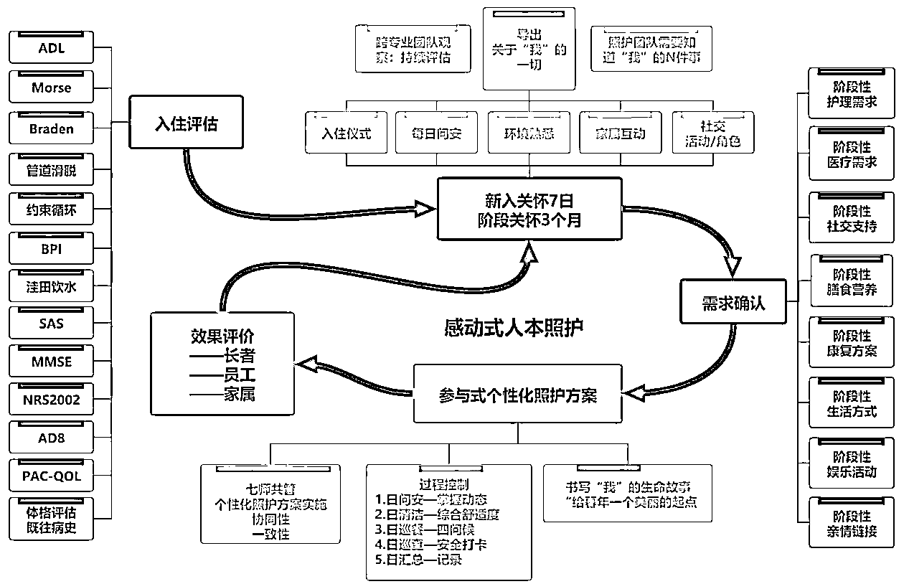

感动式人本照护

从长者入住评估开始到 3 个月阶段关怀，老人、员工、家属都参与进来，让老人尽快的适应新的生活、让家属帮助我们更了解老人、让服务团队更好的饿照料老人，动态评估，及时调整。

每周有手工活动、文体排练、志愿者演出、健康讲座、每月有楼层长会议、月度生日会、家属接待日、重大节假日文艺汇演等丰富的活动，丰富老年人的精神生活。

照护体系涉护理、医疗、社交支持、膳食营养、康复计划、生活方式、娱乐休闲、亲情链接等，就不逐一展开了。疫情是最好的试金石，我们拼尽全力守护了更多的生命。

**八、管理精益化：提升颗粒度、对标找差、持续改善**

从接受第一位老人到如今 200 多位长者在住，算是完成第一阶段框架的搭建和团队的磨合，各方面进入稳定阶段。

未来更关注的是营销、财务、后勤、护理等各模块的满意度和数据成本优化，缩小与对标项目的差距，持续不断地学习、改善。没有完美的项目，唯有持续的精进。

从事养老在大家看来是朝阳行业，这条路上充满机遇与挑战，躬身入局，你我皆有机会。

做养老工作八年，好的坏的都经历了，伴随着产业结构转型和人口老龄化，为老服务行业的人才升级也刚刚拉开大幕，希望通过生财的平台有更多优秀的朋友加入。

养老产业是万亿市场，对于“未富先老”的我们是极大的挑战，国外的经验可以参考，更需要结合国情走出符合我们的一条行业之路。最后分享一点我的心得，希望对大家有帮助；

1.  养老产业涉及非常的宽泛，不局限于养老院；

2.  养老行业是民生，适合追求稳定回报的；

3.  养老产业需要大量懂流量也懂产业的操盘手；

4.  为老市场才开启，脚踏实地大胆创新，一切皆有可能；

5.  每位长者都是我们的镜子，遇见请珍惜。

未来不论您是否从事养老工作，你我都会老，都在参与为老服务，这条路我们不孤独，加油。

附项目的部分图片：

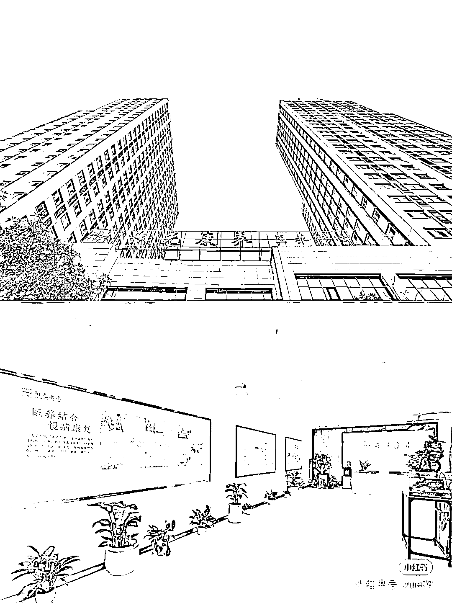

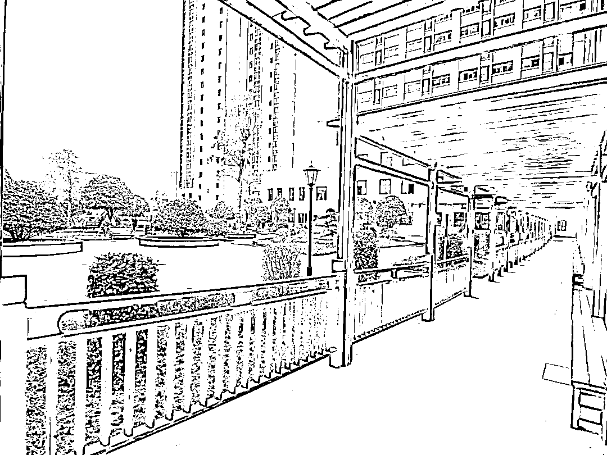

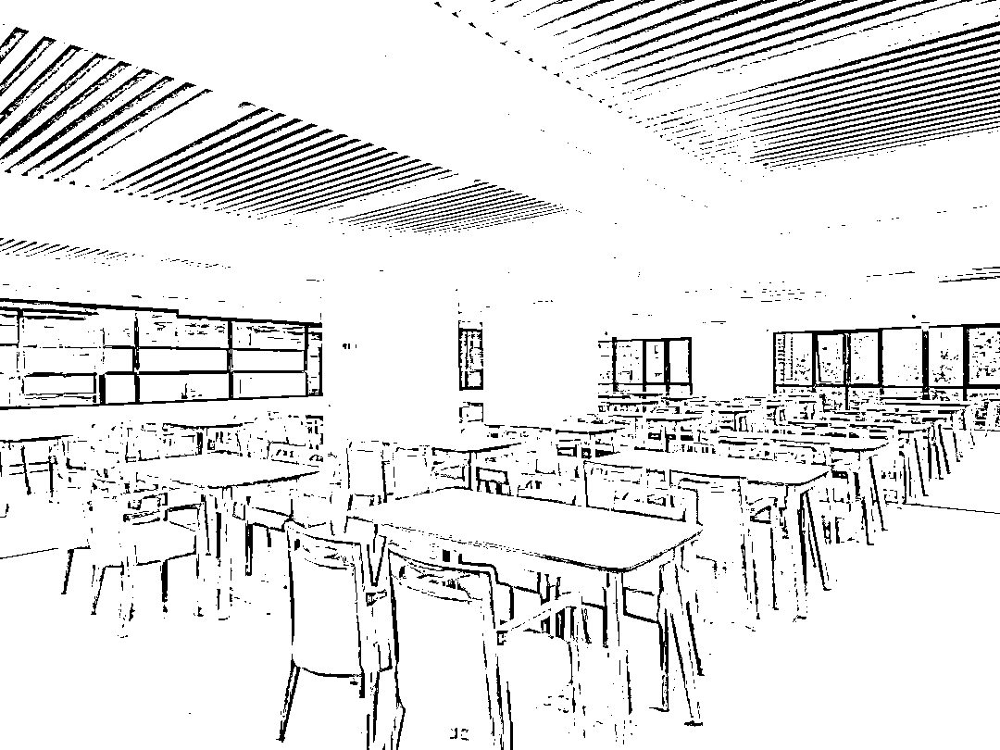

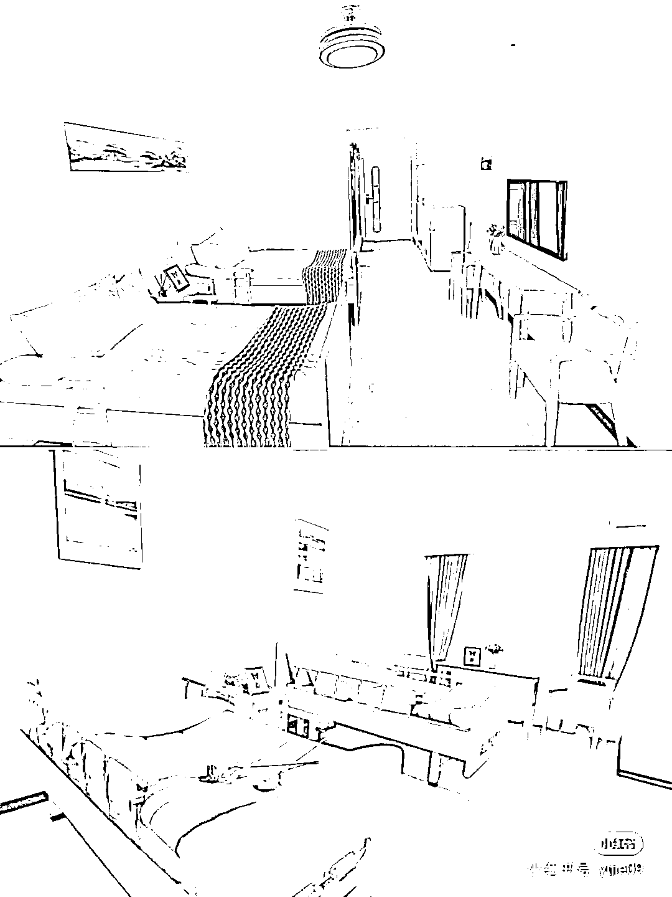

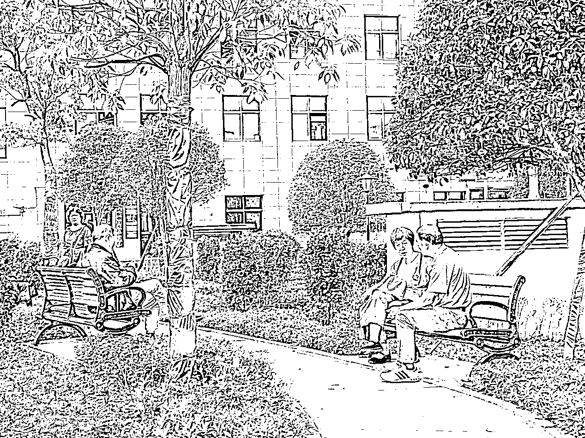

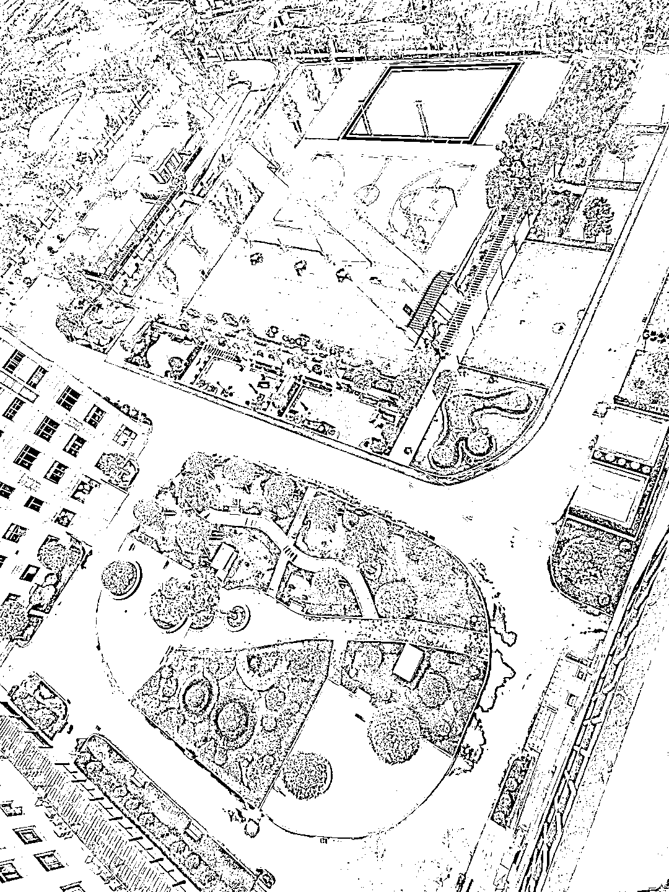

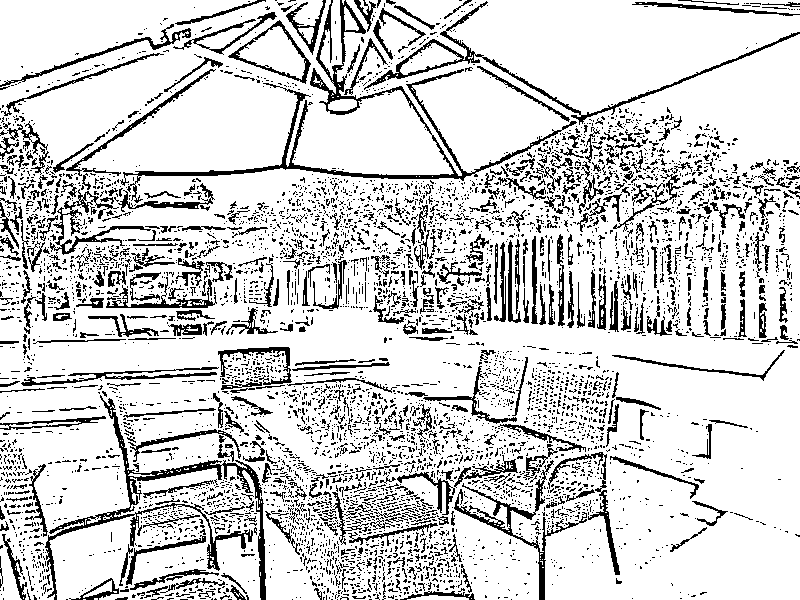

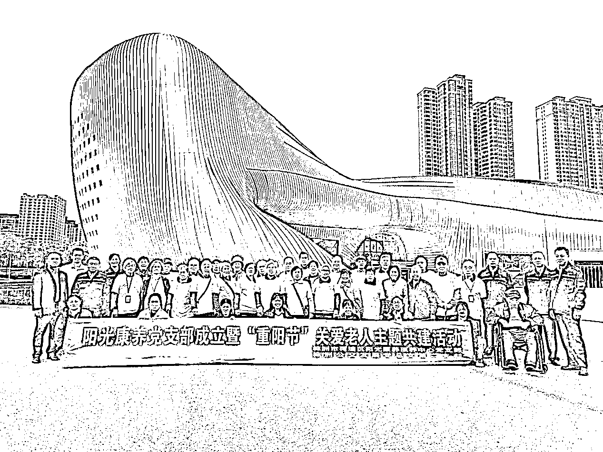

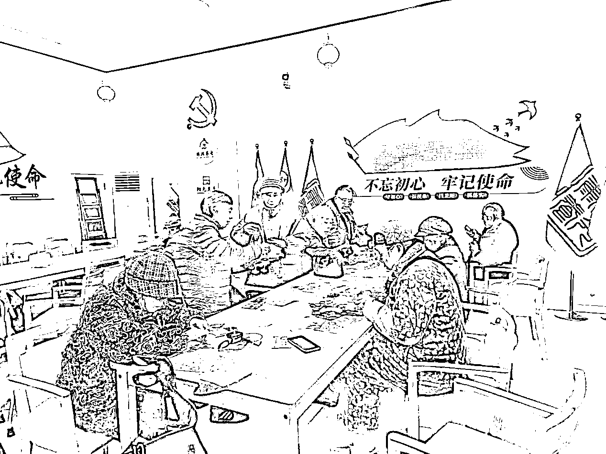

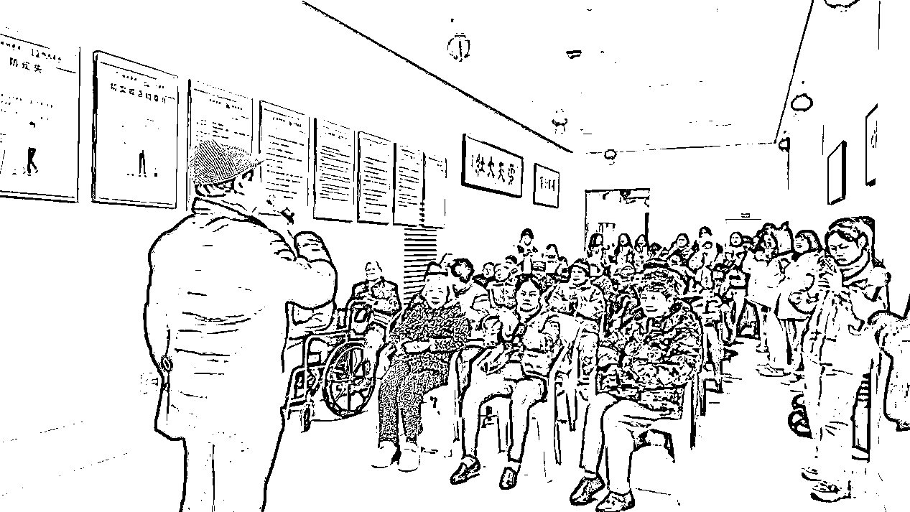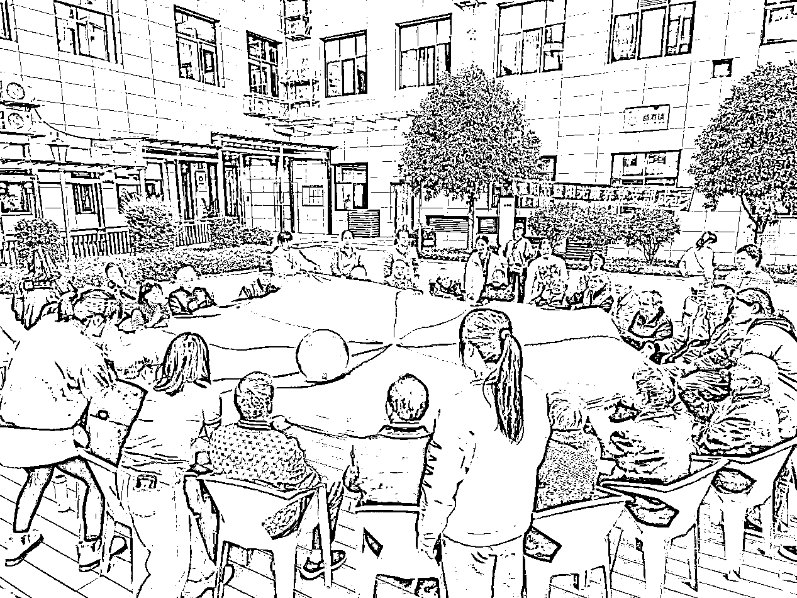

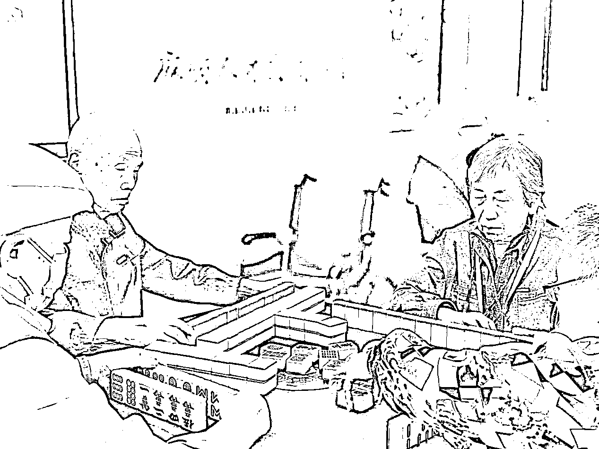

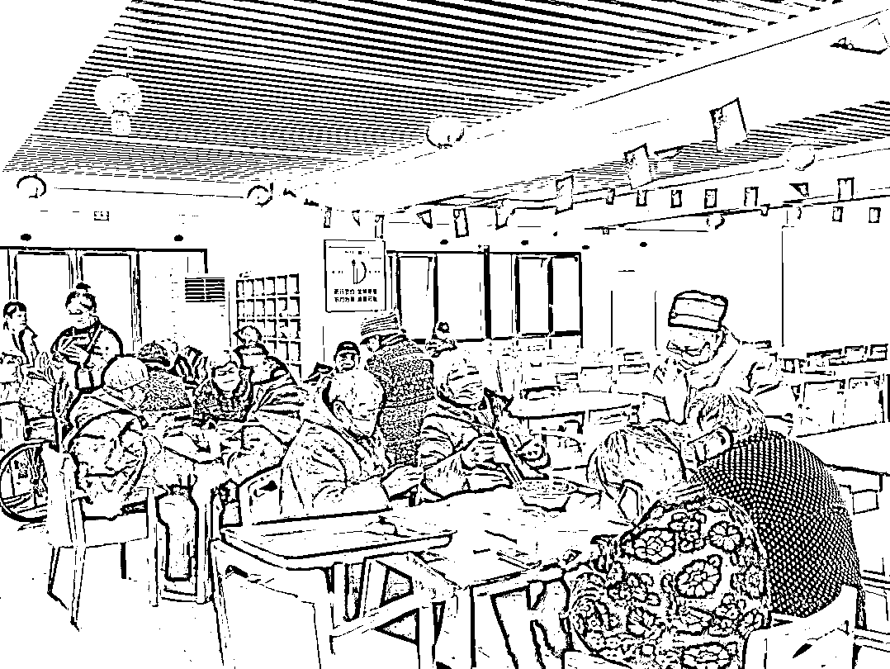

* * *

评论区：

陈奕迅 : 这可是大项目 小白入行不了啊
楚涵 : 养老中心是比较重，不太适合个体创业
徐宁 0-6 折债务优化 : 养老这块，浙江政府已经做的很不错了，各种服务跟上[呲牙][呲牙]
楚涵 : 浙江走在全国前面，人文做得好，我们经常去杭州学习。
永奇 : 那些卖线下保健产品的坑我妈几万块，我一看就是货不行品不行，都忍不住去骂这些所谓打着银发经济去坑啥都不懂的老年人
楚涵 : 不少老人搬到我们这有一车保健品，看着心疼，都 80 多岁了，在这生活丰富起来保健品买的少了，要转移他们的精力。
Rio : 养老的需求不容易满足 高风险 高人力 低社会地位 回本慢 低容错率 没有金刚钻不敢碰
楚涵 : 养老院是这样，低龄活力老人的精神文娱有市场，这次航海的中老年书画就是，这类老年人的线下报名也非常火热🔥。

* * *