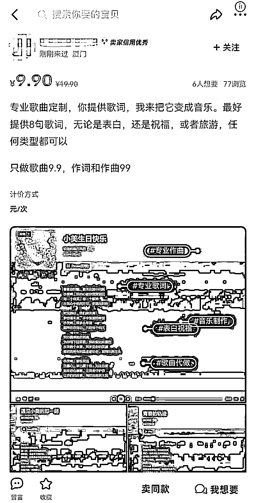

# Suno AI 音乐火爆全网，普通人的 7 个赚钱变现机会！！

> 原文：[`www.yuque.com/for_lazy/thfiu8/psg0cvk68bpg77zm`](https://www.yuque.com/for_lazy/thfiu8/psg0cvk68bpg77zm)

## (50 赞)Suno AI 音乐火爆全网，普通人的 7 个赚钱变现机会！！

作者： 珞珈 Lorjia

日期：2024-03-29

最近全网都被 Suno 的 AI 音乐刷屏了，周末测试了下，**几秒钟就能生成 2 分钟的完整歌曲，效果的确惊艳！**

无论从节奏，还是旋律、和声、音色都做到位了，完全可以配合其他 AI 工具制作成一只音乐 MV

意味着就算完全不懂音乐的普通人，**随便写一句话，也能创作属于自己的音乐歌曲了**

Suno 才上线 V3 版本没几天，就已经有人在闲鱼用 Suno 定制歌曲开始变现了💰，定价 9.9-19.9 不等

现在 AI 时代的迭代速度非常快，从 AI 文字、AI 绘画、AI 视频，到现在的 AI 音乐，每个新事物的出现会伴随着需求，需求背后就是红利

那么作为普通人来说，**Suno AI 音乐的出现对于普通人来说有哪些赚钱的机会呢？**

### **我总结了 Suno AI 音乐的 7 种变现方式**

### **1.Suno 账号售卖/代充**

虽然目前 Suno 账号的注册流程简单，但仍然需要解决网络环境、邮箱、充值等问题。

对于不了解的人来说，仍有门槛。只要能解决用户的需求，短期内就可以赚钱。

### **2.售卖 AI 音乐歌词提示词**

虽然 Suno 可以直接生成歌词，但直接生成的歌词效果比较随机，有可能不是非常满意。

如果想要创作出更好且定制化的歌词，就需要借助优质的提示词来生成想要的歌曲，这里就会产生需求，有需求就会有交易。

### **3.Suno 定制 AI 音乐**

在淘宝、闲鱼上架产品，用户只需要提供歌词主题，用 Suno 就能把它变成音乐

无论是男/女朋友表白歌曲，还是生日祝福，或者手机铃声，任何类型都可以，定价 9.9 元或者 19.9 元。

### **4.直播+现场赠送定制 AI 音乐**

通过直播平台，观众可以通过打赏、关注或点赞来获得主播现场为其定制的音乐，甚至包括专属歌词

这种方式直接利用了观众的互动和参与度来实现变现，也可以直播带货卖 Suno 相关的知识付费教程。

### **5.售卖 Suno 原创音乐**

利用 Suno 创作原创音乐，然后上传到 Spotify、Apple Music 等平台销售，从中获得可观的收入。

### **6.AI 疗愈音乐自媒体涨粉**

大家都知道现在的社会快节奏，生活压力大，每个打工人都需要舒缓身心的音乐疗愈，Lofi 音乐视频非常适合睡前或者安静时候聆听。

这种类型的视频在快节奏的现代社会中具有很高的需求，尤其是在 YouTube 等国际平台上。

目前在 Youtube 看到一个类似账号，这个账号目前粉丝 1400W，总共发布了 146 条视频，单条视频播放最高破亿，偶尔晚上还会开直播，单月收益非常高！

同时在国内的抖音、小红书平台也可以看见类似的治愈系音乐视频，已经接了不少商单，赚了不少钱

成功的关键在于持续创作高质量的内容，这个项目需要掌握 AI 音乐生成和插画制作工具的使用，以及视频剪辑技能。

**具体操作流程方法:**

1.用 AI 音乐生成工具 suno 制作 Lofi 背景音乐

2.使用 AI 工具（如 Midjourney）生成治愈系插画。

3.利用视频剪辑工具（如剪映），用于合成视频、添加动画效果和背景音乐。

### **7.Suno 知识付费教程**

任何一个新领域，最好的生意就是做知识付费，只要掌握信息差就能赚钱！

将 Suno 这个应用深度挖掘后，制作 AI 音乐课程售卖带徒，单价 199-299 元，也可以有不错的收益。

可以看到，**AI 发展速度真的太快了，从 AI 文字、AI 图片、AI 视频，到现在 AI 音乐也来了**，就算你不懂什么节奏、旋律、和声、音色，只要你有想法，也能尝试制作属于自己的音乐。

AI 是大势所趋，更是机会，任何领域，**只要你掌握了信息差+超强的执行力，就能在 AI 领域赚到第一桶金！**

**希望对你有所启发，我是珞珈 Lorjia，欢迎链接相互交流学习~**

* * *

评论区：

富贵碧莲捏 : 请问您说的这些个项目怎么做呢？[抱拳]
三月雨 : 你这个问法也太奇怪了，又大又泛，作者基本上不可能给答案呀，

充值用外币卡或者是虚拟银行卡，之后就这闲鱼-🍑-小红书上就卖呗，现成的对标账号一大堆，哪个数据好就用哪个~

感觉还是推荐小红书引流➕定制，客单价高，闲鱼专门去看了，感觉整体销量有点低。

YouTube 做轻音乐那个，生财上有很多保姆级教程的帖子的。关键词:治愈 音乐  ai

最后课程那个就 sop 化呗，主要考验获客能力
富贵碧莲捏 : 谢谢您的答复 可能我才加入生财没几天太小白啦对这个领域一无所知 但又特别想知道[捂脸] 所以才出现这种情况   请哥姐们多包涵 下次一定注意言语表达[抱拳][抱拳][抱拳]

* * *