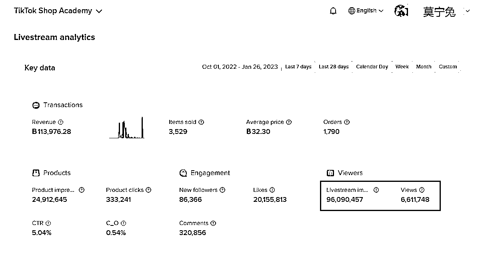
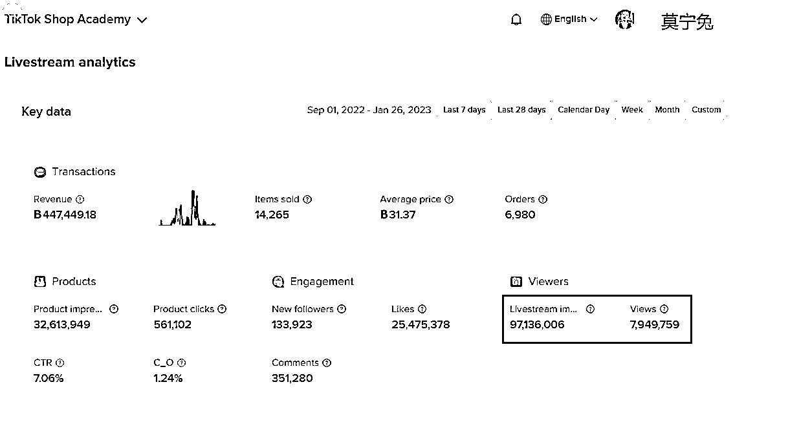
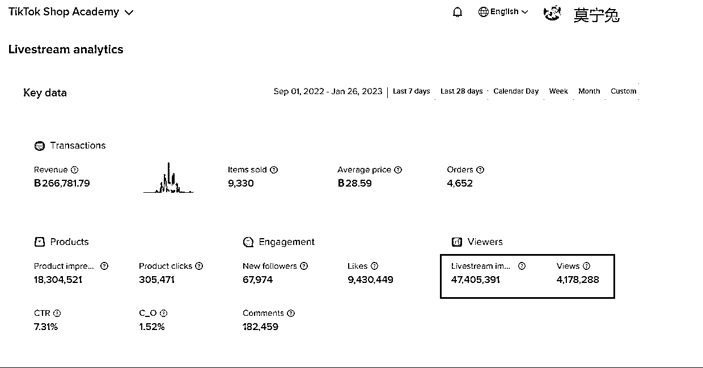
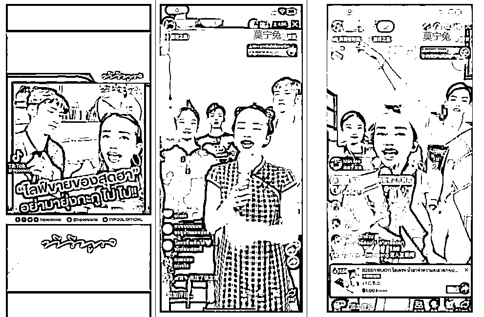
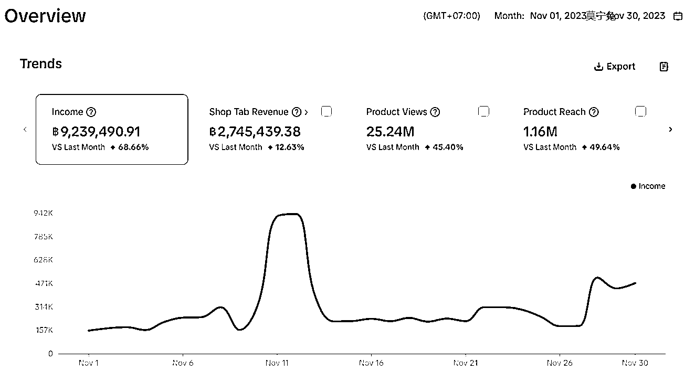
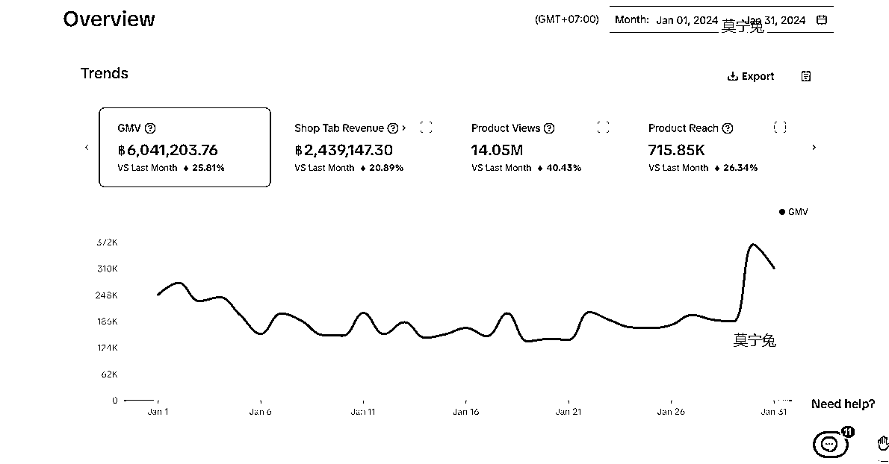

# 泰国 TikTok 大嘴 IP 及本土团队搭建经验分

> 原文：[`www.yuque.com/for_lazy/thfiu8/mwz07p6z4m9wd9g3`](https://www.yuque.com/for_lazy/thfiu8/mwz07p6z4m9wd9g3)

## (27 赞)泰国 TikTok 大嘴 IP 及本土团队搭建经验分

作者： 莫宁兔

日期：2024-03-25

“**中国人在 tiktok 上直播真的没有流量吗？TikTok 直播到底能赚钱吗？”这是被大家追问最多次的问题。**

大家好，我是 Lisa，一个拥有四年 TikTok 运营经验的“老鸟”，其中两年我专门深耕泰国市场。

**如果你有做泰国市场，肯定有刷到过我们直播间！**

今天，我想和大家聊聊我做**泰国大嘴 IP**的全过程，以及在**泰国搭建本土团队**的一些经验和心得，希望能给准备进军泰国市场的朋友们带来一些启发和帮助。

## **先简单介绍一下我自己吧。**

我之前是做外贸出口 B2B 的，那时候通过独立站和推广，我熟练掌握了 Facebook、Instagram 等平台的获客技巧。

2019 年我在香港工作时，接触到了 TikTok，由于国内的抖音正火，所以研究起来也是很容易的。

到了 2020 年，我更是被邀请成为了 TikTok 的培训讲师，和一群跨境电商的学员一起学习和成长。

虽然当时大多数学员主要做亚马逊等平台，但我始终看好 TikTok 的潜力。

### **2022 年的成果：**

机会总是留给有准备的人。

2022 年 4 月，泰国本土小店开放，我毫不犹豫地全职投入了 TikTokshop 的运营。

第一个月我们就赚了 30 多万人民币，下半年还成功打造了泰国版的大嘴直播间。

短短三个月，我们的团队就吸引了全网百万粉丝，后面视频播放量天天爆百万。

直播间曝光量更是达到了惊人的**2 亿多**，在线观众最多时超过**1800 多万**人，一场 2 小时的直播就能吸引**10-40 万**的观众。

# 从 10 月份~12 月主要直播 3 个帐号【1 月份停播了】

**虽然流量很大，但是销售额差！**

在泰国市场的运营中，我深刻体会到了本土化团队的重要性。

所以，2023 年我们决定在泰国本土建立自己的团队。

# 合伙人主播个人 IP

# 泰国版大嘴 IP

### **2023 年成果：**

在泰国 1 年时间里，通过精心选拔和培养人才，我们成功组建了一支高效、专业的本土团队。

现在，我们的团队规模已经扩大到了约 15 人，日常开播的直播间有 6 个，业务体系也越来越完善。

我们以自营业务为主，既做**线下实体批发**，也做**线上 TikTok 和 Facebook 直播零售**。在自营方面，我们专注于小众类目行业，并成功跻身**行业 Top3。**

仅仅是线上销售，我们就实现了年营业额约**500 万人民币**的佳绩。

因为我们有工厂一手货源，加上泰国人工和场地成本较低，所以线上销售的**利润能达到 20%**，**纯利 100 多万。**

**第一年是一个适应期，这个结果我们是挺满意的了，前面半年时间都是在做基础工作。**

包括培养团队，一个一个产品系列布局，以及直播间复制。

此外，我们合伙人在泰国的人脉很广，这也帮助我们成功拓展了其他类目的合作运营业务，与多个合作伙伴共同打造了高销量的直播间。

其中，双 11 期间单店铺的销量额能达到**200-300 万人民币**，平时也有**100 多万**的销售额。

这些合作项目的成功实施，使我们的合作年营业额达到了惊人的**3000 万人民币**。

**因为合作商家大部分都是第一年做 tiktok 小店，促销力度非常大，数据是很好，涉及的都是热销类目，但是利润不高，分到给我们公司的钱很少。**

计划 2024 年开发更多的新品，并且往品牌方面去做，销量额再向 shopee,lazada 靠近，以量取胜，薄利多销。

所以，我在这里提醒大家，**做泰国市场一定要先计算好利润。**

泰国市场的价格和容量都是有限的，所以一定要精打细算。

**双 11 单个店铺，最高销量 920 多万泰铢【184 万人民币】**

**2024 年 1 月销量 600 多万泰铢【120 万人民币】**

**下面，我会详细分享我在泰国市场的运营经验和本土团队的搭建心得，希望能给大家带来更多的帮助和启发。**

内容比较多，请查看以下飞书链接：[《泰国 TikTok 大嘴 IP 及本土团队搭建经验分享》](https://dww4unrkfa.feishu.cn/docx/X3iMdJ3zLo1y7VxnRHpcOLo9nvc?from=from_copylink)

* * *

评论区：

暂无评论

* * *