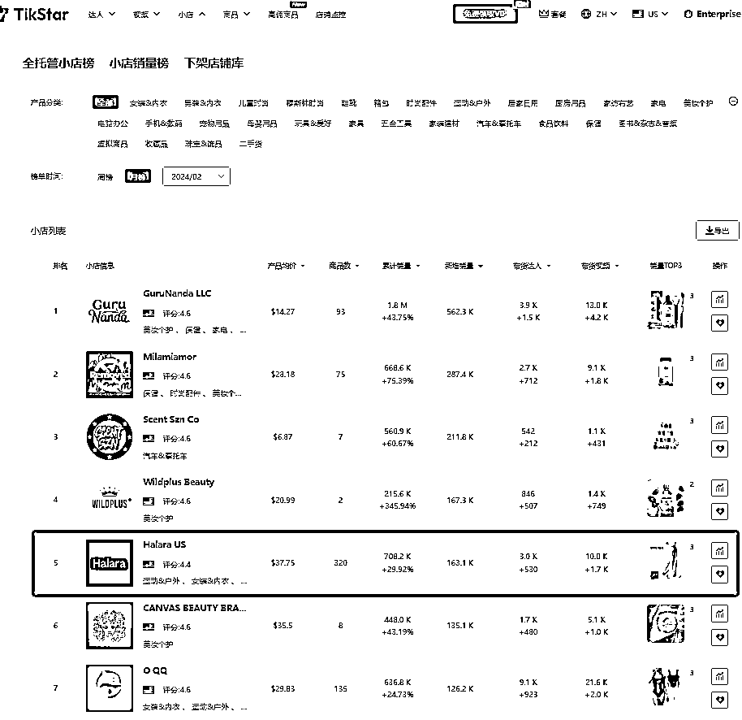
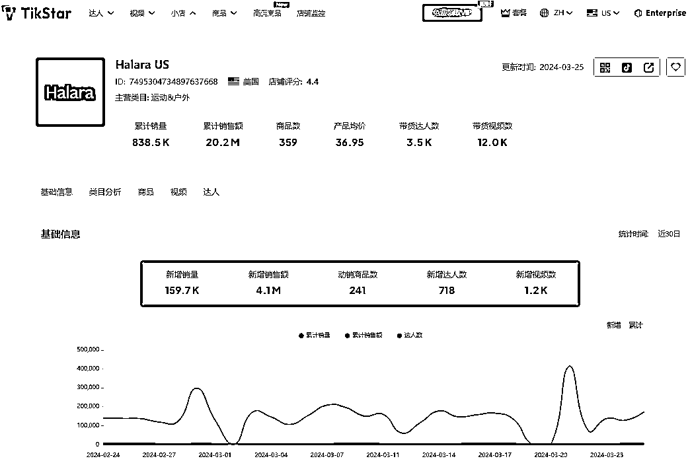
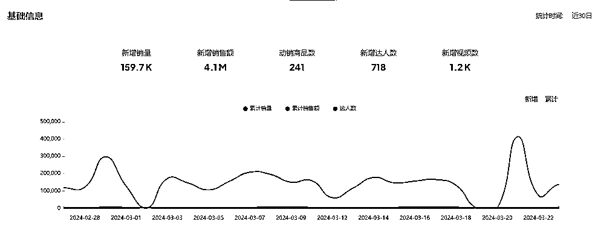
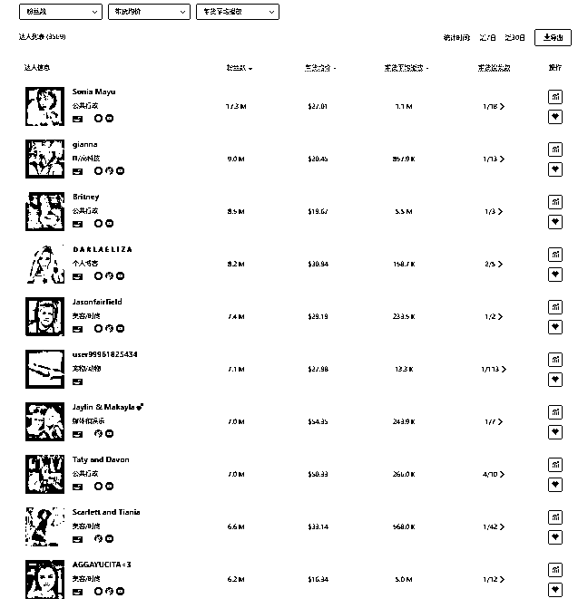

# 83 万单，Halara 的 TikTok 美国小店爆单思路拆解

> 原文：[`www.yuque.com/for_lazy/thfiu8/dqmn2qggpnfaa2ug`](https://www.yuque.com/for_lazy/thfiu8/dqmn2qggpnfaa2ug)

## (16 赞)83 万单，Halara 的 TikTok 美国小店爆单思路拆解

作者： 阳光杉木

日期：2024-03-28

**Halara US 2 月小店销量榜排名第五** 本次将会以**Halara US** 情况作为案例进行分析

小店销量榜

根据**TikStar**数据显示，截止到**24 年 3 月 25 日 Halara US TT**美国小店累计销量**838.5 K**

销售金额 2020 万美金

售卖产品数**359**个

均价**36.95**

带货达人数**3.5 K**

带货视频数**12.0 K**

**近三十日数据显示**

新增销量：159.7**k**

新增销售额：**4.1M**

动销商品数：**241**

新增达人数：718

新增视频数：**1.2k**

Halara 是一家成立于 2020 年的快时尚跨境出海品牌。尽管 Halara 成立时间不长，在创立的一年时间内，Halara 分别完成天使轮和 A 轮融资，2021 年 6 月 17 日拿到今日资本、红杉中国、IDG 等资本 1 亿美元融资。被称为 lululemon 平替，定位其定位是做“中国版的 ZARA”，专注于运动休闲品类。该品牌以高质量、高性价比为特点，致力于提供覆盖全天候场景的运动休闲服饰，适合不同类型和身材的女性穿着。主要销售价格 20$到 40$的时尚运动休闲女装。尤其受到欧美运动女士的青睐。

**Halara US 多渠道布局 Facebook，Instagram，YouTube，TikTok 上使得 Halara 覆盖多个渠道的用户，Halara 自从 10 月中旬入驻 TikTok Shop 美国站以后，迎来了快速增长。在 tiktok 上通过达人带动品牌宣传曝光产品。平均每天合作达人数 24 个。**

达人分析

目前**Halara US**建联带货粉丝量**排名前十**的达人名单如下：达人粉丝数**破千万** 达人粉丝数排名前十多为时尚博主，符合品牌调性。

达人注意事项

1.粉丝数量 粉丝数量固然重要，更重要的是是粉丝的质量。只有拥有与产品目标客户群体相契合的忠实粉丝，才能实现更高的带货转化率。

2.达人风格 寻找和目标客户群体相符的，粉丝人群更精准，激发购买欲望。

3.带货数据 低粉丝量并不意味着转化率低，有些红人在努力提升视频质量和用户粘性，这些粉丝可能会带来更高的转化率。

当然，这是对品牌而言，目前很多中小商家不筛选，直接通过海量邀约铺达人的方式去广撒网，伴随的也是回复率越来越低。

解决思路：

内容比较长，详情移步文章呀

[`za6kyadmdr.feishu.cn/docx/Tm3mdOxhNo8e22xHIfncOFiznde?from=from_copylink`](https://za6kyadmdr.feishu.cn/docx/Tm3mdOxhNo8e22xHIfncOFiznde?from=from_copylink)

* * *

评论区：

暂无评论

* * *