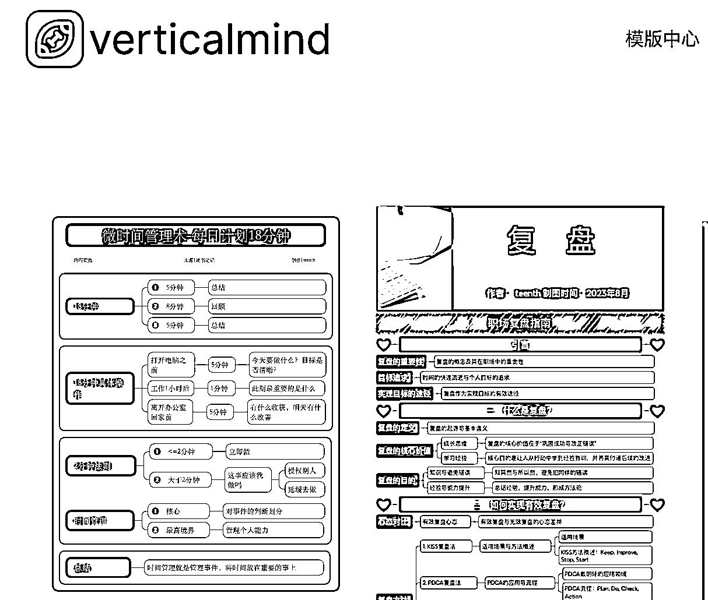
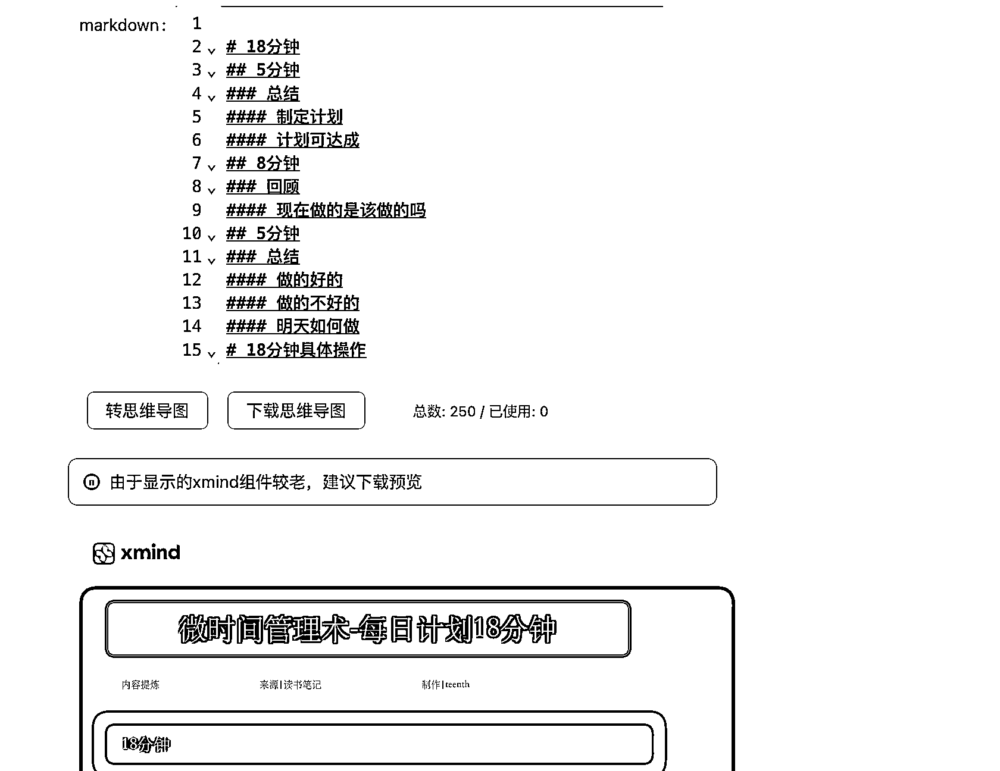

# 参加完上次的思维导图航海,有了自动生成的想法

> 原文：[`www.yuque.com/for_lazy/thfiu8/fy1vlgnyu2zv5gpw`](https://www.yuque.com/for_lazy/thfiu8/fy1vlgnyu2zv5gpw)

## (30 赞)参加完上次的思维导图航海,有了自动生成的想法

作者： teenth

日期：2024-03-29

我是去年 418 加入生财的，一直在生财学习，因为本职工作是程序员，所以偶尔会做一些工具网站。正好在这次续费的时候，做了一款思维导图的工具，感谢生财
本次工具体验链接：
本次分享主要分为 3 部分
我为什么要开发竖屏思维导图工具
如何用工具变现
未来可能会做的方向
阅读全文请移步：[`qx5811ufta9.feishu.cn/docx/FQWbdbi4DouJ5OxhF4Uc6fX3n1d`](https://qx5811ufta9.feishu.cn/docx/FQWbdbi4DouJ5OxhF4Uc6fX3n1d)

* * *

评论区：

帅彬（蟹老板） : XMind 是手机 app 吗，要冲会员吗
🌸猫本红豆冰🌟 : 可以➕宁微信付费请教吗？想要复盘的模版实操一遍～
卓 sir : 谢谢大佬分享，对于我这种手残党真的很有用啊
teenth : 电脑也有
teenth : 可以直接进网页

* * *