# 7 天公众号净增关注 7000+，裂变社群 17 个，微信 1500+

> 原文：[`www.yuque.com/for_lazy/thfiu8/ns2pp6vq1e6rnlxn`](https://www.yuque.com/for_lazy/thfiu8/ns2pp6vq1e6rnlxn)

## (22 赞)7 天公众号净增关注 7000+，裂变社群 17 个，微信 1500+

作者： 老秦

日期：2024-03-29

### 前言

大家好， 我是老秦， 红包封面过年期间的热度很高 ，老秦也参与了。

红包封面有四种玩法：

1.  1、红包封面微店代理， 公域引流卖封面赚佣金

2.  2、自己制作红包封面引流（有额度）

3.  3、利用明星/机构/品牌红包封面引流

4.  4、利用搜一搜免费红包封面引流

### 一、数据

说一下我做封面的一些数据。

**7 天公众号净增关注 7000+，裂变社群 17 个，**其中帮朋友涨粉 2000+

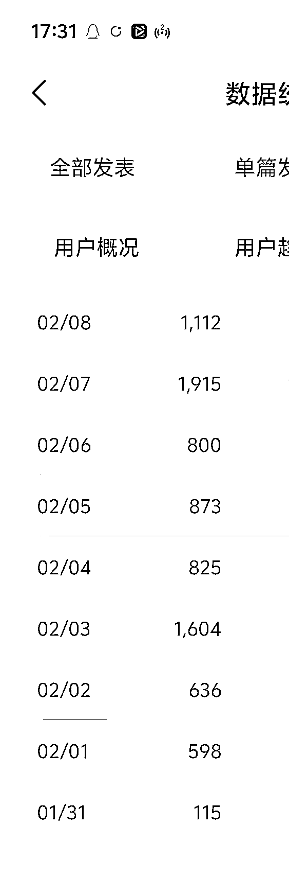

### 二、红包封面代理

关于红包封面代理，有很多开通教程，这里就不展开了。

### 三、自己制作红包封面引流（有额度）

可以在微信红包封面开放平台：[`cover.weixin.qq.com/cgi-bin/mmcover-bin/readtemplate?t=page/index#/`](https://cover.weixin.qq.com/cgi-bin/mmcover-bin/readtemplate?t=page/index#/)

做红包封面定制。

#### 一）如何定制

咱们做引流， 建议 gpt4 直接生成， 当然也有尺寸的要求，具体可以看这里。

#### 二）如何引流

审核通过后可以付费使用了，目前红包封面的价格 1 元 1 个。有点小贵。

每年平台也会赠送一些额度给公众号/视频号主，**有额度**就划算啦。

#### 1、抽奖小程序

可以在小程序【抽奖助手】或【活动抽奖】中设置红包封面抽奖， 例：

抽 50 人封面，中奖后引导用户添加你的微信获取封面，实现私域引流。

也可以设置让用户关注你的公众号后再参与抽奖， 同时引导关注公众号。

这种方法适合封面热度前期，后期封面很多， 大家的参与度就不高了。

#### 2、 公众号发封面文

公众号中插入红包封面 ，文中分两步， 第一引导用户关注公众号，第二领取封面。

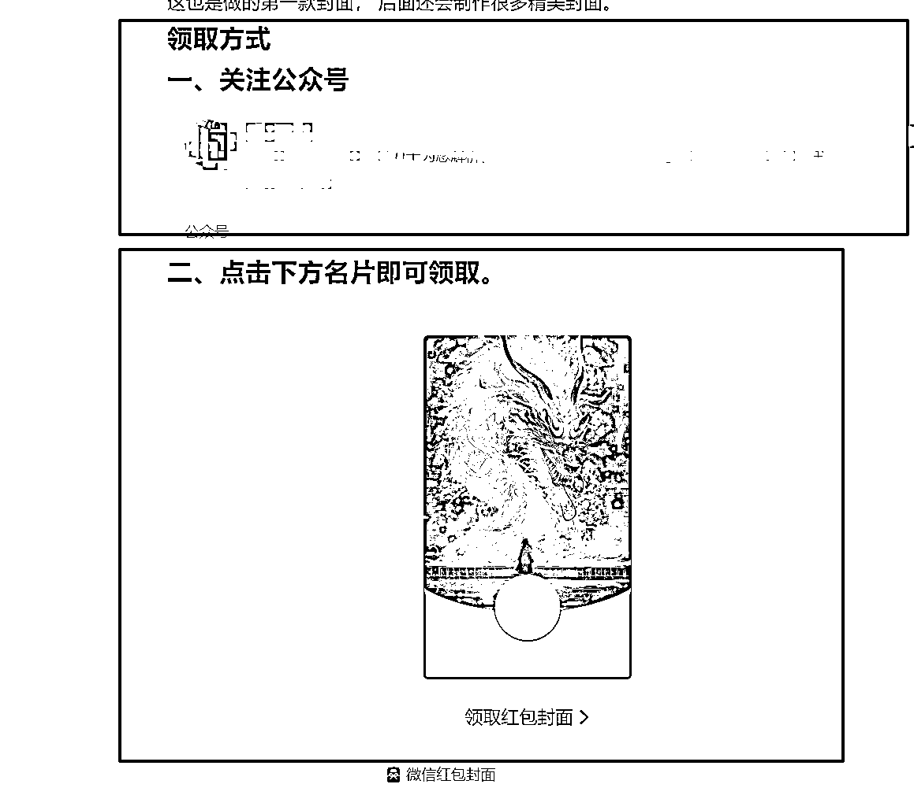

这种类型的文章当然非常容易被“推荐”或被搜索到，所以公众号粉丝数不多，阅读也是不低的。

#### 3、社群/朋友圈分享

如果你有自己的社群，或朋友圈用户较多， 可以在发完封面文的同时， 再去编辑发布一篇【引流文】，文案就是关注 xxx 公众号， 回复关键词【红包封面】即可领取封面，引流文不能直接领取封面， 只能关注公众号后领取的。

效果很好的， 一波下来最少涨粉 200+

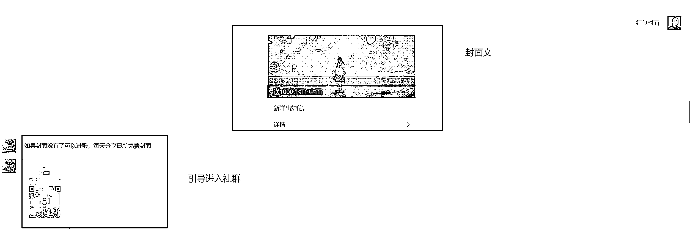

### 四、利用明星/机构/品牌红包封面引流

在红包封面热点前期可以通过明星/机构/品牌进行引流， 这种需要自己有有一些基础的流量。

直接看案例：

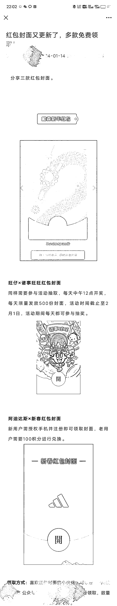

引导到公众号回复关键词：

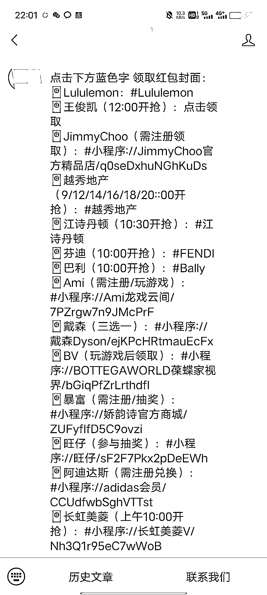

### 五、利用搜一搜免费红包封面引流

过年前 7 天，我通过搜一搜 利用免费的红包封面成功引流了。

我有个公众号小号， 粉丝不多 ，平均阅读几十，但近期发引导文 搜一搜来的流量不少， 于是想到了通过过年前的红包封面热点， 利用搜一搜引流。

所以老秦又测试一种玩法，结合  **社群+公众号+免费红包封面+搜一搜**

#### 一）思路

核心的思路就是公众号发布免费的多款红包封面组合文， 测试多种标题， 利用搜一搜来的流量， 引导用户关注公众号， 在公众号中设置社群码，让用户加群形成裂变。

1.  N 款免费红包封面组合文章，打通搜一搜，源源不断的新流量，激活社群

2.  单款免费红包封面文章，维护社群利器，让用户每天都能领多款免费封面

#### **二）N 款免费红包封面组合文章**

这种文章特别容易进入搜一搜 ， 近期我的账号这种每天都会被搜索到， 引流过来很多流量。

举个例子，可以在搜一搜中搜索“红包封面”

就类似上面的文章， 我们主要是自己找一些非原创封面合集文，文章的核心就是引导用户关注你的公众号， 在公众号回复关键词。

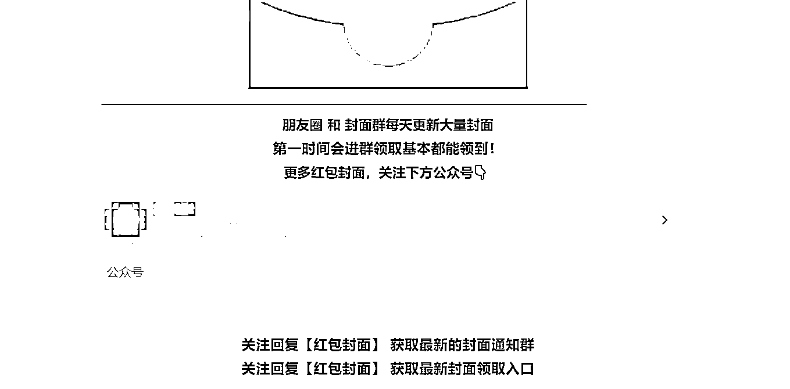

然后设置关键词回复，和之前类似：

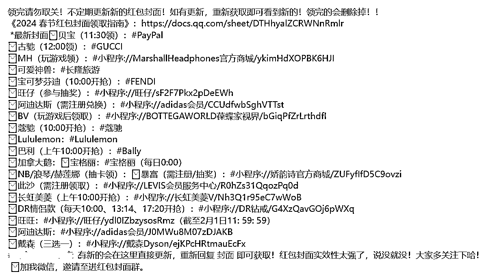

贴几篇我最近发的这种类型文章的内容分析图：

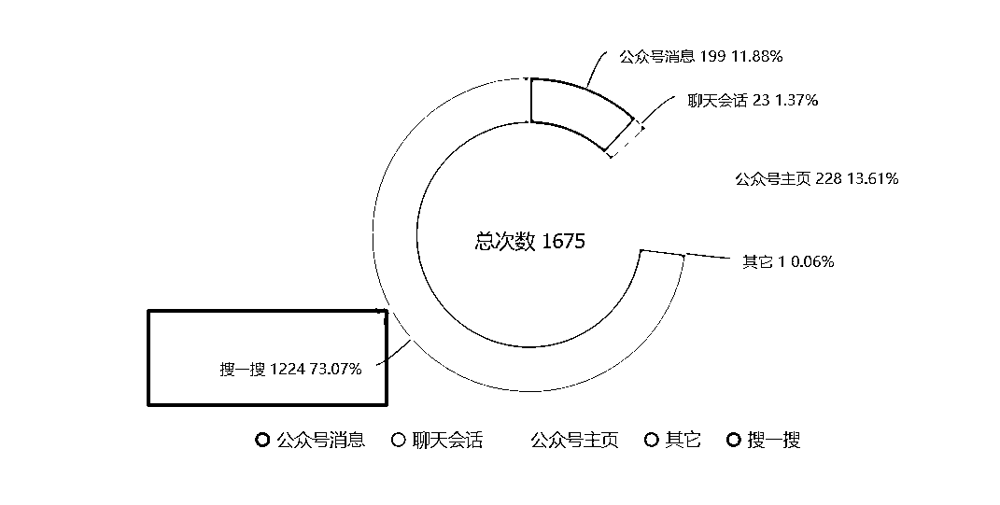

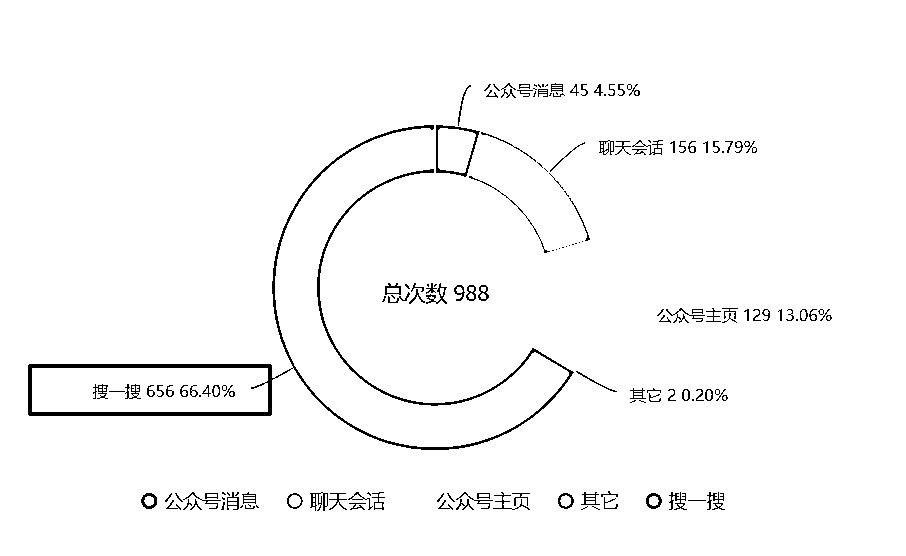

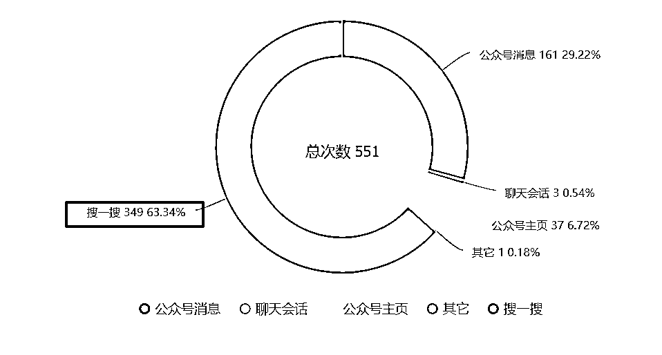

这种文章不需要做转发，就可以实现被动涨粉。

#### **三）单款免费红包封面文章**

单款免费红包封面文章有几个好处：

1.  发到红包封面社群， 让每个用户都能领导封面，对社群产生信任

2.  用户拿到封面后，容易转发， 可裂变， 从而增长关注

3.  流量主也有不错的收益

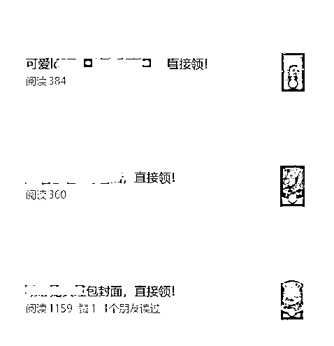

虽然文章有时效性，但公众号一天可以发很多篇文章， 所以这种文章，用户大概率会获取到红包封面。

### 六、几个优化

1、在公众号关键词回复中，除了回复红包封面封面内容，还加入了微信群二维码。给社群引流。

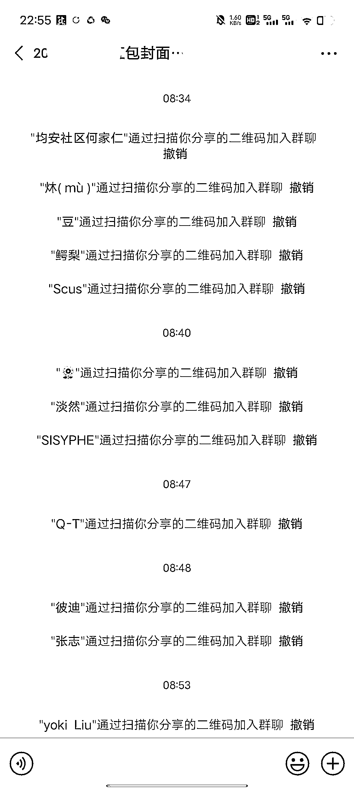

2、单篇免费红包封面中，增加文中广告，提高流量主收益

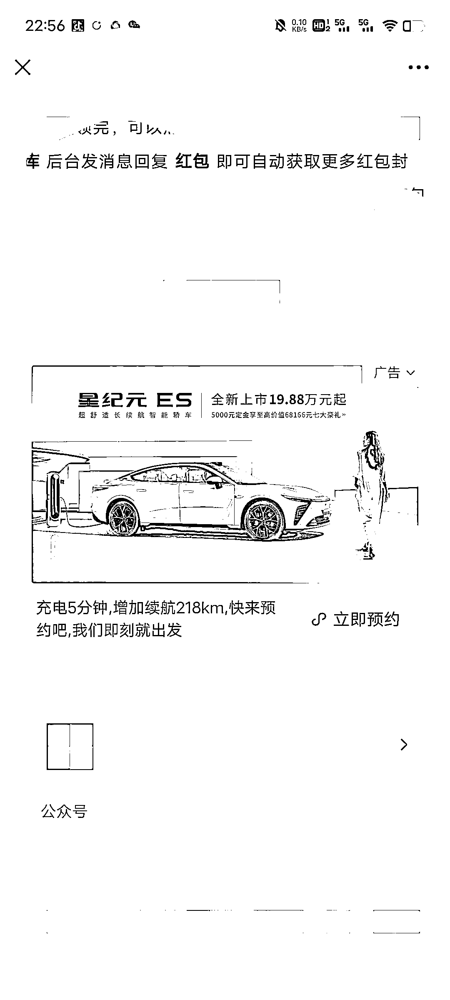

3、在公众号菜单栏添加【封面获取】菜单， 引导用户添加微信。

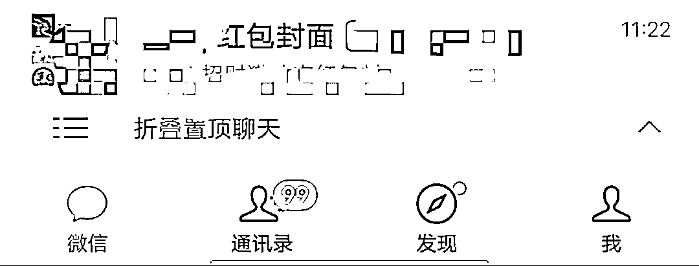

* * *

评论区：

暂无评论

* * *