# 3 个人入局英文绘本教育，30 天直播成交金额 40w+

> 原文：[`www.yuque.com/for_lazy/thfiu8/mq6zik5cez4gv0rb`](https://www.yuque.com/for_lazy/thfiu8/mq6zik5cez4gv0rb)

## (33 赞)3 个人入局英文绘本教育，30 天直播成交金额 40w+

作者： 沈宇

日期：2024-03-27

把绘本做成课程，这个项目是我在 21 年开始做的，主打就是老师+孩子共读，省去家长教育的时间，日常除去老师的专业外，还有老师和孩子跟读，是挺有趣的。

但，这不是重点，重点是我们怎么通过直播销售让课程大卖，3 个人每月稳定收益 30W+。

先说下前端，我们的课程选择是大众普遍认知里的产品，加上一定技术壁垒，以独特和低价在前端吸引住用户。

而后端我们主要是靠私域运营，用 0-599 的低价课程，引进私域后转化千元课程，靠每日朋友圈，每日沟通交流等服务最大化去转化课程。

其实这个项目起来之前，我们起码调整了三个月时间，做了好几个账号，定位也变化了很几次，人群不精准重新做，才能把账号做到如今的程度。

接下来，我也分几个板块，跟大家说下，我们是如何设计课程、怎么上架产品、如何获取流量，以及在公域进私域转化的这个过程中，比较值得做的关键点。

# 一、自我介绍

大家好，我是行者-悟空（沈宇），来着江苏南通，在 30 岁之前追寻爱好，走上了武术学习之路，也因为爱好跟着师兄弟们一起走上了线上知识付费之路。

从 12 年 qq 和贴吧开始，乘着微信的崛起，进行武术课程的线上教学，那个时候每月 gmv 是 50w 以上利润可观，在武术界基本是少有的，后来各省市开培训，搞加盟很是火热。

19 年后因为疫情，各地活动开始萎缩，线上大家爱好类学习积极性降低，业务开始进入频震荡阶段。这个时期团队已经运行成熟。所以在 21 年的时候就决定寻找新的业务内容。

什么样的东西，客户群体的付费欲望和消费意识不会被疫情影响呢？

我发现，21 年双减和疫情，线下的教学类机构被打击，但是宝爸宝妈对于孩子教育的需求没有任何的减少，反而因为渠道的减少，而更加的迫。

基于这个理念，21 年底的时候，招手开始家庭教育知识付费这一赛道的入局，这个时期也是跟着生财一起参加了航海，在这一时期，起号成功，开始了抖音之路！

目前稳定的每月收益是 30w 左右，这一过程中遇到很多问题，后续和大家一一讲解！

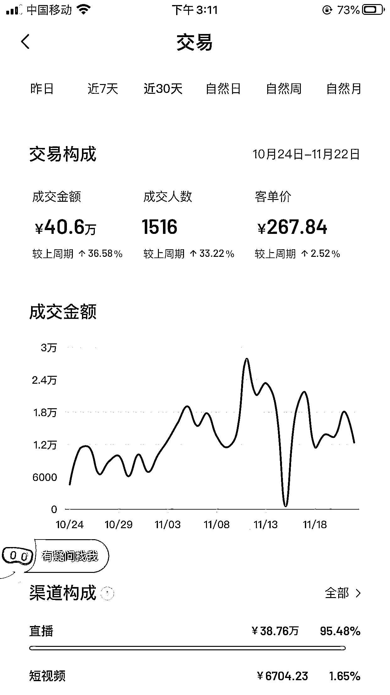

# 二、做了什么样的产品和服务

确定了目标人群和项目方向，就要确定产品或者说课程内容：2 个方向

**（1）要做被大众认知的课程**

这边的意思就是，我们很多时候，老师会从自己教学的角度去思考，固然做出来的课程内容这些是很好。

但是对于客户或者说受众来说，他们并不了解，这个里面就是存在认知差，所以，凡是需要你去花费大量时间来进行洗脑的课程，都不适合前端的销售。

这个也是前期在销售的时候，做了课程。买了课程的都说好，但是前端并没有很好的销量的原因。

基于此，后续调整了战略布局，通过市场调查，在英语类中，分级阅读的宣传和家长认知比较高，但是普遍存在不会读，不会用的问题，故此，推出对应的分级阅读课程就比较有可行。

1、就是大量的主播都在推荐，市场不需要你再教育。既买已经被教育过的产品，而不是你去教育市场。

2、家长对于产品有了解，但是还是有很大的认知差，这个里面就有继续被教育被服务的点。

3、通过普遍性产品，建立第一层的信任，后续才能有更多的持续成交。

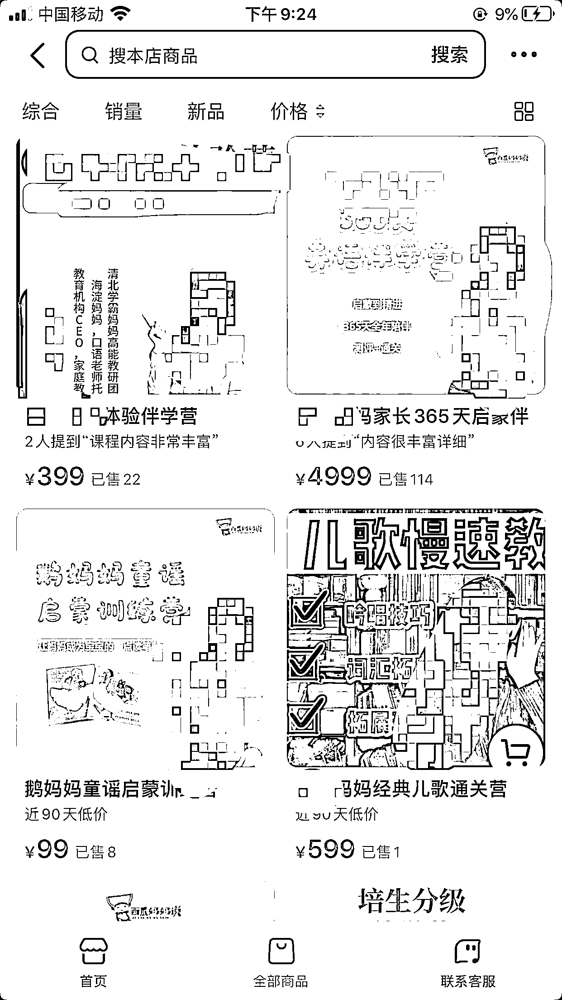

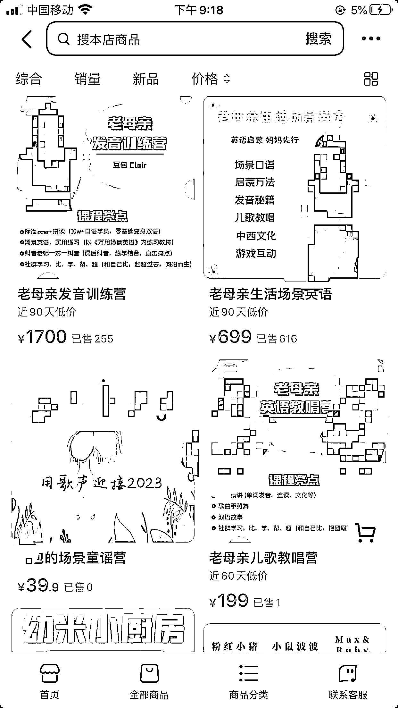

例如：上面的这种，没有特殊性，市面上比较多，就比较考验主播的 ip 和直播转化能力，上面大家看到的是做了一年多，好多个主播带出的交易数额，实际上就是很大的流量浪费，所以做课时候，一定注意，课就是产品，要有买点。

**（2）课程要有一定的壁垒**

那我们在设计产品或者说课程的时候，一定要有课程的独特性，要么就是具有专利性，要么就是很难被模仿超越。

我们都知道做互联网很容易被模仿，所以在开始之初，就要考虑被模仿的可能性，如果被模仿，你怎么办？

像之前搞过的武术线上教学，在技术壁垒上面就是进行技术体系化，把涉及的专业名称进行布局，在互联网上面大量进行文章和内容输出，占领搜索和词条。

比如筋骨训练，开发筋骨，这些词汇。效果就是想到这些名称和内容就想到我们，那个时候运用的就是品牌化。后来就是但凡说到筋骨，就想到我们，其他后来者很难超越。

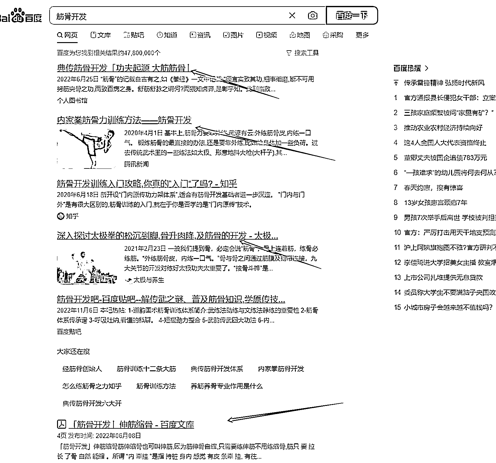

上面就是关键词文章和内容都是之前我们布局的，文字搜索基本就是直接看到关于我们的文章！

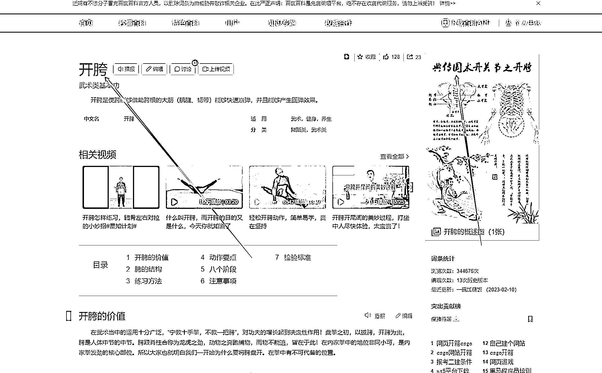

占领词条，图片上面就是我们武术宣传的品牌名：典传国术。

那上面的情况在这里不适应，前者需要大量的时间和人力去进行，这个项目的开展初期就是 2-3 人，很难有时间和精力进行，故此在产品课程设计上面，我想到了不可复制性。

这边你如果有时间，也可以布局抖音搜索 seo 来建立护城河！

在这边总结一下，如果你是进行直播销售，课程一定要：

1.  **是已经被教育过的大众认知品**

2.  **有一定技术壁垒的；**

如果满足，你一定会大卖的。

**（3）课程如何上架各个平台：**

**1.抖音平台入驻学浪**

**1.1 入驻学浪个体户申请**

抖音平台上架，虚拟课程，就需要入驻学浪，个体老师最好的办法就是申请个体户，这个比较简单，淘宝上面几百元就能解决。

这边重点要说的就是申请的类目，因为不同平台要求不一样，但是相对最保险的就是需要把下面的**【教育咨询培训】**这个给申请，避免后续小红书，视频号你要开店的时候，其他的根据你情况来选择。

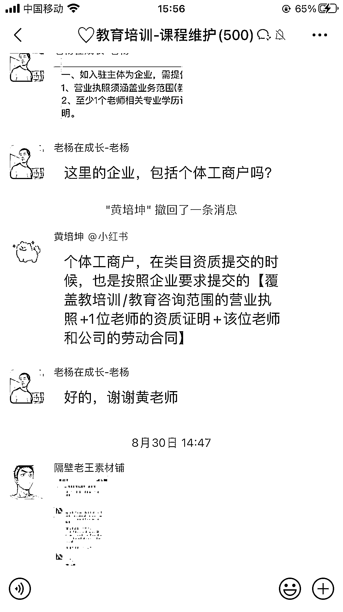

另外就是上面说到的个体需要老师资质，这个你只需要找一个有资质的申请，给你材料申请就行。

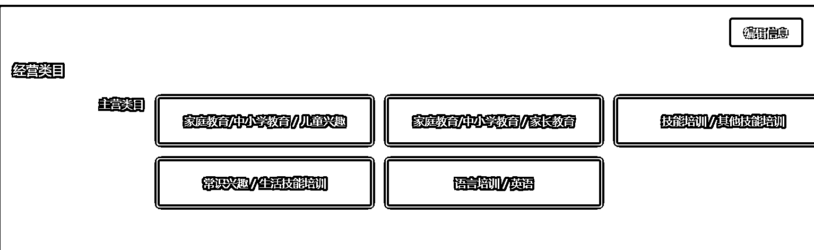

想要申请什么类别，按要求申请就 OK

**1.2 上架课程，苹果手机看不到，怎么办？**

因为抖音和苹果的关系，如果单纯的上架虚拟产品，苹果手机是无法观看到的！那怎么办，在一个链接里面创建多个 sku，一个为虚拟，一个为实物，拍的时候，让客户拍虚拟的，就能解决发货问题。

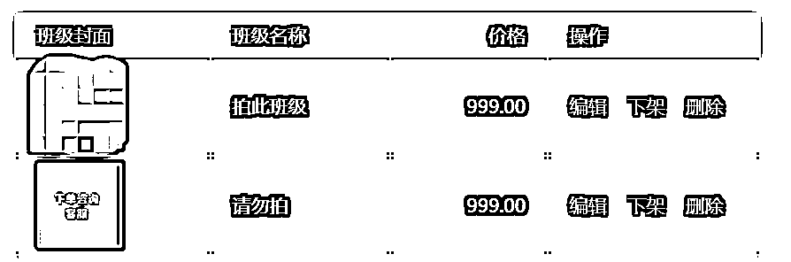

如上图，拍此班级为虚拟 sku，请勿拍为实物 sku，这样就能正常在直播间观看到课程了。

#### 1.3 在抖店上架课程类产品，不入驻学浪可以吗？

目前这种形式不太好，前面说的，因为虚拟类的你上架苹果手机看不到，所以需要发实物，这个就需要物料了，对于个人来说就比较麻烦了，另外在抖店上架教育类产品需要申请 icp 认证，虽然比较简单，但是也需要去阿里云申请，需要摸索，建议直接入驻学浪。

**2.视频号小店上架课程**

**2.1 通过小鹅通联通视频号小店**

因为视频号小店也需要没有交付的端口，所以一般就需要你自己有第三方课程学习平台，这边小鹅通比较方便，也可以打通视频号直播间。

所以一般大部分用的都是小鹅通，小鹅通创建课程后，绑定一下视频号自己的小点，就能直接把小鹅通课程 sku 申请提交。

因为我有自己的小店，所以就是直接链接自己小店申请。

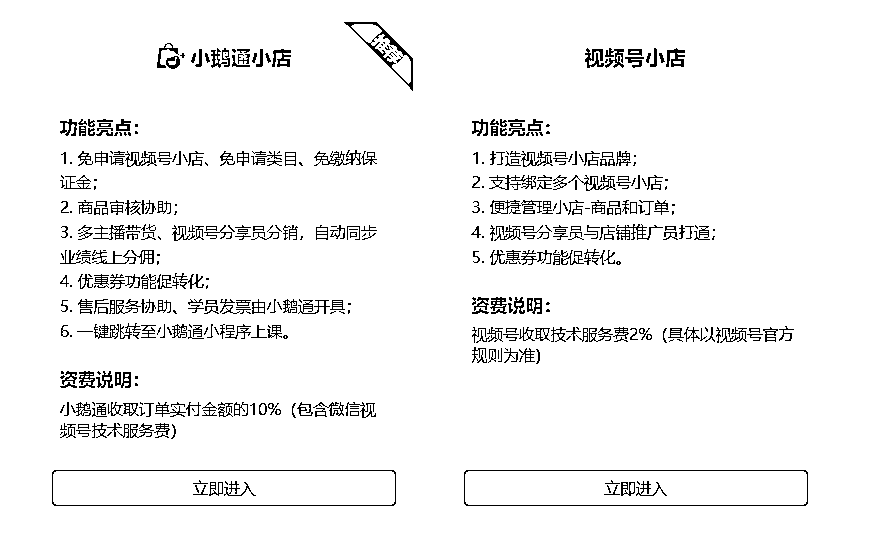

直接选择视频号小店，上架小鹅通里面的课程，就能上架课程。

如果自己没开视频号小店，直接选择小鹅通小店申请，也是很方便，就是有个手续费 10%，左右。所以就看你自己开还是，小鹅通开。

**3.小红书上架课程**

小红书上架教育类目，就是务必营业执照需要申请教**【教育咨询服务】**，不然开通不了类目，类目开通，上架还是蛮简单的，没有什么大问题。

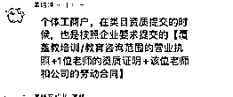

# **三、流量从哪里来**

确定了项目方向，那下面就是确定客户来源：

从 12 年开始一直做线上，转战不同平台，21 年对于我们大部分来说，短视频平台就是我们流量获取的最大来源：

抖音，快手，小红书，视频号，就是我们需要布局的流量获取渠道！

**（1）重点说抖音**

在这个之中，抖音就是流量最大的端口，所以第一步的流量布局端口就是抖音。抖音上面二个方式，短视频引流，或者直播。

在抖音上面直播和做课的过程中，走过很多弯路，其中做课，也就是产品很重要，那对于知识付费来说就是课很重要，除非你的直播能力很强。

抖音直播就是和做短视频一样，就是要不断迭代。

23 年做直播：**短视频视频+直播能力+测试投放**

**3.1 自然流如何拉**

先说如果你走自然流，就是需要关注直播数据指标，关注率 2%以上，整体停留要做到 1 分钟，粉丝互动率 3 以上，这样自然流才能起来，不然你可能会感受到长时间的几个人在线。

现在抖音很智能了，会用直播分析如下图：

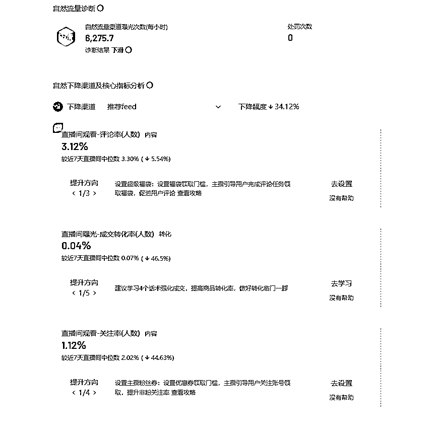

那上面的所列内容，就是你优化直播间的方向，这个内容比较多，有机会细聊。

善用福袋和超级福袋，有一点时间流量下滑，怎么也拉不上了，福袋就是拉粉丝团和关注的抓手。

整体关键还是，数据，数据好，流量就能拉上去，一般买课的流程就是：40 分钟知识 +10 分钟洗脑 +30 分买课。

1.  前面 40 分钟，需要保数据做充分，关系到你这场直播当时流量和下场直播开播流量

2.  中间 10 分钟左右洗脑，就是让观众从知识获取到准备买课的过度

3.  30 分钟买课基本分三个阶段：冲动消费、轻度信任（背书，好评等）、点对点的成交

**3.2 付费投放**

对于个人来说，先搞小店随心推来测试测试就行，后续可以了，放大千川，但是投千川也不能让付费占大头，不然不赚钱，基本保证付费不超过 40%比较合适！

如果你走千川付费，如果个人，小工作室，我建议你优化好自然流模型后去上，这样才能放大。

目前整体英语类的 roi 就是在 1-2 之间，好的能做到 2，那就是多投多赚了，这个就看你的打法了，成熟的话可以上，但是要做好投放策略，不要被投手忽悠，乱投！

小店随心推的话一般一场 100-200 足够了注意投成交，不要投其他的，其他的数据出不来，浪费！

**3.3 短视频重点**

现在直播很卷，所以就要多面手，想要直播能立起来，短视频能力不能差，如何做短视频这边就不复述了，有专门的航海手册，能真人出镜务必真人出镜。

因为直播你就直播时间让客户了解，其他时间，只能是通过短视频，让你的个人形象，在平台上面曝光，所以用好短视频很重要，加大平台对你个人的曝光量，有利于直播间的成交。

**3.4 多平台直播**

抖音端口如果模式成熟，可以同比复制到，快手和小红书或者视频号，这个是下一步准备实施的内容。这边不展开，多平台直播还是蛮简单的。

我一般用的是 obs ，下载 obs，[`mirror.tuna.tsinghua.edu.cn/github-release/obsproject/obs-studio/`](https://mirror.tuna.tsinghua.edu.cn/github-release/obsproject/obs-studio)

利用 obs，虚拟摄像头功能，可以实现，小红书，抖音，视频号多平台同时直播。

那前端打通了流量的问题，后续就是接私域端口的转化问题。

# 四、私域如何运营，实现变现

**（1）前端引流，后端就是私域转化。**

在产品设计上面，前端是 0-500 之间的产品，衔接的就是*3 倍的转化指数，故衔接产品设计在 1000-2000 之间。

课程形式就要配合社群服务。

目前我们前端设计的 299 课程，进入到私域就是转化成千元课程，后续继续进一步转化，同时横向进行产品类的覆盖。

抖音如何引流私域，一般的短视频引流，私信这些都说过了，说一下直播的时候，如何引流？

**进群以后用卡片进行引流，或者跳转短链，比如：微客链接，很方便的，直接跳转微信。**

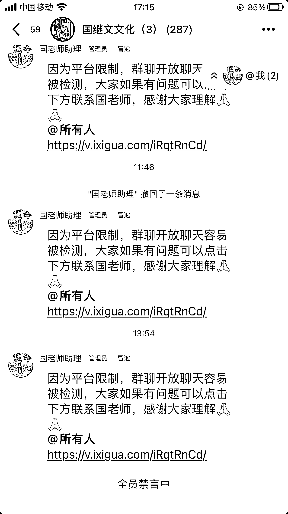

其他的，如群公告的里面加入微信信息，或者群名字改为加微信暗示都是可以的，但是相对来说都没有直接跳转方便，大家可以尝试。

**（2）私域转化三大抓手**

23 年 -24 年，只做前端，个体会比较吃力，所以一定要做好后端私域的转化。这是今年后端的转化，也比较简单，就是平时朋友圈发，微信群每周一直讲解课，周末做一次私域直播转化。

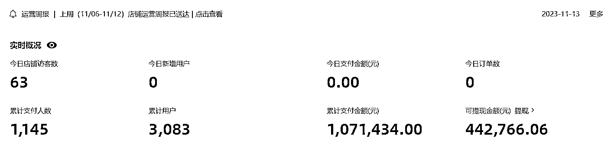

**朋友圈，微信群，私信沟通**

就是三个重要的落脚点，穿插平台文章和视频号。

想要转化好，就要建立好私域端口的信任建立，故安排了，每日朋友圈条数，每日沟通交流人数，以此来最大化的服务于后端转化。

一般来说，交流的次数越多，后续转化可能性越高。

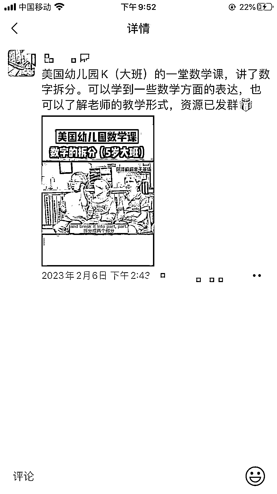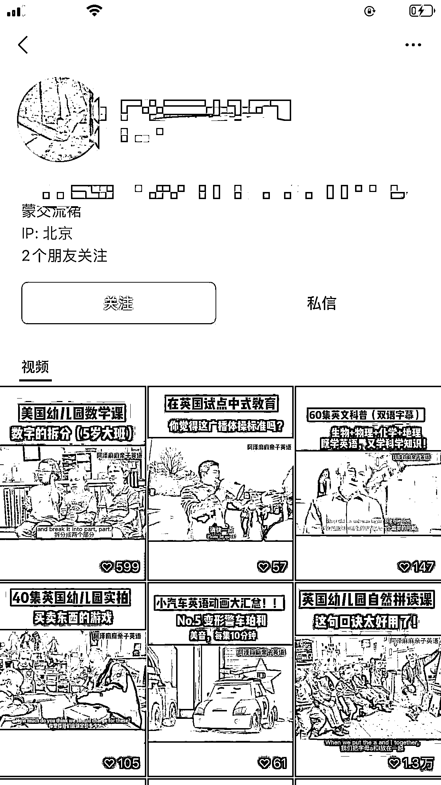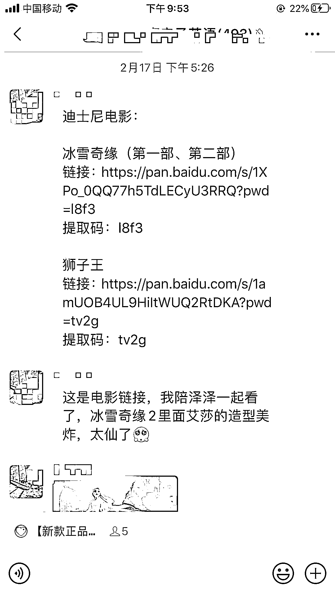

这边就是一个很好的案例，资料在视频号和朋友圈，和群直接流动，可以很好的形成用户的触达，是很好的一个运用点。

**（3）每周建一个群，搞一次宣讲**

因为前端直播需要付出大的时间成本，团队小的情况下，就是把一周积累的用户放到微信群里面，做一次集体的宣讲，比如周一周五直播或者其他渠道的人员，统一周六的的时候邀请进群，进行宣讲。

时间上面可以设置为，第一天文字讲解，第二天直播讲解，方便当场成交，这种形式就比较轻，适合小团队进行。

# 五、过程中的经验分享

**（1）宝妈多次变现**

其实在除了买课外，短视频带货也是非常不错的，因为团队精力问题，没有大力投入，但实际上，人设上去后，拍摄对应短视频，效果也是很不错的，每月也基本有几 w 的销售额。

后期准备组建视频团队，把这部分内容给完善起来，同时做流量！另外这个视频号方面也很适合宝妈从事，可以设置合伙人计划，来进行这个方面的培养，其实还是不错的！

另外就是社群团购了，这个已经在这个月开始进行，预计后续也会成为一个收益的端口。

**（2）专注和坚持**

这个项目起来之前，起码调整了三个月时间，很多时候计划和实践是分开的，所以开始做了好几个账号，定位也变化了很几次，开始是账号起不来，然后就是起来了，但是人群不精准，放弃号有重新做，但凡中间放弃就没了。

所以，想法和实操是二回事，做这个项目之前，我也一直在做相关，只是不同行业，但是一下子切过来还是有个适应期，所以一个项目看准了，就要坚持！

另外就是专注，这个项目起来了后，老想着搞复制，其实才 2，3 个人，团队还不稳定，这个时候还是要建好基本盘。

中间看到视频号好，拉了 2 个人搞视频号，发现精力分散了反而二边做不好，所以在一件事项确定后，先做好，再做延申，不能一时膨胀一下子多面作战。

最后感谢生财，我这个项目优化，就是伴随着参加生财不断调整的，从最开始的大航海，到后面的小航海，都是不断在过程中，学习迭代，然后到现在稳定。

* * *

评论区：

小菜 : 课程是自己开发还是？
沈宇 : 前期是自己开发课程，后期直播上去了，如果需要完善产品体系就对外合作，重点搞直播

* * *