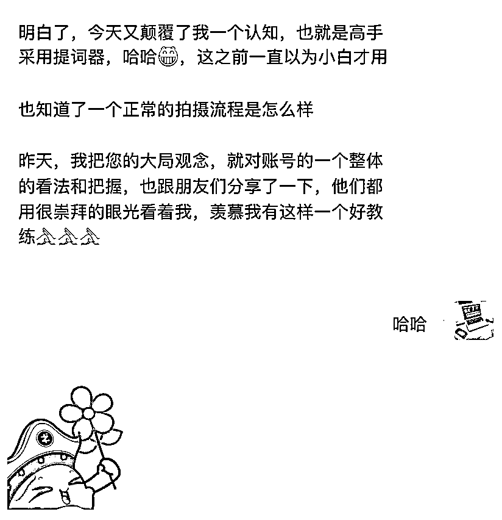
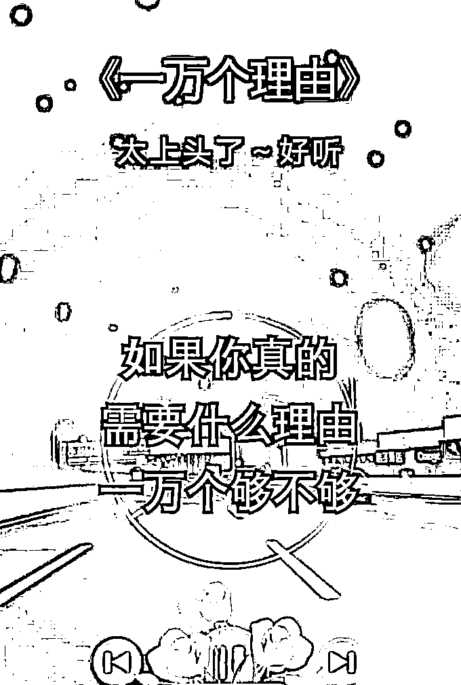
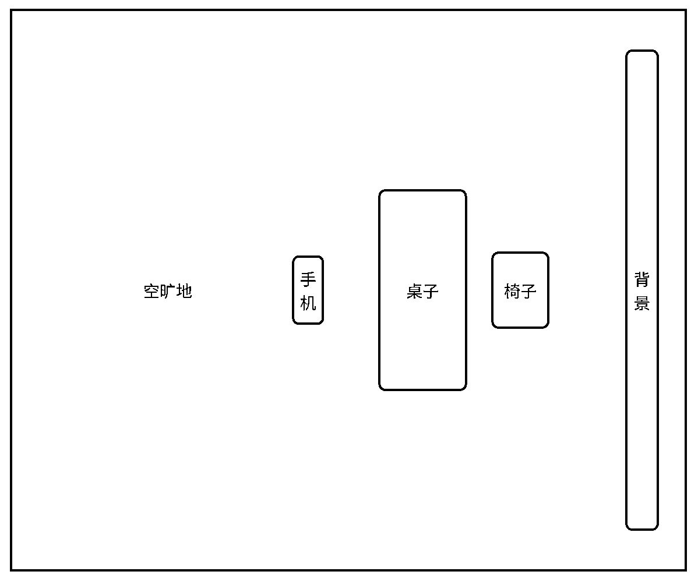

# 口播录制新手攻略

> 原文：[`www.yuque.com/for_lazy/zhoubao/uf6ecgvqlgb8yg2w`](https://www.yuque.com/for_lazy/zhoubao/uf6ecgvqlgb8yg2w)

## (50 赞)口播录制新手攻略

作者： 奇杰

日期：2024-05-24

大家好，我是奇杰。今天用这个帖子给大家讲一下新手录制口播的方法和注意事项。

**本篇帖子适用于有口播录制需求，但是方法不熟练，录制起来比较费劲的小伙伴，老手朋友可以酌情阅读。**

为什么我要写这篇帖子？起因是团队在为一些圈友剪辑口播作品的时候，我发现一些圈友给到的原视频看起来“拍的很费劲”。全程磕磕绊绊不断出错，而且表情僵硬呆滞，没有情绪感染力。这样的话，作品的效果往往会大打折扣，而且剪辑起来也比较费劲。于是我略微指导了一下，后来拍出来的作品效果就好了很多。

我意识到看似简单的问题，原来好多朋友是搞不明白的。而看似简单的方法，往往也很奏效，但是很多朋友却一直没掌握。于是我决定写一篇帖子，讲一下口播录制的方法和注意事项。一方面我对生财有术心怀感恩，带给了我们这样的氛围和收获，所以想为社群的知识建设尽一点绵薄之力。另一方面我也想贡献一点价值，来回馈大家的认可和支持。

* * *

**背景交代完了，那就上干货吧。**

首先说设备：手机+落地支架，其他的设备“前期”真的没有太大的必要。

相信大家都明白“学渣文具多”的道理，下面给大家罗列一下设备误区：

**误区一：相机**

现在随便一个手机的像素就已经很高了，而且是在手机上观看，屏幕就那么大。所以前期开始手机就“够你用了”，就没有必要折腾买相机了，前期节约出成本去干正事吧。

**误区二：收音麦**

口播是室内拍摄，封闭环境相对安静。而且人离得设备比较近，手机就能收到音。且距离是固定的，不会出现收音时高时低。并且后期剪辑的时候音量还可以调节和降噪，能弥补音量和声噪的问题。而用收音麦，好的麦价格不低，前期成本会增加，项目还不稳定就没必要无谓的增加成本。而便宜的麦不但音质不好，而且传输很不稳定，时高时低还带杂音，还不如手机的麦效果好。所以收音麦“前期”是没有必要投资的，先干吧，后期稳定了再看情况购置。

**误区三：补光灯**

白天拍摄的话，只要“迎光”坐，光线就已经够用了。晚上拍摄的话，室内光源“开大”也够用了。后期剪辑的时候还可以“调节亮度”，所以在“前期”的时候，这些都没有必要。先干吧，后面稳定收益了再考虑加配置。

**误区四：场景**

书架、窗帘、办公室、空白墙，这些都可以作为背景，只要“收拾整齐”不是乱哄哄的就好。后期剪辑的时候，还可以通过“抠像换背景”来处理背景，所以就没有必要“非得准备一个什么样的场景”才能开始拍摄。

**你所谓的“需要设备和场景”，只是你为“逃避拖延”找的借口。**

**只要你想拍，开始就行了，不要找那么多不行动的理由了。**

* * *

**拍摄时，有几个点是新手需要注意的：**

**1.用后置摄像头拍摄**

人日常习惯了说话的时候看不到自己，因为看不到自己，所以也不会顾虑自己的表情和动作，也就说的很自然。但是新手录制口播的时候，如果用前置摄像头拍摄，就会变成“看着自己说话”。注意力会被对面自己的表情动作表现等严重干扰，就会刻意的注意表情和动作，无法自如的表达，这样就会表现的非常不自然。所以新手在拍摄的时候，要用后置摄像头拍摄。看不到自己，就不会被自己干扰，就可以恢复到自然的说话状态。

**2.新手不要使用提词器**

提词器是高手用的，而不是新手可以驾驭的。因为只有老手才能做到“看着提词器讲，却表现得跟自然讲话一样”。新手看着提词器录口播，就会表情僵硬，目光呆滞，语言机械，一看就是“念稿子”。这样就失去了口播的意义，还不如用电子配音的效果好。所以新手不要看提词器，要凭记忆脱稿表达。如果实在记不住词，那就看一段讲一段，一段一段录。这样表达才自然，看起来才正常。至于中间断开看稿子的镜头，后期剪辑的时候去掉就好了。

**3.单条素材要一镜到底**

不管是一口气说完，还是看一段台词说一段，都要一直录，中间不要停止。将来剪辑的时候，一个作品就只有一条原视频，不会落下也不会弄错顺序。如果不是一镜到底，录成了很多条，在后期剪辑的时候就会面临“一条作品一堆原视频”的局面，容易遗漏、出错、混乱。不但整理、传输很费劲，而且校对、验收、调整、修改也费劲，会严重拉低工作效率。

**4.人物周围留足空间**

人物大致居中后，周围要留出足够的空白。这样在后期剪辑时，裁切调整才有空间。而且平台左侧一般会有“头像、点赞、评论、收藏”等图标，留出空间才不会遮挡人物。所以在拍摄时，要注意人物四周留出足够的空间。如果人物在画面中“太满”，调整空间就很有限，也不利于抠像换背景等操作。

* * *

**说完注意点，下面说一下拍摄步骤。**

先给大家上一张布局参考图，以便于顺利的执行拍摄步骤。

**拍摄步骤：**

1.椅子摆在合适的位置，后面就不要乱动位置了。

2.手机上支架，后置摄像头对准椅子，大概居中，点开拍摄。

3.人物坐过去试拍一段，并查看试拍效果。

4.根据试拍效果调整机位和角度，直到效果合适。

5.开始正式拍摄，一镜到底拍完一条素材再停止。

6.一条素材停止后，继续拍摄下一条。

9.拍摄完所有素材后，结束拍摄。

**新手录制口播需要注意的事项和操作方法基本就讲完了，看完以上的内容大家就可以去实操了。**

**纸上得来终觉浅，绝知此事要躬行。希望大家少拖延，多实操，遇到问题多讨论。**

**祝大家项目蒸蒸日上，财源滚滚而来。**

**让我们在生财有术，一起学习进步，结交更多朋友。**

* * *

评论区：

南飞创业笔记 : 赞，基本功

* * *