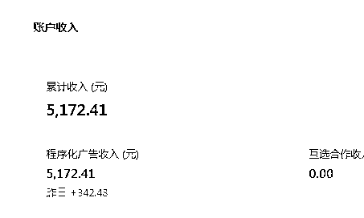

# 公众号热点类爆文连怼三篇 20w+，终于找到了自己的确定性

> 原文：[`www.yuque.com/for_lazy/zhoubao/wfh23gwoi3deiuvs`](https://www.yuque.com/for_lazy/zhoubao/wfh23gwoi3deiuvs)

## (42 赞)公众号热点类爆文连怼三篇 20w+，终于找到了自己的确定性

作者： 辰风

日期：2024-05-20

大家中午好，我是辰风。

公众号爆文这个项目也做了有一年多时间了，最近这个月通过公众号放大了一下，单号单日收益有 600+左右。这个成绩和很多大佬相比算不了什么，不过对于我们来说，也是一笔不菲的收益。

第一次知道这个项目是在生财的一条风向标里，在这个风向标里，当时提到了一个近现代史的账号，叫飞扬说史。

因为公众号爆文的项目和我自身比较匹配，所以决定入局，我做过 6 万粉的公众号，也在公众号领域深耕了三年多时间，写了六百多篇原创。之前的精华帖：[`t.zsxq.com/19yzmEAU8`](https://t.zsxq.com/19yzmEAU8)（公众号站内外引流全流程)

**今年三月份左右，又发现了一个比较契合自己的赛道，就是做职场领域的定位，然后开始跑爆文做职场政策的信息解读，跑了几篇 10 万加之后，又找到了热点赛道，做出了多篇 20 万加的爆款，很多文章也突破了万阅读。**

欢迎各位移步飞书查看：[`m2fji8xdvc.feishu.cn/docx/Lzf4dNXZwoh90gx6fmDcGyoTnxd?from=from_copylink`](https://m2fji8xdvc.feishu.cn/docx/Lzf4dNXZwoh90gx6fmDcGyoTnxd?from=from_copylink)

* * *

评论区：

逍遥公子 : 请问大佬几个号呀？
辰风 : 我有十多个
林林 AIGC 写作 : 爆文男神啊
辰风 : 向生财各位前辈学习
逍遥公子 : 好嘞[调皮]

* * *