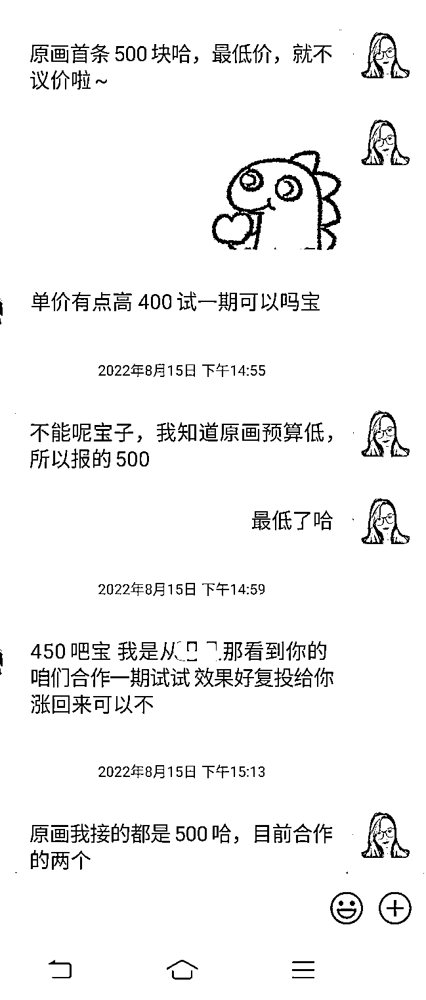

# 大专学历，副业自媒体，变现 80W+，如何选择适合自己的自媒体赛道

> 原文：[`www.yuque.com/for_lazy/zhoubao/crzhy3wsgsyzmngg`](https://www.yuque.com/for_lazy/zhoubao/crzhy3wsgsyzmngg)

## (41 赞)大专学历，副业自媒体，变现 80W+，如何选择适合自己的自媒体赛道

作者： 二丫吖

日期：2024-05-24

生财有术的各位老板，大家好吖，我是二丫，我也是生财航海家。

本职工作是在上海一家互联网公司当项目经理，也是一名宝妈，大专学历最终在上海买了房并落户。

我从 2018 年入局自媒体这行，最开始是给大 V 当写手，后面做助教，再后来做自己的账号，曾靠今日头条变现 20W+、2022 年开始做公众号，到现在靠私域合计变现了 80W+。

主业+副业组合收入，今年第一次达到年收 100 万，这对我来说是一个“历史性”的节点，这是我第一次在收入上年破百。

今年是我在生财有术社群的第三年，我自己是把生财当案例库来用的，我需要什么信息时，我就会根据关键词搜索，获取关键信息后，再做信息筛选然后执行。

这三年，我看得多，发得不多。

上周写了一篇《[大专学历，下班后读书，副业变现 80W+](https://t.zsxq.com/PirPn)》，和大家分享了我的见解，谢谢大家的点赞和反馈，很开心能够帮助到你们～

今天跟大家分享下「**如何选择适合自己的自媒体赛道**」的案例，希望能给大家带来一些启发。

我入行 6 年多，已经靠副业在自媒体这行赚到了 80 多万，先前，我还在我合伙人的群跟我的付费学员说，自媒体这行、写作这行是可以干到死的，而且，这个行业越老越吃香。

不像其他行业，有中年危机。

写作是，你的年纪越大、阅读越丰富，你素材越多，你写得就越好。你能给读者带来更大的价值，你就能赚更多钱。

现在外面各行的市场经济环境不好，工作不好找，但，如果你会写、会说、会利用互联网这个杠杆，其实你的个人收入会持续上升的。

因为，市面上的钱，它是不会消失的。

记住昂：**钱，是不会消失的，但它会转移。**

所以，现在所谓的“大环境不好”，外面充斥着各种抱怨，中年失业、高学历大学生毕业找不到工作等等。

这些是事实。

但另外一个事实是：有的人，在闷声发财，他们不公开说，但偷偷赚。

还是那句话：市面上的钱，它不会凭空消失，这个行业不赚钱，钱一定是流去了更赚钱的行业。

只是，大部分人不知道什么是更赚钱的行业而已。

这里存在一个信息差。

所以，我经常跟我的付费学员强调：**信息差=钱。**

我进入自媒体这行的目标很明确：要挣钱还买房的负债。

我当时是在存款只有 20 万的情况下，高杠杆在上海买房，借了两百多万，我的娃也还小，我在上一篇分享也说了，我还要给我妈带娃工资，还得给我婆婆生活费。

经济压力巨大！

我的工资根本就无法覆盖我的债务（房贷、车贷、装修贷），我没办法，我被我自己的欲望（我想在上海扎根）驱使，所以，我就必须拓展副业解决生活的囧况。

**所以，我从入行开始，就选择“走捷径”。**

**从入行开始，我就是花钱买课，去获取别人的经验，以最快的速度变现，赚到钱、还房贷。**

我在 2018 年 12 月份报写作课，开始正式进入自媒体行业。

2019 年，就是个码字民工，到处找稿子写。

2020 年，得益于今日头条的青云计划，赚到了 20 多万。

2021 年，累到了，也迷茫了，所以这一整年我没有做任何动作。

2022 年，复出，搞公众号，接着又靠公众号，在 2022 年-2023 年分别变现了 20 多万。

我也算是个“老自媒体”人了。

在这行混了近 6 年，今天主要跟大家分享四块：

1、为什么公众号值得做？

2、如何做一个赚钱的公众号？

3、刚申请的公众号没有留言功能怎么办？

4、刚开始做公众号，写什么？

## **一、为什么公众号值得做？**

如果跟我一样，刚开始就是冲着“搞钱”来的，大概率会去做公域（比如小红书、今日头条），因为公域流量多，能得到及时的正反馈。

**什么是公域 OR 私域？**

——看图

公域平台有个挺致命的劣势：**流量是平台的，不是你的，政策一旦变化，你就会“失业”。**

**私域平台不会，流量是平台的，同时也是你的。**

就冲这一点，公众号就值得做，因为这才是可持续积累的工作。

为什么这么说？

因为公域和私域平台的推荐逻辑不一样，比如今日头条、小红书等平台，大多数读者看的是平台推荐的内容，并不是自己的关注列表。

也就是说，即便是你的粉丝，去平台逛也不一定会看到你的内容。

公众号不一样，你只能看到你关注列表里博主的更新。

当然，虽然现在也能看到非关注博主的推荐了，但公众号近 10 年的用户习惯决定了，用户会习惯性地看自己的关注列表。

我是个在公域平台拿过大结果的人，比如一篇又一篇的青云计划：

平台一次性奖励 5000 元：

我也写过不少 10W+、50W+、100W+的文章…

看着这些截图，确实很“风光”哦。

但是！2020 年 8 月份，今日头条青云计划项目取消，**我赖以生存的根本没有了，我“失业”了。**

那时候，我才开始考虑一个问题：**公域平台虽然流量多，但受政策影响也大，一旦平台不扶持，我们这些创作者就像弃子一样，被丢弃。**

是，我也算是赶上了一个时间段的“风口”，靠着青云计划这个项目做副业赚到了一些钱。

可正因为赚到了钱，我就想要在这行**“持续地赚钱”**！

我不能永远在干这种“短期的、随时会消失”的项目，一旦平台政策变化，我之前的积累就会被动式的清空。

我要去做有复利的、有积累的平台写。

因为横竖都是写，付出的时间精力的代价是一样的呀，我为啥不去做那个长期能产生收益的平台哦？

于是，我选择了公众号。

到现在近 2 年的时间，靠这个公众号变现了 50 多万。

我把我的经历写出来告诉大家：我经历过一次公域平台洗牌导致的失业，你们在选择平台的时候就多了我这样一个参考案例。

就像粥左罗老师说的：公众号最起码还能做 10 年以上。

其实你动动脑子想一想，目前市面上有谁能取缔微信在通信上的地位？

**十几亿的用户体量，我在上面一年赚个几十万，算个啥……**

所以，不要动不动就是风口风口的，历史那么多风口过去了，也没见你抓住一个呀，那不用怀疑了，就是自己能力暂时不行而已，即便再来个风口，你也一样抓不住的，真的。

那既然这样，为啥你不去那个人又多、又稳的平台搞？

另外，做私域还有三大优势：

**① 粉丝价值高，会长期复购**

我 3 年前做今日头条吸引到微信上的粉丝，今年还有人买我的知识付费产品。

**② 内容多样化，有利于提升写作的底层能力**

**无需选择“赛道”，写你自己即可，“你”就是“IP”。**

**你的内容可以“受众垂直” 无需“领域垂直”。**

给普通人的发挥空间大。我们可以多样尝试后，选择最适合自己的方式持续更新，将自己的优势发挥最大价值。

比如，在做公众号之前，我从没有想过，我还可以解决别人的婚姻问题，我的公众号内容非常杂：婚姻、恋爱、相亲、职场、搞钱、自媒体...

这样的内容方式，在公域平台是很难变现的。

**③ 离用户近，沟通方式多样**

即便是公域平台，博主们也是引流到微信成交，比如，有很多博主的小红书的课程是让学员加微信的。

你可以想到微信的体系有多么的庞大！

所以，即便是到了 2024 年，我依旧建议大家，做一个自己的公众号，作为你**“个人品牌”**的开始。

## **二、如何做一个赚钱的公众号？**

**1、投稿变现**

50-200 元，不过这个说实话，现在大部分公众号都不接稿了，我以前的号接稿，现在也不接了。

一方面，没有写作能力的人，很难过稿。

我看 100 篇，过不了 3 篇，我就觉得，我有这个时间不如自己写了，所以我就取消了我的号的收稿。

但有些号还在收稿，大家可以自行搜一下。

你买房、升职加薪、买课花钱、被骗踩坑，都可以作为写作的素材，进行投稿变现。

我也一样，我走得快一点，我自学能力确实还算强，我是一边投稿、一边自己做号，后面我就不投稿了，因为稿费才 200 元/篇，而我的广告费有 1000 元/篇，嘿嘿～

**2、广告变现**

接广告，我真是一路升级打怪：

刚开始，就 150 元/篇。

后面，我开始涨价，报价 500 元，广告主还要砍价到 450。

再后面涨到 700 元，谈崩了，这个广告主觉得我太贵…

觉得我贵？那算了，不接。

现在，低于 1000 块的广告，不接，我每个月能稳定在 3-4 个稳定的老客户。

想不到吧，就是有人在闷声赚钱，正常我们自己作为消费者的时候，我们只关注那些篇篇文章 10W+的大号。

谁能想到我这样一个平均阅读量才几百、一千多的自媒体小喽啰，一个月光靠广告就有三四千的收入呢。

三四千块，达到小城市的工资水平了。

还是那句话，我不说，谁知道？

即便我在这个 1W+的星球里说了，一万多个人，对互联网这个几十亿的市场，算个啥。

**3、分销、卖知识付款产品变现**

知识付费这个行业，每一年都在增长中：

我是 90 年的，今年 34 岁，在我们小时候，我们只有两个世界：

① 现实世界

② 如果有阅读习惯的话，就会多获得一个世界：书里的世界。

书中自有黄金屋，这话没错，我就是一个典型的靠自学读书，赚到钱的人。

所以，我身处底层，但我通过自己的努力，爬到了中产。

你信，则有，不信，则无。

市场上也充斥着各种读书无用论，对吧？

你信哪边，你就会得到一个你信奉的那边的结果，一切都是你自己的选择嘛。

我作为一个大专学历，在现实世界里学习成绩不好，但是，好在我小时候有阅读习惯，我大部分的关于人性的知识点、以及思维方式都是在书里习得后，运用在现实世界中。

常年累月的阅读和运用，让我成为现在的自己。

现在这个年代，我们多了一个世界：互联网的世界。

等于，我们现在有了三个世界，以及现在你的孩子出身的年代也一样，他们是有三个世界的。

**1、现实世界；**

**2、互联网的世界；**

**3、书里的世界。**

我们今天来说下，互联网的世界。

在“线上赚钱”其实门路非常多，并不是所有搞钱的渠道，都叫做“自媒体”。

我们今天来说下，我们普通人能选择的途径：

以二丫为例，有本职工作，普通家庭出身。

这种背景的人，你来到互联网，你只能选择两个渠道进行变现：

**1、电商**

**2、知识付费**

**电商**，赚钱的方法其实就是把东西卖出去，你得分佣。

闲鱼、小红书无货源电商、抖音视频号无货源电商，都是这个逻辑，

你搞流量，卖东西。

这里面，又分为：

1.  不可以真人出镜，IP 式的卖货。

2.  不真人出镜，直播切片、视频剪辑性的出镜、只拍产品的卖货方式。

当你是宝妈又是副业的时候，你其实没有什么时候做电商的。

因为你要：选品、挑爆款、推品、找素材、对接供应商（你手里没货源，你得进货）、一件代发，你得处理客户地址、你还得处理退换货…

所以，这条路，如果你跟我一样的背景，出身普通、又有本职工作、没有太多时间，你就可以不用考虑了。

那么，你其实能选的就是第二条路：**知识付费。**

知识付费的辐射范围很广，万事皆可知识付费。

现在各个互联网平台都有自己的专属项目，比如：知乎好物、西瓜视频的中视频计划、抖音切片等等、公众号流量主等等。

有的项目底层逻辑很简单，就是：靠爆款，获取平台的流量，赚收益。

比如，今日头条阅读量 1 万+的视频/文章，流量收益有 5-10 元；那么，以此类推，10W+的阅读量的视频/文章，流量收益是：100+。

这只是举个例子哈，我好久没关注了，具体的阅读量匹多少钱，我现在不清楚了。

公众号流量主同理。

很多人，就是靠这个赚钱的，但，这个收入，就像你们去投稿赚钱一样。

完全把控在平台的手里，平台这段时间缺稿子了，就调高收益，平台这段时间不缺稿子了，就调低收益，甚至取消项目。

一样的，博主缺稿子，就收稿，你投稿，就能变现；博主不缺稿子，就不收稿。

你即便写的文章跟之前一样好，博主不要你的稿子了，你就无法变现。

**这其实就是给平台打工。**

**你干这个，你就会发现，自己在互联网这个食物链的最低端，你的时间只能变现一次，而且费用低廉。**

你肯定不甘心嘛，凭什么，对不对。

好，选来选去，你发现，这个时候，只能也必须做 IP，干这个才最赚钱。

IP 是什么？

是真人出镜、在互联网这行刷存在感，降低陌生人对你的信任成本。

比如，我【二丫吖】 这个公众号，就是一个典型的 IP 号。

所谓“真人出镜”其实并不是说，你一定要怼脸直播，你用文字、图片的形式，展示自己的思想、自己的成长、自己的生活，这也属于“真人出镜”。

知识付费这个行业，有人教怎么去平台搞流量主收益，有人教怎么做 IP。

我，就是，专门教人怎么做 IP 的。

而，即便是 IP 这个领域，也有两派体系。（这里我们就不展开讲了）

这个，详细的情况，大家可以去看知乎副总裁写的书《创作者》，这本书把底层逻辑写得很明白。

那些动不动就说 “知识付费是韭菜” 的用户，他们还没有进入互联网世界，在这个世界里，处于消费者、婴儿的角色，完全对自媒体的变现方式和盈利模式不了解。

既然你连思维方式都没有调整过来，那你肯定吃不了线上搞钱这碗饭的。

我们其实遇到这种用户，就会说：您说的对。

不要聊了，你跟一个孩子较什么劲。

来，我把底都透给你们看。

这是我自媒体这个微信的收入图，我做生意，是不跟其他活动交叉的，这个微信就是专门做自媒体的，所以，这个号上的收入截图，就是实打实的自媒体收入。

这些都是，我帮别人分销、卖我自己的课程的收入。

自媒体这行，是有行业峰会的，外行也不懂，也不知道是个啥…

我说了嘛，赚钱哪有那么容易，略懂皮毛，那么你就只能打零工。

要想在一个行业真的赚到钱，还是得深耕的。

**自己搞不到钱，就诋毁行业，行业其实不会受某一个人的诋毁所影响的。**

以上，我跟大家说清楚了为啥要做公众号以及我本人是如何靠公众号变现的。

接下来，跟大家分享小白刚开始做公众号，会遇到的两个基础问题：

## **三、刚申请的公众号没有留言功能怎么办？**

2018 年以后注册的公众号是没有“留言”功能的。

这是带留言功能的号：

这是不带留言功能的号：

可以设置发消息，但只能博主自己看到，别人看不到。

不过，近期公众号在改版，留言功能也在陆续开放了。

留言号的作用是：**跟读者产生互动。**

这种互动：

1、能给你带来新的选题

2、能给你带来更新的动力

3、能增加你的用户粘性。

但，这三点，在**“好内容”**面前，根本就不值得一提。

也就是说，如果你的原创能力较弱，写出来的文章无法给读者提供价值，那么根本就不会有读者给你留言。

所以，**做好内容才是做公众号的第一步。**

但，没有互动、不涨粉、不赚钱，又怎么能坚持写下去呢？

你可以选择另外的途径来跟读者互动：

**在每一篇文章后，都留下你的个人微信**（PS：可以专门注册一个微信用于做自媒体，不要跟生活、本职工作的微信搞混。）

类似这样：

这样，有心的读者就会加你微信，你某一篇文章要真的能给人启发，就会有读者加你微信找你提问，一样可以达到拓展选题的效果。

比如，即便我的公众号有留言功能，也会有人通过微信私聊我，表达她看完文章后的感受。

这里又有个细节。

我的回复非常简单。

为什么？

**因为我现号做的有粉丝基数了，加我的人就会特别多，我没有多余的时间跟这些跟我私信打招呼的人多聊，所以，我一般就是礼貌性地简单回复一句。**

可，我刚做公众号时，没有资源、不忙，我有大把的时间跟他们聊天。

**我得搜集素材，我就会主动跟这些来加我的人拓展聊天范围。**

跟别人多聊聊：

一来，能多交个线上朋友。

二来，我想着聊点东西，没准能获得一些信息。

三，最不济，也能当个素材

一般一个新朋友，我聊两个回合，如果对方有信息跟我交换，我们关系就能进一步，因为在交流的过程中，我也在“释放信息”给对方。

如果，我感觉到，对方没有资源/信息跟我交换，一直在索取我给她的信息，我就会不聊了，这个人不会发展成为“朋友”。

这个要说个很现实的问题：**你在线上大概率是没法交到“真心朋友”的。**

大家各有所求，目的都是为了发展，要有这个认知，你就不会做无谓的纠结，接受现实就好。

如果你觉得，跟这个人聊得来，就进一步发展，如果你觉得跟她聊很累，感觉到他/她越界了，一直在向你索取，那就果断不聊了。

当然，我也会去主动链接别人，去别人那获取信息，因为我懂得“自媒体这行的交友规矩”，我就能获得更多的有效信息，先给对方发个红包，有的人会接红包，有的人不会。

比如这位，因为我在刚开始就向他表达了：我愿意付费，认可您的实力，想向您请教。

**一毛不拔只想白嫖的人，赚不到钱。**

白嫖党可以得到一些信息差，但关键信息差，是无法免费获得的。

免费，我就只是给你们科普自媒体的知识，扫个盲。

但是，你们知道怎么一步步落实执行吗？不知道。

我不会说，这不是简简单单就能说清楚的。

他跟我聊了有四个多小时，甚至把他报课的课程链接都免费分享给我了，我在他那里获得了不少关键信息，这就能让我少走了弯路。

当然，在这个过程中，我也跟他分享了我做公众号的一些信息。

所以，你看，**自媒体这行的交友规则就是这样：价值互换、信息互换。**

其实，整个社会都是这个规则哈，不只是自媒体行业。

你要你亲戚给你介绍个工作，你也得买两箱牛奶上门拜访的吧？

自媒体这行，同理。

**那你作为一个小白创作者，你其实有大把的时间，那你就要珍惜那些来主动链接你的人，跟他们聊聊，多搜集素材，用来丰富你的公众号内容。**

以上，就是以微信作为跟读者互动的场地。

## **四、刚开始做公众号，写什么？**

你刚开始写公众号，要写什么呢？

比如，有小伙伴问我：

**私域平台一个最大的好处是，你其实不需要“内容垂直”，你做到“受众垂直”就可以了。**

比如，你的粉丝年龄群体在 20-50 岁，那么：职场、副业、买房、装修、夫妻关系、原生家庭、书评、自律等等，你都可以写。

因为这个年龄阶段的人，就是会同时发生职场和情感问题、买房和育儿问题，所以，你写你的，想写啥写啥。

不用先用“定位”这个词来框住自己。

先写，写着写着你自然会知道自己擅长哪方面，可以边写边定位的。

这又会有个问题，你年纪可能太小、阅历可能不太够，怎么才能写出有“价值”的东西呢？

你就得多去看，去看别人写了什么。

你去找哪些“特别”的观点。

如果你是已婚，讲话就是“不用太矜持”，可以直接一些，这也是已婚人士的一个优势，要利用起来，**比如我自己，“讲话直爽”也算是我的一个人设和标签了。**

但如果你未婚，一个实际情况是，讲话“露骨”、“过于直接”都是需要勇气和能量的，而能量的获取，就看你平常所关注的博主、所看的内容是什么了，**你其实也是可以“温柔且有力量”地表达你想要表达的东西。**

好了，你知道这两点，就可以直接动手写了。

总结：**刚入行，第一件事就是“直接写”，想写什么写什么。**

反正你至少一个月内赚不到钱，这一个月只看“怎么写内容”之类的文章，不看别的，以免打击自己的积极性，给自己增加徒劳的“焦虑感”。

你只看内容，只研究内容，这样，你的基本内容框架就搭建起来了，有了内容，再去考虑怎么运营，怎么变现的事。

【往期内容】

1）[小红书 1 条笔记变现 4000+，聊聊我的爆款创作思路+引流变现全流程](https://t.zsxq.com/SUUhx)

2）[花 1800/月招小助理，副业做自媒体赚到 40 万](https://t.zsxq.com/tNXpB)

3）[内容更新频率，日更≠能做成一个账号](https://t.zsxq.com/135Hvhqii)

4）[做自媒体要先确定自己的优势和变现模式](https://t.zsxq.com/13QbjtfMd)

* * *

评论区：

龙哥 : 优秀
A 大熊 : 学习了，虽然不做自媒体，但是还是看得津津有味。厉害了，一个电商老鸟致敬

* * *