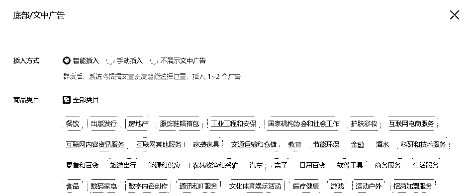
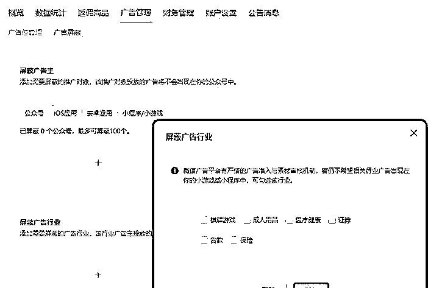
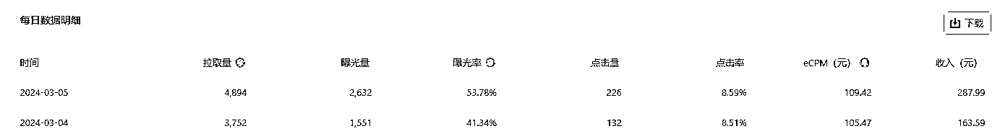
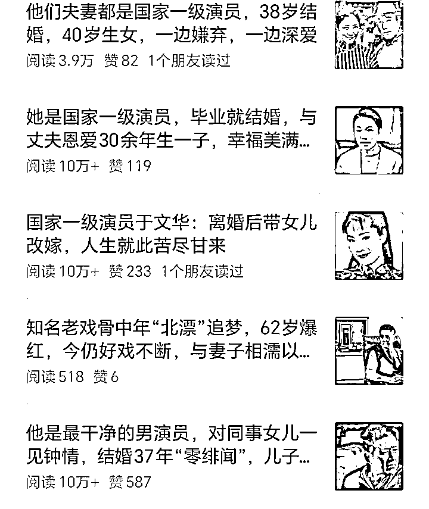
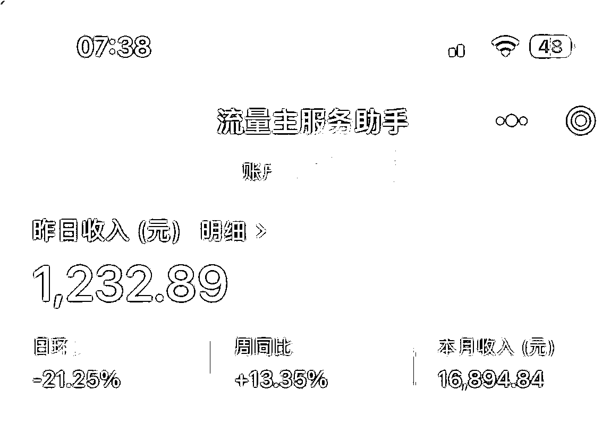

# 提升公众号收益的三个方法

> 原文：[`www.yuque.com/for_lazy/zhoubao/bwl8y5tp75i4isui`](https://www.yuque.com/for_lazy/zhoubao/bwl8y5tp75i4isui)

## (60 赞)提升公众号收益的三个方法

作者： koko

日期：2024-05-24

**一、提升流量主收益的 3 个方法**

### **01 提升方案一：广告设置优化**

关于广告设置的优化，有 2 个调整方案方向：

**① 广告相关度优化**

选择和你公众号类型、粉丝画像相匹配的行业广告。广告匹配度高有利于用户的对于广告的点击率提升以及广告转化率提升，从而影响流量主收益。

如上图底部/文中广告是可以进行投放广告行业的选择，有智能和手动插入两种方式。如果你不懂就直接选择智能插入，下面就不要勾选了。

如果你比较在行，然后在广告类目下勾选最匹配你账号粉丝画像的广告，注意下不同行业广告点击价值是不一样的，除了相关度高的广告行业选择上，一定也要把高价值广告行业也勾上。经过长期的用户广告数据反馈，系统就知道你的账号最适合投放什么广告效果好，之后会推送该类广告到你的账号上。

**② 高点击价值广告是否被屏蔽**

你可以在流量主广告屏蔽页面，看下自己是否把高点击价值行业的广告给屏蔽了。

**什么是高点击价值广告?**

一般理解为以上 6 类广告，这些行业广告主投放的 cpc 单价设置相对于其他行业来说会偏高。所以你会发现财经类垂直账号的流量主收益阅读量虽然不高，但是同等阅读量收益相比会高其他领域很多。

### **02 提升方案二：ecpm 优化**

在之前的文章里写过，流量主收益是按照 ecpm 计费：ecpm=广告曝光量* 广告点击率* 广告出价

所以影响流量主收益的核心是在广告展现量、广告点击率以及广告出价这 3 个因素。在领域已经确定的前提下，提升流量主收益我们能控制的只有 2 个因素，即广告展现量和广告点击率。

所以解决方案就是：

要么积累文章，不断的发文获取平台流量;

要么优化广告点击率，通过策略来提升。

### **03 提升方案三：榨干爆款内容选题优化**

这个项目只要你上道了，就知道 80%流量主收益来源于爆款文章，所以爆款文章创作才是核心方向。那么，爆款文章创作绝大部分人的思路是：借鉴领域内近期的低粉爆款文章。但是你不知道的是，还有一种成功率更高的爆文创作方法：榨干自身爆款内容选题

**榨干内容选题的案例：**

什么意思?

简单说，就是复刻自己的爆款，把近期爆款继续模仿发布，直到这个内容价值被榨干。

为什么要这么做?

你自己不榨干这个内容收益，那么别人看到就会去模仿。好不容易跑出来的爆款，你自己不复刻，拱手相让给别人去抄。别人爆了，你又说别人抄袭你的…

对于公众号爆文项目来说，抄不抄袭不重要，重要是的流量主收益先到手。当然，也不是让你复制粘贴式的抄袭。

综上所述，建议你 3 种提升流量主收益的方法，同时结合使用。对于收益的提升效果会更持久。

下面这个账号，我就是反复抓住一个“狂飙”相关吃瓜内容，撸了 1.6W 的收益。所以说，一旦发现一个热点内容，就要持续挖掘，直到这个话题过去为止。

# 二、8 个写作领域

1.家庭故事情感类

这个领域以中老年为主，年龄偏大，这些人有时间、爱分享、更喜欢家长里短的故事。还有一点这类人，比较容易误点文中广告增加广告点击率，这样我们的收益会更多。

2.热点类

热点即热搜，有关注度、流量大，内容容被搜索，更容易被推荐，蹭热点一时爽，一直蹭一直爽。

值得注意的是：热点来的快去的也快，要及时入场。内容的主题一定要有情绪的共鸣，比如让人愤怒、看不下去的行为、人生的不易、社会的不公等，少一点实事细节，多写点态度和观点。利用这些点燃读者的情绪。

3.国学类

这一领域主攻中老年人群体，通过一些大道理，如子钱财福报、健康长寿、人生遗憾等等。

对这些主题进行解读，再带上一定的情感色彩的故事，就能写一篇高质量的文章。

4.三农类

主题为农民、农村和农业的内容，热点话题养老退休金等。很容易出现爆款文章。

5.名人警句类

名人本来就带有一定的流量，利用名人效应引发人们的讨论，调动读者的情绪等。比如罗翔说、莫言说等等。

最近比较泛滥，不过还有发挥的余地，这一类好多无中生有的语录，注意不要编造的太过分。

6.天气预报类

这一类就是为大家提供天气情况，人们出行免不了关注天气情况。

天气加三农类是一个不错的选择。

7.历史类

上下五千年的文明，正史野史，历史人物这素材太多了，写不完直接写不完。

发挥空间大。

8.影评类

这一领域结合当下热门电视剧或电影效果更好，热门影视流量特别大。流量大机会越大。

* * *

评论区：

koko : 对于新人来说，推荐生活、娱乐、星座，三大领域，相对起号容易些
koko : 抓住一个“点”，然后就围绕这个“点”的内容使劲发
Rio : 榨干自己 这个主意不错

* * *