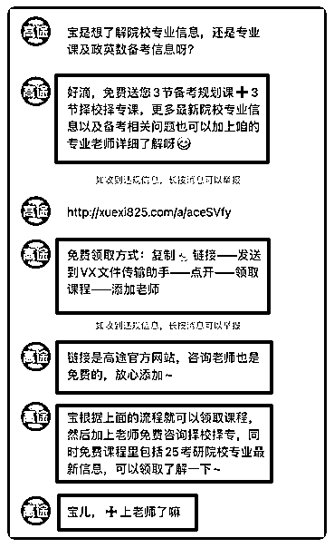

# 爽！聚光投放 1 万，营收近 100 万！

> 原文：[`www.yuque.com/for_lazy/zhoubao/buqr0hqaxsn5lwxh`](https://www.yuque.com/for_lazy/zhoubao/buqr0hqaxsn5lwxh)

## (32 赞)爽！聚光投放 1 万，营收近 100 万！

作者： 谢无敌🐱闪亮猫传媒

日期：2024-05-20

Hi~生财的朋友们大家好~ 我是你们的老朋友-谢无敌，闪亮猫传媒创始人。

常常有商家吐槽：为什么客资转化效率低、质量还差？

大家都知道，我线下是做**实体家居**生意的，在小红书主要以客资获取为主。

目前我这个业态，**平均投入 1 万的聚光费用，就有将近 100 万的营收**。

随手给大家分享几个签单👇

  

算一下，单个客资成本也就几十块，和其他平台的投放成本比起来性价比真的非常高了！

今天就来分享一下，关于聚光投放应该如何去优化，来**提升开口率，实现****投产比****翻百倍**。想做聚光的朋友可以接着往下看~

**一、内容布局：提升笔记开口率**

**二、策略布局：提升获客转化率**

**三、客资开口率翻倍的核心要点**

## **一、内容布局：提升笔记开口率**

#### **1：账号主页简介流量**

主页账号的介绍最能直观明确的让用户了解到你的产品，并且快速被看到。

对于轻量化的分享，可以通过关联线下**门店地址、线上店铺、群聊、瞬间**等最直接的主页展现方式，进行曝光。

比如，像类似下面这种有门店的企业，就可以利用公域平台进行自己产品和服务的曝光，吸引到精准的目标用户。

#### **2：转化型笔记的创作**

除了账号主页吸引精准用户之外，转化型笔记的内容却是直接决定私信留资开口率的关键。

一篇优质的转化笔记的核心因素就是打爆款。

那什么样的笔记才能获得高留资开口率呢？

**核心关键词——决定了曝光**

用户会主动检索关键词，进行浏览和种草。

在内容上，企业需要在转化型笔记中体现出**核心关键词、产品词、品牌词或是品类词**，以增加被搜索的可能，提升笔记曝光率。

通过“抢占资源——抢占关键词——首位”来实现转化型笔记的曝光。

**好看的封面——决定了点击**

好看的封面设计，决定着笔记的点击率，也影响着开口留资量。

比如，搜索“冰箱”这个词，同样是卖冰箱的。

在不同笔记封面的选择上，直接决定了笔记的互动量。

一个符合产品调性、高级且吸引人的笔记封面，从曝光上就更胜一筹了。

**优质的内容——决定了咨询**

除了笔记封面外，最重要的还是笔记内容。

优质的内容决定了用户**被种草的概率，同时提升笔记互动**，并产生咨询，也大大提升了笔记的留资开口率。

下面同样是以“冰箱”投放笔记为例👇

能看出，一条优质的转化型笔记，具备了精准用户的**需求点、痛点，产品介绍，以及强化细节描述，并在结尾为留资导流。**

方便用户了解产品的同时，提供情绪价值，增强信任感，利于用户的咨询引导转化。

**KOS 内容矩阵——引导了转化**

除了品牌专业号之外，很多商家也会利用**KOS 内容矩阵（关键意见销售）**打法。

KOS 指的是小红书生态中已有的品牌线下门店员工导购、销售顾问、主理人、产品专家或医生助理账号。

可以作为品牌代言人、用户推荐官，以及产品的链接者。

这种类型账号具备了**专业的服务能力，以及品牌知识的储备**。

品牌通过大量专业化的种草，进行**内容布局、引导转化**，从而吸引更多用户对企业的关注，来提升客资获取的效率。

主要分为三种：

1.  **企业所属账号：**由企业申请新建或把员工个人小红书账号与企业账号进行绑定，成为 KOS 账号。这类账号员工离职不能带走，不需要实名认证。

2.  **员工个人账号：**企业发起申请，员工同意后个人小红书账号与企业号进行绑定，成为 KOS 账号。这类账号员工离职时可以解绑。

3.  **完全个人的账号：**通过个人简介和笔记内容，来说明与企业有关系，实际上没有关联品牌的账号。

在内容上，KOS 的笔记代表着一手新品和专业内容分享；

利用专业知识的累计和销售技巧，以门店的形式进行装修，产生了关联，提升用户的信任感。

KOS 的笔记背后是一个真实品牌导购，经过专业培训，帮助用户更详细快速的了解品牌和产品的细节。

主要承接用户被种草之后的兴趣，**帮助品牌完成消费者最后转化环节**。

**Tips：**

每个 KOS 账号自己发布的内容都大于 10 篇，并保持日更 1-3 篇的状态。更有效的帮助企业账号提升开口率，进而提升转化量。

## **二、策略布局：提升获客转化率**

#### **1：低门槛、快响应**

**“提升私信开口率”**

在笔记获取到用户的私信进线后，下一步最关键的就是**用户的沟通承接，以及转化的能力**了。

一般用户私信留资进线后 15 秒之内就给到响应，能够有效降低用户流失，提升开口率。

可以通过设置介绍语+关键词+数字的方式，设置常见**问题和回复**等组件。

引导转化留资的同时，降低用户开口门槛，提升开口转化率。

小红书私信投放，一般常见于两种方式：

#### **2：戳痛点、给福利**

#### **"提升私信留资率"**

从用户痛点角度出发，设置一个合理的福利，比如**免费领取资料/课程，私信领取优惠券**等等。

福利是最直观能够提升留资量的关键点，结合用户需求点，吸引用户留资，不仅能帮助用户解决问题，还能大大提升留资量。

#### **3：布局词、提高量**

#### **"提升曝光转化率"**

通过挖掘潜在客户的真实需求，利用需求点，布局核心**关键词、痛点词、关联词、行业词、品牌词**等。

以满足用户的需求为出发点，进行关键词布局，扩大获客范围。

比如像下面这类“浴室装修”、“小户型卫生间”的推广笔记文案内容。

在文案内容中布局了不同属性的关键词，用户在搜索对应词汇后，也能通过精准的需求；

帮助解决痛点问题，同时**引导转化、提升获客转化量**。

####   **三、客资开口率翻倍的核心要素**

不少商家已经在小红书完成了**推广+获客**的生意闭环。

除了投放笔记和运营策略的优化，笔记的选题和内容也直接决定了广告能否获得高转化的核心要素。

#### **1：挖掘需求**

了解用户的真实需求，抓行业目标人群的痛点。

可以通过小红书平台的**行业调研、用户互动、客户反馈**中挖掘需求，进行优化。

或是可以通过对标账号，进行优质内容的分析，结合自己的产品进行优化和投放。

#### **2：引导开口**

通过设置快捷式问答回复，**及时响应**粉丝的咨询需求；

强调价格/产品福利、活动的时间节点，**提高紧迫感，促使粉丝开口；**

利用同理心引导开口，**解决用户需求、消除用户顾虑**，实现深度对话。

最后我想说，小红书商家想要提升**获客开口量、降低****产投比**，重要的还是内容的不断优化提升，做用户感兴趣的内容。

不仅需要了解互联网平台的规则和大风向，还要利用自身的专业度，做好前端和后端的配合。

只要找到适合自己的方式和打法，提升 ROI 也会是一件相对轻松的事情。

* * *

评论区：

暂无评论

* * *