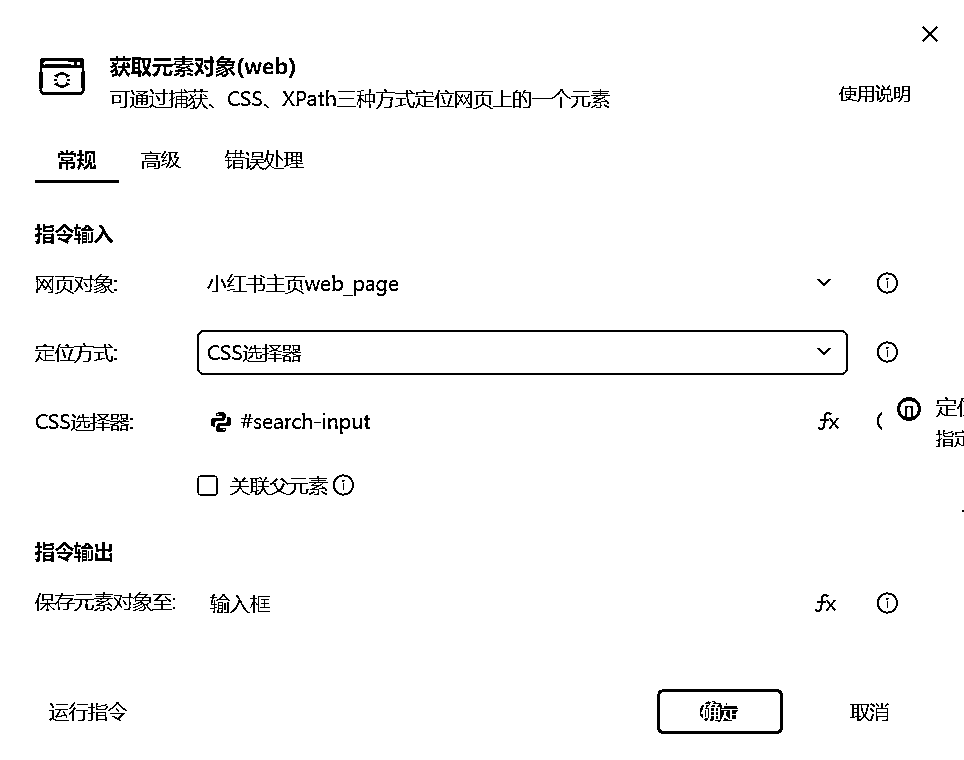

# 小红书关键字搜索素材机器人-手把手教学-附完整代码截图

> 原文：[`www.yuque.com/for_lazy/zhoubao/eeloamwq5iuisesy`](https://www.yuque.com/for_lazy/zhoubao/eeloamwq5iuisesy)

## (23 赞)小红书关键字搜索素材机器人-手把手教学-附完整代码截图

作者： 码农飞哥|RPA 定制

日期：2024-05-20

大家好，我是码农飞哥。上市公司资深软件开发，CSDN 博客专家，擅长各类 RPA 机器人的开发，以及毕业设计的定制开发。

## 一、**业务场景：**

在实际做自媒体过程中，我们经常只需要关注本领域内爆款笔记以及对标账号，比如：如果你是做美妆的，那么，你主要精力还是关注美妆下的一些爆款笔记和对标账号。**足够垂直，足够专注，才能将本垂直领域的账号做起来**

### 1、**演示视频**

暂时无法在飞书文档外展示此内容

根据关键字搜索爆款笔记过程如下图所示：

## 二、**操作流程：**

1、运行 RPA 机器人之后在对话框中输入需要搜索的关键字，选择保存爆款笔记的目录，输入需要翻的页数，默认是 10 页。

2、机器人会自动的打开小红书网页版主页，并在输入框最后那个填写关键词。

3、采集首页上的标题，作者，作者头像，点赞量等数据，数据保存到数据表格中。

4、打开笔记详情页，采集文案，收藏量，评论量等数据，数据保存到数据表格中。

5、自动翻页，开启下一页数据采集。

## 三、**影刀 RPA 程序制作步骤**

### 1、**完整步骤：**

### 2、**输入**

这里选用的对话框是一个自定义对话框，之所以使用这个对话框，主要还是因为这个程序的输入参数比较多，如果使用其他的对话框则需要多个对话框， 所以就选择了这种自定义对话框。

### **3、搜索**

这里通过 CSS 选择器来定位搜索框元素，并将元素对象命名为 输入框，或许有小伙伴们会问，为啥不直接使用默认方式直接捕获元素呢？我试过了，经常出现找不到元素的情况。

#### 2.1、填写输入框

在上一步通过【获取元素对象】指令获取到了输入框对象，在这一步使用【填写输入框】指令的时候就可以在元素库中获取 动态元素 输入框。输入的内容就是在对话框中填写的关键字，使用{enter} 可以实现输入之后回车。

#### 2.2、点击搜索框

这个指令用于点击搜索框。实现搜索效果。

### 4、抓取

这里的数据抓取分为两个部分，第一部分是列表页数据抓取，第二部分是详情页数据抓取。

列表页数据抓取包括了标题，作者昵称，点赞数，详情页链接等数据，因为这些数据是列表页可以直接看到的数据，所以就能够直接抓取到。

#### 4.1、批量数据抓取指令

直接可以通过批量数据抓取 指令就能抓取到整个列表页可见数据，一般是 25 条数据。

#### 4.2、翻页

因为每次 批量数据抓取指令只能抓取到 25 条数据，这点数据远远不满足我们的需求，所以，还需要进行翻页操作。翻页的核心代码如下所示：

这里使用的是 While 条件循环，当当前页数小于等于事先设定的页数，则会进行翻页操作，进行数据抓取。

#### 4.3、抓取详情页数据

抓取详情页就是主要操作就是读取表格中内容，然后一次捕获解析数据。下一篇内容会详细介绍。

* * *

评论区：

暂无评论

* * *