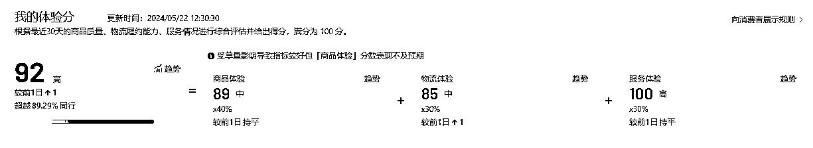

# 我在抖音做小店一年，只看利润不看成本差点亏了

> 原文：[`www.yuque.com/for_lazy/zhoubao/vzs1hlcolb1ayqu7`](https://www.yuque.com/for_lazy/zhoubao/vzs1hlcolb1ayqu7)

## (53 赞)我在抖音做小店一年，只看利润不看成本差点亏了

作者： 安信

日期：2024-05-24

学会看数据，是入门电商的重要一课。

今天的开始，我不想秀成绩，先贴两张图，大家猜猜哪个店铺是亏本的？哪个店铺是盈利的？

别急着往下看，不管你有没有做过电商，都可以试着在心里有个答案，我也会在今天的分享里去尝试解决大家做抖音小店的一些误区。

大家好，我是安信，这是我做电商的第 8 个年头。

抖音小店是时下热门的电商平台，从去年开始，我一直在探索，可以这么说，抖音小店所有的坑，我基本都踩过。

去年我们团队做抖店还是一个不赚钱的状态，但从今年 4 月开始，我换了一种模式，逆转了局势。目前为止，所有店铺加起来，差不多 10 万一天的销售额。其实这个速度，感觉让我回到了 18 年做天猫店群的时候。

23 年我们做抖店犯了一个致命错误，那就是只看利润不看成本。

每天看后台利润：4 万、5 万、8 万，相当可观，很快就在其中迷失了自我。但我们的客单实在太低了，后面核算每一单的人工成本，运营成本，售后成本的时候，发现根本就是在亏本边缘行走，一下子把团队打回了原型。

我意识到存在这样高的成本，和抖音的高退款率，当下的模式一定是行不通的。

所以我们要调整：把客单做高，客单做到 150 以上，利润一单做到 80-100 左右。就算售后成本达到 20/单，我们也可以在里面顺利赚到钱，同时也能把人工成本压到最低。

个人认为，抖音小店要赚钱的核心：**利润率做高！0 付费！客单价做高！不赚钱是不可能！**

这个观点会贯穿项目的整个流程，接下来且听我一一道来。

# **一、开通店铺**

做抖店的第一步就是开店。

开店有两个要注意的地方，一个是店铺类型，抖音给个人店和企业店的流量权重差很多，所以我们尽量选择后者，通过代办等方式，大概花费 2000 元。

另一个则是选择类目，我们可以尽量选一些 0 元入驻的类目，节约成本；同时，不同类目对应的流量速度、利润率、退货率都是不同的，这在注册店铺的时候就要考虑清楚。

不管你选择啥类目，当你做了高溢价的时候，你的人群一定是高素质居多。但是难免出现低质量的瑕疵品，所以高退款率你也可以接受，售后处理好，利润多一半。

**1、店铺注册**

现在个人店的流量权重太少了，所以我们需要尽可能做旗舰店或者专卖店。这就需要一张营业执照（淘宝代办，或者找专门的记账公司）商标授权，淘宝或者找代下店的基本都有。

办一张证大概两千块，基本是前期唯一要花费的成本了。

需要注意，如果你多个店铺，那就需要把主账号登录在服务器上。一个法人只能开 2 家店，因为法人会关联，ip 也会关联。

这是抖店入驻官网链接，入驻所需材料、费用都在里面了：[`fxg.jinritemai.com/enter/quali-fee?btm_ppre=a0.b0.c0.d0&btm_pre=a1032.b72953.c6917.d63973&btm_show_id=95da929c-02b9-4251-93f8-491fb92a6549`](https://fxg.jinritemai.com/enter/quali-fee?btm_ppre=a0.b0.c0.d0&btm_pre=a1032.b72953.c6917.d63973&btm_show_id=95da929c-02b9-4251-93f8-491fb92a6549)

**2、选择类目**

你注册的时候，下店的商标授权类目决定了你做的类目。

目前我们做的比较多的类目如下：服饰配件、男装、男鞋、童装、女鞋、居家日用、女装、收纳整理。

每个类目都有每个类目的好与坏：比如服饰配件，起流量相当快，但是退款高，利润也高；收纳整理，流量较慢较少，利润相对低一点，但是退款就低多了。

没有哪个类目同时拥有起流量快，利润高，退款低，不可能的；选择自己熟悉的，或者把所有类目做一遍，筛选一遍就懂了。

**二、出体验分**

成功开店之后，该怎么起号？

我们最常见的办法就是刷体验分，我愿称之为流量加成利器。现在抖音平台推流和体验分强相关，只有分数上去了，才有可能拿到更多流量顺利起号；相应的，如果体验分掉了，基本上不可能起店。

具体可以看这张图感受一下，差不多概念的图，数据不一定精准。

体验分的评定，取决于近 30 天的商品质量、物流履约能力、以及商家的服务情况。接下来，分享我自己做体验分的 2 个途径，基本 1 单成本在 3-4 块钱。

**第一种：**在抖音商城找到受欢迎的品，大概率是日用百货，袜子之类，受众广的。然后去 1688 寻找同款货源，再降价 3-4 元亏本上品，这样基本 2、3 天就能出单三四百。（抖音 app 打卡，选择居家百货，市场比较大的，是个人都能买的那种，比如垃圾袋，衣架，纸巾等）

举个例子，你在抖音看到 9.9 元/10 包纸巾，在 1688 可能只要 8.5 元，在这个基础上，我们把这个品定价为 4.9，相当于一单亏 3-4 块钱，放到抖店就很好卖了。

**第二种：**找服务商，他们给你亏 1-2 块钱一单，然后投流亏本，1 单也是 3-4 块钱左右。

除此之外，抖店的体验分还有很多细则， 回复速度之类的，你要每天盯着，让它尽可能维持在 90 分以上，这是完全可以做到的。

当我们的店铺体验分达到 85 分以上，就可以开始上货了。

# **三、采集选品**

这个玩法的本质就是高客单、高利润，然后搞定货源，货源搞不定就中转，符合平台规则，就这么简单，就看你怎么去执行到位。

现在因为无货源打击的非常严重，所以现在我们选品就是 2 种方式：

**1、货源网站一件代发**

第一种就是货源网直接代发。

1.  居家日用品 👉义乌购或者 1688 一键代发

2.  男鞋 👉环球鞋网

3.  童装 👉3e3e 生意网

4.  女装/女鞋 **👉**17 网、货牛牛

当然，1688 上面基本都包含了所有的品类的一件代发。

**2、淘宝、拼多多中转**

第二种方式，就是在淘宝、pdd 上选品。

客户下单后，我们去淘宝、pdd 下单，然后发到中转仓，中转仓出新单号。

这个方式的弊端在于时效 +24 小时，但是淘宝 pdd 上面的品，都是商家帮你验证过的，都是优质的品。

这里以淘宝为例，演示童装类目的选品方式。

先输入关键词【童装】，然后在淘宝的搜索下拉框，把相关词全部收集一下，比如童装女洋气时髦套装、童装女夏款等。

然后把上述关键词进行搜索，选择的按销量排序。

**这里要注意，一定要选择无 logo、无英文的品，这是因为，出现一个商标就要被罚款。这种不必要的成本支出，我们尽量规避掉。**

所以，选品的时候，建议看 2 遍以上，图片中任何地方都不能出现 logo，或者不知名品牌都不能要，要足够干净。每一个品点进去，然后五张主图，都需要仔细看。如果没有 logo、英文，还有品牌类似的，这个品就可以要。

按照这个步骤，一直选品，一天基本选 2000 个品是没问题的。

当然，还有一种用软件选品，可以一次性采集个几万个，然后慢慢看图，也是可以的。

下面就是上货了，不管你是从哪里的选的品，最后都是加价到抖店上面。

我一般会用三方软件来进行复制，比如熊大复制，欢乐逛之类的。

下面用熊大复制来做个参考：

放入链接，我们一般设置价格为*2+5-10。这是我们测试过，比较合适的价格区间，既保证了高利润率，又能有一定的出单量。

链接放入之后，挂机就可以了。总之上的越多，起的流量越高。

一般来说，你上几千个产品，到第 5-7 天的时候，基本上是能有几万曝光点击了。

这个时候，你要注意了，记得持续上新，他就一直有流量。只要体验分不掉，流量就一直有。

当然，客单价高意味着转化低很正常，坚持上货，总会有流量进来的。

回到我们最开头的那两张图，哪个店铺是盈利的？相信现在你心中已经有了答案。

乍一看，30%的退货率、1600 万的曝光次数、1.28%的商品点击支付率，好像就是比 50%的退货率、200 万的曝光人数、0.59%的商品点击支付率，要更赚钱。

但事实上，高曝光人数、低客单产品，背后对应的人工运营成本，是成倍上涨的。

因为不断地有人询单、不断地有人退货，20 万的 GMV，要承担将近 3000 单的退货量。而当我们把客单价拉高，30 万的 GMV，则只需要处理 400 多的退货订单。

所以，答案就是图一亏本，图二盈利。

再次回顾我的抖店运营逻辑，就是最简单的做高客单、做高利润，全靠免费流量，不作投流。

最后，送想入局抖店的朋友两句话。这个项目我从 0 开始做的（之前的店都退了），执行力到位，一定可以出成绩，百分百出。

这个行业的机会风险都在，但是想要一口吃成大胖子，显然不可能，慢慢来，慢慢来，效果就来了。

以上就是我的分享，有啥问题都可以留言或者跟我聊，我看到一定回你！

* * *

评论区：

葱葱 : 哇，学习了
X : 屌的 bro
Gens : 请问可以推荐靠谱的云仓吗
rrcc : 上架几千个品，就是测哪些能出单吧
安信 : 私聊吧，放网址不太好
龙哥 : 牛逼
张伟峰 : 现在同款比价怎么解决

* * *