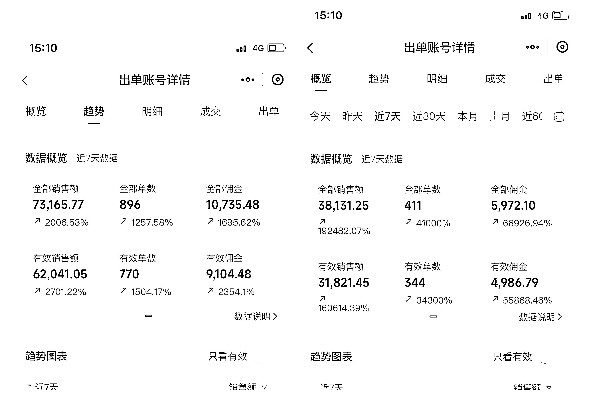
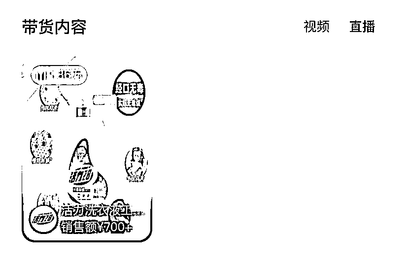

# 第一次入局抖音半无人，7 天 GMV11 万多，佣金 1.1 万，我做对了哪些事！

> 原文：[`www.yuque.com/for_lazy/zhoubao/chrcag31kfvv4z2k`](https://www.yuque.com/for_lazy/zhoubao/chrcag31kfvv4z2k)

## (93 赞)第一次入局抖音半无人，7 天 GMV11 万多，佣金 1.1 万，我做对了哪些事！

作者： 书燃

日期：2024-05-24

首先必须再一次狠狠地感谢生财这么好的平台。

23 年考察项目的时候，因为生财的优质内容，入局了抖音短视频带货，一年多过去了，也算有点小收获。

最近因为一些瓶颈，想看下有没有一些能加持的项目，果然，来生财就对了。

偶然翻到师姐的帖子：[抖音半真人直播：新手小白 7 天 GMV 破 10W，单日单号佣金破万！](https://hhkijeuq3w.feishu.cn/docx/PinxdM4llobM0yx4r8SclIffn0e?from=from_copylink)

还不了解半无人项目的，可以看看。

抖音半无人直播，从第一次开播到现在，一共做了 15 天时间，最近 7 天，GMV11 万多，佣金 1.1 万，成绩跟各位大佬没法比，但是随着对这个事情的推进，我相信，还是有很大进步空间的。

OK，进入正题，老规矩，先看图，目前 2 个号在跑：

无人直播的技术跟实操，相信很多大佬都分享过了，在我看来，想把这个事做起来，你最多花个 1 天时间，全套路径基本都跑通了，那今天给大家分享，我觉得在这个过程中，我认为一些有价值的事情和动作。

大家都很关心选品的问题，这个我留在最后讲，卖个小关子。

1、不要代播，不要兼职，前期所有东西都要亲自上

一件事情，只有自己跑通了 0-1 的所有细节，你才知道哪些是重要的，哪些是不重要的。哪些需要自己干，哪些可以外包。

我以前没做过直播，第一次播的时候我自己也怕，但是没办法，你要搞钱就必须要克服。从我第一天实操这个项目开始，我一个人连着播了 10 天（一次 1 个半小时左右）。这个项目跑了 15 天，我播了 13 次。

结果是什么？

不说我现在是一个专业主播了，但是好歹现在直播不结结巴巴了，给一个内容框架，自己大概也能在熟悉产品后随机发挥了，这样你整个状态就显得特别的自然，这不比你喊个人对着镜头给你念稿子强的多？

并且你自己播完之后，哪些话术需要优化一目了然。塑品够不够？有没有三步验证法？逼单给不给力。直播间遇到特别问题，有没有紧急预案？很多人说，这个我都是等播完了，看评论，再补充到里面去，也是一样的效果。其实不然，直播间三要素：人场货。

人是排第一的。

所以我建议，前期你起码自己播个 10 场，不要担心说自己不够帅、不够好看。谁关心啊？

如果说后续你慢慢做强做大了，很多东西都标准化了，那你可以找更多优秀的人来帮你播，扬长避短。

2、实物！实物！实物！

我自己打过的品，直播间都能看到实物！

你直播间东西都看不到，凭啥让别人相信你去购买啊！一张图片一个小视频，真的不太够。并且有实物之后，很多直播间的问题，你就产品一顿吧啦吧啦，还是拉高你的录像时长，跟有效互动。

没东西，你只能说去小黄车看一看，对吧！

当然这个东西是分类目的，像很多大佬卖冰箱、电视机，不可能在桌子上摆一台，可能我觉得我播的品，实物展示后会更直观，更容易促进下单。在我看来，有实物和没实物的直播间，还是有一定差别的。

3、话术

每天直播完，我都会去看相关的停留数据，从 10 秒拉到 30 秒到现在接近一分钟，核心就是我在不断地优化话术。

暖场的时候有没有给客户下钩子，塑品的时候是不是就干巴巴的把详情页念一遍，有没有做到三步论证，逼单够不够猛。

这里跟大家分享一个找到优秀话术的小技巧

如果你要打一个品，你不要去扒同行的话术，同行自己也是抄来的。你去扒同类型产品的官方直播间话术，他们有固定的团队，有销量，所以他们的话术更经得起考验。你无非把里面的卖点置换一下就可以了。

怎么找到优秀的直播间？

抖音 - 电商带货 - 选品广场 - 点开你要带的主打品 - 带货内容 - 直播

有了好的主播好的话术，流量来了你才接的住，不然直播间一直流失用户，没有转化，就会陷入一个恶性循环。虽然我们打的是搜索流量，但是搜索只解决了流量有没有的问题，和是否转化，或者转化效率高不高，话术还是很关键的。

4、场景

我目前测下来视频场景＞图片场景，实时布景我还没来得及测，这个暂且不说。

很多朋友不敢上视频，很大的原因是怕过不了去重然后被处罚，这里也跟大家分享个小方法。

首先，我们要知道，我们直播间的背景视频，目的只是为了让场景更丰富，产品展示更直观。没有用户会认认真真的盯着你人背后的那个视频看的，所以我们处理视频跟平时发布短视频带货逻辑就有天然的区别。

短视频带货混剪，你要讲究逻辑性和一致性，因为人家看你视频狗屁不通，你肯定卖不出去货。

但是直播间背景视频，你只需要展示就完事了，管他通不通，对吧。所以就大大降低了我们混剪的难度。

混剪方法：

a、找 5-8 个同产品视频，导入剪映

b、鼠标右键 智能分镜头

c、所有的视频镜头重新排列组合，这里还有个细节，如果你是功效类产品，那我们效果对比的镜头就要多一些。

假设你的轨道需要 10 个分镜头，

混剪视频第一个镜头，取第一个对标视频的第一个镜头

混剪视频第二个镜头，取第二个对标视频的第二个镜头

混剪视频第三个镜头，取第三个对标视频的第三个镜头

以此类推...

d、随机抽取镜头放大，101%、102%、103%都行

e、加贴纸和关键帧，从左到右，右到左都行

f、加画中画，你就拍拍你的鞋子桌子啥的，加 2 层，透明度 2%

我基本都这么剪的，如果你不放心，可以发布到自己的抖音，有个几十播放啥的，说明去重没问题。

5、商品

主打品和关联副品我一般选 10 个，这 10 个品我都是提前和商家谈好佣金，不然 1%的佣金，出一单我都觉得心疼。拍品的问题，直接小不点点击成交即可。

除非你的话术里面有一些特定商品，那你按话术要求排列就行。比如我会说 1 号不喜欢，你去看 5 号，巴拉巴拉的，再不喜欢就去小黄车。

这里我之前忽略了，导师损失了一些佣金！我现在的观点就是：我直播间的橱窗里面，不可能出现一个 10%佣金以下的品。

6、小不点的关键字

这个一定要多埋。你埋 10 个跟 100 个，转化真的差了不少，很多用户你可能不回复，他直接就走了。分享一个更效率的办法，我都直接去商城找店铺的客服，直接找他要他们自己统计的快捷回复。一次性就把问题全部解决了。

7、选品

**一句话搞定：抖音所有带货短视频达人，都能成为半无人直播的打品先锋部队，你品、你细品。**

以上为个人经验分享，仅供参考。感谢@几许大佬的分享，感谢群里面大佬们的解答，半夜 2 点多问问题，都有人回复，我真的惊呆了！

最后希望大家多爆单，少举报，爱护环境，人人有责...

* * *

评论区：

郑見玮 : 来了大佬
饶同学 : 同行 ，就是最近太非了[呲牙]
龙哥 : 很赞
烽火 : 高手
绢绢感恩美学 : 太牛了，膜拜
谢奇遇 : 大佬又来了
拾壹贰 : 感觉看过了呀
半月 : 为啥没讲选品和退货率呢？什么时间直播好？

* * *