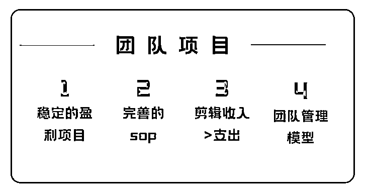
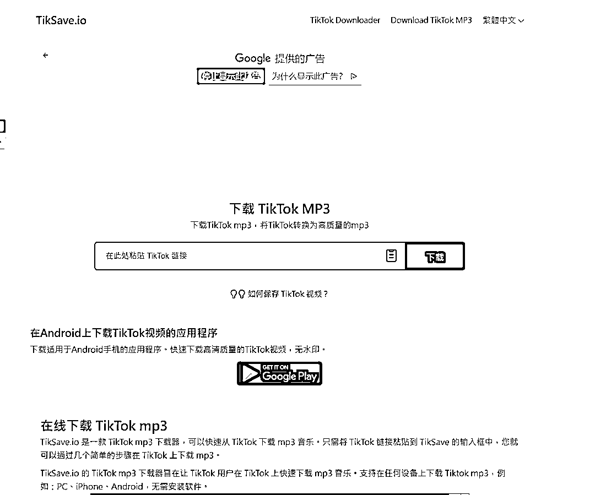
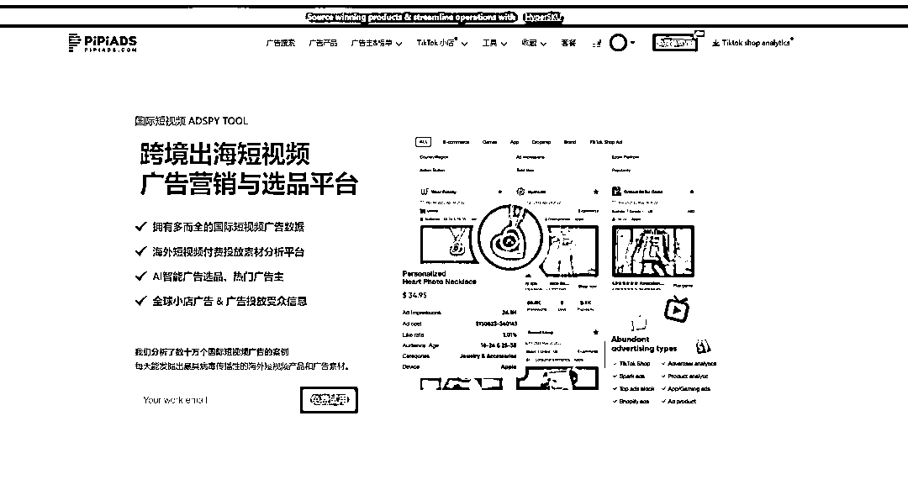
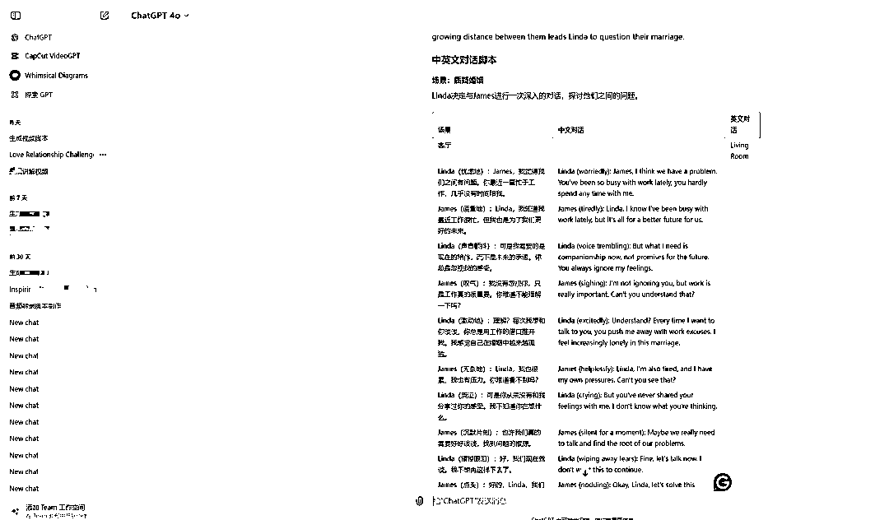
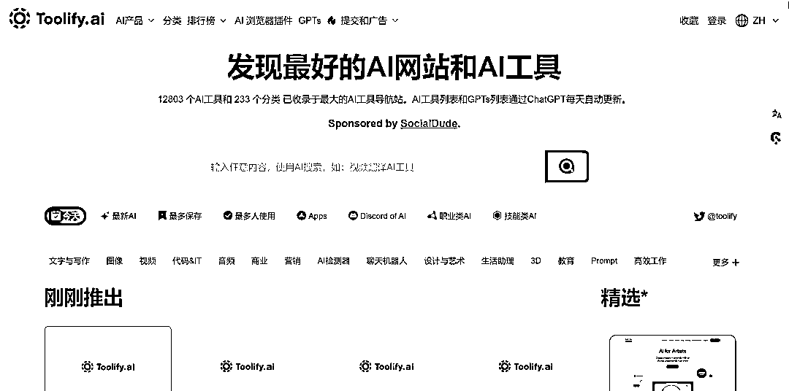

# 如何低成本从 0 组建出 30 人的内容团队（实战 tiktok 操盘经验）

> 原文：[`www.yuque.com/for_lazy/zhoubao/sen5cc75407483zr`](https://www.yuque.com/for_lazy/zhoubao/sen5cc75407483zr)

## (25 赞)如何低成本从 0 组建出 30 人的内容团队（实战 tiktok 操盘经验）

作者： 梁小伟

日期：2024-05-23

分享一篇小伟怎么打造内容团队的操盘实战经验，大家可以参考思路

随着各种 ai 工具和剪辑工具的迭代，剪辑门槛其实已经大大降低。

我们来梳理一下怎么做：

关于项目：其实大家会发现，很多做自然流的团队 都大多有几个痛点

**1：起号周期长 2：回报不稳定 3：流量所带来的转化养不活团队**

不管你是做电商，或者平台的创作者收益，又或者是其他 app 的推广。快速见到成效的团队，已经拿到大结果的团队是少数 普遍的账号，都是一直卡 200，甚至卡几个月 其实**核心原因是对于平台规则的理解，对流量的理解，对内容的理解**。这些理解，对于公司，或者个人发展来说，我可以把他总结为网感和所做赛道的了解 道理其实大家都懂，应该怎么加速呢？

**一、如何降低内容人员网感的培养难度**

解决办法：**学习的本质就是模仿-对标账号模仿**

对标案例本身已经拿到结果，有完善的脚本和持续的推流，你去模仿和拆解的过程中，无形可以快速入场，降低试错成本。

**实操环节**

第一步 养一台手机，平台搜索关键词收集所在赛道的 top 账号进行汇总

开始点赞+评论等互动行为，直到算法开始推荐相关赛道内容

第二步 将所汇总的 top 赛道进行分析，提取共性和脚本 共性（音乐、脚本内容、标题、文案） 字幕提取工具: [`getsubs.cc`](https://getsubs.cc)

音乐提取工具：[`tiksave.io/`](https://tiksave.io)

第三步：结合搜索以及推荐 找出近期起的对标新号，因为老号权重上去了，发内容就会给播放，再加上粉丝观看。这种账号成功率不高。所以找最近一周，最近一个月起的新号。1:1 进行模仿。

第四步：结合 pipiads 查看广告投放素材 花钱投流的素材，能拿到结果的素材非常有必要学习。以美区举例，1000 播放的通用 cpm 是 5-12 美金，那些投放几十万播放，几百万播放的广告主非常值得学习

**特别注意**：**独立站投放 Tiktok 大结果的玩家素材**原因如下：相比闭环小店有基础销量提升下单率，购买链路短，达人建联背书的优势， 独立站投 tiktok 广告需要很强的流量功底去制作素材，从素材-落地页的整个链路来看，比闭环更难。这些优秀的团队，网站、特别值得研究和学习。

我们第一步解决了内容人员网感的问题，降低人员难度后，那我们怎么去解决脚本提炼，怎么做好准备工作

真的需要很专业的人吗？

我觉得大多数电商团队而言，不是太需要的。

**内容实操环节**

**第一步，投喂 gpt 提炼脚本框架**

怎么投喂 gpt 这个内容网上很多，大家可以自己去看，然后其实大多数团队，3.5 就够用了

**注意：将这些脚本全部放到你的飞书文档库方便下一步**

第二步，收集好标签、

音乐上 tikstar 视频库-带货视频榜-标签库-音乐库 搜索你的对标账号，收集标签及实时更新的热歌

**注意：配乐特别重要 实时热歌是可以蹭到热度的，迭代速度够快，就是一个机会**。找热歌最好是找无版权的，或者是翻拍音乐

**第三步：内容场景**

（1）翻拍高播放内容 （2）.纯原创创意内容生产 （3）.有技巧的搬运混剪。

**翻拍高播放内容**

优先找简单的套路，容易起号的套路去降低你的门槛和难度。当你足够了解平台流量，你会发现其实内容是百花齐放的，有很多案例需要日复一日的去延伸。

拿我举例，我每天耗费找赛道的时间是固定不变的两小时，然后进行翻拍。翻拍的过程，一开始不要定的太高 定的太高是什么意思呢?我要买多好多贵的摄影设备，我需要多好的环境和场景布局 一部手机，一个灯。几张布，都可以创造出你想要的环境 甚至场景还可以通过 ai 直接去改变。内容上，可以通过 ai 生成内容，ai 内容变成图片，图片变成视频。全链路通过 ai 实现。我们测试过了，可行的。

ai 工具导航站：[Toolify.com](http://Toolify.com)

**纯原创创意内容**

不同的团队有不同的创意思路，这里和翻拍差不多，我就不过多去说 有技巧的搬运混剪

搬运混剪

第一：尽量避开素材源来自 tiktok，如果避不开，我分享技巧

技巧一：大博主的素材尽量不要碰

技巧二：混剪或者有别人的素材出镜，格局打开，直接@他给他吸粉，进行共赢

技巧三：借助 ai 工具，例如变成动画，例如加入更多的原创元素（贴纸、动画、特效）

当你解决内容的时候，还需要剪辑和发布到你的账号，剪辑是一个苦力活我没有团队怎么办？我的团队效率低怎么办？或者培养团队难度低怎么办？

我给你一些经验分享

第一种，普遍的招聘模式 招固定内容人员，进行公司上班或剪辑。

这里有个问题，前期不知道效果好不好，又或者还不想招人来测试，又或者招人来发现效果很差 应该怎么优化呢？

我是怎么做的。

**链路一：朋友开始培养**

我是 00 的，很多同学还在上学。我会带着这些同学去学习，剪辑，做项目。本身我也没有太多资金，所以我会跟他们进行无底薪分成模式

这样纯线上去筛选，去进行筛选。

一部分人会放弃

一部分人执行力不强

一部分人很有冲劲愿意坚持但缺乏能力

一部分人很牛

放弃和执行不行的小伙伴，好聚好散，还是好朋友。

有冲劲，能力不够的慢慢带

很牛的人，加码给足利益 这样大家又学到东西，赚到钱了又开心，不影响感情

**链路二**：没这种朋友怎么办 我来教大家怎么裂变

我是怎么做的呢？**线上找兼职团队**

**思路一：qq 群水 1000 人以上的大群**

1-3 天我去 qq 加了很多剪辑学习群 我去群里前三天，猛活跃，活跃的时候时不时甩几个红包 有必要还可以猛拍群主马屁 时机到了，开始群里告诉大家， 我这里接剪辑单。一般我第一次会给客单高一点。例如正常价 5 元一条的，我会给 15 一条素材 就会有很多人咨询，咨询引流到微信派单群

第二步，筛选的过程，直接给样片和要求，做好模板。需要先剪样品进行初步筛选。一般 50 人筛出来 10 个人基本合格、

第三步，十个人中让他们剪三天，筛掉其中的 7-8 个人。留下一两个很优秀的小伙伴 继续裂变，让他去找人 第二次裂变派单价格从 15 降到 10 元。告诉留下来的小伙伴 让他去找人剪辑，10 块钱一条，他找一个人，剪一条给他 2 元 他什么都不用做

这样做法就是，降低你的带人难度，你不用再去花时间去找人了。同时他有了自己的收益，会特别上心 这样节约了管理成本，裂变了一批剪辑人员，同时又降低了剪辑单价

第四步：再次从二群，找两个人。告诉他，派单 6 元一条，去找的人，给你一单 2 元。在进行裂变反复。一般单价到 5 元是上限。因为剪辑一条时间成本是半小时。

**思路二**：社媒平台发布帖子找人 没什么技巧，直接去发布信息，找人就可以。

以上的成本我计算过 一个合格的剪辑师，费用是 2000 一个月。

如果你赚到的钱，能超过 2k+就可以选择尝试。

以上是我的实战经验.....

* * *

评论区：

倪大胖 : 再次从二群，找两个人。告诉他，派单 6 元一条，去找的人，给你一单 2 元。在进行裂变反复。
请问这个派单是指?
拾壹贰 : 赛选出几个人人选后，直接去裂变，因为他身边也有很多这样的人，但是不断的降低成本，是这个原理吧
拾壹贰 : 时间成本可能会高一点

* * *