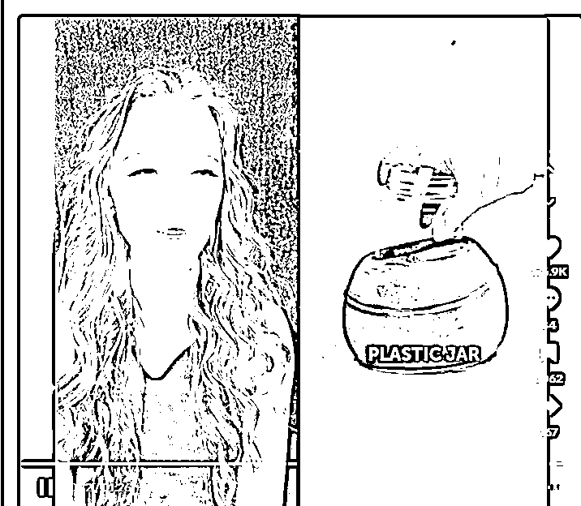

# TIKTOK 中视频计划之分屏玩法

> 原文：[`www.yuque.com/for_lazy/zhoubao/zwq14ng8ye9vf9iy`](https://www.yuque.com/for_lazy/zhoubao/zwq14ng8ye9vf9iy)

## (15 赞)TIKTOK 中视频计划之分屏玩法

作者： A   😇路途

日期：2024-05-24

短视频运营方面，第一个维度在于对手的质量，第二个是账号的权重，第三个则是作品的数量。在这三个维度中，我们唯一无法干预的就是账号的权重。账号权重决定了基础的播放量和流量精准度，进而对作品的数据产生影响，从而影响作品的持续推流。因此，对于同样质量的作品，发布在高权重账号上就容易爆，而发布在一般权重的账号上则很难爆。所以，我们开展 TikTok 运营的首要任务就是迅速筛选出一批高权重的账号。同时，我们可以注册 100 个 TikTok 账号（注册账号几乎没有成本），发布三天视频，通过赛马机制从 100 个账号中筛选出 20 个高权重的账号继续进行运营。 之前给大家分享过 tiktok 中视频，该文章还曾获得过精华，原文是@[知识星球 | 深度连接铁杆粉丝，运营高品质社群，知识变现的工具 (](https://wx.zsxq.com/dweb2/index/topic_detail/412511451855118)[zsxq.com](http://zsxq.com)[)](https://wx.zsxq.com/dweb2/index/topic_detail/412511451855118)。TikTok 中视频 是一个短期暴利的项目，但到目前为止，TikTok 为数不多的赚钱项目仍然是中视频。而且现在玩法会比之前更加暴力。注意：该玩法不适合于小白，个人玩家。

今天给大家讲讲 tiktok 中视频分屏玩法。tiktok 中视频跟抖音中视频很像，都是万粉后发布超过一分钟的视频赚取播放收益，而 tiktok 的中视频的收益却比国内收益高很多，tiktok 中视频 1000 播放美国平均有 1.2 美金折合人民币 8 块钱左右，其中有巨大的汇率差在这。下图的 RPM 就是千次播放 1.15 美金

什么是分屏玩法呢？看下图你就懂了。

从内容上看，就是两个视频一左一右拼在一起的效果。最开始是官方推出的一个玩法，叫做合拍。后面大家发现，这种内容完全可以自己剪辑在一起以后发布，效果也不错。

你可能会说，路途这个看起来也太简单了吧......感觉没什么意思啊。

是的，我最开始也是这么想的，但事实上我们这个玩法恰恰是最赚钱的，我们把这个矩阵上到了无限大，完全就是乱拳打死老师傅，死命怼。

比如说起 500 个号，假设我有 20 个大号跑出来了，每个号平均给我带来 3-5W 的利润，那么这个月我的收入就能有 60-100W，这个就是分屏的模式打法。

当你的账号足够多，收益也就会开始变得越发可控。

可能你会有个疑问，这类视频看起来这么简单，为什么能火？或者说能够赚到钱，我认为大致有这么几个原因

1、内容因素：虽然看起来只是 2 个视频拼接在一起，但是其实你会发现，左右的两个视频都是 TK 上已经验证过的内容，不说 1+1>2，起码一下子有两个内容呈现在你面前，总会有你比较感兴趣的，完播的概率也增加了。

2、去重因素：我们做视频做内容，其实往往不可能完全从 0 开始原创，多少会借鉴或者引用别人的作品，而分屏这个方式，在画面上只有 50%的画面使用的是引用的作品。

3、矩阵因素：我们知道，起一个两个账号其实并不是难事，不少小伙伴甚至能够做到上亿播放。但是要想放大自己的收益，就必须做到矩阵化，模式化。这类作品正式因为足够简单，所以加上规模效应以后，能做出这样的成绩就不奇怪了。

那这类作品如何制作呢？

这个做法太简单了，简单的来说就是把两条视频左右拼接就行了，问题是，一条一条视频剪辑太慢了，我们要向做矩阵就必须要提高效率。那么今天我就给大家重点讲一下如何批量的生成此类视频。

首先呢，我们需要把要整理的素材先准备好

这类作品形式，一般来说，就是一边是解压类视频，或者手工类视频。另一边呢，就是一个人物视频，这类视频一般直接在某 tt 里面找大点一些博主的搞笑视频。

那么这类视频怎么找呢？首先解压视频，可以在个个平台直接检索对应的关键词，也可以在淘宝等直接购买别人整理好的素材包。至于人物视频，这个最好的是找到当地的一些小网红的视频，直接套用。

素材准备好以后，如何批量剪辑呢？

操作方法很简单，就是把一部分素材，放在左边，一部分放在右边就行了，那么我就接下来主要给大家讲一下批量剪辑的技巧。

首先呢，剪辑工具的选择，可以选择 PR 或者剪映。PR 的功能比较强大，能够批量的导出作品，而剪映则需要一条条的导出。

但是 PR 的操作会难一点，剪映则更简单。下面这两个软件我都给大家演示一下批量剪辑的操作思路。

如果使用 PR 呢，我们最重要的是要使用他的粘贴属性。

你看，其实作品的剪辑方式是有相似性的，所以我们可以一次性处理多个素材，先把某一个素材调整好它的位置和大小等等，之后在把这个效果复制到其他的素材上。

比如说下面这个人物素材，我先设置好第一个素材，然后把它放在视频左侧，因为其他作品跟他是有相似性的

我直接复制第一个素材的属性以后，在全选其他素材，之后右键粘贴属性，就可以一次编辑好多个作品。之后再批量导出就行了。

那使用剪映同样也是有技巧的,我可以先把解压的素材先合并成一个完整的素材内容。之后把人物的素材放在上层直接匹配就行了。

如果不太好理解这个技巧，可以找我发录制的视频演示教程哈。

那么我们再说回来分屏作品的流量问题。这里要说的是，做分屏作品，主要靠的是作品和账号的数量来打矩阵，所以不要以个别作品和账号的播放和收益论成败，主要是一个变现模式。这个适合小工作室批量矩阵玩，不适合个人。

希望对你有帮助，记得帮我点个赞哈~

* * *

评论区：

coke 丶 : 音频不会乱吗
A   😇路途 : 不会，忘记加上去了，解压素材的音频关掉[呲牙][呲牙][呲牙]

* * *