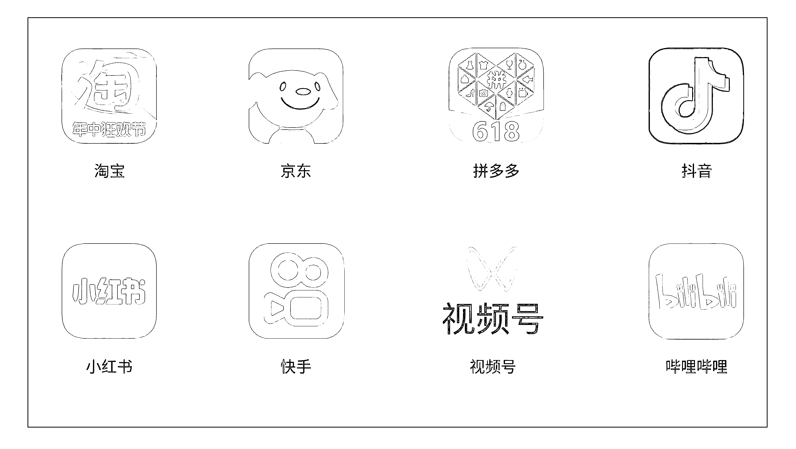
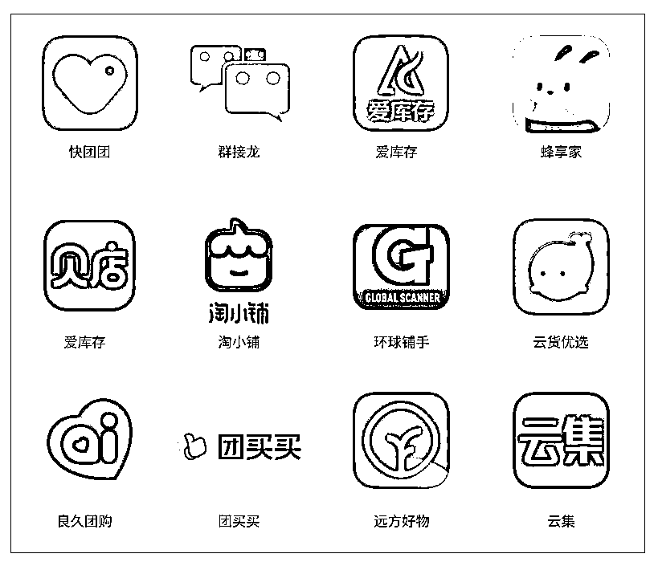

# 深度解析电商分销的三种形态

> 原文：[`www.yuque.com/for_lazy/zhoubao/gre9prp01ulwb7sf`](https://www.yuque.com/for_lazy/zhoubao/gre9prp01ulwb7sf)

## (118 赞)深度解析电商分销的三种形态

作者： 老胡

日期：2024-05-22

有日子没来生财分享了，过完年为了做短视频相关的内容付出了大量的时间，还踩了不少坑，这块等有空的时候和大家细说，今天主要想聊的是我一直想写，但没有时间来写的一篇文章，那就是关于电商分销的三种形态。

为什么之前没有时间写呢，因为写这种深度文章特别烧脑，会耗费大量的时间精力来整理思考。

有那么句话讲的特别好，写作之难，在于把网状的思考，用树状结构，体现在线性展开的语句里。

本文内容都是我日常和一些在电商大厂里负责营销的高管们、市场上做电商分销的高手们、包括做电商分销平台的老板们、以及头部大团长们经常探讨的话题。也是我如何看待某个分销项目时的一些底层思考，可以说全是压箱底的干货。

如果你能细心看完并且看懂这篇文章，能帮助你赚多少钱我不敢乱说，但是帮助你以后遇到类似项目的时候做判断那时绝对有帮助的，什么样的项目能干，值不值得干，应该怎么干都会有一些清晰的认识。

当你有了这些清晰的认识以后，未来遇到合适的项目，参与进去，实现年入百万都是很轻松的事情。因为此时你就会对某个分销项目能有一个全面的判断，有了这样的认识后就可以全力投入去做，因为有判断之后的相信才能坚持，最后才会取得成绩。

而不会像那些不懂的人，没有自己的深层思考，跟着别人做，别人说某个项目好就好，别人说不好就不好。

那种随大流的人，要不就是被坑被骗钱，浪费了时间精力不说，还把身边的亲朋好友都得罪光；要不就是蜻蜓点水遇到点问题就轻易放弃。

我讲两个发生在我身边的案例给大家听下，拿我的人格做担保，100%真实不吹牛。

静静是前两年我做拼多多旗下社交电商“群买买”时跟着我干的一个下级团长，也是个普通宝妈，当时跟我参与那个项目的时候从来没有接触过任何私域分销项目，对这块的认知就是 0，但是她的理解力和执行力都非常强，短短几个月她就实现了月入 2 万块。

虽然后面“群买买”那个项目由于拼多多官方的傻逼决策导致了业绩下滑，最后平台被关闭。但她跟我干了 2 年，提升了对私域分销的认知，也掌握了一些方法论。现在去干了另外一个私域分销平台，短短 8 个月的时间已经实现了月入 20 万，估计到年底可以实现月入 30 万的水平。

一个素人宝妈团长月入 30 万对她来说应该是个天文数字了，但站在整个电商分销或者说私域分销领域来看，可以说只是一个相对普通的水平，做过私域分销大团长的都应该懂。

我还认识一个做私域分销的宝妈团长，她叫七七，一个 10 岁男孩的妈妈。

昨天她来杭州还一起吃了午饭，短短三年的时间她就实现了年收入从 0 到千万的突破，妥妥的实现了阶层跨越，听起来是不是非常夸张，不敢相信对不对。

三年之前她还是广西柳州移动公司的一名员工，年收入也就才 30 万左右。

年入 30 万，有房有车对于在一个小地方生活的普通宝妈来说，应该是非常滋润的，但是七七想给孩子更好的教育，想去更大的城市生活。她想实现年入百万，但在原有的移动公司内是很难实现，所以她就毅然决然离职，离职后带着孩子去了深圳，最后加入了某私域分销项目。

我记得她去年也是这个时间来杭州找我聊天，她当时的月收入刚刚达到 30 万，告诉我她 2023 年的目标是实现年入 500 万，然而一年之后当她再次来杭州和我见面交流的时候，她已经成长为一个月入百万，年入千万的大团长了。

实话说给我都惊讶到了，因为这两年的经济大环境非常差，很多行业都活得比较艰难，倒闭的公司、失业的人群比比皆是，每个人都过的非常不容易。

居然在这样的情况下她还能获得如此快速的增长，短短一年，收入直接翻倍，看来这就是私域分销的魅力呀。现在她的日常工作就是全国各地跑一跑，见见她的那些下级分销代理们，然后定期组织培训和聚会，没事的时候就出去旅游和拜访各路高人学习，生活、事业、家庭一点都没耽误，真是活的有滋有味还有品，连我都羡慕极了。

七七现在这个收入水平，已经超过市场上绝大部分公司的盈利能力了，属于货真价实的超级个体，直到现在她连个办公室都没有，只是聘请了 10 个兼职的在线助理帮她处理一些杂事。

上面说了一大堆，只是想告诉大家在电商分销领域这些年入百万、年入千万甚至是年入上亿都是真实存在的。只不过这些人要不很低调，从不对外说，要不就是她们自己对外说，很多人都不相信。认为她们是在吹牛 P 图搞传销，而我由于和她们经常交流，自己曾经也创业做过类似平台，同时也躬身入局做过大团长所以了解会多一些。

谁的收入是真的，谁的是假是 P 图，我聊个几分钟基本就能判断出来，当然她们也不会骗我，更不敢骗我，否则后续找我交流，我基本就不再理会，或者干脆拉黑删除。

接下来我们言归正传，正式围绕本文的主题展开，那就是电商分销的形态。

总的来说，我个人把**电商分销分为三种形态，分别是纯公域分销、公私域结合分销、纯私域分销。**

每一种模式都有各自的优点和缺点，也分别适用于不同的流量类型和人群，没有绝对的孰好孰坏，只要你用心参与进去基本都能赚到钱，只是赚多赚少，发展快与慢、生命周期长和短的问题，下面我把这三大模块逐步拆解下，希望对大家有所帮助。

**一、纯公域分销**

这里讲的纯公域分销，指的是那些在公域电商平台内完成的分销模式，比如淘宝、京东、拼多多、抖音、快手、视频号、小红书、B 站等。

虽然过去只有淘宝、京东、拼多多三家是纯正的公域电商平台，但今天随着抖音、快手、视频号、小红书、B 站这些内容平台的崛起，他们也都在各自努力成为一个闭环的电商平台。

为什么？因为只有做成一个闭环的电商平台才是最赚钱啊，卖家在这个平台会投入大量的广告预算，平台的流量可以重复卖、反复卖给不同的商家，于是抖音就超越了腾讯，成了中国最赚钱的公司。

由于在这些平台里开店的商家非常多，平台自身的流量也有限，而且越来越贵。

所以此时商家想要得到更多流量，就只能找到平台内的各种达人合作分销带货，这些达人对粉丝有影响力，深受粉丝信任，所以带货转化率也比投广告要强，而这些在平台内达人分销带货的模式，就是我所定义的纯公域分销。

纯公域分销它有个特点，那就是这些分销达人在淘宝、天猫、京东、拼多多、抖音、快手、视频号、小红书、B 站等这些公域电商平台内注册账号、创作内容，通过内容获取站内的粉丝关注，后续通过直播、短视频、图文等形式帮助平台内卖家分销带货，从而获得佣金收入。分销达人从起号、创作、吸粉到带货变现都在平台内完成，是一个完整的闭环，而不是从公域导流到私域微信，然后再成交的逻辑。

当然电商卖家在这些大平台内想卖货基本都还是购买平台广告流量为主，比如常见的淘宝直通车、抖音的千川信息流等，卖家主要的费用还是花在广告引流上，而这些广告营收也是平台的主要收入来源。

除了平台以外，目前在这些公域电商平台内最赚钱的就是各种站内分销达人了，比如淘宝的李佳琦、薇娅，抖音的小杨哥、广东夫妇、郝劭文，快手的辛巴、太原老葛等等这些头部达人，这几年依靠给商家分销带货赚佣金，都实现了财务自由，甚至用盆满钵满来形容都不为过。

不光这些头部达人，还有大量的中小达人，那些粉丝几万、几十万、乃至上百万的达人，这几年都通过帮助商家分销卖货，赚到了大量的真金白银。所以我们才会看到现在全民都想做网红，用尽各种方法让自己出名，然后开始分销带货赚钱，这一条被无数人验证过可以通往成功的路。

实话说在公域平台内做达人分销是最好的路，不管是通过短视频、直播还是图文，不管是超头网红，还是中腰部 KOL、KOC 都是可以快速赚到真金白银，**因为不仅平台会给你流量，分销达人自己还可以通过在平台内投放实现规模化的增长，同时商家也愿意给你足够的预算和佣金，甚至让商家亏本或者帮你投流，他们都愿意干。**

为什么商家亏本都愿意干？

这是因为有品牌杠杆作用，一个商品被头部达人带过以后，他们再去找中小达人带货，这些中腰部 KOL、KOC 们就会愿意带，所以商家才会愿意给到一些头部达人坑位费+高佣金，甚至是 100%、120%的分销佣金。

啥叫 100%佣金，那就是头部达人帮助商家卖 100 块销售额，商家愿意支付 100 块佣金。

啥叫 120%的佣金，那就是头部达人帮助商家卖 100 块销售额，商家愿意支付 120 块佣金。

看出来了吧，这就是为什么大家都要去做网红，连头部网红都要去做带货的原因啊。

虽然做网红，然后参与分销带货非常香，也能快速规模化起量，商家都趋之若鹜，甚至求着你给他们带货。但是做个网红太难了，现在已经不是用红海来形容，直接就是血海。你看看最近郭有才火了，有多少人从全国各地跑到菏泽南站去做直播蹭流量的。

不光普通的个人今天想成为一个大网红很难，就连公司去投入重金去孵化都不容易成功，我身边也有不少老板在做 MCN 机构，开始批量的来孵化达人，其目的就是未来做带货分销，但是成功率太低了，我看下来连 3%都不到，也就是说你孵化 100 个达人，能有 3 个跑出来就非常非常不错了。

可以说这条路，我们绝大部分普通人都不适合做，如果有的选我自己早都去干了。

总的来说在公域平台做分销这条路是比较难走的，不管是投流类型的分销，还是做自然流分销，普通没有背景的素人进入机会非常渺茫，大家只是了解下就行了，不要只看贼吃肉，没看贼挨打。

**而真正适合我们普通人的，是我下面要讲的这两条路，那就是公私域结合分销和纯私域分销这两种形态。**

**二、公私域结合分销**

公私域结合分销，这种形式也是市面上我们最常见的一种电商分销形式，也就是把公域平台的商品拿过来通过私域平台进行分销，然后赚取分销佣金。

比如业内人都很熟悉的淘客、抖客、京东客、多多客全都是属于这一种模型，这也是我个人最了解的模式，毕竟我在这个领域干了 15 年，可以说亲眼看着这个模式从无到有，从 0 到 1，一直到今天的全面开花，全民参与。

如果我上面讲的淘客、抖客、京东客、多多客这些还是行业内的专属名词，只有业内人才听懂，普通分销团长还听不懂的话。

那么下面我讲的这几个 APP，你们至少听过一个，如果你连一个都没听过，那我这篇文章里你也别浪费时间看了，不适合你，还不如去刷会短视频。

其实花生日记、蜜源、好省、粉象生活、高佣联盟、悦拜、美逛、福袋生活、芬香、乐买买、热度星客、抖选生活（原抖心选）等等一大堆，这些 APP 或者小程序都是公私域结合分销的模式。

这种模式之所以在过去几年能够快速崛起，主要还是通过私域团长分销这种机制进行了全民覆盖，过往的文章里我讲过无数次，这里就不过多阐述，感兴趣的自己在我公众号里翻翻，尤其可以多看看我 2019-2021 年的文章，对这块讲的比较多。

这里我就讲几个大家关心的核心问题，为什么平台和商家都能接受这种公私域结合的分销模式，这种模式为什么适合普通的素人做，以及为什么这种模式可以快速爆发起来。

**1、  为什么平台和商家都能接受这种模式？**

因为现在公域电商平台自己也非常缺流量，商家在这些平台上更是流量饥渴，通过投放在平台内获客的成本越来越高，可以说已经到吃不消的地步了。

听说某电商卖家在抖音上一年卖了 3000 多万，最后算完账只有 1.7 万的利润。

大家不要笑话，这很有可能是真的，因为他们的利润大部分都用来在抖音买流量了，同时还需要给自己的主播发工资、发提成，合作的主播还需要给坑位费+佣金，还需要维持公司运营的各种费用，可以说真的是苦不堪言。

还有个案例，也是前段时间风中的厂长发的，他在义乌参加了一个电商人饭局，义乌的一位卖家去年在拼多多做了 2 个亿销售额，类目是日百杂货，毛巾杯子这种，一年下来赚了 55 万的利润。

那位卖家说其实整体算下来他的毛利是负的，这 55 万的利润还是因为他的发货包裹量大，一家游戏公司在他包裹里塞游戏卡，扫一扫免费玩游戏那种，他是靠塞这种游戏卡每月赚个 10 几万，最后减去全年的卖货亏损，最后得到了 55 万的利润。

现如今这种情况下，作为公域电商平台的淘宝、抖音、京东乃至被业内称为索马里平台的拼多多，他们都希望平台上的卖家能够持续经营下去，但是他们自己也没办法给到更多的流量。

这个时候通过站外的分销合作伙伴，来给站内商家带来流量就是平台极度渴望的了。

因为这种站外分销流量几乎可以说是免费的，只有带来成交才会支付佣金，没有成交不需要支出任何费用。

那么肉眼可见的站外流量在哪里？毫无疑问肯定是在微信里。

但是这些平台又不可能自己无限制的去微信里做投放，来给商家免费导流。更何况现在从微信到淘宝、抖音的链路也不是很顺滑。

那么在这样的情况下，通过聚集无数的中小个人流量，使用蚂蚁雄兵战大象的做法就非常合适，让这些人不断地在微信群、朋友圈帮助淘宝、京东、抖音的卖家分销产品，这对公域电商平台和卖家们而言都是非常能接受的一种模式。

**2、为什么这种模式适合普通的素人做**

一般来说我们普通素人人的微信好友数非常有限，且影响力也有限，就算他们的朋友圈和微信群里天天卖货，也赚不到多少钱。

但是这种公私域结合的分销模式中，普通人参与进来是可以很好的借势的，因为他们推广的都是大平台的品牌特价货，是货带人的逻辑，而不是人带货。

卖家在这些私域分销渠道往往会给大额的隐藏优惠券和高佣金，说白了也是亏本进行的。之所以卖家会在这些渠道亏本，还是因为可以通过这种站外的私域分销渠道打爆，从而获取到电商平台内部的流量杠杆。

简单来说一个商品只要卖的多、好评多，就可以在电商平台内的搜索排名中靠前，从而免费获得站内的搜索和推荐流量，只要做过淘宝和京东的商家都非常清楚这一点。

所以在这种大平台的信任背书下，又是品牌商家可以亏损的货带人逻辑下，素人带货是成立的。

哪怕一个普通的素人，她要是在朋友圈发一条促销信息，比如优衣库平时卖 100 块的裤子，现在有一张 50 块的优惠券，你只要复制口令打开淘宝就可以领取 50 块优惠券，实际支付 50 块就能买到，而在淘宝站内购买是没有这个隐藏优惠券的，必须要原价 100 购买。

那在这种情况下，你说好友们看到了我发的这套朋友圈，他们会不会买，肯定会买啊。好友们购买后，我就能拿到 20%左右的推荐佣金，也就是 10 块钱这样，一个普通人就靠这种分销推荐，一天赚个几百块也是很随便的，而且这种货品还经常出现。

看来这里大家都会明白了，之所我发朋友圈后，能带来很多购买用户，其实好友们不是相信我的推荐，而是相信优衣库和淘宝这个占比是最大的，这就叫借平台的势、借品牌的势。

实际上抖音的抖客分销也是同理，只不过在私域渠道的分销玩法和淘宝和京东还稍微有些不同，但大致的了逻辑是类似的，这里不再展开。

**3、为什么这种模式可以快速爆发起来**

上面第 2 点，我提到了为什么这种公私域结合的模式中，普通素人可以通过借势参与分销的逻辑，那么如果只是那种逻辑的话，她们参与进来还是很难赚到大钱的，一是因为她们的朋友圈好友数量有限，二是那种容易推的品，也不是天天都有。

但是不要紧，这种公私域结合的分销平台还有个很牛逼的工具能力，也是这些分销平台能够发展壮大和生存下来的最重要抓手，那就是查券和返利工能。

常规情况下，素人分销者在朋友圈或社群推广公域平台的货品，好友看到后复制口令去对应的平台买就完事了。

但是我上面提到的那些 APP 或者小程序们，他们又做了一套多级分佣的代理分销体系，让所有的私域用户去把微信里的亲朋好友都发展进到那些 APP（或小程序）当中去，这样当这些亲朋好友每次要去淘宝、京东、抖音上购物的时候都会用这些 APP（或小程序）去搜索一遍，看看是不是有隐藏优惠券和返利，然后再去购买会更省钱。

那么在这样的逻辑下，哪怕这些私域分销者每天不发朋友圈，不发微信群卖货，也能获得不错的收益。因为要在这些平台买东西的用户太多了，分销者们只要去拉人去用这些 APP（或小程序）就可以实现长期的分佣收益，更何况还有多级裂变的分销抽成。

这就是为什么这些公私域结合的分销平台能够快速爆发起来的根本原因，分销者们既能够借势到大平台的信任背书，又能享受到品牌卖家给的定向折扣和高佣金，同时还能把所有要在这些平台购物的用户发展到那些 APP（或小程序）当中去，长期的享受到购物的佣金分成，是一个非常完美且可以快速高效复制的模式。

过去几年有一大批的私域分销团队长通过这种模式赚到了钱，头部的赚到了几千万甚至上亿，赚到几百万的腰部团长也是一大批。我当年创业做的兔子优选，后来和好省合并了，我们的平台里面就有不少赚到大钱的团长们，有的真的实现了财富自由。

**4、讲讲这种模式的弊端**

首先是各家平台很难有自己的特色和差异化，因为都是给大平台做私域分销，每个平台拿到的货盘和佣金比例都是一样，这就导致各平台为了竞争和抢用户只能是不断地让利，比如 A 平台给分销者的佣金是 30%，那么 B 平台就给 35%、C 平台就会给 40%，搞到最后大家都没什么利润。

分销平台没利润就可能随时会放弃经营，这对加盟其中分销者来说是一个非常致命的打击，会导致她们所有的努力都付诸东流，我当年会把兔子优选和好省进行合并，主要的考虑也是为了让分销者们的努力不能白费。

另外还有个弊端，那就是很容易受到大电商平台的环境和政策调整影响，一个政策可能就会让下游的分销渠道瞬间熄火，比如拼多多现在就不允许这些渠道给用户返利，这就导致很多做拼多多的私域分销平台现在关闭了。

另外包括商家营销预算的缩减，也会对这种模式产生很大的影响，比如淘宝商家以前愿意在私域分销渠道亏本做，以换取淘宝站内的流量杠杆。但是现在淘宝整体购物流量下滑，导致搜索流量也下滑的厉害，商家就算亏本在私域渠道分销做了很大的销量，也很难换来淘宝站内的搜索和推荐流量，于是他们就不会继续亏本做了，这样下游的素人推广者就很难有好的货品来推。

另外不少商家也会降低甚至关闭这些私域分销渠道的推广计划，这样就算分销者把亲朋好友拉到那些购物 APP（或小程序）中去，他们也经常找不到大额的隐藏券，或者返利的钱很少很少，慢慢的这些用户就会放弃使用这些 APP，导致私域分销团长们的收益也是断崖式下滑，从而引发整体出逃，这就是今天的真实现状。

虽然这种公私域结合的分销模式当下面临严峻挑战，但也不是说没有机会，今天很多做淘宝和京东私域分销的公司和个人依然可以赚钱，只是周期会长些，当然进入的门槛也变的非常之高，普通素人的机会没有以前那么大了，只有在红利期才是最好做的，比如 2018-2021 年。

不过随着抖音和视频号的货架电商发展，关于这两个平台的公私域结合分销会不会有一波新的造富机会，我也一直在研究关注，如果有相关的消息我会及时写出来同步给大家。

**三、纯私域分销**

最后我们来讲下纯私域分销，估计这个也是大多数分销团长们最关心的话题，也是目前从业人数最多的一个模块。

纯私域分销和我上面提到的公私域结合分销的最大区别是一个是给淘宝、京东这些大平台导流卖货，一个是给自己的平台导流卖货。

私域分销这个模式是伴随着微信的诞生而发展的，从最早的微商、到后面的云集、贝店、环球捕手、淘小铺、蜂享家、爱库存（饷店）、云货优选、良久、远方好物、快团团、群接龙、团买买等一大批平台。高峰期可以说这种纯私域分销平台有上千家之多。

虽然有的已经消亡了，但到今天依然还有几百家存活着，且很多大多数都活的很滋润。

虽然这些平台对分销者的叫法不同，有的是叫代理、有的叫店主，有的叫团长或帮卖，这都只是对分销者的称呼不一样而已，但是大家干的事情其实都是一样的，那就是帮助商家在微信里卖货。

纯私域分销平台在我的定义里，可以分为社交电商平台和私域电商工具两大部分，接下来我详细讲下这两者的区别。

**1、社交电商平台**

社交电商平台的理解很简单，那就是整合上游供应链，然后自己建设分销平台，同时去发展大量的中小分销者加入，利用这些分销者或者分销渠道在微信里去帮平台卖货。

平台自己不会去做任何的市场投放，所有的流量全部来自分销者，所有的货品也都依靠分销者去卖，所有的商家想加入这些平台分销，也都是签约入驻的形式进行，整个销售环节都是平台在组织，客服售后的工作也都是有平台方去和消费者对接，商家只需要处理退换货这些环节即可。

我上面提到的云集、贝店、环球捕手、淘小铺、蜂享家、爱库存、云货优选、良久、远方好物等都是这种平台，虽然贝店和淘小铺因为一些特殊的原因关闭了，但是其他家都发展的还挺好，大点的都做到了年销售额百亿以上，当然还有一大批中小平台也活的不错。

这种纯私域分销平台的最大特点就是稳定持续性强，竞争没有那么激烈，在微信生态里各家都有自己的势力范围，所谓鼠有鼠道、猫有猫道，大家都相安无事，默默发展自己的业务，没有公域平台那种白热化的价格战、补贴战。

商家或者品牌商也非常愿意在这些渠道卖货，因为毛利是非常可控的，同时还没有流量成本。

有家做保健品公司的渠道负责人和我说，他们在天猫的利润率最多也就 10 个点，在抖音是亏钱的，而在私域分销渠道，他们的毛利润可以做到 40%，所以他们非常重视这些渠道的长效经营。

另外各家分销平台的货品和人群定位也不一样，每家都会有自己的特色，有的是专注于服饰特卖、有的是专属于食品健康、有的专属于大健康，可以说这是个原始丛林，大树能活，小花小草也都能活。

**2、  私域电商工具**

私域电商工具其实就是快团团、群接龙、团买买等这些平台，当然有赞、微盟、微店等这些平台本质上也算是私域电商工具，主要是用来帮助商家在微信里快速开起一个店铺的功能。

只不过快团团、群接龙、团买买是最近两年新起来的，而有赞、微盟、微店这些是相对早期的工具了，前者是相对较轻的工具，而且纯免费使用，后者是相对重一些的私域开店工具，而且还要付费。

私域电商工具和社交电商平台最大的区别是不用自己去组织货盘，而是搭建好开店体系，让所有供应商自己进来开店。同时在流量端，卖家要自己去发展分销用户，说白了他们给你提供的只是一个工具而已。

这对商家的要求其实蛮高的，一方面要自己负责上架开店，一方面还要去拓展分销帮卖，同时还要负责售后客服等诸多工作。

但是好处也是很明显的，那就是卖什么货、推什么品都是商家自己说了算，而且不用受制于平台的管控，拥有最大的自主权，而且利润是最高的，不需要缴纳任何的平台广告费，商家利用这些工具可以低成本、快速的构建自己的私域经营场景。

很多之前在淘宝、京东、抖音等平台开店的商家现在都开始重视这一块的运营了，不管把在公域平台购买过的顾客偷偷加到微信，然后使用这些工具平台开店，在私域里展开成交。

**3、  私域分销团长到底是怎么选？**

前面我说了那么多，确实有点深，如果你只是想单纯的知道普通的素人或者有一定私域流量的个人，如果参与纯私域分销的话，应该怎么选，接下来我就展开给你分析下。

首先是不要去做私域工具平台的分销，也就是不要去做快团团、群接龙、团买买这类的分销，因为这主要是给商家做私域经营用的工具，虽然他们也设计了针对个人分销的帮卖套体系，但没有多级分销的能力，只是单纯的一级帮卖。

说白了这就要求你自己有比较多的私域流量才行，我们绝大部分普通人的微信好友数量也是不多的。

另外这些工具平台上的商家参差不齐，很多商家不诚信经营，货品质量很差，售后服务基本没有，而且工具平台基本上不会去管理这些商家，也没有售后服务和保障那套体系。基本全靠商家自己进行，如果你参与这种分销，最后可能会对朋友圈的信任损害较大，所以我不太建议参与。

最好是参与到社交电商平台的分销当中去，因为这些平台不仅有多级分销可以让你有管道抽佣能力，而且很多平台的货品还非常有特色，同时平台方也会对入驻的商家做有效筛选和管控，也会定期组织大促活动，各种宣传物料和素材都会给你提供好，你要做的就是去分销就行。

虽然做纯私域分销相对于公域分销和公私域结合分销对不起来发展没那么快，但这是最稳定的、最能持续经营的项目，是可以实现细水长流的。

尤其是公私域分销和纯私域的社交电商平台的分销，他们都有一个共同的特点，那就是会有多级代理抽佣的机制，这个机制太关键了，因为你未来 60%-80%的收入来自于这个机制，而不是靠你在朋友圈和微信群里天天卖货。

我文章开头说的那两个案例，一个是月入 30 万的，一个是年入千万的，其实做的都是这种纯私域的分销平台，当然纯私域的分销平台非常多，大家在参与的时候一定要多看看，仔细甄别下，有些平台也是骗人的，甚至还收人头费，这种最好别轻易加入，否则就是被割了韭菜，还涉嫌传销。

如果你实在分不清楚，也可以来咨询我，欢迎给我私信。

对了，我接下来准备创建个“老胡分销联盟”，专注于做私域分销相关的事情，长期免费的给大家分享私域相关的各种知识，而且还会每年亲自带领大家参与 1-2 个分销项目，主要聚焦在公私域结合分销和纯私域分销两大模块，目前加入“老胡分销联盟”是纯免费的，不收任何费用，不过由于我的精力有限，大家需要先报名，然后我会来审核，审核通过的才可以正式加入。

如果你有一定的私域流量，同时对私域分销感兴趣，愿意从事这个领域，而且有任性、有执行力，想参与进来一起赚钱的话可以关注我的公众号“老胡地盘”在这篇文章的尾部扫码报名，未来我们一起同行。

我给自己定的目标是用 2-3 年时间，带出 100 位年入 100 万的徒弟，然后我就可以和大家一起周游世界，边玩边赚钱。

* * *

评论区：

帅彬 : 大佬👍利他思维
李同学 : 行业深度好文[玫瑰]
龙哥 : 很赞
邂逅的时光 : 怎么报名呢
张大宝 : 糟糕，这些 APP 真的一个都没听过[发呆]
老胡 : 看文末
老胡 : 那不适合你[偷笑]
起不来就 s : 只有想干的心，没做过私域您会同意吗

* * *