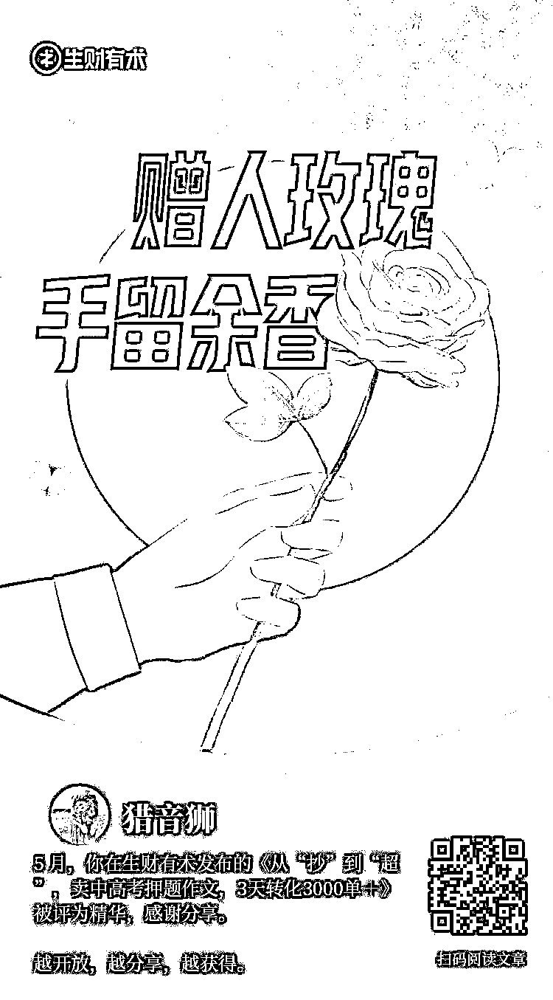

# 从年入 50w 到年入 100w，我做对了什么？

> 原文：[`www.yuque.com/for_lazy/zhoubao/xugoo5mp0y4gtbsi`](https://www.yuque.com/for_lazy/zhoubao/xugoo5mp0y4gtbsi)

## (83 赞)从年入 50w 到年入 100w，我做对了什么？

作者： 豪叔（猎音狮）

日期：2024-05-15

圈友们好，我是**豪叔**，也是去年刚加入生财的**萌新**！

为了**感谢**生财平台，我打算写点**自己的感悟**！

把这篇**《从年入 50w 到年入 100w，我做对了什么？》**送给刚加入生财的圈友们，共勉！

虽然这点成绩对于圈友来说，是微不足道的一小步，但是对于我来说，是一大步。

**我简单说一下我的个人经历吧！**

* * *

我先来简单介绍一下我自己，我是**90 年属马**，老家云南边境山卡卡。

学历是普通二本，**环境科学与工程系**毕业，专业是**土地资源管理**。

可以说专业跟我现在从事的工作八竿子打不着，所以做**自媒体**，**学历**也没那么重要了。

我学员里甚至有很多**初中毕业**，还**做得不错**的。

2000 年 9 岁才上的学前班，因为**家境贫寒**，父亲都不打算给我上学的，虽然一个学期才**15 块**的学杂费。

后面 9 岁时，父亲还是把我送去了学前班，用的书包是母亲用几块布缝起来的一个布袋子，样子就有点像我们现在购物用的纸袋子。

所以特别珍惜学习的机会，从小学到初中，一直都保持全校第一。

到了高中，可能到了“大城市”（县城），被花花世界给吸引力，所以只考了个普通二本，村里***~~因此少了一个清华的大学生~~***，哈哈！

高考后，父亲说回去跟他**修地球**吧，大学读了没啥用，早工作早赚钱。

其实最主要的原因还是**家境问题**，父亲也不是不想给我上，对于普通家庭来说*~~，~~****~~读个高中就是拖累全家，上个大学那简直就是拖垮全家~~***，省吃俭用大学四年花个八万，对于农村普通家庭来说，简直就是**天文数字**。

因此，高考结束的那个假期，在别人跟父母出去度假的时候，我在当地县城骑着三轮车送货，干了两个月，赚了 1800，买了一个**行李箱**、一张到昆明的**汽车票**，剩下的当做暂时的**生活费**。

学费申请了生源地助学贷款，大学四年，勤工俭学，最巅峰的时刻，**晚上上班，白天上课，还能保持不挂科，门门 90＋**，哈哈！

干过很多很多兼职工作，比如**餐厅服务员、房产中介、家教、发传单……**

这样的生活持续到大二，因为跟女朋友分手了，可能觉得***~~我赚的钱连我自己都养不活吧~~***，消沉了两个月后，我没再去做兼职了……

而是，自己做了一个兼职平台，因为之前做兼职认识了一些商家资源，就做了一个**免费的兼职平台**，**免费分享兼职信息**（也因为被骗过、被中介坑过，不想让想和我一样的学弟学妹重蹈覆辙）。

我**利他**的思维，就是这个时候开始培养起来的，好像还真有**福报**这么一回事，慢慢开始**转运**。

一切从这开始变得越来好，还交了**新女朋友**，也就是我现在的**老婆**，一切都**重新开始……**

毕业了因为做的兼职平台，有幸加入一家互联网公司，月薪**2300**，上了三年班，虽然钱也没挣着，但上班期间一直接触**互联网**，一直也在边上班边做**兼职自媒体**。

2018 年自媒体赚到第 1 桶金，**50w****，****~~月薪 2300 的人~~**，兼职一年赚**50w**，当时真的开心坏了！接着就辞职了，自己一个人一直干到现在！

当时做了很多企鹅独家号，时间太久，只能登录这个号了，如上图！

因为我**利他**的思维，每次换项目赛道都如同**顺水推舟**，**如有神助**，**轻而易举**就换上了。

七七八八项目换了不少，每次自己都好像是**站在风口**的那个人！尤其 2023 年 4 月，在圈友**@墨鱼**的引荐下，成功加入了生财，收益翻了几倍（平时每年 30w—50w），突破年入 100w。

我在生财一边学习，一边分享，在生财发过数十篇文章，下面是亦仁老大给我加精的文章。

一直到现在，我都是一个人**窝在家里做互联网的状态**，我***~~不喜欢社交，不抽烟，也不喝酒~~***，比较喜欢**安静**，因为安静**才能思考、创作……** 我的那些**爆款文案**，就是这样写出来的！

* * *

作为一个普通人，我是如何坚持一个人做这么多事情，还有空来分享这么多呢？

* * *

是两个字支撑着我，**利他！**下面是我跟我朋友交流是，阐述的我对**利他**的看法！

文字密集，大家看着看着容易疲劳，我就截图吧！

说完**利他！**我再来说说我上面提到的**信仰！****无论是自己做事，还是做利他的事情****，**当我坚持不下去的时候，就是这些**信仰**支撑着我！送给**新人们**，共勉！

**1、****不要等着被照亮，要努力去让自己发光！**

**2、****竹子用了 4 年时间，仅仅长了 3cm，但从第五年开始，会以每天 30cm 的速度疯狂的生长，仅仅用了六周时间就长到了 15 米。其实在前面的四年，竹子就将根在土壤里延伸了数百平米。****生活亦是如此，人总会经历一段默默无闻的时光，但不要气馁，不要担心你此时的付出得不到回报，因为这些付出都是为了更稳地扎根。**

**3、想要拥有你从未拥有过的东西，****你必须去做你从未做过的事情！**

**4、****只要量多，就会质变！**

**5、世界上最伟大的商业模式就是利他！**

感谢看完，以上就是我今天的**分享**，**共勉**！

* * *

评论区：

从小就很帅 : 感谢分享，真诚利他
豪叔（猎音狮） : 一起生财有术[抱拳][抱拳][抱拳]
F-F : 一个人[抱拳][抱拳][抱拳][抱拳]
逆熵增者 : 感谢分享，有启发，对利他有了更深的理解了
豪叔（猎音狮） : 一起生财有术[抱拳][抱拳][抱拳]
豪叔（猎音狮） : 一起生财有术[抱拳][抱拳][抱拳]
刘一口 : 感谢分享，很受用
海叔 : 功利心确实太重了，感谢🙏

* * *