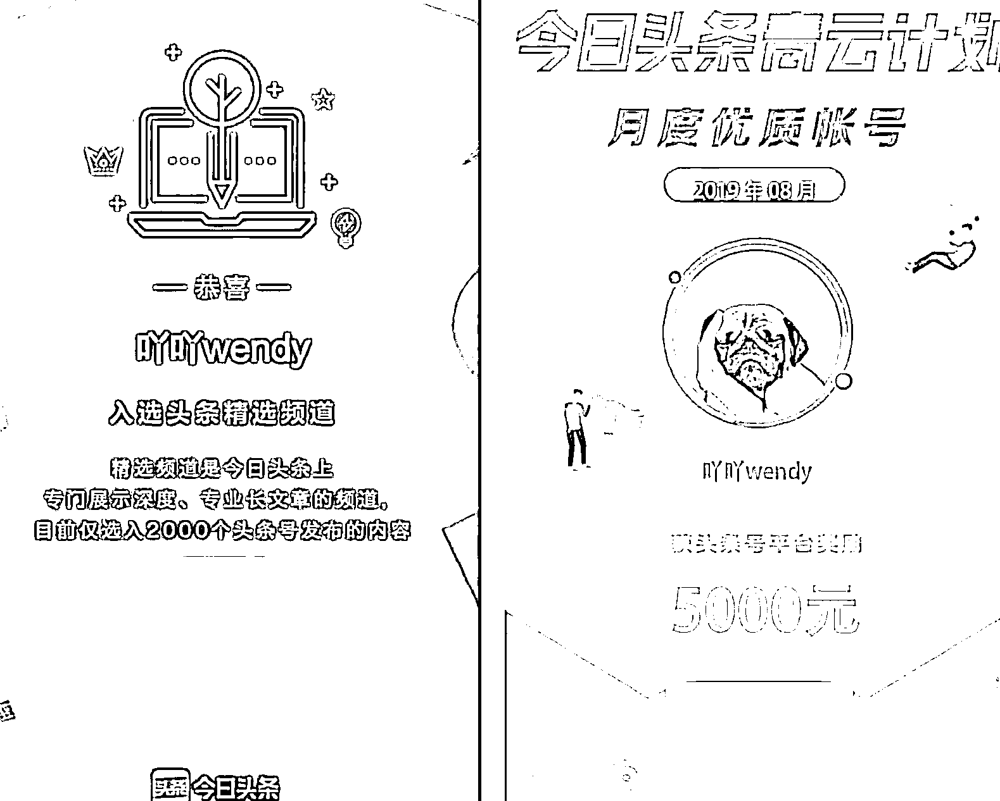

# 大专学历，下班后读书，副业变现 80W+

> 原文：[`www.yuque.com/for_lazy/zhoubao/dmu9gc9moge7rdp0`](https://www.yuque.com/for_lazy/zhoubao/dmu9gc9moge7rdp0)

## (37 赞)大专学历，下班后读书，副业变现 80W+

作者： 二丫吖

日期：2024-05-17

生财有术的各位老板，大家好吖，我是二丫，我也是生财航海家。

本职工作是在上海一家互联网公司当项目经理，也是一名宝妈，大专学历最终在上海买了房并落户。

我从 2018 年入局自媒体这行，最开始是给大 V 当写手，后面做助教，再后来做自己的账号，曾靠今日头条变现 20W+、2022 年开始做公众号，到现在靠私域合计变现了 80W+。

主业+副业组合收入，今年第一次达到年收 100 万，这对我来说是一个“历史性”的节点，这是我第一次在收入上年破百。

今年是我在生财有术社群的第三年，我自己是把生财当案例库来用的，我需要什么信息时，我就会根据关键词搜索，获取关键信息后，再做信息筛选然后执行。

这三年，我看得多，发得不多。

今天跟大家分享下「成年人，如何功利性读书，靠读书赚钱」的案例，希望能给大家带来一些启发。

我在互联网上的几个标签如下：

一、大专学历，本职工作年入 40W+，上海买房。

二、大专学历，找了个硕士老公，落到了上海户口。

三、靠副业做自媒体，合计变现 80W+。

我的这些成绩跟大 V 比起来，不算什么，但我确实起点太低了，我拿到这些成绩，需要解决：

以上，这些问题，都需要我持续学习，对自己纠偏。

我是湖南娄底人，我的原生家庭其实挺穷的。

我父母原本在娄底开出租车，后面尝试转型做生意，亏了。

之后，他们俩就去广东惠州做流水线工人，一个 2500 元/月、一个 3500 元/月。

我弟弟，也是大专学历，每年寒暑假总是在工厂做流水账、当兼职保安赚点零花钱。

我算是我们家的“探路人”。

**我通过持续不断地阅读、试错，找到互联网这么一条出路。**

2017 年，月入 1.5 万的我，将我大专毕业 1 年的弟弟带入行，手把手教。

现在，我弟弟年入 20 万，今年准备在上海买房了，右戳：《[我弟弟要在上海买房啦！](https://mp.weixin.qq.com/s/Cs4WwGu0dkMY97RrpDWk1g)》。

我的父母目前也在上海。

我母亲帮我带娃，我每月支付工资；我父亲，在上海开滴滴，月入八九千的样子。

我的家人，在遇到挫折、困难、重大决策时，一定会来问我的意见。

而，我的人生决策，他们给不了我有价值的意见，他们只有一句话：我们也不懂、你自己看着办。

**每个人的人生，都需要“灯塔”，否则就是抓瞎。**

**好在，我还算喜欢阅读，我看过的书，给了我指引，让我能获得现在的成绩。**

接下来，跟大家分享：**阅读在我生活的各个方面，起到的作用。**

讲实话，我的阅读量不大。

没有像小红书博主那样，一年几百本。

**我觉得，读书不是比量，比的是运用的能力。**

今年春节期间，我整理了下我的书柜。

一个格子能装下的已读书籍，帮我靠副业赚到了钱。

我在 2019 年，靠今日头条青云计划入自媒体这行，靠写书评变现。

**刚入行时，我不知道要写什么，那就写我读过的书吧。**

我能做到一本书写多篇书评：

不仅工具书能拿来写文章，小说也可以。

因为我持续写书评，持续中青云，于是，获得了平台优质账号的奖励。

就这样，一个写作小白，靠原本有那么一丢丢的阅读爱好，靠写书评，正式入行！

我后面其实已经完全掌握了书评中青云的写法，其实就是套公式，我想试试其他的写作手法，于是，我开始写平台征稿。

依旧是从我最拿手的书评进行切入，换个写法。

结果，我获得了 2 等奖，奖金 5000 元：

欧耶！

青云计划这个项目在 2020 年就已经取消了，现在没有了。

但，头条号后台的征文活动持续有，会实时更新不同的活动，每个活动都有结束期限，大家可以去看看，哪些适合写书评。

后面，我在解锁完用书评写征文这个技能后，正巧遇到青云计划项目取消，我当时赖以生存的项目不在了。

**但项目是死的，人是活的，对吧。**

那就转型，写文章卖书！

我先后写了 3 篇文章，卖了 3 本不同的书，分别是《乡土中国》、《达芬奇传》、《王蒙写给年轻人的中国智慧》。

这三本书，后面给我带来了总收益 3000+。

当时《乡土中国》并不是一本好卖的书，出版社备货少，结果因为我一篇 10W+的文章，卖断货了，出版社连忙补货。

这是在自媒体这行，读书带给我的实际收益。

我其实，并不是第一次参加这种读书类的社群，在我历史的经历中，有人会问：啊？像你这样这么功利性读书，还有意思嘛？

这个问题，请大家在微信读书上搜华杉版的《孙子兵法》，就是这本：

翻开第一页，作者就写了一句警示名言：

你如果只读书，不运用，做不到知行合一。

**那么，读书、学习跟你玩游戏、刷剧并没有区别，也是一种玩物丧志。**

希望大家，都能做到：**知行合一**。

靠读书变现，就我个人经验来看，是有个循序渐进的过程的。

**书，你需要去看，才知道这本书适不适合你，你是否喜欢。**

**事情，你得去干，你才知道这个工作是否适合自己。**

我靠着“有效阅读”这们“手艺”，先后在公域平台尝试了：单篇书评青云稿费变现、征文变现、写爆款文卖书变现。

我有点累了。

我从生娃后，就持续工作，因买房压力大，背后又没有人给我兜底，我只能一路往前冲。

2021 年，我 31 岁，这一年，我停掉了所有的副业，想让自己好好休息下。

副业，停了，本职工作还在。

读书这事，不仅作用于我的副业，也对我的本职工作起到了巨大的作用。

我在 2014 年揣着一张大专学历以及带了两千块来上海，第一份工作是月薪 3500 元的物流系统销售，我的业绩并不好。

2015 年，我先后读了两套小说，分别是《杜拉拉升职记》、《圈子圈套》（这部小说是我当时那家公司的老板推荐的）。

这两部小说都是讲职场的，看完后，我现学现用。

先在公司内部，用策略换岗，从销售换到实施工程师。

接着，以实施的身份熟悉公司系统后，跳槽。

正好赶上了那段时间的互联网高潮期，以月薪 1 万的薪水顺利跳槽至一家电商上市工作做系统需求分析师。

当时，这个岗位的需求分析师是需要懂一点基础的代码的，我完全 0 基础。

他看中我的沟通能力，他觉得代码这事可以学，但沟通需要天赋，我是业务岗，不是开发，只需要会基础的增删查改就行。

入职后，他掏钱，给我买了本 SQL 书，让我自学。

就这本。

我通过看书+请教同事，终于会了基础的增删查改。

9 个月后，我再次跳槽，以月薪 1.5 万入职一家新三板上市公司，当项目经理。

我没有当过项目经理。

但我因为身在这个行业，看到过别的项目经理是如何工作的，面试时，只需要把我的“所见”变成“面试专业语言”输出就行。

这个，随便去搜一些项目经理的相关书籍来看看就成。

比如，这本书，就很不错。

**我只要将这本书里讲的案例，替换成我实际在公司遇到的客户情况就行。**

概念、项目经理职责、遇到的问题及风险，其实是一样的。

**书上的语言，能将我们日常琐事进行归纳总结，用“专业话术”表达出来**，我只要把这个专业话术，运用在面试上。

面试官就会觉得：虽然，这人没有做过项目经理，但表达上、理解上、认知上跟项目经理这个岗位是匹配的。

于是，我顺利拿到这个岗位。

入职后，我知道自己经验不足，于是立马用公司的资源，报名考了 PMP 证书（项目管理证书），公司报销培训考试费用。

之后，我用一样的方法，跳槽、换岗、换行。

2021 年年底，我找到了一份离家三公里的工作，年薪 40W+。

**能有这个收入，跟我持续阅读、学习、实践息息相关。**

这几年，我的阅读书籍范围不断扩大：育儿、个人成长、心理学……

我已经很久不写书评了。

但是我看过的书，已经融入到了我的日常习惯和思考。

**我现在能做到将不同书籍上的信息融合实践后，得出我自己的思考，进而结合我个人的人生阅历，进行输出。**

写作 4 年，这样的输出的方式，是我最喜欢的一种。

于是，2022 年，我趁本职工作较为稳定的期间，搞起来了一个公众号。

这个公众号很少写书评，都是我自己的故事，但这些故事里融合了我这么多年读过的书、阅过的人、积累的经验…

这个号我做到现在，结合私域一起，今年的变现量很不错。

好啦，我的阅读经历就是这样，简单、朴素。

**可以说，如果我不阅读、不持续学习、不行动，那么，现在的我和我弟弟就是广东工厂里的流水线上的普通男工、女工。**

**赚不到什么钱，也看不到更大的世界。**

**是持续阅读，带我走到了今天，我是阅读的受益者，所以，今天我想跟大家分享，输入的重要性。**

自媒体行业这两年很火，大把的普通人在这行淘到了金，比如我就是其一。

我当年是高杠杆买房，手里只有 20 万存款，在上海买的房子，为了买这个房子我欠了两百多万。

而且，我原生家庭其实有点重男轻女，我请我妈帮我带娃，我每个月要给工资，我每个月给她 5 千块。

另外，我老公虽然是硕士，但因为我是大专+原生家庭也比较差，所以，我其实在雌竞这条路找不到家境好的男生，我能找到个硕士，已经很不错了，讲实话。

而我又是自己一个人在上海，没人给我撑腰的。

我老公家庭条件不好，我婆婆身体不好，每个月要给她 3500 的生活费，她属于生活不能自理，得保姆照顾。

现在我大姑子、小姑子+我们家，三个人平摊我婆婆的费用。

所以，我其实没得选，我只能往前冲，而且，每一步不能走错，走错了，我就很难翻身。

**也是因为这样，我自己是底层出身，我知道赚钱的不易，我知道行业有泡沫，尤其自媒体这行，一眼望去，人均年入百万，哈哈。**

我自己今年第一次达到百万营收，但明年能不能有这个收入，也不知道，只能说持续找机会吧~

大家都是成年人，我也希望大家能够冷静地知道一个事实：**自媒体这行确实是普通人翻身的一个好行业，可即便是自媒体这行，也没有空手套白狼这回事！**

**你要付出勤奋和时间精力。**

你得学会读、学会写，才能赚到钱。

我是个实在人，我知道，能做到我这样的人不多，我这一路走过来，当年跟我一起来上海的同事，有很多已经回老家了。

**但是我希望用我的案例告诉大家，只要你有目标、你能坚持，你不下牌桌，你就有机会赢！**

按照我的经验，阅读能力影响了理解能力，理解能力影响了赚钱能力。

把书读活，才能让人生持续生财有术！

【往期内容】

1）[小红书 1 条笔记变现 4000+，聊聊我的爆款创作思路+引流变现全流程](https://t.zsxq.com/SUUhx)

2）[花 1800/月招小助理，副业做自媒体赚到 40 万](https://t.zsxq.com/tNXpB)

3）[内容更新频率，日更≠能做成一个账号](https://t.zsxq.com/135Hvhqii)

4）[做自媒体要先确定自己的优势和变现模式](https://t.zsxq.com/13QbjtfMd)

* * *

评论区：

咿呀花花 : 看完了，真的很优秀，尤其是对于读书的理解，能够把书用到自己身上才是有用的，我也时常提醒自己，要知行合一
二丫吖 : 共勉～
小怪兽、 : 看完了，萃取-抽象-转化-凝练，真的是知行合一，把书里的知识运用到自己身上，而不是孤零零的在脑海中有个印象
感谢这么有力量的表达！[爱心]
二丫吖 : [爱心]
帅彬 : 真的很棒
敏杰 : 挺励志，知行合一，读书是为了更好的实践
风萧萧兮 : 太厉害了！[强]

* * *