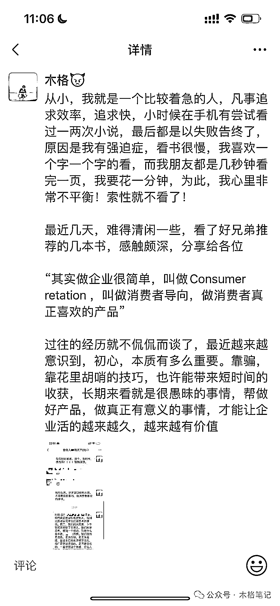
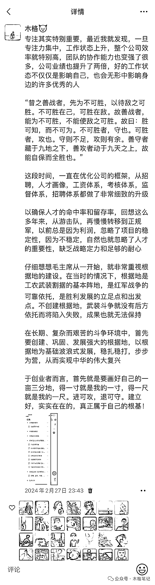

# 践行长期主义，实现百万营收我的成长之路

> 原文：[`www.yuque.com/for_lazy/zhoubao/wd7f5g093em6vr9h`](https://www.yuque.com/for_lazy/zhoubao/wd7f5g093em6vr9h)

## (33 赞)践行长期主义，实现百万营收我的成长之路

作者： 木格

日期：2024-05-15

**“这是我过去这一年来学习复盘的并且拿到结果的文章，可以理解为"木格"的成长之路”**

**坚持做困难之事，才能成为优秀的人，践行长期主义，实现长期价值**

这几天时间，我读了几本书，复盘了我过去一整年的今日份思考，“我发现许多我以为理解的事情，事实上我并不理解，我不理解的东西，现在理解的很深刻”

什么是价值，我想是经历，这段时间在做去年一整年的复盘，同时明确清晰的规划了未来的战略方向

我们常说，小事做好，大事自然就成了。如何帮小事做好呢，需要制定长期的目标，有清晰的规划，并且在过程中不断的去制定战术，迭代战术，把握好每个战略点，帮 0~60 分的事情做好

一个月前，我有点迷茫和焦虑，也许是过年那段时间闲太久了，我以前经常进入这种懵逼状态，经过几天调整，工作效率和心流就回来了，现在我似乎找到了解决办法，分享给各位

那天晚上很晚，我开着车，来到江边，走到了一处台阶，一个人戴着耳机坐在地上，听着熟悉的音乐，静静的发呆，心里想着自己刚创业那会那股劲去哪儿了呢？那股不服输的精神，一定要做出一番事业的决心，未来一定要出人头地

现在似乎没有最开始创业那么拼了，很直接的原因是条件变好了许多，慢慢的我想通了，我没有非常清晰的目标和规划，我的未来在哪里？怎么去做？什么时候做？找谁做？一边想着未来的方向，一边，我也想着刚创业那会的感觉和初心

**“接下来的一段时间，我明确了未来的战略方向，搭建了人才框架识别人才画像和迭代了各个岗位的培训模块，同时注入一定的企业文化，从上到下，大家都有了清晰的方向和目标，工作效率和目标感更强了”**

在这段时间里，我读了好几本书，比如成为乔布斯，段永平，李想的创业史等，有些看不太懂的，我便多读几遍，让我能更深刻的理解

公司文化，创新，招聘，人才画像，打造伟大的产品，消费者导向，说实话这些观点，我大多都停留在字面思想，其实我并不理解里面深刻的奥义

几天前，我发布了一条朋友圈，说我从小其实就是一个非常不爱看书的人，看一本很长的书，对我来说确实是个挑战，大家一两天看完的书，我得花一两周，我就喜欢一个字一个字的读，生怕漏了几个字，但是当我帮这些事情完成之后，我发现我好像慢慢喜欢上了阅读

以史为鉴，可知兴替，创业者一定不能陷入在自我意识里，这带来的后果就是自信和不听劝，在我之前创业的过程中，我犯过很多类似的错误，这在企业的经营过程中一定是非常不利的

在我完成这些具有挑战性的事情后，我发现许多事情是有规律的，虽然我看书看的比较慢，但是我重点知识，理解的非常深刻。在学习层面我汲取了很多新的知识，在空闲的时候，我可以不用花很多时间在其他无效的事情上面，我也在此过程中锻炼了我的耐心

**什么才是真正牛逼的人，"及时发现错误"，"并且做出改正"**

这几天复盘今日份思考的过程中，我发现我的很多行为和潜意识在不断的改变，这里包括我平时空闲时写的文章，写出来，并且复盘，真的会无意识的影响我

**我发现我这一两年时间，改变了两个缺点，也放大了我的优点，重点说下我之前的缺点，着急做选择+缺乏足够的耐心**

我以前做选择很快，选择一个项目的维度很肤浅，连最基本的适不适合自己都没考虑，只是单纯的看能赚多少钱，任何事情总是喜欢以钱为导向，没去思考未来，到最后的结果就是钱没赚到，又浪费了时间，有些时候运气好也会赚一些钱，但是并没有没做很久

时至今日，在我做选择的时候，我会多花一周甚至更长的时间去做思考，同时在确定选择之前，我会请教在这个行业身边做的最好的朋友去问一问，在读书和梳理战略方向的时候，也给我了足够的耐心

前段时间我和大家开玩笑说，现在的项目，做了一年半，马上两年了，我第一次这么有耐心

现在的我知道“没有完美的战术，只有完美的战略”，战术出错是很正常的事情，战略方向没问题就行，胜兵先胜而后求战，，我并不需要场场对局都获胜，但是我在战斗之前，一定会让自己立于不败之地，只要是围绕长期目标走的，那都是好事情，也就是**"阳谋"**

**迎难而上，做确定性的事情，做困难的事情**

不需要过分追求完美，先帮小事情做好再说，我们不会要求任何一件事情初期就要做到 100 分，做 60 分就是胜利，任何项目我们也不会再只以钱为导向，只围绕我们如何帮当下的事情做好从而实现未来的战略目标

什么是确定性的事情，在生活当中，运动，看书是确定有益的事情，在工作当中，从运营层面，选品，供应链，培训，从公司经营层面谈，搭建好的组织架构，实现自我迭代，灌输公司文化，做一流的创业者，这些都是确定性的事情

帮这些事情做到极致，就已经超过 95%的公司了，以前我无法理解战略的重要性，无法理解远大目标的重要性，因为我从来没想过三五年以后的事情，实际上大多数公司和项目，在你一开始做的时候，你的初心和战略卡位就已经决定你的未来了，在初期，一定要帮确定性的事情做到极致，搭建好自己的基本盘，做一劳永逸的动作

****

**学会错位竞争，拉开差距**

瞄高打低，如果你对标的只是和你一样的公司，两三年后，你会发现你们并没有拉开很大的差距，和行业 TOP 做竞争对象，两三年后你会发现你的同行已经不见了，你想超越飞机，你就得去造火箭

什么是困难的事情，这个挺有意思，我思考思考和大家娓娓道来

大家都知道，我们是做大健康的，最开始也就是从美团入手，从电商到器械到大药房到开品等，前段时间我和我的同事们开会时提出了几个问题

1.  假设我们公司倒闭了接下来我们要去做什么

2.  接下来做什么方向，能保证我们一定能长期生存下去

3.  如何帮现在的事情做到更好，为了公司的未来

4.  **我告诉我的同事们，回想我们这两年**

5.  假设我只做了电商，没有转型器械，那我会死掉

6.  假设我在器械利润很高的时候，我开了很多家，我也会死掉

7.  假设我做项目的过程中，选择错了人，我还是会死掉

8.  假设我们公司没有好的组织架构，我依然会死掉

9.  假设我没提高门槛，去做大药房，突破难关去做开品。我必死无疑

10.  不了解的朋友可以看看以前我复盘的文章，详情请移步：[`articles.zsxq.com/id_kd7gcjm1evru.html`](https://articles.zsxq.com/id_kd7gcjm1evru.html)

这是实实在在发生在我身上的故事，我并没有什么过人之处，这些年我踩了不少坑，如文章开头所说，经历很重要，复盘很重要，为什么我们能突破各个难关生存到现在，营业额和利润都实现了稳定增长，突破百万

我之前做天猫开了 80 多家，一个月利润几百万，最早期入场抖音小店，短短几个月时间就突破了上千万营收，这些都是实打实的教训

转瞬即逝，过眼云烟，这些项目，我都没有做很久，只是赚到了“一些小钱”长期来看，我亏大了！我不可能再去犯原先的错误了。除非我真的是一个傻逼，现在我们的战略定力，由上至下，由下往上都是非常强的！

为什么无比相信一些事情，其实这来自于我的复盘和写文章，公众号是记录一段时间的成长，在记录这些的过程当中，自然也深深的影响了我的决策

我明白，衡量一个项目是否有价值，绝对不是当下赚了多少钱，而是如何长期可持续的提供价值，帮产品的细节做的足够好，消费者导向，活得久，钱自然就来了

迎难而上，迎接挑战，接受痛苦，像傻逼一样的坚持

这个世界运行是有规律的，大家都在寻找那个平衡点，商业的逻辑其实很简单，消费者导向

**为一群人持续提供高价值的产品！做差异化的服务，做同行做不到的事情，长期坚持下来，自然就游戏胜出了，说的容易做的难，希望各位真正能铭记于心**

**木格笔记**

**2024.05.15**

* * *

评论区：

暂无评论

* * *