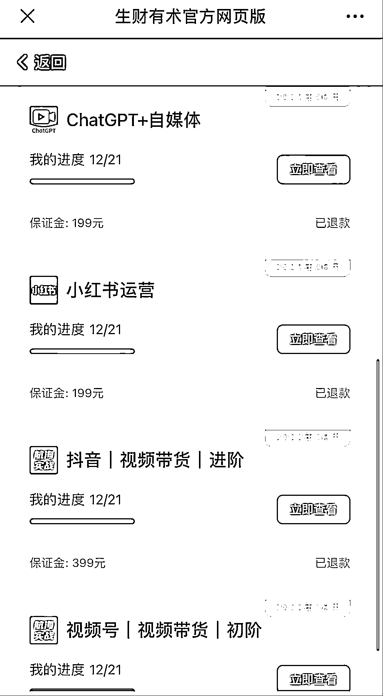
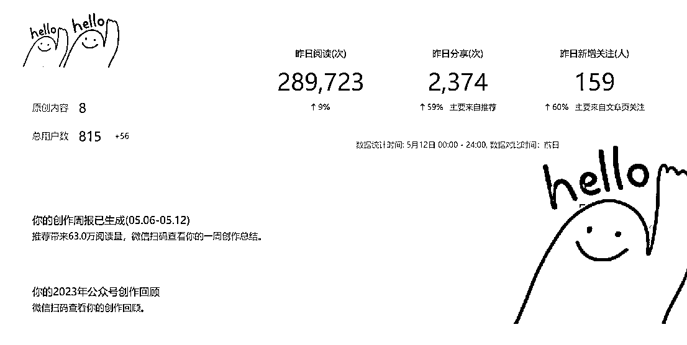
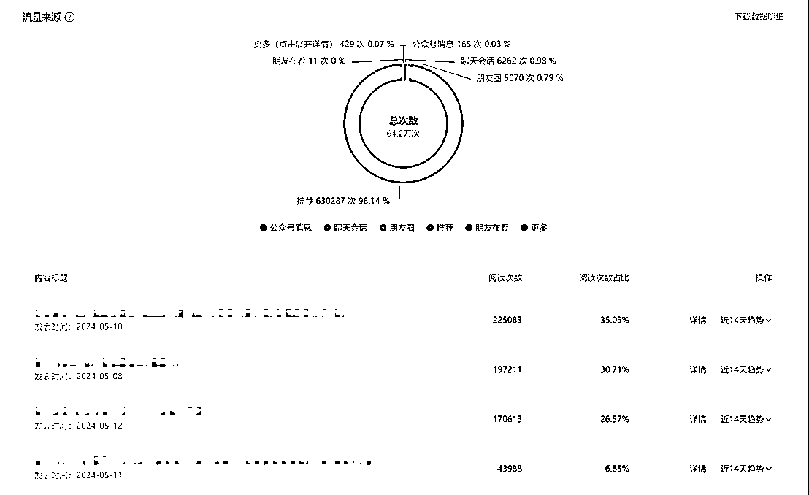
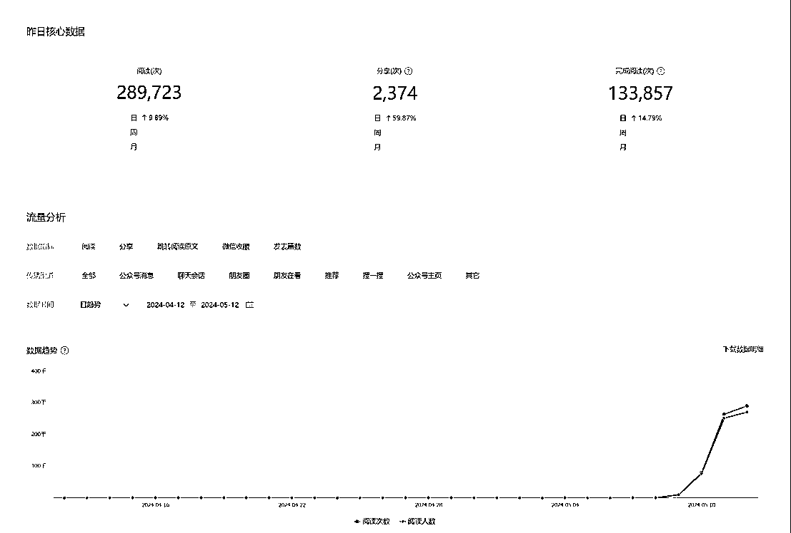
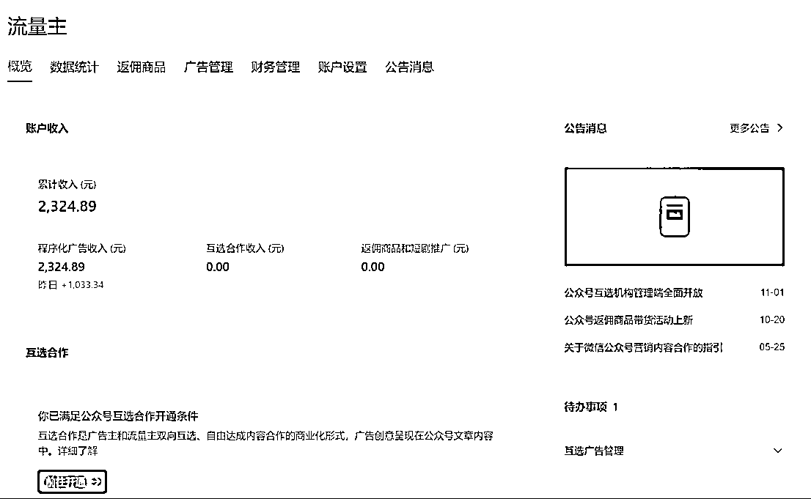
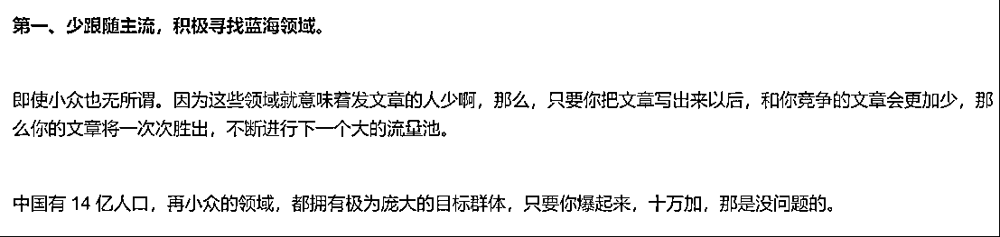
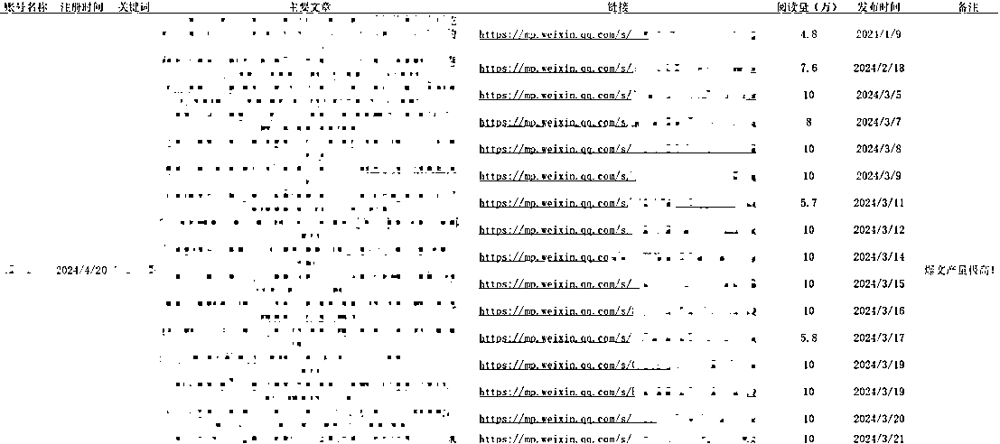

# 新人做公众号 5 天斩获 64.2w 阅读，我做对了哪些事？

> 原文：[`www.yuque.com/for_lazy/zhoubao/iq1ydo9br9e9iwzu`](https://www.yuque.com/for_lazy/zhoubao/iq1ydo9br9e9iwzu)

## (140 赞)新人做公众号 5 天斩获 64.2w 阅读，我做对了哪些事？

作者： 一 ge 不小心

日期：2024-05-14

      抱歉，之前有些疏漏导致帖子没了，晚上忙完重新发一遍。

      大家好，我是一 ge 不小心，虽然是很老的圈友，但其实很多圈友对我比较陌生，因为我一直不是很喜欢发言，都是充当“帖子阅读者”的角色，今年立了发帖子的 flag，所以慢慢改进吧，希望未来认识更多的圈友。

      文章稍有点标题党，可能会让圈友们误以为我是生财有术新人，阅读本文之前做一下明确：新人这个头衔仅指公众号爆文这个项目曾经没有做过或做的成绩可以忽略不计（2023 年参加过 ChatGPT+自媒体航海，写了很多，但没拿到什么结果）。

     说回公众号爆文的项目，因为我个人平时比较爱做点总结写写东西，虽然没有正式做过自媒体，但写作的能力自认为其实还可以。从生财有术接触到公众号爆文这个项目的时候，我一直是很看好，并且觉得如果将来能做好将是一个令人舒服的工作，不管是个人 IP 变现还是靠流量主养活自己。因此在 2023 年 6 月，我也就跟公众号爆文项目结了缘，在报名了一直做的电商相关航海之外，我还报名了 ChatGPT+自媒体航海，不出意外，ChatGPT 和自媒体对于我来说，都是新东西，每天忙项目时间少，学习学到焦虑，虽然航海我勉强跟了一路，但跟很多新人一样，焦虑中开始焦虑中结束，并未拿到什么结果，因为我当时的心思全部还是在电商上，那时候主要在带抖音团队，做抖音团队的建设，每天还要面试不少人。不过虽然航海没拿到结果，我也没有灰心，还是在留意这个项目的趋势，学习各个圈友的方法论。

* * *

* * *

      后来公众号爆文项目一放下也就就到了今年五一了，在放假的这几天，在家里没什么事也挺无聊的，一边重读《孙子兵法》，一边刷着生财有术的精华内容和航海的手册，想着反正闲着也是闲着，来都来了，琢磨了下想再尝试一下公众号爆文这个项目。特地在看精华之余重点把公众号爆文航海的航海手册又看了一遍，看的非常细心，还做了不少笔记。说来这次也有意思，突然就有了一些不一样的感觉，没错，真的感觉完全不一样，我仿佛看到了我熟悉的电商领域玩法跟公众号爆文产生了某种联系，甚至是共振。

      我居然能用电商玩法来重新思考公众号爆文这个项目，此刻好像脑子里各种工具都能跟公众号爆文产生联系，抖音玩法、小红书打粉、淘宝电商等等，这些看着相差甚远的技能，同时让我在看公众号爆文航海手册的时候，有一种通透的感觉，一个门外汉突然获得了某种了不得的秘籍般。

      因此，说干就干，现在不干，未来很难再干了！在看了航海手册之后，拿着手机和电脑就是一顿操作。

      不过在写下去之前，由于怕大家看着无聊，先放几张图跟大家汇报一下这 5 天的成绩，总的拿到了 64.2 万的阅读量，这五天几乎每天都有近 10 万或 10 万+的文章出现：

* * *

* * *

* * *

* * *

* * *

      这份成绩单其实让我很吃惊，甚至可以说完全出乎我的意料，导致我一直在想，我只是想再试试这个项目，怎么突然从航海学渣变成了高分学霸？但既然成绩已经被我收入囊中，那自然不能稀里糊涂的就放过这个我自己的“异常值”，因此，来生财有术给大家好好侃一下，这 5 天，我究竟做对了哪些事？是否能有方法论给其他新人借鉴？

**      首先，我觉得要感谢我做电商一直拥有的蓝海思维，**做过电商的朋友应该更能感同身受，国内的电商环境现在很不好，太卷了，你想一直赢下去就必须要一直拥有做出一定差异化的能力，去主动降低竞争的烈度，当然，除非你有“钞能力”，充钱解决所有烦恼！因此这些年，我一直在避免与大商家竞争，我自己体量太小了，能活下去尚且不易。

      这也与我五一看的《孙子兵法》的通篇思想不谋而合，能不战就不战。大家可以体会一下《孙子兵法·谋攻篇》的内容：

> **      铭记直接竞争，是不得已而为之！**所以在这次阅读航海手册的时候，我一直在想，航海手册里列的内容能拿到结果能赚到钱肯定是的，但大家都在看，那竞争肯定也会比较大，对于我一个项目新人来说，可能还是很难拿到结果，我不想重走失败的老路，那有没有办法可以避免这种看得到的竞争？
> 
>       一定及肯定有！后来我发现航海手册其实也提了一下蓝海思维，蓝海思维比较简单，不做赘述，大家可以看一下手册这里：
> 
> 
> 
> * * *
> 
>       有了蓝海思维就行了吗，未必，你要会用，理论终究是理论，理论不能让你打赢战争，因此，结合蓝海思维，我在想，怎么找蓝海呢？教练们显然也遇到过这个问题，所以在航海手册又找到了方法，建议航海手册里**2.1.1 怎么选赛道**这一节新人可以进行多次阅读。
> 
> **以下则是我的操作：**
> 
>       筛选我可能想写的方向，然后，去搜，怎么搜？比如职场，列出几个关键词，比如：失业、降薪、裁员、晋升等等，一个个去搜，搜到 10W+的爆文，把它标题里的关键词筛选出来继续搜，把职场这个大的赛道下面的子赛道搜的越多越好，看文章的同时去看账号的注册时间和发文数量，如果 10W+阅读量，还是发文少的新账号，那这个“异常值”可能就是机会，进行记录，并标注子赛道，切记不能标个职场完事，要写职场+XXX，比如职场+找工作+国企、职场+八卦+赚钱，分类越清晰越能找到自己想做且能做的方向，从小赛道捏软柿子开始。
> 
>       其实每个赛道下还有很多方向，别看不上这些小赛道，有些做的好的人靠一个小赛道天天 10 万+，找对标账号尽量找最近的注册的新号，发的文章不多越少越好，但需要有 10 万+的文章，我们主要去对标他们 10 万+的文章就行！
> 
> * * *
> 
> 
> 
> * * *
> 
> **      其次是，拿出拼刺刀的铁血思维**，无论你是否真的选择到了蓝海项目，都会有竞争，无非是竞争大小和竞争烈度，蓝海思维结合《孙子兵法》就像你已经在谋、交上做好了功课，但商业世界不像真正的战争，别人不可能说看你做的好了就把好的方向完全让给你了，因此要做好伐兵、攻城的准备，这里我要提一下曾国藩的“结硬寨、打呆仗”理论，曾国藩认为面对战争，只有做好充分准备，步步为营才是正常的取胜逻辑，换到做项目，对于操作者来说，一定要放弃幻想，不能能一蹴而就，要撸起袖子就是干！
> 
>      我在找到一些方向之后，并使用表格将他们全部做了记录，把文章和文章链接、阅读量等关键信息全部做了记录，并注意对比，找到真正适合我去捏的软柿子，同时数据足够多的时候也能交叉验证我的判断：是不是真的蓝海，或者是假蓝海。有些时候可以通过拙劣的文章和并不匹配的 10W+判断蓝海与否，但有些时候需要几个账号一起看，如果某一个赛道文章都挺拙劣的，虽然不是 10 万+但大部分都有小几万阅读那这赛道也能干！以下是我梳理的对标账号和爆文的表格，大家只用看表头和逻辑：
> 
> * * *
> 
> 
> 
> * * *
> 
>       这个环节我花了大量的时间，甚至是我做这个项目的主要时间消耗地，我在不断的筛选赛道的同时，不断通过记录的爆文去培养我对爆文的敏感度，这个赛道哪种文章更容易爆我会更有把握，全部下来短短几天时间梳理了一千多篇爆文，并把 5 万阅读以上的文章进行了标注，同样是为了方便我进行对比分析。这个步骤是我觉得无法避免且对于我很关键的点，很费时间和精力，但能决定项目的成败，做项目，就必须摆正态度，以你能做到的万全之策面对竞争对手。
> 
>       选择大于努力啊！
> 
> **      放弃想法，像个婴儿学语言般机械去重复，**这一步也是我执行的过程中不断提醒自己的点，因为我并不是公众号或者自媒体大神，网感太差了，纯粹门外汉我还是很虚心的向对标账号学习的。先说一个反例，我在第一篇文章爆了之后，我就跟我一个朋友说，让他用我的方法论再去尝试一下，因为之前他做过一段时间，期间也有过几次八九万的阅读，所以这次我希望带他把号一鼓作气做起来，但在教他的时候，他的动作一直在变形，爆文的标题，我说只能简单改动，不可改动过多，除非你觉得自己比他强，结果他的标题完全靠自己来写，内容上更不用说，结构和立意一塌糊涂，完全看不出来做了对标。
> 
>       这也是我想跟圈友分享的点，前期花了大量时间做了“调研”，战略已经定好了，就不要有太多的想法，质疑和想法过多会让你执行动作产生漂移。我们要像婴儿学语言一样先去机械重复，把你选中“老师”的每个动作都去机械重复！但不要去完全抄，因为会违规，你尽量做到一样，结构、标题、立意等，但不是抄，这个就需要大家去做好度，能力强的做好优化，能力弱一点的让 ChatGPT 帮你写一写，从**文章的结构、立意及内容表述上**，做到高仿，甚至复刻！不为什么，一个刚做的新人，咋能知道为什么，还没入门就要放弃脑子，机械重复！
> 
> **      不断总结，找到不足，以量变换质变**。刚开始写的第一天我的数据并不是很好，所以在看到数据反馈之后，我又将我的文章与对标的文章放在一起进行逐段逐句的对比，多次修改，并不断问自己为什么他能拿到 10 万+，但我发相似的文章却只能拿到 3000？不是爆款再发都能是爆款吗？因此，我不断调整自己的动作，多练多对比，以及在后面两天的文章中，我写过多版，进行过多次修改，在对比多次之后，我有些时候感觉我的文章甚至比对标账号更好了，这时候，我再去发表，然后等待系统的开奖，后续几乎每天都能写出爆款文章，结果也确实还算满意，5 天我写出了 3 篇 10 万+，5 月 12 日更是单天获得近 29 万的阅读量！
> 
>       说了这么多，结合我自己在公众号爆文的这次尝试和拿到的结果，我帮大家做个总结，我究竟做对了哪些事：
> 
> **第一，蓝海思维**，尽量去选一个可能竞争更小的赛道，做事不要粗线条，职场、八卦是一个很大的赛道，你可以做职场+和八卦+去避免竞争，如果还是觉得竞争大可以职场+A+B，总能找到竞争小的地方。
> 
> **第二，结硬寨打呆仗**，做好你能做到的万全之策，把工作做到位，放弃幻想，做项目不是做了就行，要做好，要做到更好，量变引起质变，如果你还没引起质变，审视一下方向，如果方向没错，那说明量还没有到。
> 
> **第三，机械重复，婴儿学说话般**，别人说什么你说什么，你找的“教练”做什么，你就做什么，不要有自己的想法，不然动作会变形，失之毫厘差之千里，先模仿再优化再超越。
> 
> **第四，学会总结和复盘**，没做好的地方，与自己预期有差距的地方，去找原因，多看多想，方向没错但没成绩肯定是哪里做的不够，既然不够就重走“长征路”，与对标账号去对比扣细节。
> 
>       以上是我这次在公众号爆文项目中能拿到结果的重要原因，我觉得我这次能拿到结果还有一个前提是我做过很多项目，脑子里解决问题的工具比较多，因此，对于更新人的圈友来说，建议还是多看看帖子，工具越多，解决遇到问题的可能性会更大！
> 
> * * *
> 
> 评论区：
> 
> 🥝 : 很有收获
> 小吴姐 : 在您这篇分享里，我真正见识了“大量大量的输入—融合—输出” 巨大能量！
> Rio : 认真复盘 值得学习
> 默默呀~~ : 看了你的文章醍醐灌顶了[强]
> 🥥椰子 : 想问一下对标文章的 Excel 表格是自己整理的还是用了什么爬虫工具呀
> 宇欣 : 调研的环节很有启发，可操作性极强[抱拳][抱拳][抱拳]
> 一 ge 不小心 : 我没用爬虫，自己整理，这个环节在我看来是需要自己花时间的地方，建议还是纯人工整理，毕竟整理过程也会产生很多之前没有且很好的思考。
> 🥥椰子 : 好的，自己整理也是一个思考的过程，谢谢分享！！[玫瑰]
> 
> 
> 
> * * *