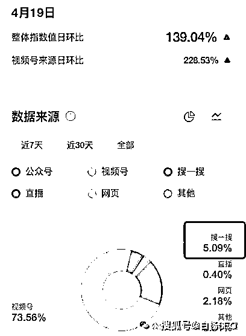

# 白杨 SEO：微信小程序排名怎么做？小程序 SEO 关键词排名因素分享，供参考

> 原文：[`www.yuque.com/for_lazy/zhoubao/whcolfgpq061iuvg`](https://www.yuque.com/for_lazy/zhoubao/whcolfgpq061iuvg)

## (18 赞)白杨 SEO：微信小程序排名怎么做？小程序 SEO 关键词排名因素分享，供参考

作者： 白杨 SEO

日期：2024-05-15

前言：这是白杨 SEO 公号原创第 529 篇。为什么想到再来写写微信小程序 SEO 这个？因为最近有很多朋友问我微信小程序怎么做排名，所以写一下，如有帮助或启发，可以分享给需要的朋友。

文章大纲：

1、微信小程序 SEO 是什么意思？

2、微信小程序搜索排名规则有哪些？

3、微信小程序关键词排名怎么做上去？

4、新做的微信小程序怎么推广？

**微信小程序 SEO 是什么意思？**

SEO 是指搜索引擎优化简称，微信小程序 SEO 是指微信小程序搜索引擎优化，再白话一点就是指：优化用户在微信下拉用关键词搜小程序或在微信搜一搜里用关键词搜小程序的小微序排名靠前。

从微信下拉搜索截图，

从微信搜一搜搜索截图，

**微信小程序搜索排名规则有哪些？**

我们得先知道小程序排序规则吧，供参考：

1、上线时间（占比 5%） 微信小程序的上线时间，上线时间越早，排名越靠前 小程序关键词占位非常重要，越早发布竞争越小，不过现在已经是白热化的阶段了，好关键字基本名字抢注完了。

2、小程序加载速度（占比 5%） 前面有说到，小程序也是代码写出来的，谁的代码简洁，加载速度快。

3、关键字频次（10%）：描述中完全匹配出现关键词次数越多，排名越靠前，有点像早期 SEO 关键词堆积了。

4、标题（35%）：标题中关键词出现 1 次，且整体标题的字数越短，排名越靠前。这也是我们 SEO 中说的的相关性

5、使用量（占比 45%） 微信小程序用户使用数量越多，排名越靠前白杨 seo，公众号：白杨 SEO 优化教程白杨：浅谈小程序 SEO

上面这 5 个因素是我 2018 年写的，我看市面上好多关于小程序排名规则什么的文章基本都引用了我那篇，小程序 SEO 这个词也有可能是我最先写。

不过过去快六年了，小程序搜索排名还是有一些变化，同时也从给别的企业或个人优化建议和实战经验再更新一下。最新小程序排名因素重要度从高到低如下，依旧仅供参考哈。

1、小程序整体使用量（也就是小程序总用户量）预计占比 50%左右；

2、小程序的用户行为（比如新用户搜索点击，停留时间，评价，小程序活跃度等）预计占比 30%左右；

3、小程序的相关性命中率（即小程序名字/描述/服务等包含关键词匹配度）预计占比 15%左右；

4、小程序上线时间，加载速度，小程序认证等等预计占比 5%左右。

当然，比如小程序掉排名也会有诸如行业，政策，作弊等等因素，这个不在小程序排名规则里来讲哈。

**微信小程序关键词排名怎么做上去？**

上面我们讲了微信小程序排名规则影响因素占比大概，具体怎么做上去，我们可以对比来做，白杨 SEO 的做法也是参考哈。

常规微信小程序关键词排名优化方法 5 条：

1、做好微信小程序基础完善

这里一是指小程序上线前的代码，头像等，更多是指一些代码端优化，

具体如下，来自微信官方文档建议：

小程序里跳转的页面 (url) 可被直接打开

小程序页面内的跳转 url 是我们爬虫发现页面的重要来源，且搜索引擎召回的结果页面 (url) 是必须能直接打开，不依赖上下文状态的。特别的：建议页面所需的参数都包含在 url。

页面跳转优先采用 navigator 组件

小程序提供了两种页面路由方式：

a. navigator 组件

b. 路由 API，包括 navigateTo / redirectTo / switchTab / navigateBack / reLaunch 建议使用 navigator 组件，若不得不使用 API，可在爬虫访问时屏蔽针对点击设置的时间锁或变量锁。

清晰简洁的页面参数

结构清晰、简洁、参数有含义的 querystring 对抓取以及后续的分析都有很大帮助，但是将 JSON 数据作为参数的方式是比较糟糕的实现。

不收录 web-view 中的任何内容

我们暂时做不到这一点，长期来看，我们可能也做不到。

设置一个清晰的标题和页面缩略图

页面标题和缩略图对于我们理解页面和提高曝光转化有重要的作用。 通过 wx.setNavigationBarTitle 或自定义转发内容 onShareAppMessage 对页面的标题和缩略图设置，另外也为 video、audio 组件补齐 poster / poster-for-crawler 属性。

2、微信小程序账号、描述、服务名字关键词优化布局

现在微信小程序能优化关键词的地方只有账号名称（不是简称那里）30 个字符（15 个汉字）和描述 120 个字符（60 个汉字）以及小程序里面功能页面标题上可以布局如图：

你可能会问，小程序账号名字是不是越长越好（布局关键词多），又或者是越短越好（完全匹配）？其实这两者都不对，因为小程序名字的相关性在我们上面规则说了，它占比并不是最大的。

所以白杨 SEO 建议，如果你是新的小程序应该考虑的是完全匹配更好，但也不能做流量很大的词。如果你是老的小程序，完全可以考虑不仅是账号，你的描述同样可以用起来。

3、小程序进行认证

这里是指小程序要做认证，现在微信小程序还要求备案之类。同等条件下企业主体权重要大于个人主体，但如果一个在使用量绝对大的上面，个人主体排名也可能排前面。

4、小程序用户行为数据优化

这里小程序用户行为数据优化，简单理解就是用正常的小程序用户行业去做一些关键词排名优化。

白杨 SEO 说得再白一点就是，搜索点击，搜索点击使用，搜索点击使用到评价（好评）等这一切都是可以做的。

有人会想，如果大词是不是要很大的量。初步这么想没错，但是你要了解真正的词在微信搜索里真正的每天搜索量有多少呢？你也可以了解同行自然的数据是多少呢？

如何判断微信搜索里面关键词用户的真实搜索量，白杨 SEO 的建议是腾讯广告后台投搜一搜广告+微信指数里搜一搜占比结合起来即可判断。

比如【SEO】这个词微信指数 94 万多，搜一搜占比 5.09%，大约 5 万。

5、小程序整体用户量提升

小程序整体用户量的提升也有助于我们小程序关键词排名。

如何提高我们的小程序总体用户量呢？主要有三个方法：

1）投小程序广告（公众号或者朋友圈广告）带来用户；

2）mai 小程序用户（这种很多一些数据平台在做），不过这种最大风险在于用户本身机器 fen 之类，严重也构成影响微信正常生态，白杨 SEO 不建议。

3）做小程序自然流量全网推广。

新做的微信小程序怎么推广？

新做的或者原有的微信小程序怎么做推广，四年多前我写了 16 种微信小程序推广方法，如果你恰好需要推广小程序，可以看那篇：[白杨 SEO：一文告诉你 16 条微信小程序推广渠道大全，实操举例【干货】](http://mp.weixin.qq.com/s?__biz=MzU2NTQzMzA4Nw==&mid=2247484618&idx=1&sn=9dc99af2d4b0f6f20afcc796f70c64dc&chksm=fcba835acbcd0a4cf54913ec881e658e4f2f1034dd174c24d6be225d0a3f64023bd742c603f0&scene=21#wechat_redirect)

当然你可能会问，这都过去四五年了，里面的推广方法现在能用吗？我想跟你说的是，即使再过四五年，有些方法还是能用，大同小异。如果你现在有更好的微信小程序推广方法可以留言，这样可以帮助更多需要的朋友。

**作者介绍：**

白杨 SEO，专注 SEO 十年，全网 SEO 流量实战派，对互联网精准流量有深入研究。全网同名：白杨 SEO

**相关推荐：**

[白杨 SEO：8000 字从 0-1 拆解微信公众号排名原理，小白也能看懂！](http://mp.weixin.qq.com/s?__biz=MzU2NTQzMzA4Nw==&mid=2247488812&idx=1&sn=f1b77bf5510aaa829ddbe9eedecb15d4&chksm=fcba92bccbcd1baa13fe8e086cd9997c7d40d04c1d8161cf3c110d784066fb41c4da020cf105&scene=21#wechat_redirect)

* * *

评论区：

猫哥 : 感谢分享，学到了。
白杨 SEO : 不谢，有用或者启发就好[呲牙]

* * *