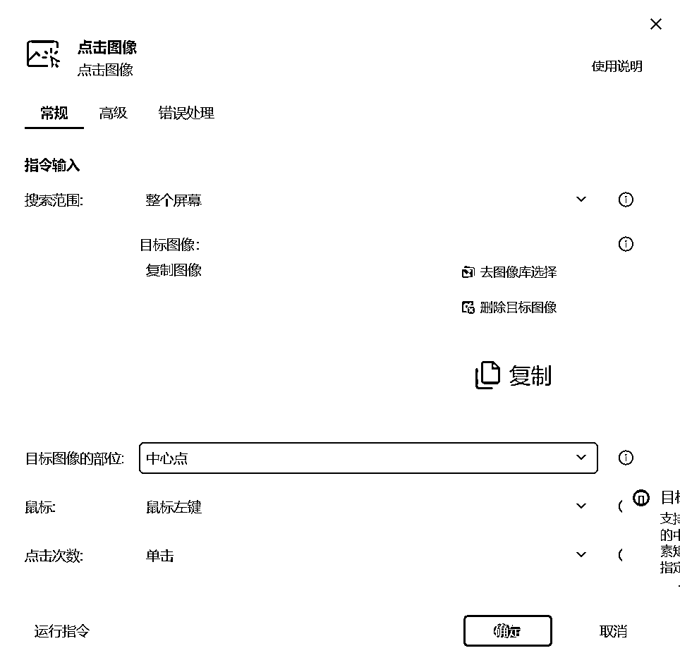

# 小红书全自动写文发文机器人-爆文仿写笔记（二） -附提示词

> 原文：[`www.yuque.com/for_lazy/zhoubao/obmqtgl2vsnge6ig`](https://www.yuque.com/for_lazy/zhoubao/obmqtgl2vsnge6ig)

## (69 赞)小红书全自动写文发文机器人-爆文仿写笔记（二） -附提示词

作者： 码农飞哥|RPA 定制

日期：2024-05-13

大家好，我是码农飞哥。上市公司资深软件开发，CSDN 博客专家，擅长各类 RPA 机器人的开发，以及毕业设计的定制开发。

## **业务场景：**

上一篇文章介绍了如何让机器人自动搜索爆款素材。那么素材搜集好之后，同样可以让机器人根据已有的素材进行仿写以生成新的图文笔记。

仿写的过程如下图所示：

## **操作流程：**

仿写过程其实就是让大模型根据已有的标题和文案生成新的标题和文案。这里最核心的就是提示词的使用，以及选用的大模型。经过测试这里选用 Kimi 作为目标大模型。

## **影刀 RPA 程序制作步骤**

**演示视频**

暂时无法在飞书文档外展示此内容

**完整步骤：**

仿写标题和仿写文案过程是一样的，这里介绍仿写标题的过程。

1、**打开网页**

使用打开网页指令 在 Chrome 浏览器上打开 Kimi 的首页，这里需要注意的是使用 Kimi 需要**先登录。**

### **2.**  填写提示词

我这边使用的提示词是：

作为小红书爆款文案模仿专家，你需要首先分析给出的文案。你的核心任务是以高度的专业性和创造力，精准模仿热门文章的写作风格，这涵盖了内容创意、独特的用词方式以及情感表达等关键方面。要求：字数控制跟原文案一致，风格也要保持一致，只需要给出模仿之后的文案即可。

以下是小红书原文

"""

"""

使用【点击元素】指令 点击 发送按钮

### **3、等待结果**

Kimi 生成结果之后会有一个复制按钮，只要等待这个复制按钮出现即认为结果生成结束。

所以，首先使用【等待图像】指令，等待复制按钮的出现。

等复制按钮图像出现之后，再点击该图像即可。

### 4、获取剪切板文本

点击复制按钮之后即可将 Kimi 生成的结果复制到剪切板中，这时候可以使用 【获取剪切板文本】指令

本文介绍了 全自动发文机器人中文案仿写。希望对读者朋友们有所帮助。

* * *

评论区：

John : 也不错，我之前都直接上代码，现在发现有些还是得直接模拟用户。
比如我许多环节我都直接 coding 自动化了，但小红书发布最后用的类似 rpa 的方案。小红书检测自动发文做的很好[囧]

等我完整理一理 也来分享一下
码农飞哥|RPA 定制 : 嗯嗯，是的呢，隔行如隔山，模拟用户适合多数人的思维
般若 2 : 终于找到了最“傻瓜”的教程，大爱博主
码农飞哥|RPA 定制 : 哈哈哈，学起来
Rio : 等 20 秒取结果 不太靠谱
码农飞哥|RPA 定制 : 不是等 20 秒，是最多等 20 秒，等复制按钮
Rio : 异常情况如何处理
码农飞哥|RPA 定制 : 捕获异常

* * *