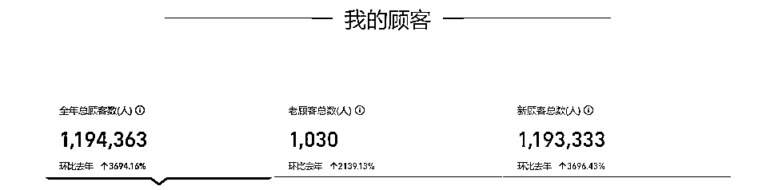
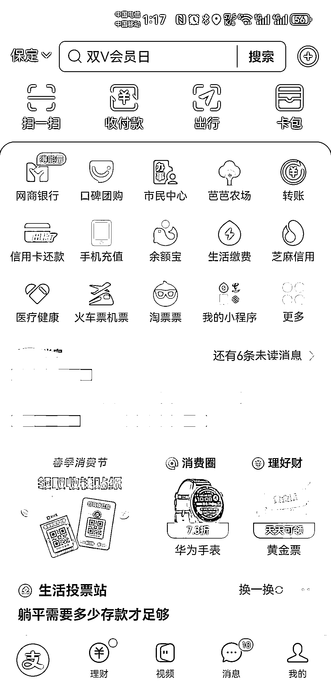

# 电商卖货，启动资金 6000 赚到 100 万的秘诀：和平台打好关系

> 原文：[`www.yuque.com/for_lazy/zhoubao/ug0tvec8s2syiboc`](https://www.yuque.com/for_lazy/zhoubao/ug0tvec8s2syiboc)

## (81 赞)电商卖货，启动资金 6000 赚到 100 万的秘诀：和平台打好关系

作者： 微尘🐳

日期：2024-05-17

不知道大家平常有没有关注到，支付宝有一个商家积分兑换活动，有很多的商品可以选择，比如纸巾、牙膏、袜子等。

这类商品都会参加到支付宝货源活动中，并且都是专门的平台运营去找商家，给到相应的资源位售卖，如果你有这些领域的产品，哪怕是自己没有工厂，也可以在 1688 开店，然后报名平台的活动拿到资源。

我就是靠这样的操作赚到了第一个 100 万。

核心就在于和平台小二打交道搞好关系，牢记平台规则，通过开 1688 店铺来承接合作后，积极参与 618、双十二这种大促活动并完成指标，就会得到官方的支持和青睐，让更多用户看到下单。

话不多说了，详细的过程和具体操作方法我将在下文和大家分享。

通过 1688 店铺承接到支付宝定制纸巾项目，实现半年 GMV5000W+，利润在 100W+。

纸巾这个产品属于消耗品，利润不是太大的，全靠量，有量才能跑出更大的利润。

先上个图吧

各位对纸巾都不陌生，不论是生活用纸还是商务用纸，随处可见。我来分享的这个项目是如何通过 1688 店铺来接到和支付宝合作纸巾项目。

大家好，我是京悦，从业电商行业 10 余年，从业实体 3 年。今天分享一下这件事情的可做之处，由于文化水平限制，表达能力有限，请各位圈友凑合着看。

我来自河北保定一个小镇上--大册营镇，号称“华北纸都”，全国 80%的纸巾产自我们那里，如果有圈友在做纸巾的项目，估计会知道我们这个地方。

我们这里不仅有纸巾，还有驴肉火烧、槐茂酱菜，春不老（咸菜类）、保定铁球。

景点有：满城汉墓（金缕玉衣的出处）、易县狼牙山、清西陵，涞源白石山景区、涞水野三坡景区等，这里给我的家乡打个广告。

圈友有来的话请你吃驴肉火烧，烤全羊。下面我来简单说下这个项目具体的流程。

## **一、项目介绍**

通过 1688 店铺来承接到和支付宝合作的纸巾项目。

大家如果对 1688 不太熟悉，那么对于支付宝来说肯定是熟悉不过了。兑换路径在支付宝-我的-商家服务-商家积分（有的个人支付宝是没有这个选项的）这里针对的大部分是 B 端客户，实体店商家居多。

兑换页面有很多商品，大家可以看下有没有自己领域的产品，有的话需要再 1688 开店，然后报名的，就有机会参与到这个项目里来的。

我接触到电商这个行业是在 08 年就开始有所接触但是没有特别的涉及到这块，早期我记得是淘宝一件代发的模式，当时我在北京通州上班，机械厂里工作，了解到电商这个行业然后就在淘宝开了个店铺也上传了些资料包。

当时就是在 QQ 群找的东西。没怎么深入的研究它。

10 年我回老家结婚后，又在机械厂上班两年，在 12 年的时候开始自己和我老婆我俩一起开店打包发货，去朋友工厂上班，自己出来单干。

我自己出来单干是因为和朋友谈蹦了，上班你不能干自己的事情，不知道在做的老板有没有这种，不允许自己的员工有其他的副业，在我这里上班就要死心塌地的给我干，不能有自己的副业。

好了不在这里托大我的这点破事了。下面我来说下怎么去争取这个项目吧。

说这个没有门槛吧，也不全对。因为要开一个 1688 店铺需要 6688 元年费的，咱们圈友有做这个业务的，能返一定金额的。这里就不说了，那么开始吧。

**（1）开通店铺**

需要准备东西有：营业执照，身份证，手机号，支付宝。

这里建议还是找第三方服务商帮忙开通店铺，可以和他们谈优惠的。

**1、上传商品**

店铺开通好以后就是上传商品，如图。

达到 L2 店铺等级以后就可以报名严选产品了

这里的严选店铺有全店都可以是严选产品，也可以部分是，这个是要抽佣 5%个点的。看自己的选择。

**2、入驻严选**

要求如图：

这里大家看到的三个身份 L2 级诚信通商家，就是你的店铺等级要达到 L2 级， 下图为等级分层标准，到哪个层级要完成哪几项目标值就可以了。

具体的有做的大家到时候在自己的后台看就可以。

另外两种超级工厂和实力商家，是要花钱的。这里咱们暂且不说的。

那么普通诚信通商家可以做吗？可以的，我咨询过小二的：

店铺开起来以后，做到 L2 等级以后，就跟着类目群里小二发的活动起报名就好，发声被看见就好了。

还有一点是要申请钉钉号并把店铺和钉钉号绑定起来，然后找下自己类目群加进去。这里也不是说把诚信通等级做到 L2 级就不用管了，也要正常运营操作的。

下面是钉钉账号绑定的入口位置，店铺后台右上角点击自己的名字

店铺怎么开就简单的介绍到这里，店铺开起来以后，记得营业执照要年检的，避免异常。

这里我总结过一个年检营业执照的教程：[`wx.zsxq.com/dweb2/index/topic_detail/814822212552542`](https://wx.zsxq.com/dweb2/index/topic_detail/814822212552542)

**（2）如何争取到项目**

好了，店铺开好，严选加入，那么我们来说下怎么去争取这个项目。

每个类目都有一个内部商家群的，你要去关注它，看到里面有活动要去报名的，先不要管它出单不出单，总之去把活动报名好，审核过以后，要去运营一下，证明咱得产品价格和质量方面是受买家喜欢的，这样小二也会看到咱们得数据的。

除了商家群里的活动店铺后台的活动大家也要去报一下的：

1688 每年都有 3 场大促的，3 月、9 月、12 月，到时候小二会在群里发出报名连接，和相对应的完成奖励。

## **二、我做了哪些事**

店铺开起来以后，迅速熟悉平台的规则，并熟悉平台各个工具的运用。

正常运营店铺外，积极报名后台和钉钉商家群里面的活动链接，当时活动是很出单的，这个活动是支付宝货源。

市场的厂货通满 10 减 5，每个场次的活动我们都会做一些相应的运营，保持自己的产品排在前面，卷纸和抽纸前面的全是我们的，我自己和朋友的店就能在活动上面一直存在。

只有这样才能出单多，它这里当时还不是千人千面的。卖的多自然而然就会有人关注到你的。

接下来我们就是报名大促活动，3 月、 9 月 、12 月的大促活动，每次都不落下，都能完成很高的 GMV，很好的完成各项指标（这里用的店铺是专门做大促活动的店铺，和主店铺是分开的。）

大促之前会有人找你让你完成多少多少业绩的，具体金额这里就不明说了，总之很多上百或是上千的 GMV，肯定不会只找你一个人的，还有别的商家呢，这时我们是只要开口说话，我们会想尽一切办法去做到。

这样能帮他完成业绩，我们也能得到相应的资源位，它这个大促活动有相对用的奖励的。总之和行业的领导保持一定的联系就好，大家的利益都是相互的。

这里说下要完成那么高的业绩，不需要你有那么多现金的，只要把平台的工具运用好，用很少的现金就可以完成的。

再然后我们就得到了报名这个活动的链接，当时是填写表格的，把含税包邮价格和产品规格填上，等待着审核就好了。

由于我们前期的工作，我们很快通过审核，并通知邮寄样品。从接到通知到邮寄样品，然后确定包装的设计，包装设计好到做出样品我们只用了不到一周的时间。速度很快的，下面是当时的包装一款卷纸和一款抽纸。

这里我总结一下，我能做这个项目的核心就是和类目领导保持着一定的联系，完成各种活动指标，商家和他是相互的。双赢的局面。

## **三、注意事项**

最后说一下：开 1688 店铺必须要用到营业执照的，对于没有工厂的商家，在和类目领导聊天的时候不要刻意去提自己没有工厂就好。

要在钉钉群里活跃，和类目领导保持一定的联系并维护好关系。1688 店铺主要是靠活动来抓取到 B 端客户，并在订单里面去分析出哪些是 B 端客户加以加到微信去维护。

不管圈友有没有工厂都要把产品质量把控好，尤其注意这种积分兑换的产品，报名活动的时候一定要库存和价格算好，积分兑换活动中的产品一定不要出现任何差错，有价格和库群方面的问题，及时在钉钉群里反馈或是私聊活动负责人。

希望对想做 1688 店铺的人有一定的帮助。感谢大家的阅读。

* * *

评论区：

FF : 我有品牌底价库存尾货供应链，可以研究合作一下[呲牙]
大虫 : 啥类型的
泰来 : 同保定圈友，优秀！向你学习～
康先生 : 啥类型
Do_no : 啥类型的
FF : 小家电 个护 清洁 3C 数码类
FF : 小家电 个护 清洁 3C 数码类
FF : 小家电 个护 清洁 3C 数码类

* * *