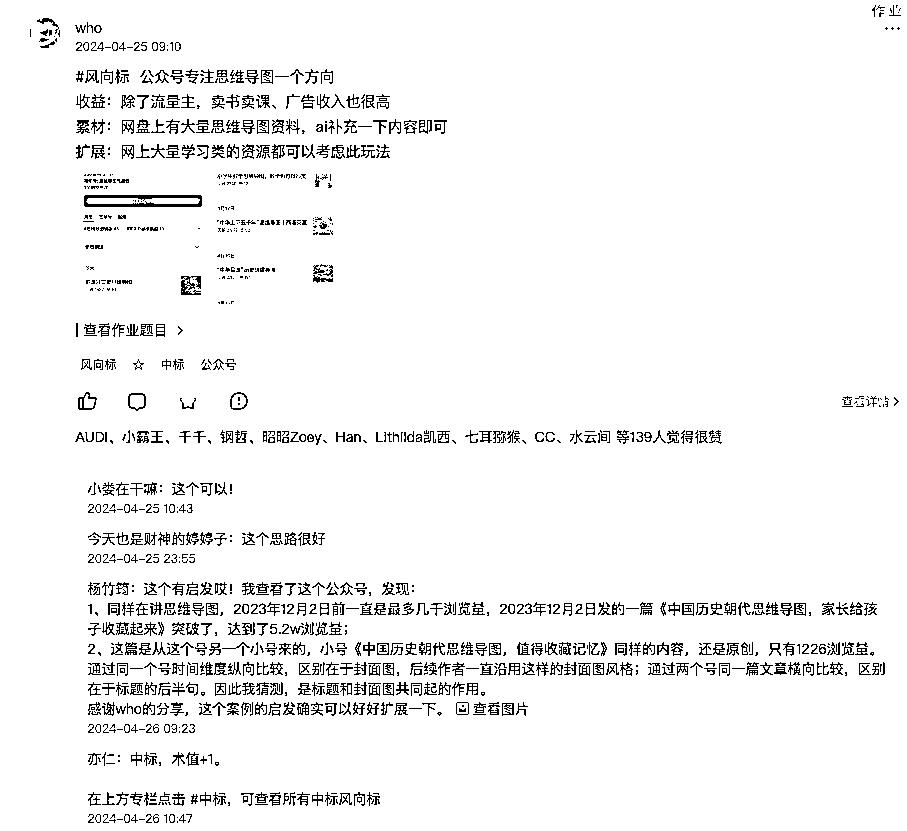
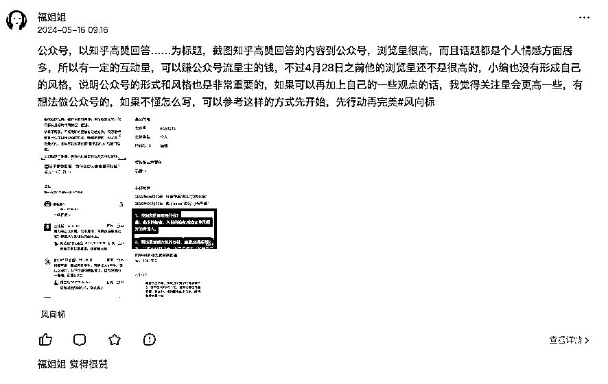

# 学会《生财思维课》，每天写 5 个风向标，新手三个月赚回生财门票的实操线路图

> 原文：[`www.yuque.com/for_lazy/zhoubao/zni8d5y2wnbiz2a2`](https://www.yuque.com/for_lazy/zhoubao/zni8d5y2wnbiz2a2)

## (73 赞)学会《生财思维课》，每天写 5 个风向标，新手三个月赚回生财门票的实操线路图

作者： 吕贺

日期：2024-05-17

加入生财，是通过镇海团队入的，当时靠谱的一句话深深的刻在了我的脑海里：**在生财，一定要占好自己的生态位！**虽然生财有六万人，但仅有少数人能充分利用生财的资源。

我暗暗下决心，不让自己的门票白花，所以一加入生财，我就在各方面积极参与活动。生财的新人活动也很丰富，我按步骤参加了新人融入营、生财思维课、6 天微实操训练营。

我觉得还不够，一直想输出自己的精华贴，不断的写内容，但每次写出来自己都觉得是一团狗屎，实在拿不出手。

慢慢我发现，新人想输出精华贴的话有一个问题：精华贴虽好，大多数都是拿到结果后的项目才分享出来，因为精华贴的第一步都是晒成绩。所以精华贴都有一定的滞后性，它是解决执行差的好工具，而风向标是第一时间解决信息差的有效工具。

然后有一天，我在刷生财风向标的时候发现，我可以写风向标啊！

「风向标」，生财有术里一个价值非常高的、最新最快的赚钱信息汇集点，供大家收集和分享与赚钱相关的「短情报」和「玩法」。

我天生有一点点商业敏感度，在选品方面算是有一点点天赋，曾经摆过地摊，挣钱虽然不多，但选品算是一绝，看了人-货-场基本能判断一个品能否挣钱。还做过拼多多电商，试过上百个品。写一个风向标，也算是难度不大。

风向标重在「短」与「快」，140 字以内的赚钱信息，只说重点，言简意赅，表达清楚核心玩法。大部分有图有数据，记录着真实商业世界正在发生的现象。

短——意味着输出的时间不用过长，自己读消息的时候有了灵感，花三五分钟就能完成。通过圈友的点赞和亦仁的加精，很快就能形成一个正反馈，即 MVP。

快——意味着每天都有大量的机会，不会因为别人写了我们就没有机会了。我们站在一个和行业资深者同样的起跑线上，他们能看到的和我们看到的不一样，所以会比写精华贴要简单。

在学习了生财思维课之后，我发现利用生财思维写风向标，又快又简单，赚回门票可以很快实现啦！

# MVP 思维：正式行动前，你就确定赚钱了

MVP，即最小可行性产品（Minimum Viable Product），是一种产品开发理念。

它强调以最小的成本和资源开发出一个基本可用的产品版本，这个版本能够表达出产品的核心功能和理念。

MVP 的目的是通过市场反馈快速迭代和优化产品，以适应不断变化的市场环境。

在生财里，风向标算是最小可行性产品了。参加航海，一般都需要 21 天；任何一个项目，都至少要准备，学习，实操几个阶段；就连写贴子，风向标都是文字最少的。

所以想在生财里获得第一个成功，**风向标就是一个 MVP 思维**。

只需要 140 字以内，利用自己的碎片化时间，截截图，配上自己的想法，发出去就 OK 了。

这个最小 MVP 的反馈指标也很多，很快，其他人的点赞，评论等。都会给你指出一些方向，比如有的风向标我发出去就会有大佬评论，这个信息价值不大，等等。

而且，重要的是，每一个风向标，**亦仁都会亲自筛选**。亦仁觉得合格的，会打上「中标」两个字。这个回馈，够直接，够完美，够市场化了。

亦仁曾经说过：**每一个风向标后面都隐藏着一个挣 100 万的机会。**

所以，写风向标，是当之无馈的生财第一 MVP。

我尝试着写下了自己在生财的第一个风向标。

毫无疑问，没有中标，但也获得了 8 个赞。

不错，继续吧。

用好 MVP 思维，主要分 3 步-

1)做出一个 MVP(最小可行性产品)

2)推出市场验证需求

把产品推向市场，向用户展示，并收集用户的反馈。

3)根据用户反馈，来决定下一步行动

如果用户反馈，产品确实有商业价值，那就进一步完善产品如果用户反馈，产品没有、或者缺乏商业价值，那就需要改变方向，或者果断放弃。

# 异常思维：不正常的地方，往往藏着赚钱机会

什么是异常值?

就是和正常的信息，有明显区别的信息。

比如，

一个百万公众号出现 10 万+文章是正常。

但一个几十人关注的公众号出现 10 万+文章，就是异常。

我在加入生财之前，就做了一年的公众号，经常刷“低粉爆文”。低粉爆文就是异常思维的一个典型案例。

在风向标里面，有很多我认识的做公众号的大佬发公众号的低粉爆文作为风向标。

这事对我太简单了，我平时本来每天都要刷公众号，现在只需要截图发出来即可。

于是，我发出了我的第一个公众号对标号的风向标。

不出意外，又没有中标。

不过当时我对中标没有什么概念，只是一心想提高自己在生财的生态位，所以不中标对我也没什么影响。

发对标号风向标也基本不影响我的工作，所以我还继续发。

> # 对标思维
> 
> > 既然我的目标就是找对标号的风向标，那我就利用对标思维来找找风向标里面类似的内容，看看中标的风向标都是什么样的。
> > 
> > 经过对风向标中标的分析，我看到公众号类风向标的大佬有 辰风、林林 AIGC、善士笔记、who 等等。
> > 
> > 可以看到中标最多的这些大佬，发风向标的频率也很高。在做公众号爆文项目的人很多很多，也有很多人有自己的爆文库，但并没有都发出来做风向标。
> > 
> > 就像赤面所说：
> > 
> > > 当然，除了大佬，很多小白还没有意识到风向标的作用和价值，没有参与进来，或者想参与却不知道如何下手等原因。
> > > 
> > > 我没有统计功能，所以不知道自己具体看了多少风向标，但是，我敢说，近一年内所有关于公众号、公众号爆文的风向标我都看到了。
> > > 
> > > 之前刷风向标的频率是每周找两个时间，通常是周一和周三，花一两个小时把没有看到的风向标都刷一遍。
> > > 
> > > 后来自己开始每天写，就每天随时刷新，地铁上，上厕所，中午休息，就把风向标刷完了。
> > > 
> > > 
> > > 
> > > > # 第一块钱思维
> > > > 
> > > > **任何一个一百万都是从第一块钱开始赚到的。**
> > > > 
> > > > 写风向标，不是商品，不能直接转换成钱，但我们可以把第一块钱思维，转变成第一次中标思维。
> > > > 
> > > > 持续写，持续写。
> > > > 
> > > > 最开始的时候，写完一个风向标，我总是忍不住过几分钟就去刷新一次，看看有没有被亦仁列为“中标”。时间长了我发现，亦仁是每天在固定时间内统一处理风向标，所以你一直看除了增加自己的焦虑，没有任何其他作用。
> > > > 
> > > > 后面我就有意识的让自己去忽略短时间内查看中标结果的心态，让自己更加注重长时间的坚持和回报。
> > > > 
> > > > **但行好事，莫问前程。**
> > > > 
> > > > 利用好对标思维和蓝海思维，不断去发掘风向标。利用迭代思维不断更新自己的写法。
> > > > 
> > > > 没想到，第一次中标来得这么快！5 月 15 号突然发现我收的赞快速增长，数据不同寻常，然后就发现了亦仁的回复，“中标，术值+1”！
> > > > 
> > > > 好开心啊！
> > > > 
> > > > 
> > > > 
> > > > 第一块钱，非常重要，中标之后，我收到了鱼丸的「风向标共创群」入群邀请。
> > > > 
> > > > 目前看来，入群也没有什么特殊之处，只是对自己的一个激励。一方面能更加深入的与生财互动，一方面可以更加具体化的要求自己，每月至少发 4 条风向标。
> > > > 
> > > > 
> > > > 
> > > > 对了，鱼丸发了两个关于风向标的贴子，非常有进益，如果大家想写风向标，可以多读读。
> > > > 
> > > > 风向标收集创作指南：[`t.zsxq.com/0cLu2pgrS`](https://t.zsxq.com/0cLu2pgrS)
> > > > 
> > > > 如何在风向标中掘金挖宝：[`t.zsxq.com/0cYBnyrw7`](https://t.zsxq.com/0cYBnyrw7)
> > > > 
> > > > 我是受了第一个创作指南的启发，才想到如何通过写风向标赚到第二年的门票这个 idea 的。
> > > > 
> > > > # 算账思维和概率思维
> > > > 
> > > > **当一个人在正确的方向上，持续做的事情越多，就会有更大的概率，实现偶然的成功。**
> > > > 
> > > > 术值，是生财的积分体系
> > > > 
> > > > 100 点术值 = 1 张生财门票。（2765 元）
> > > > 
> > > > 50 术值可以兑换 1 个龙珠碎片
> > > > 
> > > > 7 碎片兑换 1 颗龙珠
> > > > 
> > > > 即，一个术值=27.65 元。
> > > > 
> > > > 每发布一条风向标，中标后我的未来收益是 27.65 元
> > > > 
> > > > 为了明年省下生财的门票钱，至少要有 100 个风向标中标才能完成这项任务。中标率在 1/3 到 1/2，那要发 300 个风向标。即每天一个风向标，这个目标太简单了。可以适当提高一下对自己的要求，每天发 3 个风向标，假设每天有 1-2 个中标，那么三个月就可以赚到第二年的门票。
> > > > 
> > > > 这个目标设定的合情合理，每一个新手都可以执行。
> > > > 
> > > > > 算账思维也是受到风向标达人的启蒙，链接如 [《发了快 700 条风向标后，我总结出「风向标收集创作指南」》](https://uhvdpsq44s.feishu.cn/docs/doccnrqtZE3h7TLdS9uMbycX1Vd)
> > > > > 
> > > > > # 蓝海思维：如何在竞争激烈的市场找到红利
> > > > > 
> > > > > **所以，如果你能在一个领域，找到这样的蓝海产品、或者方向，那你赚到钱的概率就会非常大。**
> > > > > 
> > > > > 如果你经常看风向标，会发现一个现象，小红书的风向标非常之多，远超公众号、tiktok、实体等类目，抖音应该居第二位。
> > > > > 
> > > > > 光看风向标，让我感觉小红书是中国最好的变现平台。
> > > > > 
> > > > > 所以我猜测，想发一个小红书风向标想中标不太容易。但公众号的风向标就没有那么多，我也算是选择了一个相对蓝海的领域去写风向标。
> > > > > 
> > > > > 同时如果经常看 youtube、TikTok 的人，我觉得写风向标会更容易中标一些。毕竟海外的市场很多，而关注海外市场的人又相对少。
> > > > > 
> > > > > 如果你也打算开始写风向标，可以从这些蓝海领域里找到自己的突破口。
> > > > > 
> > > > > > # 迭代思维：完成比完美更重要
> > > > > > 
> > > > > > 经过自己和大佬的对比，我发现，我写的风向标，仅仅是低粉爆文。而风向标是寻找信息差，能赚钱的信息差，或者说是商机。
> > > > > > 
> > > > > > 低粉爆文仅仅能代表公众号平台的一种偏爱，不能代表着这是一种信息差或者商机。
> > > > > > 
> > > > > > 风向标需要一个更完整的商业链条让大家看到机会。
> > > > > > 
> > > > > > 比如这条没有中标的风向标。
> > > > > > 
> > > > > > 讲述了一个公众号的异常值，即从没有流量突然爆发到有流量。单从公众号角度来看，这是一个非常好的案例，是低粉爆文的模仿对像。
> > > > > > 
> > > > > > 作为一条风向标来说，仅仅有流量异常值意义不大。缺乏一个完整的从流量到产品，到付款的商业流程。所以没有中标。
> > > > > > 
> > > > > > 
> > > > > > 
> > > > > > 比如说这条中标，公众号只是流量的一个载体，流量相对于大爆的 10W+，并不是特别好，很多就是 2 万或者几千。
> > > > > > 
> > > > > > 但这个公众号背后有着一套完整的商业链条，就是可以卖书，卖课。这样配下来，号主的收益就非常高，而不是靠单一的流量主来源。
> > > > > > 
> > > > > > 
> > > > > > 
> > > > > > 这条中标同理。公众号背后是完全的商业流程，流量是关键但不是唯一。
> > > > > > 
> > > > > > 
> > > > > > 
> > > > > > > # 合作思维：2 个人多赚 10 倍的秘诀
> > > > > > > 
> > > > > > > 除了生财，我个人还有一个小小的 IP 社群，是关于公众号的。于是，我开始了学习合作思维，把生财里所有关于公众号的风向标全部都找出来，共享给社群。而社群里有小伙伴提供低粉爆文的公众号，我也会按生财思维筛选一下，符合要求的，也会发风向标到生财里。
> > > > > > > 
> > > > > > > 比如社群里分享的“文案带风”，我加以分析，配上文字，发到生财的风向标里面。
> > > > > > > 
> > > > > > > 
> > > > > > > 
> > > > > > > 生财风向标 To  公众号 AI 创作指令社群
> > > > > > > 
> > > > > > > 
> > > > > > > 
> > > > > > > 这种方式，加快了信息流通，也降低了我发风向标的难度。
> > > > > > > 
> > > > > > > 其中，有一个中标的就是我从社群收集来的信息。
> > > > > > > 
> > > > > > > 
> > > > > > > 
> > > > > > > # 花钱思维：用小钱赚大钱的方法
> > > > > > > 
> > > > > > > **花钱思维，简单来说就是用钱来通过交易，换取一些其他的资源，来帮自己更好的达成目标。**
> > > > > > > 
> > > > > > > 做公众号爆文时间长了会发现，自己手动刷公众号会进入一个信息茧房，只能刷到自己看过的号，刷不到低粉爆文。
> > > > > > > 
> > > > > > > 于是，我开启了花钱买爆款案例的野路子。
> > > > > > > 
> > > > > > > 我在公众号上发布了一个“小任务|5 元一次，简单易做”。
> > > > > > > 
> > > > > > > 内容就是帮我找公众号爆款案例，就可以获得 5 元红包。
> > > > > > > 
> > > > > > > 
> > > > > > > 
> > > > > > > 
> > > > > > > 
> > > > > > > 这可以说是一个用小钱赚大钱的方法，一方面可以打破我找低粉爆文的信息茧房，一方面可以替我引流到我的私域或社群，同时还能带动公众号的流量。可以说是一举多得。
> > > > > > > 
> > > > > > > 从上图可以看到，这一篇文章的阅读量达到了 4895，因为这篇文章加我微信的人也有近 100 个，虽然我也花了一些小钱，但总起来讲，收益还是不错的。
> > > > > > > 
> > > > > > > 
> > > > > > > 
> > > > > > > # 逆向思维：打破常规的赚钱路径
> > > > > > > 
> > > > > > > **逆向思维，又称反向思维或颠覆性思维，是一种创造性思考方式。**
> > > > > > > 
> > > > > > > 有一个风向标，我印象特别深刻，特意把它收藏起来。因为他就是逆向思维的成功案例。
> > > > > > > 
> > > > > > > 就是从 TikTok 视频搬运到小红书混剪。
> > > > > > > 
> > > > > > > 现在我们的一般性思维都是把小红书搬运到 TikTok，而这个风向标里的小红书，却是使用的逆向混剪。通过 TikTok 混剪到小红书。也非常成功，一个月出单 4.4 万件。
> > > > > > > 
> > > > > > > 
> > > > > > > 
> > > > > > > # 中介思维：空手套白狼的赚钱方法
> > > > > > > 
> > > > > > > **你不一定要自己去做产品，而是找到产品，和需要产品的人，你在其中建立一座桥梁，让双方的供需匹配起来，低成本低风险的从中赚取利润。**
> > > > > > > 
> > > > > > > 目前对于进入生财的新人，一无所有的新人，最好的挣钱方法有两条路，
> > > > > > > 
> > > > > > > 一是参加航海，做项目挣钱；
> > > > > > > 
> > > > > > > 二是把生财推荐给好友，推荐一个好友，就能获得 500 多块钱的分佣，这就是中介思维。
> > > > > > > 
> > > > > > > 充分利用生财里的知识库，把自己觉得有价值的风向标，精华贴分享到朋友圈里，积极推荐给需要的人，赚到自己真正的第一笔钱。
> > > > > > > 
> > > > > > > 总结，以上就是我加入生财一个月后，关于写风向标的实操过程，总体来讲，写一篇精华贴不容易，写 100 个风向标却很简单，希望能帮助新加入生财的朋友，尽快找到自己在生财的生态位，尽快由观望者转变为参与者。
> > > > > > > 
> > > > > > > 风向标是一个非常简单的突破点，突破之后可以再进而写出精华贴，航海贴等，拾级而上，利用好生财。
> > > > > > > 
> > > > > > > 最后，附上「生财思维课」链接，希望大家都能学会挣钱的底层思维。
> > > > > > > 
> > > > > > > 多谢靠谱 把我拉入生财，也感谢她对本贴的指导。
> > > > > > > 
> > > > > > > 
> > > > > > > 
> > > > > > > * * *
> > > > > > > 
> > > > > > > 评论区：
> > > > > > > 
> > > > > > > Rio : 最近我做了个工具采集风向标的
> > > > > > > 吕贺 : 采集生财内写好的风向标吗？
> > > > > > > 竹子 : 真的是把生财思维课用到极致了！行动力超强
> > > > > > > 卷啊卷 : 好强的思维[强]
> > > > > > > 咿呀花花 : 优秀
> > > > > > > Rio : 对 因为风向标不都是我想要的内容，1 天 100 多条，所以要过滤不想看的，省点时间
> > > > > > > 老彭 : 加油
> > > > > > > 春夏 : 标题党，你没赚回你这么写[擦汗]
> > > > > > > 
> > > > > > > 
> > > > > > > 
> > > > > > > * * *