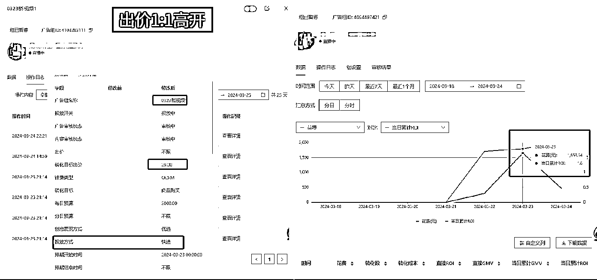

# 快手数字人直播单品百万消耗万字测品复盘（付费投流测品反思）

> 原文：[`www.yuque.com/for_lazy/zhoubao/whrb6ka8hcqhykii`](https://www.yuque.com/for_lazy/zhoubao/whrb6ka8hcqhykii)

## (42 赞)快手数字人直播单品百万消耗万字测品复盘（付费投流测品反思）

作者： 书豪

日期：2024-05-17

大家好，我是在杭州的龙珠圈友书豪，小红书店铺和聚光投放航海教练。

好久没有写贴了，一来是个人经历有限，二来最近打品确实很忙，三来写文章有点洁癖，希望能写出高质量的文章，能够给每个做电商的圈友一些收获一些启发。

2024 年，各大电商平台都很卷，想要在电商平台拿到大的结果，需要持续不断稳定的出现爆品。

测爆品，一定是概率问题，多测多有，而测品是一门技术，一门精湛的技术。至少对于我们普通人，更应该追求的是术的层面的追求。

最近身上压力特别大，2024 年开年多招了一批员工，想要更高效的测品。

生财有很多都是个体户的电商圈友，回头看，我也看到了曾经的自己，刚创业的前两年，曾经的我以为自己无所不能，后面开始上团队之后，发现团队的力量是高于一切的。

  

有句肺腑之言，希望跑出爆品的同学可以听一听，当你手里有一个爆品的时候，一定要开始招两个员工，因为你敢上团队，你才能把很多琐碎的事情交出去，比如剪辑视频，这是很浪费时间的。电商人的精力应该 80%的时间花在选品和内容上，剪辑视频会浪费你宝贵的生命，宝贵的时间。

招人后，你才不会让自己限于琐碎的忙碌！红利面前，时间成本是最高的成本！

我自己的能力是很有限的，今天和大家聊聊我们团队的测品模型。

**测品，测的是人，不是品**

搞电商，测品是永恒不变的动作。

没有好的测品思路真的会影响自己和团队的判断，最后主观判断放弃，一旦有同行同品下拿到了结果，只能垂头丧气！

这是我们踩了诸多坑趟出来的测品方法，**可将测品成功率提升到 30%，节约 70%的测品时间和成本**。

这个测品思路包括测品前准备、方法优缺点、测品成本控制、测品操作流程、复盘思路等，内容有点多，但都是血泪得出的教训。

以下测品方法仅在快手平台，通过短视频引流直播间打法进行了数据支撑和实操验证；

**目录说明：**

**测品方法的模型**

**快手这样的内容电商平台高效测品的必要性**

**整体测品流程：测品前准备、测品动作**

**复盘对于测品的影响：人货场分析复盘三大模块**

**测品注意事项**

# **1、测品方法的模型**

我们今年的主营业务分为快手数字人直播和小红书店铺两大板块。

我们自己自营盘始终在不断测品打品；

在快手短引测品上，我们前期受制于经验过少，也踩过很多坑；

花过很多冤枉钱，也同样因为测品不及时效率低错过了大爆发的机会，回首过往发现有些弯路是不需要走的，有些坑是可以避开的。

因为自己淋过雨，所以也希望后来者都能在下雨时递把伞。

测品不要带入感情，不要死磕一个品。可能我们会节省出一半的时间做真正有意义的事情。

## 2、**快手这样的内容电商平台高效测品的必要性**

相信大家都或多或少的做过一些电商项目

除去自有品牌、自有供应链的人外，大部分的人不论淘宝、小红书、视频号测品都是绕不开的事情

但每个平台有不同的规则和投放工具，势必测品方式也有所不同；

对于白牌团队，测品是从年头到年尾始终在做的事情，没品打要测品，品稳定了还要测品，始终处于品焦虑状态；

辗转小红书、快手两个平台，我们发现测品这个事情，测的是品吗？

测的是人，测的是人的需求，测的是该时间段内人的迸发性需求；

如果想在短时间内快速找到人的需求，你或者你的团队需要几次测试能够找到？

我们说的高效，不只是时间高效、也是准确度高效；

市面上的测品，有说两天的，有说十天的，背后对应着各自的方法；

两天的主打高开，通过付费高开价，快速测试人群市场；

十天的主打细水长流，靠时间换人群，自然起量；

我们不去评价这两个方法的落地性，实操性或者可行性；

站在付费打品团队或个人角度来考虑，这个事情是很难行得通的，测品既要在最短时间测试，同时也要保证测品过程的准确性或真正可行性；

**我们经过几十次的测品得出的结论是 3~7 天，成本 1000 元以内；【特殊品时间和成本会有所变化】**

### **2.1 为什么是这个时长范围？**

首先搞清楚一个事情，短引测品时期的时长作用是积累足够多的数据支撑；

我们是做纯付费打法，虽然一样会有自然流，但一般情况下自然流只占比 15%，所以只需要考虑付费数据即可。

**如果测品，只测试一天，那需要考虑你用什么样的打法？**

1~2 天测试期，市面常见的就是高开打法，通过广告费与货物成本 1:1 甚至 1.2:1 的比例高开拉动投放工具快速探索人群，抢占市场大量；

这套逻辑在抖音上，有很大一部分细分品类下是适用的，原因就在于大部分的品类都不算真正意义上的新品，抖音庞大的人群市场及大批品牌或资本玩家早已经在某段时间对产品进行了人群测试，即便近段时间这个品的内卷程度不大甚至没人去打，但系统依然具备了相对完善的人群定向。

所以通过高开快速实现素材与人群的配对，在确定视频素材的前提下抢占电商人群流量份额，快速完成系统对素材及计划的人群嫁接，实现测品目的。

注明：如在快手上，高开仅适用于两种情况：其一市场份额较大，高开后可快速实现 GMV 跃迁级别增长；其二竞争对手走先一步验证了市场及人群，此时通过高开快速抢占市场份额；

**如果测品，要测试 10 天以上，那你会损失什么？**

思考一个问题，在什么情况下需要通过十天的时间去测试产品？

短引里面一般分为两种

1、上头了，坚定的认为这个产品没有问题，只是短视频脚本一直没有对应上，所以不断的投入；

2、刚开始三天就有不错的免费流占比，认为这个品有量；

这两种情况下，基本每日的 roi 都不会太好，稳定的时候 roi 打到 1，可能损失的只是一个货物成本，但是日复一日的亏损，会让你陷入到赌徒心理，总觉得再来一次就能翻盘；

最后时间成本和金钱成本双向亏损；

老实说，只要别太上头，其实金钱上充其量也就是万把块钱损失；

**但时间成本才是最致命的，你浪费了十几天的时间**，相当于即便同一时段有好品选项，但你慢了一步，被人抢占先机，那什么都来不及了，即便后面能盈利，也是别人吃肉，你喝汤；别人数钱，你玩钢镚儿；

打个比方：假设你测品时间花了 15 天，同样有人和你同时起步，别人 5 天一个品，在相同的时间内别人测了三个品，成了一个，可你 15 天还未必会成功；

**目前测试了女装、男装、中性服饰、百货日用、食品、小家电及汽车后市场赛道，因各品类不同，所以在数据回收和数据计算上会有一定的差异范围，所以测品这个事情从严谨意义上来说，只能得出一个相对较窄的时间范围。**

### **2.2 为什么要把成本控制在千元以内？**

测品这个动作本身就是一个风险系数很大的举措，即便一个成熟的打品团队在不断换品的情况下，都不敢保证每个月都有大爆款可以跟上；

这也是为什么测品是打品团队始终坚持不懈的动作！

测品的最终目的是找到一个较为稳定且相对长期的盈利成本！

朋友们，兄弟们，切记切记，你是为了盈利！是为了赚钱！

测十个品，九个亏，1 个赚，赚的那一个放长周期可以抵扣掉前面九个的亏损；

但这里也需要记住一点，亏的多了，想赚回来，那就又陷入了赌徒心理，测品是一种有科学方式的对赌；

**正确的测品思路是通过数据分析、内容深耕及投流手段从而让你的测品成功概率增加**

这里说的千元，针对的是快手短引小白玩家，因为预算本质上和你的筹码和目标有关系，如果你的目标是找到一个爆品，这个爆品每个月能够产生十万【**￥100000**】的净利润，那拿出 2 万来不断测试，我觉得也是 OK 的。

第一前提你的筹码足够，第二你的目标远大；

如果你的目标是找到月利润 2~5 万的产品，那就必须要计算前期测品预算；

同时心态很重要，和手里筹码一样，手里钱越多，你的底气越足，在心态上会更平稳；

**测品成本，主要是通过人为因素就可以控制，我们希望的理想型是广告费用不亏，只亏货物成本；**

对于我们而言，只要跑出来，能多出单，即便货物成本亏了也没关系，最起码系统记住了买你东西的用户画像是什么样子，有了人群画像模型，系统会逐渐找到有需求的那一戳人。

## 3、**整体测品流程：测品前准备、测品动作**

想要在不出现主观误判的情况下真正测完一个品，整体流程是不能有问题的，快手短引模式是非常复杂的，当融入了无人直播之后，这个复杂程度再次增加；

**如果想保证整体测品不出问题，每一个环节都要做到尽善尽美，不留纰漏。**

举个简单的例子，一大早开了直播拉了三条移动端智能计划，测试新视频，结果消耗了 300 快一单都没有出，这个时候突然反应过来，没有做直播间讲解和场控的提升转化处理，那你不光是损失了 300 快，更浪费了一早上的好流量；

## 3.1 测品前准备工作

在选品确定后，测品前的准备工作是至关重要的。

**大致分为几块内容：上品、供应链谈判、脚本找寻、爆款拆解、内容制作、直播间找寻；**

一共六项工作，这六项工作需要在半天或者一个白天时间完成，所以这个时候是很忙碌的，必须要做到忙中有序，忙中有效；

这里面难度较弱的基建操作就是直播间找寻录制、小店上品及小店一系列动作；

直播间找寻录制：快速在其他平台找到同款产品目标价格的直播间，在确定话术无误后即可通过软件录制；

小店上品及一系列动作：顾名思义就是快手小店商品上架和上架后需要的地址填写和售后设置。

这两点只要有一点电商基础的人，都了解，所以这里不做重点讲解部分。

我们今天主要聊聊供应链谈判、脚本找寻、爆款拆解和内容制作；

### 3.1.1 供应链谈判的技巧

今天不聊高大上的供应链整合，因为这个事情对于大部分来说比较遥远；

我们就来说说如何快速找到稳定且靠谱的供应链，并做到双赢状态。

供应链这一点大家不用纠结，基本上 1688 就囊括了所有，开头先从 1688 做起，当熟悉了之后你再去扎根产业带找寻价格更有优势更加稳定的工厂。

整体分为几个步骤：

**如何在 1688 上找供应链 —— 怎么判断价格是否正常 —— 如何和供应链谈判 —— 如何让供应链信任你**

如果你在各个平台上搜索进货渠道，现在真的是五花八门，但是我的建议是别纠结别卷低价，卖货的目的是把货品交给有需求的人，就够了，有需求的人对于价格的敏感度不会特别大。

所以只需要用好 1688 就可以，你现在看中了一个产品，直接在 1688 上搜索产品名称；

会出现大量的商品，找到你要的同款商品，当你感觉这个价格不对时，直接搜索同款即可；

一个搜同款，你会发现特别多的同款商品，这个时候的价格也是差异很大，

你怕买贵了被宰！又怕买便宜了质量有问题！那简单，第一搞清楚我们是做一键代发，不是批发商，所以你拿不到批发价；第二一键代发这里会涉及很复杂的东西，所以一键代发的价格差异化最大。

只需要知道一点：做拼多多的商家，他们也基本上只赚 15%，所以去拼多多看均价，用均价减去 10~15%就是一键代发的价格。

如何和供应链谈判？这是一门由浅入深的课，没有一个人能做到对任何一个品的市场价格或者价格底线了如指掌；

这个时候，我们要做的就是在人性的边缘来回拉锯。

我们的建议是以实避虚真真假假，真假参半。但发心一定要正，我们不想占便宜，只期望能做到双方利益都舒服的双赢。

注明：这里切记，供应链从来都是需要多备一手，防人之心不可无，多储备供应链又没坏处；

### 3.1.2 脚本找寻及爆款拆解

当选定产品后，脚本就是整个模式中的重头戏了，找寻到一个优质的脚本可以让测品率提高五成把握，当然这里面还有很多的变量，我一一为大家做拆解。

**首先，大家要明白一件事情，市面上 99%的产品都是老品，老品就意味着已有人试水；**

老品已有人尝试，那是不是也说明了老品的短视频素材有人做了！

再想一下，他连素材都做了，是不是连脚本都写好了？

曾经有一堆验证过的爆款视频摆在我的面前，我视若无睹，发誓要做品类下原创的又一座高峰；

于是我潜心专研人群，耐心思考内容，测品前的准备工作真的是自认很充实；

再后来，有一些品无疾而终，有一些品胎死腹中创业未半；

再后来，我感觉自己好像个小丑，好像个傻子！！

明明有现成的爆款视频，明明可以找到爆款脚本，就别固执！

脚本不要原创，直接找寻，市面上的钱大部分都是简单的搬运编辑赚来的；

**脚本主要集中在三个平台找寻”抖音、快手、有米有数“；**

抖音作为原创内容最多的平台，不论是内容制作能力还是达人原创度都比普通人高；

快手作为本身我们要主打的平台，了解最新爆款及老爆款视频有助于你快速筛选脚本；

有米有数主要针对部分品牌在信息流广告上，内容是不同步主页的，只隐藏在后台所以也是一个重点平台；

脚本找寻看如图的筛选即可，这里额外说一下在脚本找寻过程中，需要同步进行脚本初筛；

初筛指的是如有近期在快手爆发的脚本尽量筛出去，避免在脚本框架的对应人群上造成冲突；

在筛选后，我们现在要做的是对脚本进行拆解，以此保证后续”复制脚本“的素材原创度；

脚本拆解就是将爆款视频的内容架构进行拆解，先从框架内容拆分，再到画面说明，以真空收纳袋为例；

这里以有米有数最近投放时长最久、关联创意最多的视频作为爆款脚本

分为三个层次拆解，**1】脚本框架拆解；2】画面内容拆解；3】背后用户拆解；**

1】脚本框架拆解：思考整体脚本的故事性框架

以上图所示，拿到视频之后要做的第一件事情就是音频独立并转字幕，通过听音看画快速对脚本进行初步掌握，我们先不要考虑个人主观想法，不评价 NO Judge。

将整体视频分割成几个板块”吸睛三秒、价格优势、工厂制作、卖点解决需求、产品展示使用及引导购买；可以看到整体脚本框架在 45 秒的时间内快速将信息传递出去，且直接形成有效传递。

这一步骤的拆解目的是 1、了解整体框架内容；2、便于后面镜头替换；

2】画面内容拆解：整体画面思考

在已知文案大框架下，仔细看每个框架下的画面，这个脚本主要以混剪为主，但画面内容上基本做到了音画同步，尤其是在描述卖点解决需求的时候通过强烈的对比和冲击展示，让用户对卖点快速吸收并理解；

在这里我们需要思考的是如何准备素材，从画面中对素材进行分类；

以真空收纳袋为例，整体分为产品展示、使用展示、卖点突出展示、工厂制作等大板块内容；

对于一个优秀的剪辑，素材如果单单是这样去分大类还不够，还要再细致，只有把内容细致到特定镜头才能起到效果，还是继续拆分；

产品展示分为：手拿展示、多款对比、新老对比、产品陈列、实际应用场景下静态拍摄等；

使用展示分为：抽真空、不同尺寸装袋、放置进柜子/行李箱、一镜到底收纳整齐、封边收纳、放气还原等；

卖点突出展示：3 秒真空抽气、1 秒封边、超省空间、防潮展示、结实耐用等；

3】背后用户拆解

从文案中还原人群内心需求，这里不只是脚本本身也可以看一下对应这条视频的评论情况；

整个视频的前 15 秒，都在围绕价格优势，突出购买人群更看重性价比；

性价比紧跟着就是一句工厂发货，用户对于产品普遍会有一定怀疑性，快速打消顾虑........

**背后用户拆解的核心目的是：了解用户人群基础画像后，深刻知悉用户需求。**

在我们无法获知用户需求的时候，我们就可以通过爆款脚本去进行拆解，而这一步可以在后期作用于剪辑和客服，甚至直播间的主播话术及场控话术；

## 3.2 测品动作

在正式测品前，有一个前置动作“检查”，反复确认测品钱准备工作及物料没有问题，方可测品，因为一旦开始除了时间成本外，金钱就需要转化成测试效果。

测品动作是一个没有过多复杂操作，要做的是测试、复盘、调整、再测这么一个循环；

**测试包括短视频素材、投放测试及投放时间测试；**

在第一次测品期间，短视频素材需要做到全面性，打个比方今天如果只发 15 条素材，那 15 条素材在保证质量的情况下，是测一个脚本好，还是测试五个脚本好，哪个效率更高？

**肯定是同等素材量级下，测试越多脚本越好啊，能够快速找到能够跑量的素材；**

短视频在测试期间，我们主要看的是短视频不存在违规情况下的消耗速度和投产速度，这里又说回短时间测品的弊端，短视频伴随播放递增是会经历几次审核等级的，每一次审核通过都会获得投放端口跑量支持和自然流倾斜；从刚开始发布的安全审，到一定规模的观感审，再到起量的高热审，最后到爆发的 TOPK 审核。

**所谓的短视频测试就是要找出能够突破观感审实现整体端口起量的高热视频。**

很多的视频都卡在了观感审之下，图片的审核曝光要求数据是 23 年的，近期这个数据要求出现了变化，起因是当我们拉到 3 万甚至 4 万播放时依然无法突破观感审核限制，或者直接在这里被判定了负向。

投放工具在测试期间，它的作用是通过付费形式快速让你的视频完成播放历程发酵，你本应该十几天甚至几个月要完成的数据会在短时间内快速被推广出去，但这里依然面临着一个问题，就是好不容易烧出来一个视频，正准备大展拳头结果在观感审核上被判了负向【24 年极简版审核更加严格】

磁力金牛广告端口，我们主要考虑两个户“PC 户”、“极简户”。

PC 户具备人群模型校正功能，不断校正对应需求人群后会长期稳定盈利；极简版户具备测试新视频及拉热视频助力 PC 探索人群的作用，是没有稳定模型的。

在测品期间，投放上我们看这两个户各有侧重点；

Pc 户在前期是很难消耗的，所以我们重点看的是整体的消耗曲线，今天消耗 5 毛，明天 3 块，后天 5 块这个样子，当 pc 开始出单，这个向上的趋势会更明显，我们大部分的测品会发现这个品和内容没有问题的话，pc 都会有一轮爆发；

极简户则是需要每次拉计划的时候，需要始终盯着呢，刚刚有讲过极简版的作用之一是测试新视频，新视频有的符合人群有的不符合人群，就会出现空耗情况【只消耗广告费但不出单】，这个时候我们就需要定一个容忍亏损值，我们一般会认为当空耗到一个产品售价的 80%，我们就关闭计划。

主要内容及投放做完了之后，后面的就是复盘和调整了；

复盘作为整个测品期最重要的也是必备的技能，我会单独一段具体讲述。

## 4、**复盘对于测品的影响：人货场分析复盘三大模块**

这里指的复盘是基于投放金额和 GMV 数据从而推导直播板块、素材板块、投放板块三大板块去反思；

举个例子，当你第一天测品发布了 30 条作品，这个时候 pc 和移动拉好计划之后，移动端有一条计划空耗了 50 元，一单不出，而且商品点击和进入直播间的数据都不太好，这个时候就需要全面复盘了。

**复盘检查顺序从投放到直播间，再最后回到素材板块；**

### **4.1 投放板块复盘检查**

当你发现计划在空耗，或者原来跑的很好的计划不然不好了；

第一时间看原计划设置，是不是选择了智能出价、智能投放，是不是素材出现了负向？是不是选择了直投直播间？

甚至于计划时长调错了，都可能影响投放结果，测品主要拼的是细节，这些细节做不好，那测出来的数据也不能作为产品不行的有力依据；

当排除这些因素之后，再去思考下一个板块问题；

## 4.2 直播板块复盘与检查

直播板块这里依然是细节上的校对，主要针对直播素材、obs 调节、直播间助力工具、各类设备；

直播素材方面：当转化不好的时候，一定要认真听一下自己找的直播素材内容，听十分钟；然后头脑模拟一下用户的进入路径和购买路径。正常的短引直播间话术是“欢迎定语、痛点说明、卖点解决、产品使用展示、引导下单”，在保障这套话术的前提上，主播的情绪和氛围感也是直接影响转化的因素之一；

obs 调节方面：直播间是否有声音、是否有杂音、是否出现不该有的画面、是否可循环等，我们做无人直播的短引打法，obs 是必需品，obs 出问题会直接影响直播间的整体效果；

直播间助力工具：我们之前是用淦核，现在改用了小雨滴。主要的作用就是商品弹窗、自动客服话术回复及场控引导，这三点也同样直接影响购买转化，大家一定要养成开播就检查的习惯；

各类设备调试：这里主要是麦克风、摄像头及耳机设备；这里是尽量以真人直播间的形式去整体模拟一下，确保快手后台对设备的监控不出现问题；

## 4.3 素材板块复盘

在前两者没有问题的情况下，那就需要考虑素材板块了，所有人都会面临这个问题；

只要是短引测品直播间，测品的最终 bug 就卡在了素材板块不好判断层面，这里我们不去讨论内容应该如何去做，如果聊这个事情，那都能出一本书了。

今天分享两个小技巧去判断内容是否符合人群：

### 4.3.1 内容素材的播放和投流数据

大部分的内容素材如果不 OK 的话，他是不会有播放的，或者播放数据只有几百；

但总会有种情况让你抓耳挠筛，就是播放数据大几千但就是不出单，这里需要考虑的是，打开两个端口的数据，看该内容下的具体商品点击数、吸引直播间人数；

第一看投流数据，了解这个脚本和内容是否具备市场吸纳能力和能否满足用户需求；第二看视频本身数据，从封面点击量、3 秒 5 秒完播率、互动数等观察视频本身质量；

### 4.3.2 内容素材爆发下的自然流

有些作品播放数据特别好，但投放数据却一团糟，这个时候我们一定要学会看一个数据

就是当你这一批数据发布之后，你的自然流怎么样，这里就不只是要看快手小店的生意通，还要学会看直播间，盯一段时间的直播间进人情况；

快手的直播间进人有个数据特别好，就是每个进来的人都会有说明，是来源短视频、还是来源推荐、还是来源搜索亦或是来源于推广；除了推广其他的都算是自然流，如果一个作品自然流特别好，而且当他播放量疯狂上涨的时候，你直播间的自然流 GMV 猛增，那不要犹豫，就算是磁力金牛亏钱也要去拉；

# 5、**测品注意事项**

测品期间，不要随意关播开播，固定直播时间，拉长直播时长；

测品期间，一定要检查好设备，不要出现没插麦克风耳机这种细节问题；

测品一定不能再中午测视频，测视频只有两个时间点早上或晚上

内容素材尽量优化剪辑，不要混弄，这些片子后面都是用真金白银去做测试的

直播间一定要检查好，不要出现黑屏情况

直播间一定要做好场控，如果有人骂你，别人不用进直播间都可以看到评论

投放时间段都是早上或晚上，如果你不是能吃苦的人，这行就不要做了

测品时候遇到高退货的产品，尽量选择放弃

投放期间，不要胡乱操作，你的乱操作只会影响系统对你的判断

宁愿在爆发的时候乱操作，都不要在测品期间胡乱搞

在搬运的时候，一定要仔细核对好快手确认没人用过这个内容

投放的时候，一定不能短视频挂小黄车，不然你的数据就会很糟糕

不要因为磁力金牛亏了，就不敢操作，不断拉热视频本身就是在测试的过程

不多拉计划，也不少拉计划，看好规划，算好大账，每天做好财务表

2024 年，已经过去三分之一了，希望分给大家分享的测品复盘，能够对做电商的圈友有些启发有些帮助。

也希望大家不要太焦虑，虽然我自己也常常感到焦虑！

电商创业，是一件经常需要坐冷板凳的事情，外界只看到你打出了爆品，但不知道爆品的背后是不断测品耗尽心力久座冷板凳的结果。

创业之路，更是一条修心之路，什么时候我们安于现状了，那爆品的机会就离我们远去了。

我希望自己未来无论遇到什么问题，都能够勇于面对，永远向前冲！

也希望所有圈友在生财内都能找到适合自己的方法和技巧，拿到结果，遇到问题，就解决问题，不要害怕！

(我目前主要在做小红书、快手这两个平台，基本所有平台短视频内容的核心逻辑都是基本想通的，没有特别大的差异，希望这次的分享能够对大家有帮助，如果对上述分享有疑问的，也欢迎跟大家多多交流，探讨，定当知无不言，我的微信：wsh137552775)

* * *

评论区：

Yye-柏寒 : 书豪老师出品必属精品，先点赞再看
李又懂（赚钱版） : 赞
🌈程程爱数码 : 书豪老师出品必属精品，先点赞再看
颜乐乐 : 这复盘绝了，书豪老师牛逼
董大甜 : 书豪老师太高产了 好赞
竹子。 : 书豪老师牛逼
大脸猫 : 赞
Mr.Zhao : 请教下，投放的时候，一定不能短视频挂小黄车，这个是为啥呢？

* * *