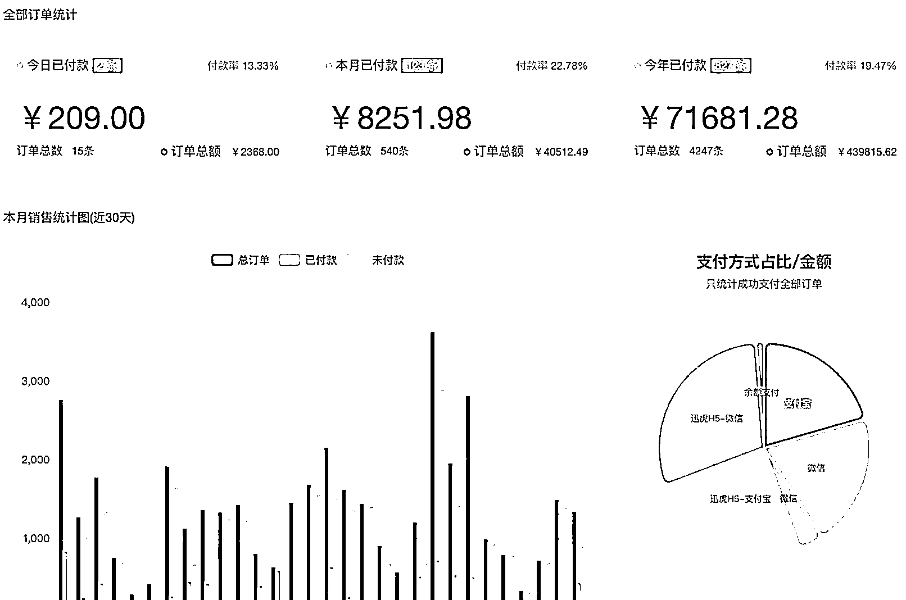

# 分享我低成本做个网站实现睡后收入的方法，新人也适合

> 原文：[`www.yuque.com/for_lazy/zhoubao/qmr4x0mmgh1z9yn8`](https://www.yuque.com/for_lazy/zhoubao/qmr4x0mmgh1z9yn8)

## (60 赞)分享我低成本做个网站实现睡后收入的方法，新人也适合

作者： Susumr

日期：2024-05-17

在互联网上拿流量变现，不是只能在小红书、抖音、视频号上做，还有一个投入不高也能赚到钱的方式：

“做 SEO+多渠道推广，利用网站来承接流量，然后变现。”

这个方式真正投入主要在建站费用和时间成本上，建站可以找网上教程学习，算了下我自己建站也就花了 2000 左右，当然花钱找人做也行。网站建成后就可以开始推广拿自然流量了，几乎不用过多的维护。

像我现在这个资源站，主要盈利模式是年会员或永久会员，我只要定期把用户需要的内容整理更新，然后做 SEO 自然流和多渠道推广，一直都会有搜索流量进来，每个月访问 5k 以上，再加上用户可以自行购买，也算是一种睡后收入了。

所以，最近想在互联网获取流量但不知道怎么实现的朋友，可以试试这个。今天这篇文章，我也会分享从 0 建站到运营推广整个过程的实操细节，全程毫无保留，希望大家看完都有收获。

大家好，我是 Susumr，坐标西安，曾经做过设计的产品经理。

怀着折腾不止的心态玩过各种不赚钱的副业，主打就是个练手，后来加入生财之后深受各位大佬的慢慢熏陶，逐渐找到赚钱的副业，每个月不多，但足已覆盖房贷以及生活各种花销。

想要在网络上赚钱，实现睡后收入，大部分的普通人最先通过信息差来实现。

而信息差，就是你将**有应用价值的信息**进行**系统性的整理**，然后**触达**给**需要它的人**进行**变现**。

这是我自己一个人做的虚拟资源网站项目，一个冷门且持续有睡后收入的项目，每个月不多，但足已覆盖房贷以及生活各种花销。

## **一、项目概况**

我本身是产品经理，日常工作会用到的工具有很多，比如办公软件、xmind、viso、axure、sketch 等很多软件，而我今天要说就是其中之一的软件——axure 软件。

我做的项目就是围绕产品经理使用的工具 axure，衍生出来做的一个虚拟资源站点。

我通过将不同项目的 axure 原型案例模版进行系统性的整理，然后通过网站售卖给需要它的人，因为用户可以自助支付购买，这样就实现了“睡后收入”。

网站的盈利主要卖年会员或永久会员，日均 pv 就是 1k～2k 左右，2023 年月均收入在 5k～9k 区间，让我在 2023 年 9W 左右的副业收入。

## **二、如何引流**

很多人在着手项目前会有疑惑或焦虑，做个网站流量从哪来？

我所选的这个项目的目标用户“产品经理”，他们大多数也都是使用电脑的场景进行搜索，所以网站一部分靠自然流量、另一部分靠知乎等公域平台引流。

靠自然流量和偶尔在知乎回答几个问题。

**1、SEO 自然流量**

只要网站勤勤恳恳发布满足目标用户的内容，然后被搜索引擎抓取后，然后用户通过搜索自主进入网站。这样就可以免费获取到这样的自然流量了。

**2、其他自媒体平台引流**

知乎、B 站专栏、百家号、今日头条这些文字类平台都可以是引流的平台，偶尔发公众号或其他渠道，但也没怎么运营。

我自己仅在知乎平台转发文章、用 AI 回答与目标用户相关的问题、以及在 B 站专栏转发了几篇文章。因为我精力有限，没有太多的时间投入这一块。

**三、如何做一个网站**

**1、初始准备阶段：**

想法产生：从自己熟悉领域出发，我本身作为一个产品经理，我发现以前日常都有找原型资源学习的习惯，市面上是有，但都比较分散。

**调研：**

调研同类网站（如 axureshop）和潜在用户的需求，明确目标群体和他们的痛点。

比如通过了解到这个网站销售额有几百万，那时候想着我赚一点点流量就行。而且他们是做平台，单个的资源比较昂贵，我可以做一个充值会员全站资源可以下载的站点，但从这一点，就应该可以满足很多产品人的需求。

好的，想法就这样有了，说干就干，那么第一波资料资源从哪里来呢？

买同行！对就是买同行，网上搜一下，网上找了做公众号的买了资源，然后把资源简单分类。包括源文件、教程等，这些都是产品经理日常工作中需要的资源。

直接加微信买下（应该是￥200 左右），然后将资料存到网盘。

投入￥200，资源有了，下一步就是搭建网站。

**2、建站和初步运营**

建站这一步可能对于很多不懂技术的觉得是很困难的，但其实我也是不懂技术，但我不怕去学习，以我趟过这条路的经验告诉你，**其实没那么难！有手有脑就行，会不会技术不重要。**

建站最简单的理解就是需要**一个域名**和**一个服务器**。

**① 建站前步骤**

**1）个体户营业执照（某宝上直接搜“个体户注册”，￥100 以内。)**

注意：非必须办理，也可以直接买域名和服务器开搞，后期运营不错了再办也可以，重新备案一次就行。

**2）注册域名（去阿里云注册账号，购买域名，。com 一般￥78）**

[`wanwang.aliyun.com/domain`](https://wanwang.aliyun.com/domain)

选你跟你网站名称近似的拼音域名，随便选也可以。

**3）服务器（刚开始买个便宜的就行，ecs 云服务器，￥200 左右）**

注意：一般选 centos 系统

[`www.aliyun.com/product/ecs`](https://www.aliyun.com/product/ecs)

**4）域名备案**

（备案之前需要先有个服务器，阿里云左上角有个备案入口，点进去按照提示流程**自主备案**就行，就是填各种表单麻烦一点而已。)

**注意：0 元免费的，不要选代办的。不要看它麻烦，照着一步步流程操作就行。没那么困难。一般情况 1 周时间就好了。**

ok，花了￥378，这样我们就有了域名和服务器。下一步搭建搭建网站。

#### **② 搭建网站**

这个部分懂技术的人很简单，但不懂技术的，更简单，只需要拷贝粘贴即可。

我做个简单的汇总如下（详细版请你按照下面教程链接操作，第 7 步可按照表格说明就行）

**1）在服务器上部署宝塔**

提示：去宝塔 [bt.cn](http://bt.cn) 网站拷贝部署代码，然后去你买的服务器远程链接后，等它自己运行，最后给你登陆地址、账号、密码就可以。

**2）开通服务器的常用端口**

开通 8888、888、3306、80、443、22 等端口，还有记得上面宝塔登录地址给的端口。（参考下面链接教程）

**3）域名解析至服务器**

去阿里云域名管理那里，a 记录解析到服务器的 IP 地址。比如 a 记录将 www 解析到你的服务器 ip 即可。（参考下面链接教程）

**4）在宝塔一键部署 wordpress**

上面教程第 7 步之后，不需要那么那么麻烦，直接在宝塔后台-软件商店，搜索“wordpress”一键部署就行，最后弹出一个弹窗。里面的信息下面要用。

**5）部署、登录 wordpress 后台**

根据上面部署成功后，会给你一个链接，打开链接之后就是你数据库地址、名称、密码、网站名称、登录账号密码等，一一填写就行。

照着教程办就行了，全程跟着操作就行，这部分我帮你找了个比我更专业的教程。👇

[阿里云轻量应用服务器宝塔 Linux 面板搭建 WordPress 网站 - Linux 面板 - 宝塔面板论坛](https://www.bt.cn/bbs/thread-116323-1-1.html)

（这个过程可能会很繁琐，也有很多细节问题，出现问题去网上搜索对应的问题，很快就可以解决。或者求助你身边懂技术的人也是一种办法，记得红包感谢即可。)

大功告成！这一步网站已经初步搭建完成，你可以访问 www。你的域名。com 就可以访问。很简陋很正常，下一步我们就装修它。

**③ 安装主题**

wordpress 本身就是平台，在它之上有丰富的主题、插件等生态。

主题就是你想让你的网站长什么样，我们要做虚拟资源站就找对应的主题，这里我帮你找了几个不错的，我自己也用。

下面是市面上主流的主题，你可以选择自己比较喜欢的主题。

1.  [`ritheme.com/`](https://ritheme.com)  Ri 主题，券后 ￥499

2.  [`www.ceotheme.com/theme`](https://www.ceotheme.com/theme)   CEO 主题，￥399

3.  [`www.zibll.com/pay-zibll`](https://www.zibll.com/pay-zibll)   子比主题， ￥599

下载到主题包之后，安装完成基础的配置。

**1）安装主题**

在你的 wordpress 后台-主题-上传即可

**2）配置主题的基础信息**

**3）支付方式配置、会员价格定义**

主题已经对接很多支付方式，网站的支付可以用**虎皮椒等其他支付渠道**，**个人无需营业执照可以申请支付**。

有营业执照的，开通过**微信支付**的，可以不用这个。

主题安装及配置完成后，网站就已经搭建完成了，就可以发布文章了。后续观察慢慢优化调整它。

主题+支付商户开通合计约￥500 可以搞定。

**④ 发布内容**

发布文章时，除了标题、内容、分类等外，将资源的资源的价格、资源的云盘链接在文章底部配置。

**内容策略：**初始阶段重点在于内容的积累和质量，让别人来看的时候一看，确实有价值。

**题图：**把每个封面图进行配图设计，显得品质高，有价值的。这个配图其实很简单，可以用稿定设计或其他设计编辑平台搞定。

**版权问题：**需要严格注意版权问题，避免法律风险。发布对内容的检查，如果是书、视频等形式检查这些资源 的来源，如果是大平台的，不建议发布。也可以引流到私域作为赠送的东西送给会员（曲线方式？) 。

网站一定注明来源网络，有如侵权联系删除即可。（这其中也收到过律师警告，当时吓得要死，其实下架就行了。)

**3、SEO+推广**

**① SEO 优化**

首先是网站的基本 SEO，推荐这个插件，一键查看网站 SEO 等信息，可以根据后面颜色进行修改，完善到绿色为标准。

其次，当有发布一些内容后，就开始注重流量了，然后从搜索引擎挖掘相关的潜力关键词，然后把它们编辑成文章发布。

1.  技巧 1: 从 [5118.com](http://5118.com) 网站挖掘你需要的关键词。

2.  技巧 2：搜索框联系词

1.  技巧 3：可以借助工具，**查询域名在搜索引擎收录情况** 在百度谷歌等搜索框搜索 site:xxxx 域名 xxx，在展示结果查看已收录的情况。

**② 多渠道推广**

单靠搜索引擎也不够，后来就尝试通过知乎、公众号、B 站专栏（豆瓣、百家号也玩过没什么流量就不发了）等平台进行内容分享和引流。可以使用这个一键同步的插件。

知乎和 b 站专栏一般网站权重高，以及它们平台也有一定量的目标群体，所以可以注册这两个账号，用户名或简介用你网站的名称或域名，更容易让用户引流到你的网站。

另外，我还用过邮件营销，首先，加了很多关于原型的 QQ 群，然后批量把 QQ 获取到，QQ 对应 QQ 邮箱，我用 [laifaxin.com](http://laifaxin.com)  服务，给几千个邮箱发送邮件，其实效果不是很好，但也获取到一些流量。

有了自然流量以及外部平台的引流加持，网站的内容对用户来说有价值，自然就会有成交。

**4、持续优化网站**

**① 保持内容更新**

持续更新高质量的内容，保持让用户来了之后看到网站内容都在持续更新，他才有付费的动力，以及保证网站内容有免费下载、付费下载的。

**技巧 1：**因为是资源类网站，所以标题不用考虑是否爆款吸睛，直接一针见血告诉用户是什么资源即可。也可以资源名称+推荐语。比如“XXXX 2024 年最新整理”

**技巧 2：**借助 AI，chatgpt 或国内平台均可以，将标题替换即可（将标题替换 XXX 下面的句子后再发）。↓

假如你是一个 XXXX，你在文章撰写和网站运营有很深的研究，请你根据标题《XXX》写一篇 500 字的文章，文章内容要求如下：

 1、尽量多使用便于搜索引擎搜索的热门关键词和长尾词；

 2、在文末整理 5 个长尾关键词，英文逗号相隔；

 3、文章内容禁止使用连词等，如“首先、然后、其次、值得一提、除此之外、总之、最后、综上所述、总而言之”等词语。

**⚠注意：**写完之后，一定要检查一下，尽量不要有“首先、然后、其次、值得一提、除此之外、总之、最后、综上所述、总而言之”等没用的语气词，AI 有时很不听话。

#### **② 注重资源的分级**

网站的资源可以借助按照电商或线下门店的品类设计，比如下面：

**引流品：**免费的资源，专门用来引流的，提供给用户免费下载。这部分资源一般是你网站下载最多的资源。

**畅销品：**低价或免费的资源，对用户来说性价比高，用些没有高支付能力的用户，可以先下载低价资源尝鲜。这部分资源是你网站下载量中等的。

**主打（利润）品：**高价格资源，可以是高质量资源合集、也可以是行业最佳案例作品，这部分资源的目的是引导用户开通会员，即使不开通会员，单独购买也是很高的利润。

这部分资源因为是打包价格，或者很高质量，其中文章可以引导用户开通会员（会员可以全站免费下载）更实惠，可以进一步提高转化率。

#### **③ 会员及权益服务**

**会员的定义和定价：**可以是月会员、包年会员、以及永久会员。（虽然永久会员是伪命题，但大家都喜欢为永久会员买单）

年会员和永久会员的价格相差不大，这样永久会员的下单率高。

**权益的扩展：**去年 ai 火的时候，买了 ai 系统部署后，免费赠送给购买会员的用户使用，以及承诺未来新的资源也会有赠送。

不同时期可以做优惠活动，页面可以做限时、限量、免费送 XX 的活动，提高转化率。

#### **④ 团队建设**

一直以来是我一个人持续运营网站，后来由于精力有限，又想要更多的时间探索其他项目。

其实也不算搭建团队，就是把发文章的活找了个兼职做，让他帮忙发布内容，按量给他付钱。他平时编辑保存好文章，设定好定时，尽量保持每天都有发新的文章即可。

**5、差异化**

**差异化策略：**我项目的差异化

① 主要在于购买会员全站都可以下载。而竞品站只能单个单个的购买，对于很多用户不太友好。

② 为不同行业的打包售卖，比如是电商、erp、金融、医疗等不同行业的，均分别打包整理，利于用户一键下载。

③ 其次还会赠送其他附加的会员权益，比如免费使用 ai、教程类视频、书籍等。

④ 社群（我目前觉得社群比较太浪费时间和精力所以没有做社群）

**6、实操过程建议**

**① 坚持和耐心：**虚拟资源站不是来钱快的生意，它是个缓慢的过程，前期可能看到不到正反馈，但你只要保证你做的事情能够给别人提供价值，肯定会有人买单。

其实我刚开始会员定价很高，发了也没多少篇都有好些人下单买，后来一段时间没有订单，才意识到不能高客单，逐步下调之后慢慢上涨就可以。另外作站点都各自细节，各种枯燥的发文章。

**② 电脑端流量：**虽然流量大部分都去了移动端（小红书、抖音、微信里），但网站也是很多流量的，因为选择的这部分人群使用资源的场景就是电脑端，浏览和下单直接可以在网站上完成。

**③ 移动端流量：**向大势趋看起，学习用小红书、公众号都获取流量，这又是一门新的学科，虽然我自己在做，但做的不好。

我的建议还是找个伙伴合作，一人负责资源的搭建的维护，一人负责流量的获取和客服，这样更能持续发展，毕竟每个人精力有限，我也在找这样的人。

## **四、运营虚拟站所具备的能力**

**五、产品建立的思路或需求挖掘的思路**

**1、从【岗位👉资源】的思路挖掘需求及验证**

从岗位上挖掘需求那可太多太容易了，从 BOSS 直聘上就可以挖掘，下图中有上百种职业岗位。

上百种职业及岗位可以挑选：

举个例子，岗位：**项目经理，**我们可以以项目经理这个岗位，结合岗位的招聘详情，就可以挖掘出这个岗位的工作内容，根据内容就可以延伸出所对应的资源站。

衍生出相关的资源站：**项目经理资源站。**

**验证上述：**

**① 岗位背景验证：**从知乎平台查询关于项目经理、项目管理的话题上有几十亿的浏览量。

**② 电商平台验证：**

**③ 虚拟资源站验证：**

**2、从【岗位👉工具👉资源】的思路挖掘需求及验证**

**结合每个岗位的招聘详情，就可以挖掘出高频使用的软件工具。**

##### **例子岗位：UI 设计师**

日常使用工具：**Photoshop、Sketch、illustrator 或 Figma 等软件**

我们可以基于以上使用的工具，衍生出相关的资源站：**Photoshop 资源站、或 Figma 资源站。**

**验证上述：**

**① 软件背景：**从下面 IXDC 刚刚发布的调研报告，设计师高频使用的软件比例很高。

**② 电商平台调研：**各平台的需求量，我们淘宝和小红书。可以看出来 PS 素材作为老牌的软件，它通用于各种行业的图像设计，需求量一直持续且量很大。

figma 作为新星，仅适用于互联网行业的界面设计，且有一定的使用门槛，所以需求量不足 PS 量大。

淘宝-psd 素材

淘宝-figma 素材

小红书-psd 素材

小红书-figma 素材

**③ 相似虚拟资源站调研：**

[`www.nicepsd.com/psd/`](https://www.nicepsd.com/psd)   月均 22k 流量

[freeuid.com](http://freeuid.com) ，月均 8k 流量

以上，就是站在设计师使用的工具 Photoshop、及 Figma 的角度入手的需求挖掘及市场验证，除了基本的 PS、Sketch 等软件工具，还可以考虑设计过程中可能需要的插件、模板、字体、素材库、设计灵感库等。

这些资源可以进一步细分为不同的设计领域，如 UI 设计、平面设计、插画设计等。

你的网站还可以加上**技能提升与学习资源**：设计师可能需要不断学习新的设计趋势、软件技巧、行业知识等。可以整合在线课程、教程、设计书籍、行业报告等资源，提供全方位的学习支持。

**六、入局门槛和建议**

任何赚钱的事情都有一定的门槛，有门槛才有机会，并且这些门槛你可以通过你的学习能力跨越。

有人疑问 2024 年做网站还有机会吗？

首先目前各个自媒体平台基于算法分发流量，你必须坚持创作，保持活跃，才会有新流量。

而网站是从基于关键字权重排序的搜索引擎获取流量，你做得越久，权重就会越高，排名就会越靠前，从搜索引擎拿到的流量就会越高。

再者就是各个自媒体平台各种关键词限制，动不动就限流、禁言和封号，很不稳定，而网站相对而言就自由太多了。

**1、入局门槛**

**技术门槛**：搭建和维护一个虚拟资料资源站需要一定的技术知识，但这并不是阻碍，互联网发展这么多年网络上有太多的教程，善用搜索即可轻轻松松的解决。

（我本身就是不会写代码的人，并且过程中我通过自己搜索解决太多太多的技术问题，以及通过搜索、或者 chatgpt 的结合输出代码片段，写出了很多网页的小功能。)

**内容获取**：收集高质量的虚拟资源是关键，这可能涉及版权问题，需要确保所有资源的合法性。此外，资源的更新和维护也需要持续的努力。

**网站定位**：确定目标和受众群体，以及如何与现有的资源站竞争。这个结合我上面第五点提到可以迅速找到你定位。

**营销和推广**：如何吸引用户并转化为付费会员是个挑战。需要有效的营销策略和推广手段，这可能需要一定的营销知识和实践经验，恰巧，如果你运营好内容，借助自然流量和各个平台的引流，可以很好的变现。

如果这部分能力强的话，你可以更快放大这个项目。

**2、入局建议**

建议从你所在行业里进行出发，因为只有你熟知，你才能够了解用户的需求，你才能坚持的长久。

（自己想想，让你去陌生的领域开始，你肯定坚持不了多久。当然，有经验、有洞察需求能力的人可以去尝试其他资源，主要你能整合资源为用户提供价值自然会有人买单。)

**市场调研**：在入局前，进行充分的市场调研，了解行业趋势、竞争对手和潜在用户需求，找不少于 5 个以上的竞品站进行分析。

（下面我做过虚拟站调研模版的字段，感兴趣你可以自己参考使用）

**合法合规**：确保所有资源避免侵权问题。这是重点，但不是阻碍点。

**技术学习或外包**：如果自己不具备某方面能力，也没有太多时间去学习，可以**借力**，通过找专业或有相关经验的来搭建网站。（也可以找我）

**内容差异化**：寻找特殊的内容需求缺口，提供独特的资源或服务，以区别于其他资源站。这不是重点，前期可不考虑。

**用户反馈及社群**：我自己懒没有做社群，不过你可以建立社群，增加与用户的粘性。重视用户反馈，不断优化网站功能和用户体验。有求资源的可以及时搜集相关的资源；有退款的申请的，可以直接退款，避免影响支付收款。

**合作与联盟**：寻找有用户资源的合作伙伴，或者发展帮你分销网站的人，提现时多发一点意料之外的奖励，共同赚钱。

**耐心与毅力**：虚拟资料资源站的建立和运营需要时间，不要期望一夜成功，要有长期投入的准备。希望你耐得住时间的考验，时间会给你馈赠和收获。

至此，**整个虚拟资源站体系搭建完成，下一步要做的，就是行动了。**相信经过你的实操，会实现自己的“睡后收入”。

* * *

评论区：

阿辉|solas : 这个分享很详细了
Susumr : 哈哈哈哈  是的  感谢赞赏
深圳老刘 : 有这么些自然流量垫底，再做别的业务确实会轻松些。

* * *