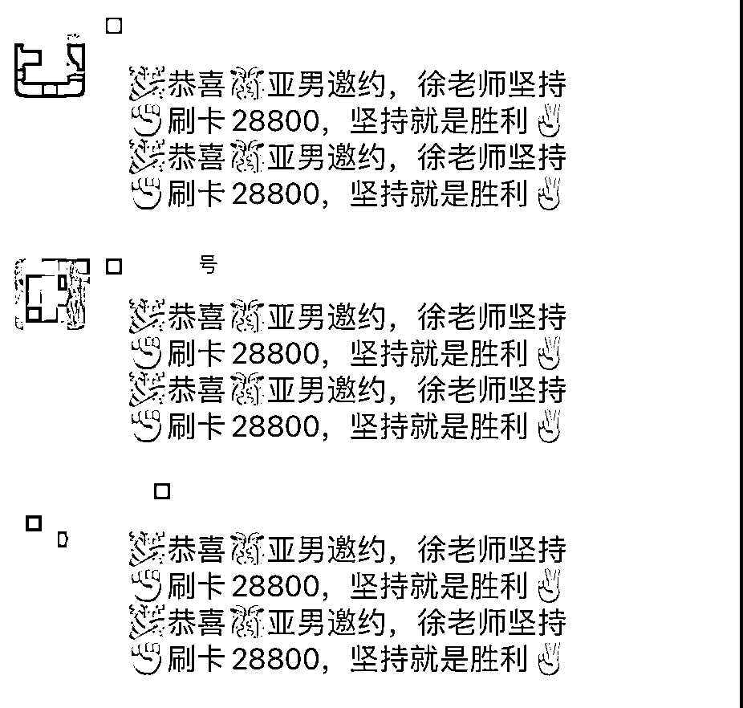

# 如何用一年时间打造一支 12 人年营收 600w 的婚恋团队？

> 原文：[`www.yuque.com/for_lazy/zhoubao/cncs4c6a2ukdkokb`](https://www.yuque.com/for_lazy/zhoubao/cncs4c6a2ukdkokb)

## (精华帖)(55 赞)如何用一年时间打造一支 12 人年营收 600w 的婚恋团队？

作者： 朱倩南

日期：2024-05-15

## **一、沉浸式体验**

可能大家对在婚恋机构找对象会存在一些好奇，什么样的人会通过婚恋机构找对象呢？首先带大家免费沉浸式体验通过婚恋机构找对象的寻爱之旅。

## **二、** **运营模式**

我本人在珍爱做了 5 年，店长也是我珍爱的同事，包括我也在 MarryU、我主良缘等平台做过一段时间，对比下来珍爱的模式是最具参考价值的，目前我们按照这套模式来做：线上引流->电话邀约->面销->线下一对一服务。

另外，我们非常重视培训，因为我们知道招到一个合适的人很难，培养好一个合适的人更难，所以我们在培训上面投入了很多精力，基本每天都会花 1 小时的时间用来开早会，其中 10 分钟用来安排任务，剩下 50 分钟都是用来做技能的培训。真的在婚恋行业做了几年了的人都知道，这个行业不是说做一年两年就能成为专家的，需要大量知识的积累，包括销售技能、情感、恋爱、心理学等等。培训后面我专门拿一个章节来讲。

## **三、** **市场**

目前市场这块，我们的发力点很单一，所有的客户资源只是通过抖音、小红书等新媒体获取的，并没有做活动或者地推等其他方式来获取客户资源，这是我们团队可以提升的方向。

在创业之前，我对抖音、小红书等新媒体一窍不通，所以在创业初期，我把大量的精力投入在了研究抖音、小红书引流上，目前我们市场团队有 3 个人，平均每个月能获取 1500 条客资，对于我们 6 个人的销售团队来说刚好够用。

生财里面的流量大佬特别多，具体的玩法我就不做过多介绍。

## **四、** **销售**

### **团队规模**

销售是人员流动最大的岗位，我们基本稳定 6 个销售左右，其中 3 个能做到 10w+业绩/月，2 个稳定在 5-10w 业绩/月，1 个垫底每个月贡献 3-5w 业绩。有人也许会好奇，一个销售一个月做 10w 业绩是不是很难？难度当然是有的，需要具备一定的技能，但也不是很大，我和我们家店长在珍爱平均一个月 30-40w 业绩，带过 6 人团队单月做到 200w+业绩。

### **客单价**

男单客单价基本在 8000-13000 左右，谈男单对技能的要求没有太高，一个正常的新人，如果 2 个月后，把谈单流程练好就可以上手谈男单了。

女单客单价平均在 20000 左右，谈女单对技能的要求比较高。

会员付款截图

### **考核标准**

1、通话时长

销售的职责是打电话邀约和谈单，对于新人来说，前 2 个月把电话邀约做好就可以了，后面再开始尝试谈单。在不谈单的情况下，每人每天至少要打够 150 分钟的通话时长，否则加班完成。我的要求是：单子谈不成可能是技能问题，但没有预测（邀约成功的客户）一定是态度问题。

通话时长

2、资源利用率

每个销售的库里大概有 150 条左右资源，每天平均 5 条新分资源，我们对资源进行了如下分类：

销售每天按照 40321 优先级去打电话跟进客户。每周盘库一次，将超过 7 次不接电话、信息不回的意向度差的客户抛入公海，这样就能够以最高效的方式筛选出最有意向的客户，提高成交效率。

作为管理者，每天都要去监督每个销售的资源跟进情况，监督范围包括：实时监听电话内容（有没有按照流程和话术来打电话？）、资源跟进情况（有没有按照规定的优先级去跟进客户？），一旦我们发现有人不按照规范来执行，比如一个新分的资源，打了一次电话未接通就直接抛到公海（一个归类意向度极低的客户的地方），那么作为管理者会立即指出这个问题，甚至作为惩罚不会再分配新资源给他，因为他自己不珍惜资源！

## **五、服务**

目前我们服务团队是 3 个人，对于服务团队最基本的要求就是服务好现有的付费会员，如果能有续费业绩那就是锦上添花。

关于如何服务好付费会员，也许很多人的认知是：会员在我们这里交了钱，我们一定要帮 TA 找到老婆/老公！我想说理想是美好的，现实是骨感的。我们会很坦诚的告诉会员，今天你在这里交了钱，我们不能保证一定能让你结婚！我们能保证的是给你介绍的人一定是真实的并且是真诚来找对象的，另外你在情感上的能力一定会有提升！

前不久的 315 曝光的婚恋头部企业的一些乱象，我也想说婚恋行业是一个很容易被人误解的行业，现在在网络上面，只要去搜索婚恋机构，都是充斥着“骗子”、“婚托”、“退费”、“套路”等信息。

不排除这个行业有些想挣快钱的人来当搅屎棍，但是我相信大部分的婚恋创业者都是怀着成人之美的初心来做这件事的！每当收到会员脱单的好消息，给我精神层面的成就感不是钱能够衡量的！

会员恋爱撤档仪式

会员结婚赠送锦旗

## **六、培训**

创业这几年认识了很多同行，有些已经处成了特别好的朋友，很多都是做几年了，但是业绩时好时坏，大部分原因是太依赖某个员工了，比如上个月销冠的状态很好，一个月能做 10w 业绩，这个月销冠可能因为状态差或者离职等原因没有业绩，那么对整个公司的业绩影响就会非常大。这个问题相信很多团队都会遇到，解决这个问题的根本办法就是做好“培训”！培训分为三个方面。

1、 **新人培训**

新人入职，前 3 天熟悉流程、话术、抄写、背诵，达标之后才能上岗。

2、 **日常培训**

每日早会花 1 个小时针对近期高频的问题针对性培训，提升单点技能。

3、 **通过培训找状态**

业绩不好或者员工状态低迷的时候，听优秀的录音，找回正常的状态。通过常态化的培训，我们能保证员工的专业技能一直在稳步提升，做大人效最大化。在我们团队，除了核心的那两三个人，所有人我们都可以替换，并且能够快速的培养起新人填补空缺，销冠从来都不是某一个人，这个月 A 状态好，那么我会给 A 倾斜一定的好资源，让他多产出业绩，那么 A 就是销冠。下个月如果 A 飘了，状态不好，那么我会把好资源倾斜给 B，B 就是下个月的销冠。

我认识的这个行业专业技能在全国可以排前 5 的大牛，坐车、洗澡、上厕所、排队都是时刻听着这几谈单的录音，保持稳定的状态，所以要想在婚恋这个行业保持竞争力，必须要保持长期学习的习惯。

## **七、** **最后**

下次我会分享一些婚恋行业专业技能方面（电话邀约技巧、谈单技能、扩消费意识等）的内容，希望对生财圈里做婚恋的同行朋友们有帮助，也欢迎对婚恋行业感兴趣的朋友一起交流探讨。

* * *

评论区：

咿呀花花 : 说实话，交费以后，就开始 Pua 了
朱倩南 : 整体门店运行思路，其实领导者的思想很重要。你说的肯定有这种情况
田媛 Karen : 我一直好奇和疑问，团队的人或者这个业务的核心成员尤其业务口的，都得是已婚的吗？或者换种说法，从事某个赛道必须要有相关经验吗
朱倩南 : 不需要，我们家未婚的多
A 千韭说 : 受益了！[强] 很强。
朱倩南 : 感谢🙏
李鹏 : 希望其中没有套路，谢谢
奇了个遇 : 难怪最近一堆人给我打电话

* * *