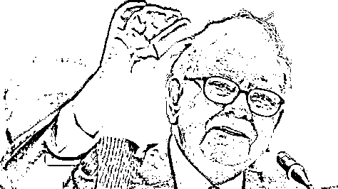
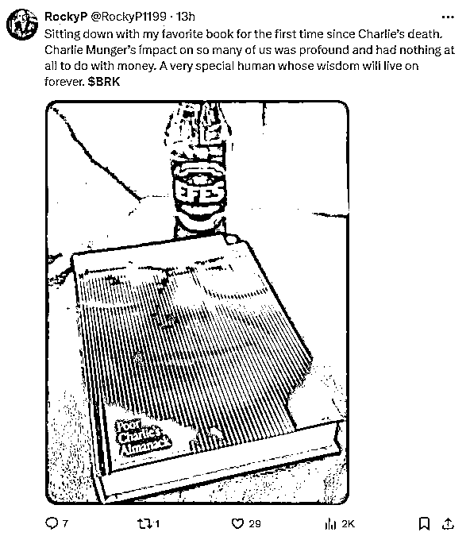
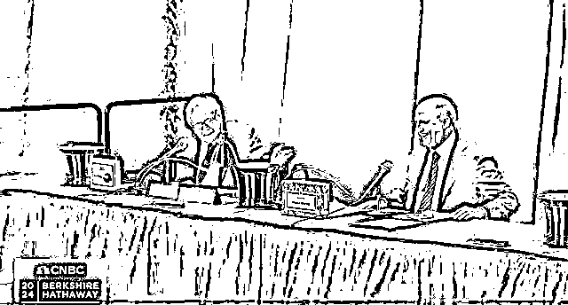

# 2024 巴菲特股东大会--减持苹果的原因-明年美政府巨变

> 原文：[`www.yuque.com/for_lazy/zhoubao/zudvzvi3g0l0gb5r`](https://www.yuque.com/for_lazy/zhoubao/zudvzvi3g0l0gb5r)

## (125 赞)2024 巴菲特股东大会--减持苹果的原因-明年美政府巨变

作者： 时贞易

日期：2024-05-12

2024 年股东大会的主要包括缅怀去年底过世的查理芒格先生，巨额现金储备，为何抛售苹果等，以及公司的未来。巴老说话频次很明显比哪怕去年速度都慢了很多，我们开始聆听九十三年功力的投资智慧：

**一、查理芒格**

在大会正式开始之前，巴菲特用一段开场影片致敬缅怀 23 年底去世的查理芒格先生，并回忆道：我俩生活的方式都是能够尽可能让自己开心的一种方式，查理非常喜欢学习，刚才的短片中也听到了，他对好多事物感兴趣，我们在一起度过的时间甚至比独处要更加开心，他活了 99.9 岁，除了从军的时候，他从来没有自己出去锻炼过，他从来没有想过自己要吃什么，他根本没有想过自己吃得营不营养、健不健康，但还是活了 99.9 岁（**小伙伴们请不要盲目参考查理的饮食和生活习惯并以为这样就可以活到 99**）。

最后巴老独自呢喃到：不知道我哪一天会离开，这也是一个很大的幸事。

**二、2000 亿美元巨额现金**

我们现在可以投资的钱还是比以前更多，这是现在的一个常见现象。而且我觉得是合理的，可预测的。持有的现金包括国债在这个季度结束的时候到达 2000 亿，这个钱我们想要花，但是花的话，我们一定要找到合适的标的。希望风险能够足够小，而且回报能够很大。相对于股票市场上的可用资金，以及世界各地的冲突，持有大量现金有吸引力。

**三、减持苹果**

当被问及是否认为苹果的投资魅力较 2016 年有所下降时，巴菲特开始绕，先是说持有的是公司而不是股票，跟一开始抛售比亚迪一样说这家公司还是非常优秀，随后直言：抛售苹果源于希望避免未来高得多的税率，而非对其长期前景判断。

那如果美国公司税大涨以应对财政赤字，美股抛售潮会随之而来吗，2017 年时任美国总统特朗普颁布的税收改革，将该国的企业税率从 35%降至 21%，同时还做出了一系列其他变革，这些相关减税措施将要到期，明年将开启税务讨论，讨论的内容包括是否调整美国企业税率，拜登呼吁将企业税率提高到 28%，他暗示卖苹果是赶在明年美国政府税务谈判之前进行。

巴菲特的操作一向具有风向标，比如去年银行危机前抛售了持有多年的银行股。明年公司税率如果提高，必然导致公司的盈利能力下降，即使估值市盈率不变，由于盈利变少了，股价也会跟随下跌，估值因子也会下调。可能巴菲特认为苹果未来的涨幅不足以抵消未来税收的增长，那么这其实就暗示了，他对苹果未来股价的态度。

**四、派拉蒙亏损清仓**

paramount global 是一笔亏钱的投资，巴菲特承认他负 100%全责，伯克希尔在 2022 年的一季度买入了 paramount，在 2022 年就跌了 44%，之后在 2023 年又再跌 12%，今年清仓了，巴菲特并没有具体解释公司哪里不好，而是说这个决定让他更深入的去思考，人们在闲暇时间会做什么，运营一个娱乐公司的原则是什么，不管是体育类还是电影类的，在以前的采访中，巴菲特就表示，流媒体公司有太多的竞争者，导致了价格战，巴菲特最后说，这笔投资让我更聪明了，但也让我更穷了。

其实这样亏钱的投资巴菲特有很多次，上次还是在 2016 年买入航空股的时候，然后在 2020 年清仓了，这些投资都反映股市也会有误判，也会在遇到黑黑暗事件的时候不知所措，比如上次航空股他就卖在了最低点，但每次错误都会让他去反思，从上面巴菲特的反思问题，也能看出他问的问题更本质，从一个企业如何能够成功的角度出发，来指导下一步的投资。

**五、美债和美元无法被替代**

当被投资者问及，美国国债规模已经是 2008 年金融危机前的 6 倍，债务规模的快速扩张是否存在风险，巴菲特回答道，最乐观的猜测是，美国国债会在很长时间内都会被市场接受，因为除了国债没有其他更多更好的选择，考虑到通胀威胁全球经济状况的危机，以及美元作为储备货币的地位等各方面因素，美国国债的规模并不算特别大，问题不是美国国债的绝对规模在威胁美国金融体系，而是通胀和未来的美元价值在威胁整个系统，所以，我不担心美国国债供应的绝对数量有多少，而是担心财政赤字的前景。央行需要立法者的帮助，来控制美国不断增长的赤字。

**六、为何增持化工能源**

在被问及在拉斯维加斯，太阳这么好的地方，为何还要继续投资化工能源时，阿贝尔表示，当你考虑能源部门内正在进行的转型时，我们正在从看资源转向可再生资源，但这种转变不会一夜之间发生，这种转变将需要许多年，而且当我们使用像太阳能或风能这样的可再生资源时，它们是间歇性的，我们确实尝试将其与电池结合使用，但目前还做不到完全从碳资源转型，巴菲特则附议称，我们有足够的资金来实施它，但有些事情确实需要一定的时间，若储能技术无突破，太阳能永远不会是唯一的电力来源。

**七、下任 ceo 阿贝尔将完全接管投资决策**

首度确认阿贝尔将完全接管投资决策：巴老说自己现在每天只工作两个小时，很快整个投资流程就会完全交到团队手中，资本配置应完全由阿贝尔来负责，我不希望有几百个人每人管理十亿美元，我的阅读速度，体力和运营效率都在下降，比 30 年前低了很多，如果子公司管理层有更好的人去汇报工作，为什么要来找我。

**八、如果只有 100 万和年轻的身体该如何投资**

之前巴菲特就说过，如果给他 100 万，他就能做到年化 50%的回报，巴菲特说，如果是我的话，我会拿起相当于以前的穆迪手册，然后开始一页一页的看，找那些有吸引力的小公司，你必须热爱这个游戏，这个找到低谷股票的游戏，不能只是为了钱，能把所属公司行业摸得透透的。

问答环节的最后，巴菲特以一句俏皮的告别语结束，他笑着说，**我不仅希望你们明年来，我希望我明年也能来。**

大会结束，全场观众再次起立，为这位 93 岁的投资界传奇鼓掌。

我现在跟三十年前、四十年前比，我自己做执行这方面的工作肯定不像以前那么高效了，我没有办法认识所有的这些董事会的经理人们，但是我身边有格雷格和阿吉特这样的得力助手。

我想说我每天接这些经理人的电话，基本上现在数量为零，而格雷格这边是在帮助我们应付所有的这些咨询和电话，我就坐在那儿读《华尔街日报》就行了。

你现在有 1820 亿的现金了，你在等什么呢？为什么不把它配置到其它的一些该有的地方去呢？

**巴菲特：**这个问题很好回答，台上的这几个人都没有一个很好的想法，怎么好好地去用这笔钱，我们不会在现在一个利率 5.4%的情况下去用这个钱，利率这么高，当然这一点不要去跟美联储讲，我们只在正确的时候去挥杆一击，但现在好多人不管什么时候都在乱挥舞着他们的棒球棒，因为可能觉得之前挥棒都打空，那我就不停地打、不停地击，总会打到一个正确的标的。我们现在可能对这个回报不会再像以前一样想到要超过 100 亿，也许超过 1000 万是比较合适的。现在如果还是以前的那个目标，可能找不到这么多的机会。比如说在日本，一个公司如果收购 300 亿、400 亿，可能回报会比较好。现在如果看到这样的一家公司，也许我会去做的。我现在可能也许在“绝食”吧，现在没有这种足够的投资标的，没有足够有魅力、有吸引力的投资标的让我去配置资产，看以后有没有任何变化吧，我们拭目以待。

我觉得任何一个劳动密集的行业都会受到 AI 的威胁，当然在此层面之下可以营造更多的娱乐的时间。

我不知道我会不会变得更富，这个世界会不会变得更好，但是你们都知道，善良的人到最后他们都想要成为更好的人。你们中的很多人都是这样。

* * *

评论区：

传说 : 巴菲特就是极度自律，高度理性和专注的最佳代表[强]
小 Q : 我觉得任何一个劳动密集的行业都会受到 AI 的威胁，当然在此层面之下可以营造更多的娱乐的时间。

我不知道我会不会变得更富，这个世界会不会变得更好，但是你们都知道，善良的人到最后他们都想要成为更好的人。你们中的很多人都是这样。

* * *