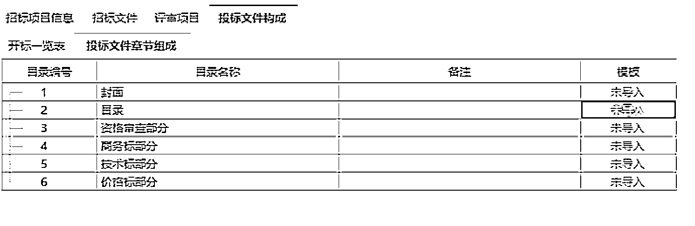
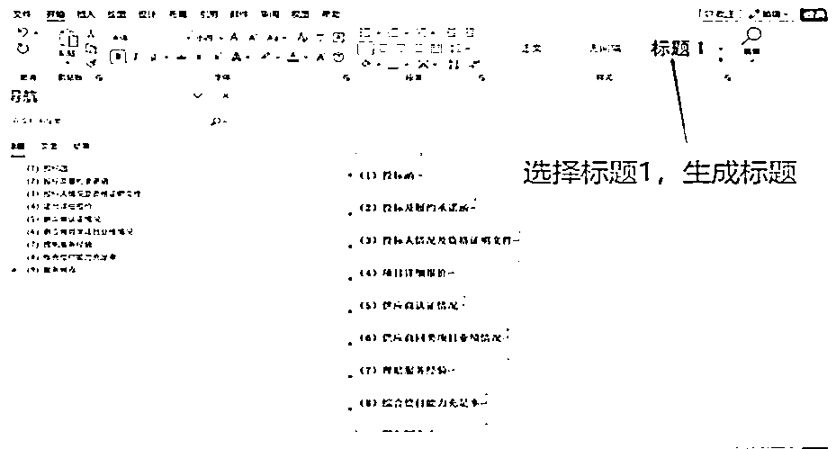

# 发现商机，拿到“项目”招标书，该怎么做？

> 原文：[`www.yuque.com/for_lazy/zhoubao/cuhtzzgwmvdng33v`](https://www.yuque.com/for_lazy/zhoubao/cuhtzzgwmvdng33v)

## (28 赞)发现商机，拿到“项目”招标书，该怎么做？

作者： 田春先

日期：2024-05-11

我们知道生财有术提供了风向标，也就是“潜在客户商机挖掘”，我们传统的行业也有招投标“商机”捕捉，我检索了一下生财有术的专栏，没有看到怎么做投标书的，今天整理一份，供大家参考。

1、先查看投标资质：要求**总公司**还是**分公司**，如果是分公司投标，需要总公司授权分公司**唯一投标人**，要第一时间优先安排办理；

2、看是否需要**投标保证金**，如需要，在上报应标条件的时候同时转给公司财务部申请。

3、查看**密钥**有效期，如标书是**电子标书**，下载招标文件后，要**看法人及机构**是否在有效期内，注意：**不要在投标截止日之前失效！**

4、**通读招标书，看标书构成**，如商务标、技术标、资信标、电子标。同时要注意看标书制作方式，及文件导入格式（WORD 还是 PDF），是**分项**还是**整体导入**。

5、根据招标文件提供的**投标文件编制格式**，快速做好标书初稿，根据标书要求分别建立投标文档（商务标、技术标等），生成**目录**索引。

6、将公司最终批复投标条件（注意招标书中带 ★标记内容，是否要求不可偏离，**不响应是否会废标**）、公司证照等资料填入标书初稿，排版后定稿，申请 OA 用印，如线下投标，则打印装订即可。

7、如需纸质文件投标，应按标书分类打印投标文件的相关**封面及密封条，分外包装及内包装**，电子标还需准备好 U 盘。

最后附**常见废标**事项，请注意自检：

# **如何发现”商机“？**

把你所在行业的关键词输入第三方网站（乙方宝＼千里马＼剑鱼，前期不用付费，再凭关键词查找真正的网站来源即可）检索即可

以千里马网站为例，比如输入“工程保险”（根据你的行业填写），选广东，近一周，搜索方式：标题，即可看到最新的招标公告。

# 附以下**常用查询网站及网址（排名不分先后）**

中国招标投标公共服务平台

[www.cebpubservice.com](http://www.cebpubservice.com/)

全国公共资源交易平台

[`www.ggzy.gov.cn/`](http://www.ggzy.gov.cn/)

广东省招标投标监管网

[`zbtb.gd.gov.cn/login`](http://zbtb.gd.gov.cn/login)

深圳市政府采购监管网

[`zfcg.sz.gov.cn/`](http://zfcg.sz.gov.cn/)

深圳市公共资源交易平台

[`www.szggzy.com/static/index.html`](https://www.szggzy.com/static/index.html)

北京市公共资源交易服务平台（全国公共资源交易平台（北京市））

[`ggzyfw.beijing.gov.cn/`](https://ggzyfw.beijing.gov.cn/)

河北省招标投标公共服务平台

[www.hebeieb.com.cn](http://www.hebeieb.com.cn/)

山西省招标投标公共服务平台

[www.sxbid.com.cn](http://www.sxbid.com.cn/)

内蒙古招标投标网

[www.nmgztb.com.cn](http://www.nmgztb.com.cn/)

辽宁省招标投标监管网

[www.lntb.gov.cn](http://www.lntb.gov.cn/)

吉林省公共资源交易公共服务平台

[`www.jl.gov.cn/ggzy/`](http://www.jl.gov.cn/ggzy/)

江苏省招标投标公共服务平台

[www.jszbtb.com](http://www.jszbtb.com/)

江西省公共资源交易网

[www.jxsggzy.cn](http://www.jxsggzy.cn/)

山东省公共资源交易网（全国公共资源交易平台（山东省））

[`ggzyjy.shandong.gov.cn/`](http://ggzyjy.shandong.gov.cn/)

湖北省公共资源交易电子服务系统（全国公共资源交易平台（湖北省））

[www.hbggzyfwpt.cn](http://www.hbggzyfwpt.cn/)

广西壮族自治区招标投标公共服务平台

[zbtb.gxi.gov.cn:9000/](http://zbtb.gxi.gov.cn:9000/)

全国公共资源交易平台（海南省）

[zw.hainan.gov.cn/ggzy/](http://zw.hainan.gov.cn/ggzy/)

全国公共资源交易平台（四川省）

[ggzyjy.sc.gov.cn](http://ggzyjy.sc.gov.cn/)

贵州省招标投标公共服务平台

[ztb.guizhou.gov.cn](http://ztb.guizhou.gov.cn/)

陕西采购与招标网

[www.sntba.com](http://www.sntba.com/)

甘肃省电子招投标公共服务平台

[ggzyjy.gansu.gov.cn/](http://ggzyjy.gansu.gov.cn/)

宁夏回族自治区公共资源交易网（全国公共资源交易平台（宁夏回族自治区））

[www.nxggzyjy.org](http://www.nxggzyjy.org/)

新疆生产建设兵团公共资源交易信息网

[ggzy.xjbt.gov.cn](http://ggzy.xjbt.gov.cn/)

最后，祝各位有标必投，有投必中！一起生财有术！谢谢你的阅读！

* * *

评论区：

Rio : 代写标书 成了 5 个点 不成不要钱
咿呀花花 : 我可以代写标书，哪里有这个需求呢？
李昊 : 可以
蝈蝈、 : 中标金额 5 个点么？
田春先 : 建筑工程可能有，总包提供资质参与投标。
一只微微笑 : 大公司都有投标组的，而且大项目都是拼关系，怎么可能拿出 5 个点给代写标书的人
Rio : 终于有个明白人，能拿这个点数肯定有资源
一只微微笑 : 那就是抢手了，传统行业都是这样拼关系

* * *