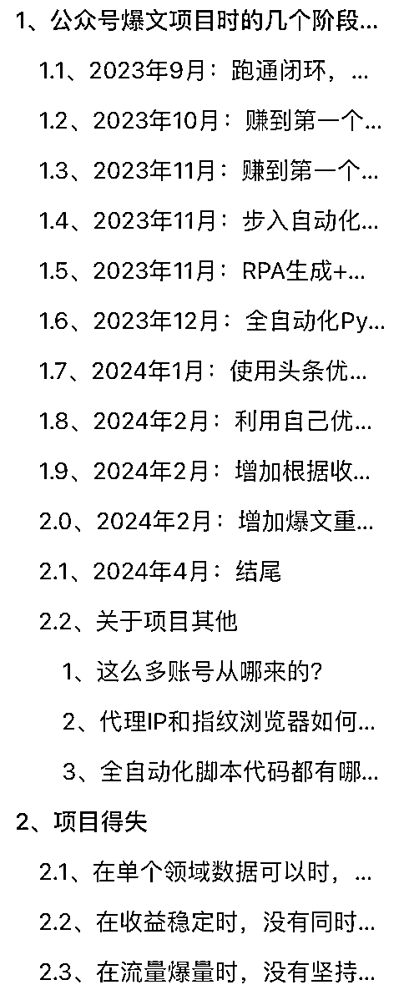

# 公众号爆文全自动化，7 个月收益 37 万复盘

> 原文：[`www.yuque.com/for_lazy/zhoubao/rvh27w613r5v82b7`](https://www.yuque.com/for_lazy/zhoubao/rvh27w613r5v82b7)

## (165 赞)公众号爆文全自动化，7 个月收益 37 万复盘

作者： 毛韩

日期：2024-05-11

大家好，我是毛韩，第 5 期圈友，编号 21985。

之前发过两篇精华帖：

[公众号爆文核心逻辑分享](https://wx.zsxq.com/dweb2/index/topic_detail/811422512225252)

[新手小白如何借助生财小航海每月多赚 2 万元（附：小航海项目筛选模型）](https://wx.zsxq.com/dweb2/index/topic_detail/214214855554841)

这次发帖，一方面因为公众号爆文项目在我这里确实已经告一段落了，同时又有一些新的想法，想看看能不能找一些圈友合作；另一方面看到好朋友@阿泽 分享的复盘帖深有感触，也想给自己这几个月时间一个结果，总结一些得失。

本篇文章分为以下三个部分：

1.  复盘操作公众号爆文项目时的几个阶段思考

2.  复盘项目中的得失之处

3.  总结这段经历，开展新项目的思考

详情请移步飞书：[公众号爆文全自动化，7 个月收益 37 万复盘](https://tjhy5ng53f.feishu.cn/docx/IwGtdlp73ou55txP0qIcyJytnRg?from=from_copylink)

大纲如下：

* * *

评论区：

哲学工作室 : 受益是依靠公众号广告吗？
写的有点太理论了，例如怎么挖掘蓝海项目，感觉上公众号饱和了，挖掘就很关键
一朵云 : 太牛了！
阿泽 kk : 毛哥终于来了[旺柴]
牛高 : 这个写的还不错了，比小部分圈友的钓鱼帖子好太多。
哈总 : 太强了
💡学习了批量采集对标帐号+Python/RPA 矩阵化操作

😍“有次 RPA 发布脚本出现 Bug，将同一篇文章在同一个账号上发了 7 次，第二天我看数据时发现 7 次中，有 3 次都破 10w 阅读，当天这个号赚了 1.1w 的收益。​
于是连夜增加了爆文重发功能，这个功能后来为我多赚了 5w 元左右。”
哈哈哈，这也太搞了
Rio : 目前卡在矩阵上，求分享代码
大屋顶 : 是我最近看过生财里最好的文章。比那种四处复制黏贴招学员的贴子硬核太多！毛总牛啊。太牛了！
途 : 太牛了，目前我们也在搞公众号，奈何没你那么厉害，只搞通了 RPA，没有您这么智能，非常佩服

* * *