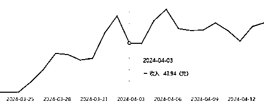

# 站撸流，论如何复刻“职场柠檬”公众号？---AI 原创全自动爆文保姆喂饭级教学

> 原文：[`www.yuque.com/for_lazy/zhoubao/bzd62vg76vg4772g`](https://www.yuque.com/for_lazy/zhoubao/bzd62vg76vg4772g)

## (54 赞)站撸流，论如何复刻“职场柠檬”公众号？---AI 原创全自动爆文保姆喂饭级教学

作者： Rio

日期：2024-05-07

嗨，大家好，我是 RIO

AI 武器研究所成员，我们专门研发"能搞钱的 RPA 工具"，定期公布 RPA 工具以及分享背后的运营逻辑

今天分享主题是公众号爆文写作

这也是本人第二次航海的复盘

上次航海之后写的“ 纯数据流打法”，最近已经加了精华

纯数据流，理科生如何攻坚“公众号爆文写作”？---2024 春季 RPA 工具发布会

很开心，不幸的是，“纯数据流打法”有的过时，

那时的我有点“炫技”，讲的比较散，只是一点

这次航海我尝试把他们串成线，奔着“变现”去

实战中演变出更强的打法

容我慢慢道来

这次航海教练推荐了几个赛道

其中聊到了职场人情世故很爆，例如“职场柠檬”

聊到格式化，素材重组，AI 模块化扩写

我感觉我可以

说干就干，这次要复刻“职场柠檬”公众号

注意，复刻不是洗稿，而是做像素级复制，然后按他的风格写文章

有点像厨师，吃一口，然后炒出同样的味道

经过一个月强撸终于赚到了一张门票

接下来，一步一步介绍我是怎么做的

尽可能做到保姆级

之前好几篇文章都写到要公众号要坚持日更

关于这，我是这么思考的

其实**根本不存在坚持**一说

公众号拼的就是原创的续航能力

所以，要干就要干一辈子

**“干一辈子”意味着写到死**

“写到死”意味着无论退休，忙工作，休假，生病，任何状态不能断

“不能断”意味着写文章不要花太多功夫

“不花功夫”意味着不能全手搓

“吃到老”意味着文章有收益

“有收益”意味着文章有质量

“有质量”意味着素材要源源不断

“源源不断”意味着不违规

“不违规”意味着不靠洗稿

总之，细水要长流，目标是一辈子的号

为此，我给出的方案：**“AI 原创全自动文章生成”**

全程 RPA，机器负责定向采集，批量 AI 写作，格式化的编辑，批量的存入草稿

人只要负责在订阅号 APP 上设置发布时间即可

当然需要人给文章以“灵魂”

只要电脑在，素材源没有改，人还有思考，就可以站撸到老

所谓“站撸流打法”

论质量可能打不过手搓

但论持久与量级，手搓完全不是是对手

最近有个号“燕子职场 30” 日更 500 篇 1 分钟 1 篇  该爆的一样爆 平台对他毫无办法

他们用的手段大概就是这套

但他们重复洗同一篇文章的做法未必能长久

有没有**不靠洗也能撸一样能爆**的方法

在那种行业中相当讲究原创与算法的环境也能爆的方法

我们开始吧

请移步到飞书，注意里面大量的小视频，建议在 WIFI 环境下观看

[`ovumyiw67u1.feishu.cn/wiki/MYdQwzDwmifs5bk9c1rcxuzknNc?from=from_copylink`](https://ovumyiw67u1.feishu.cn/wiki/MYdQwzDwmifs5bk9c1rcxuzknNc?from=from_copylink)

* * *

评论区：

啊喂王默 : 牛，技术流
芝马开门 : 干货满满啊~~~
芝马开门 : 老大 666
阿船 : 非常全面，保姆级教学。有个地方看不太懂“关于去 AI 味，稿子丢给算法跑一下”，这一步应该如何抄作业
Rio : 独家算法去 AI 特征，专门针对各大平台识别算法，才能搞到流量。算法非售品，这里仅做介绍
Rio : 纯纯理科生
水深无形 : 请问如何加到技术大牛的微信？
Rio : Rio0235

* * *