# 最近布局问一问导流到公众号，被封号了，所以把问一问规则分享出来：问一问 · 回答指引

> 原文：[`www.yuque.com/for_lazy/zhoubao/shlho3kho1saebxe`](https://www.yuque.com/for_lazy/zhoubao/shlho3kho1saebxe)

## (17 赞)最近布局问一问导流到公众号，被封号了，所以把问一问规则分享出来：问一问 · 回答指引

作者： congshan

日期：2024-05-09

hello 大家好！我是山歌，也可以叫我 congshan，曾任全球知名培训机构全国 TOP sales 以及销售团队负责人，后转做财税公司近 5 年，服务咨询超 1000 个小微企业主，目前在深耕关于零基础老板开公司必备知识付费赛道，希望持续为大家输出有价值有用的财税知识，如果你有想了解的主题也欢迎在评论区留言，如果这篇文章对你有帮助也希望多多点赞和转发给有需要的圈友。

重点在最后，一定要看到最后，容易被封的几种情况。

# **问一问 · 回答指引**

问一问鼓励原创、真诚的内容，真实的经历体验对他人生活更有帮助与启发；原创观点与独特见解更令人印象深刻。搬运和 AIGC 的回答不受欢迎，会被驳回甚至触发处罚。

### 1\. **遵循以下原则，能让你的回答被更多人看见：**

##### **✅ 真诚分享，引发共鸣**

分享个人真实的经历/体验/观点/真实答疑等内容，传递生活所见，引发他人共鸣，对他人实际生活有帮助与启发。

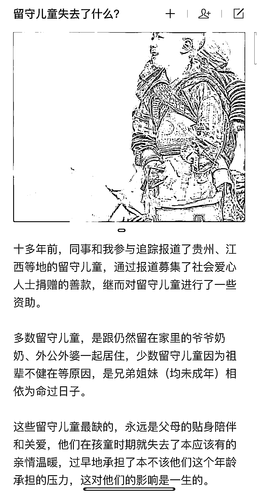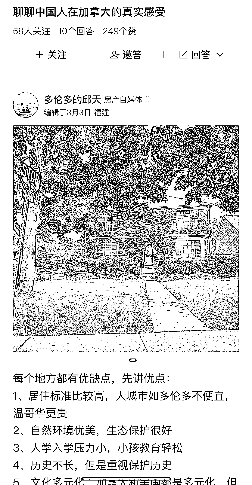

✓ **正例：**个人真实经历/体验分享，对他人有启发

##### **✅ 内容实用，贴近生活**

内容有完善信息和较强实用性，根据真实生活经验输出干货，步骤清楚可参考，对他人有帮助。

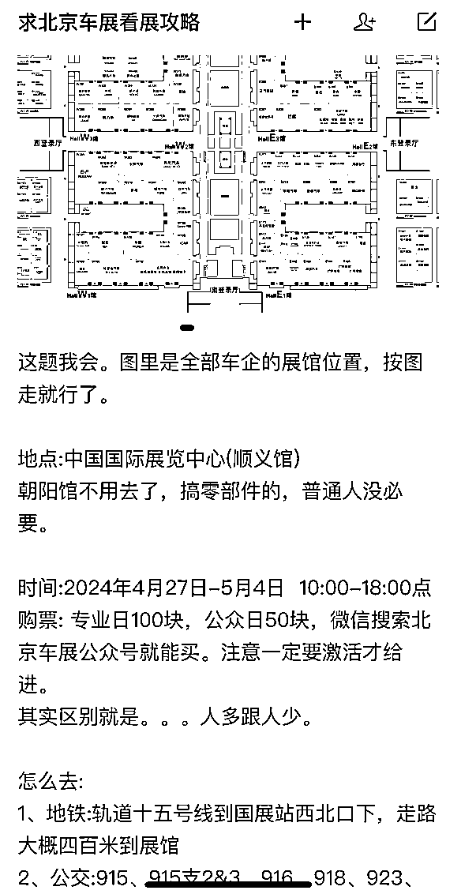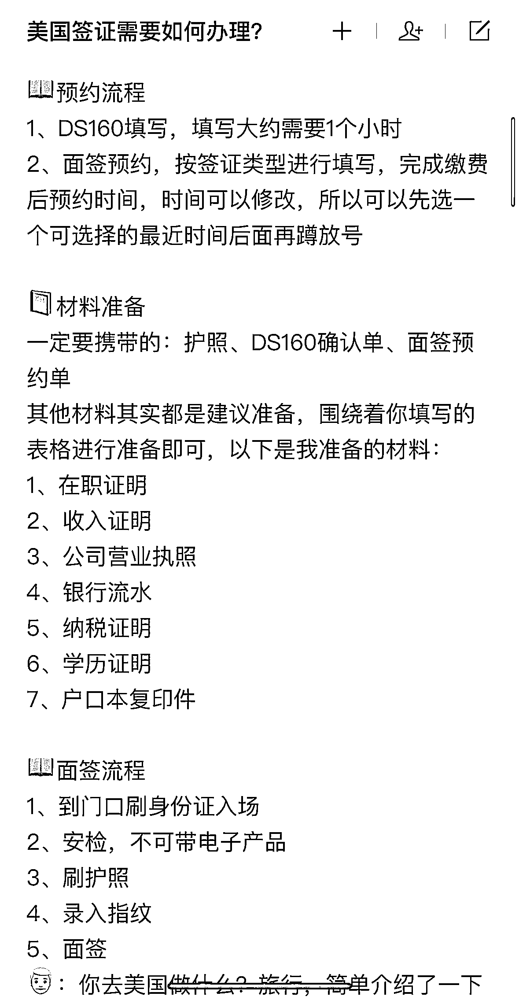

✓ **正例：**内容步骤清晰可落地，实用价值强

##### **✅ 专业翔实，具有深度**

翔实专业，输出干货，引用客观可信的数据和案例等深入浅出解读，提供信息增量或不同常人的专业解读视角。专注回答某几个领域内的内容，更易收获用户信赖。

**理想汽车全线产品降价，MEGA 降 3 万，怎么看？**

**超级猩猩怎么走出差异化，干掉传统健身房？**

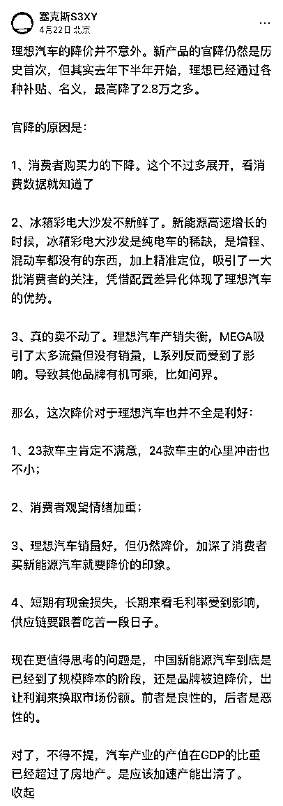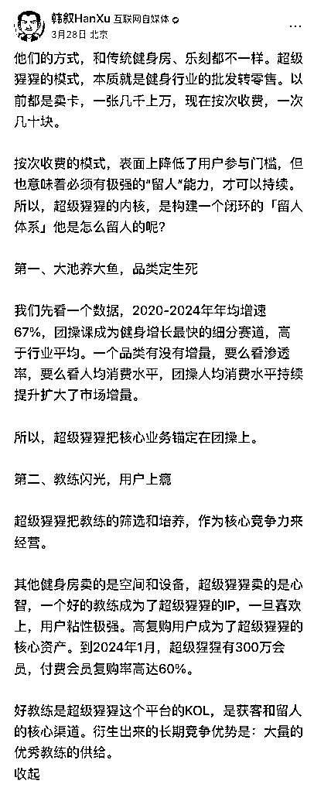

✓ 内容翔实专业，读后有获得感

##### **✅ 图文并茂，多图更佳**

✓ 问一问支持在回答中插入图片、视频等内容，我们鼓励图文并茂的内容，多图更佳

✓ 多媒体内容能在推荐流、搜索等场景中获得更好的展示和流量收益

✓ 文字和图片相互补充，与事件主体强相关，共同传达完整信息

✓ 图片清晰美观，建议尺寸 3:4

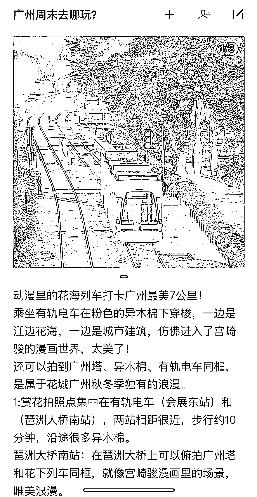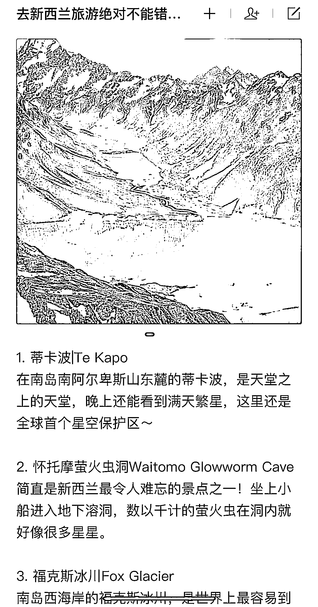

✓ 使用多图且清晰美观，与文字相互补充

##### **✅ 观点前置，开门见山**

省掉引言、导语等没有信息量的开头，鲜明有态度的观点更容易被用户喜欢。

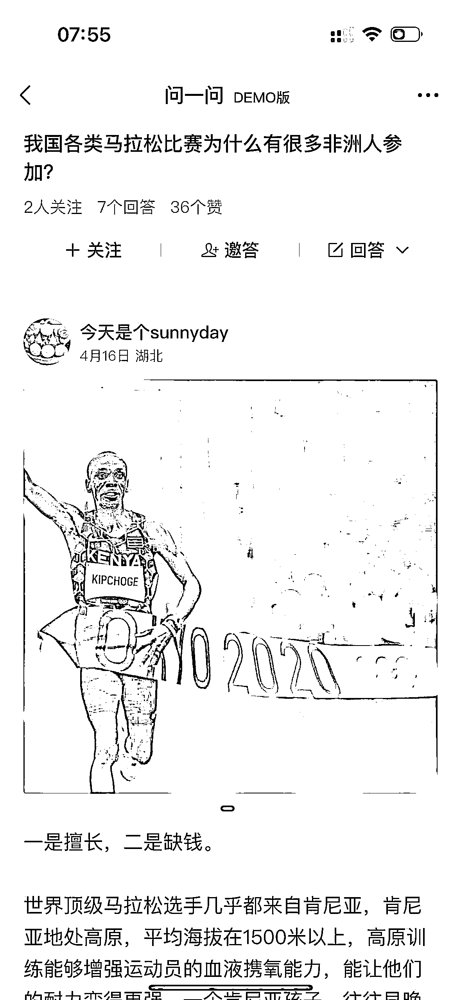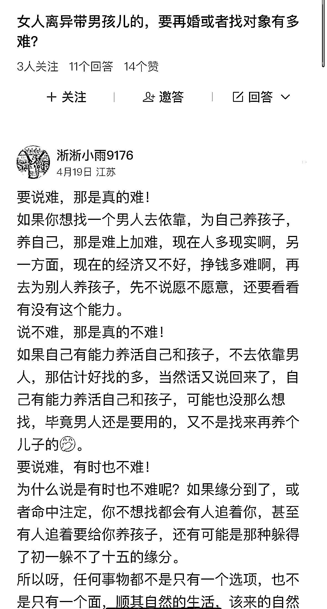

✓ 开头表明态度

**❌**不直面问题核心，较啰嗦

##### **✅ 分段排版，阅读友好**

建议使用短句，少用长句。建议每 3-4 行即分段，可用空行分隔大段文字，提高用户的阅读体验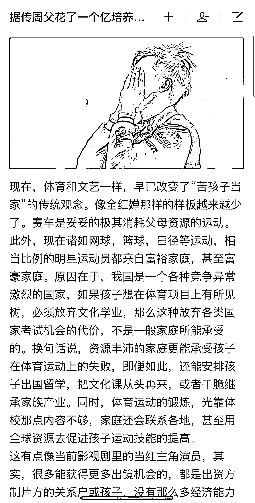

✓ 合理分段阅读体验好

**❌**排版差阅读吃力

### **2\. 请避免以下类型的回答（回答可能不被推荐，甚至被驳回或引发账号处罚）：**

❌ **AIGC，搬运抄袭：**明显由机器直接生成的低质回答，或者直接搬运他人的内容

❌ **恶意引流、不当营销：**以吸引流量为目的，在回答、昵称、帐号个性签名中，包含诱导关注或明显不当营销信息

❌ **造谣诽谤、侮辱谩骂**：传播有明显常识性错误或有害谣言，侵害他人合法权益，拉踩引战、攻击丑化、恶意歧视特定群体的回答

❌ **答非所问、离题万里**：回答内容和问题并不相符，或全篇没有意义的假大空文字、无关图案或表情，无法理解，对解答问题没有任何帮助

❌ **重复发表：**重复发布多篇相同或相似内容，包括文本、图片、视频

❌ **水印内容：**回答含有图片视频涉及第三方平台等水印，影响用户观感，且有引流不可控风险

* * *

评论区：

暂无评论

* * *