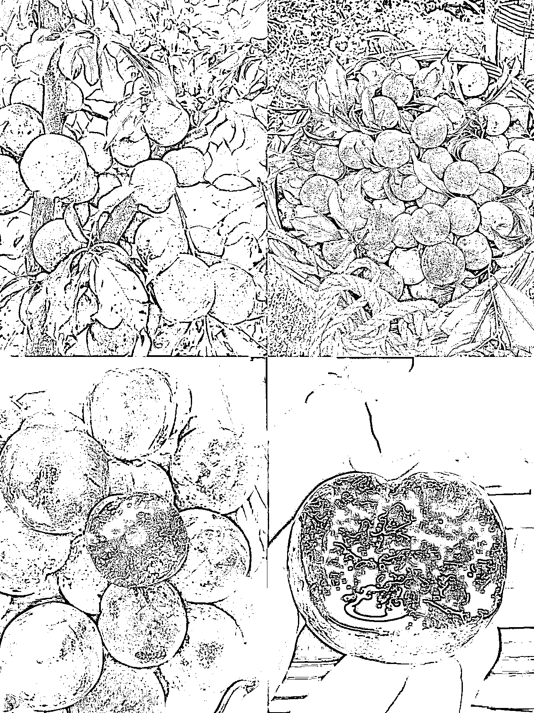
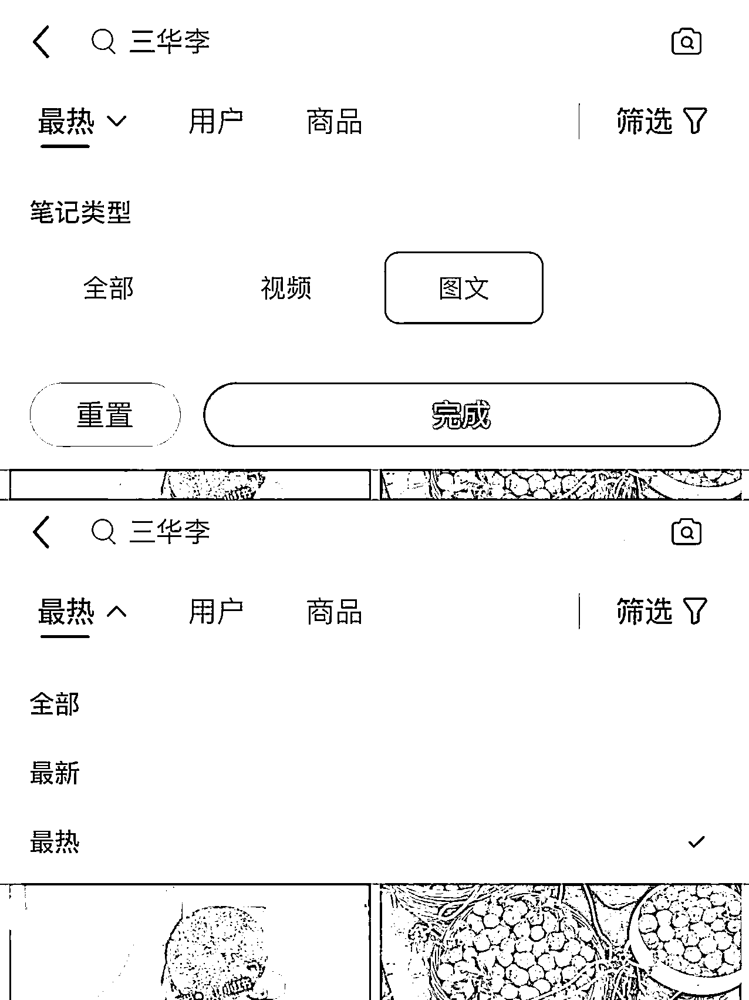
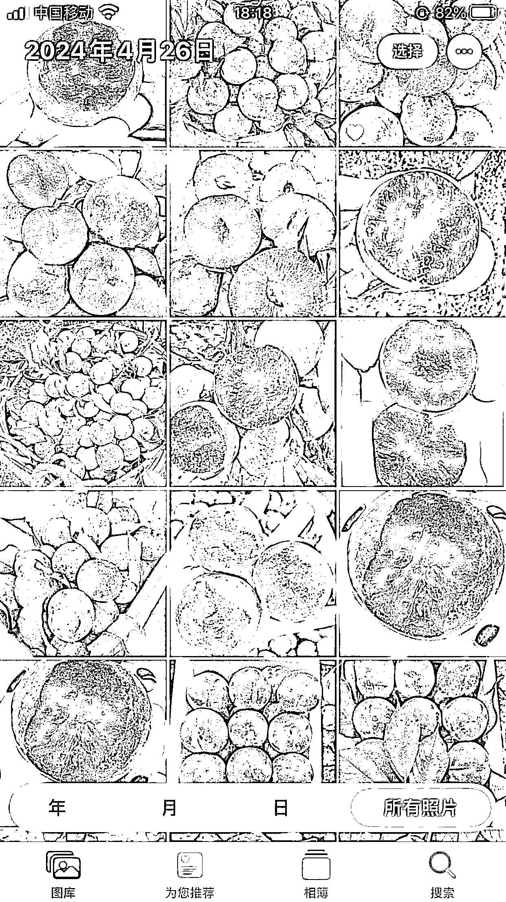
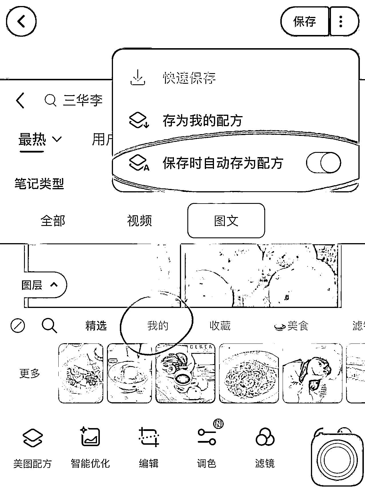

# 分享我平时在小红书选品后，如何操作下一步的经验

> 原文：[`www.yuque.com/for_lazy/zhoubao/tcz8k59eakvmhey2`](https://www.yuque.com/for_lazy/zhoubao/tcz8k59eakvmhey2)

## (127 赞)分享我平时在小红书选品后，如何操作下一步的经验

作者： 艾小飞

日期：2024-05-06

大家好，我叫艾小飞，是一位常玩小红书的实战者。

近期我发表了几篇关于小红书如何选品思路和案例出来后，好几个人来问我说：飞哥你说的道理我都懂，但我却不懂选了产品后该如何去做下一步，完全是懵的，飞哥平时你是怎么做到的，请问能教教我吗？

本来我认为这种问题已经是很常识了，没必要浪费时间再科普一遍，但没想到的是，居然还是会有人不懂这里面的操作流程该怎么做

既然这个问题困扰了大家很久，又没谁专门来讲清这事，那我花点时间来给大家分享下，我平时都是怎么操作和思考这种问题的，根据文中举的例子，看看我所思考出来的点子，是不是你想要的答案

好了，也不浪费你们时间，咱们直接开始进入正题吧

当发现一款适合拿来做小红书无人直播的产品后，下一步该如何做呢？

就拿我最近看好的一款产品来说说吧

虽然这款产品利润低，但需求大，只要做好封面标题，爆单概率是挺大的。非常适合新人拿来入门练手

这款产品就是【钱排三华李】

如果确定好产品后，那么我的第一个步骤，就是发布带货笔记

这么做的目的，是为了验证这个产品是否有真实需求，是否有人能接受我的定价，是否能通过我的封面文案模板去下单，账号是否有正常流量

这些都是非常重要的关键点

如果不提前做好数据测试摸透用户的真实想法，想靠着“感觉”来走捷径的，不光做得很累，而且还不一定能卖得出产品

既然是发布带货笔记，那该如何发呢？

发布笔记这块，我喜欢把它分成两个部分

一个是图片部分，一个是文案部分

先从图片部分开始说起，看看我平时都是怎么快速的做出这套模板来的

当确定了产品后，为了搞定图片素材，很多人第一时间就去买产品回来拍拍拍，费时间和成本不说，还隐藏了很多的不确定性

因为谁也不敢确定拍出来的效果一定会带来爆款，对吧

那我是怎么做的呢

最简单的方法，就是“借”

把同行已经爆过的封面图片全都“借”过来，简单加工后就可以发布了

这样有个好处是，省时省力省成本

最主要是，别人已经爆过的素材，你“借”来再发一次，还是有很大概率还能继续再爆！

这就是为什么每次当我选好品后，都能快速当天出单的原因

好，既然是“借”，那该如何借呢？这里面也是有技巧的

如果你现在正好有空，可以跟着我一起来操作一遍你就懂了

你现在去小红书搜【三华李】这个关键词，然后点【图片】，选择【最热】那烂

这里搜出来的基本都是爆款笔记了，排名越靠前，流量就越大

然后接下来你需要做的动作是，在这么多篇的笔记里，你根据【红】【大】【多汁】的筛选标准，把符合条件的图片全都截图保存到相册里，大概需要 20 张左右，凡是能达到其中一个条件就行

记得，只管专心选图片，别去看标题

因为有些标题写得很吸引人，但封面却一般般，那样只会影响你最理性的判断，导致你选的图片质量不好，从而发布笔记时都没什么流量

给你们看看我选出来的图片

完成了这一步后，下一个动作就是要把截图好的图片简单做二次创作的处理。

**为什么要这么做？**

因为你“借”来的图片是有平台原创保护的，你啥也不处理直接发布出去，被人举报或平台发现了，不光是被限流，有可能还会被封号

为了安全起见，我们需要做点简单的处理工作

怎么做呢？

把相册里的 20 张图片裁剪成 3:4 尺寸比例，然后选择垂直平移，把图片给反转过来

操作这个步骤后，就打开美图秀秀，给图片加滤镜、加贴纸、加文字，目的是为了尽量让别人看不到这张图片有“借”的痕迹

最后一步在保存图片前，在右上角点击保存配方，当你每次二创图片素材时，就在【我的】这栏选择刚刚保存好的配方，就可以做到复制粘贴了

这样操作方法很简单，基本花不了几分钟

虽然这样简单处理发出去后也有可能被判“搬运抄袭”违规，但至少比处理前的安全系数要高很多了

好，操作完成了图片部分后，现在我继续往下说文案部分

玩过小红书的朋友都有一种体会，封面图片知道怎么做，但就是不懂要怎么写文案，特别是标题，每次想到这个标题就头疼，大家有没有过这种感受？

对我来说，文案部分是创作笔记中最难的一个环节，如果从 0 开始教大家如何去写，估计没个上万字，很难讲到关键的细节

所以为了节省你们的时间，我直接把爆款标题的模板分享出来，你们稍微在模板基础上加加工就成一条小红书爆款标题了

这个模板我也测试过了，只要账号没问题的，都是会有流量的

(标题全部给你们打了出来，方便你们复制粘贴)

*三华李纹路 xxxxx*

*三华李纹风不动 xxxxx*

*三华李铁定 xxxxxx*

*三华李宁愿 xxxxxx*

*三华李宁肯 xxxxxx*

*三华李宁可 xxxxxx*

*三华李宁不 xxxxxx*

*三华李宁要 xxxxxx*

*三华李宁做 xxxxxx*

*三华李冰冰爽爽 xxxxxx*

*三华李冰冰凉凉 xxxxxx*

*三华李白给 xxxxxx*

*三华李白送 xxxxxx*

*三华李健康 xxxxxx*

*三华李健身 xxxxxx*

*三华李健忘 xxxxxx*

*三华李现摘 xxxxxx*

*三华李现在 xxxxxx*

*三华李现采 xxxxxx*

*三华李想要 xxxxx*

*三华李想不到 xxxxxx*

*三华李想给 xxxxxx*

*三华李想说 xxxxxx*

*三华李想对 xxxxxx*

*三华李想象 xxxxxx*

*三华李刚好 xxxxxx*

*三华李刚想 xxxxxx*

*三华李刚要 xxxxxx*

*三华李刚才 xxxxxx*

看完这些标题，你们思考想想，我为什么会拿这个模板来做三华李的爆款标题模板呢

是不是好像在文案中隐约看到有某个明星的名字了对吧

对的，我这是故意这么做的

给你们分享下，我为什么会这样操作的原因

当时我在给这款产品想文案标题的时候，我发现产品的名称里有个“李”字，这字让我想到这不就是人名的姓嘛

既然这样，我能不能借用姓“李”且有热度的明星来放在这个产品标题上呢？

嘿～越想越觉得有意思，那就这么去干吧

然后马上开百度搜，看看姓李的明星都有谁，搜了后还根据他的影响力进行筛选，然后再用他后面的那个字来组词排列，看看能不能结合产品李子的特性，读起来又不是很奇怪的

讲真的，单单就弄这个姓李明星名字组词，耗了我 5 个小时才完成，中途差点都想放弃了，所以你们刚刚看到的那个标题模板，都是我用时间和精力给你们总结出来的，创作不容易啊

筛选出来后，当天就用这组模板拿去做第一批的测试，想看看能不能成

我也没想到，才刚发出去没半小时，就有人在笔记评论区留言

*“笑死，我还以为是李宁改行卖水果了呢哈哈哈”*

*“李宁不是卖衣服的吗，怎么沦落到卖...哦对不起看错了哈哈哈哈”*

*“远看是李宁，近看是李子，想问这李子 500 克一斤卖吗”*

哈哈哈看他们留言都要把我逗笑了

也有人说：

*“看着好嘴馋啊，怎么买”*

*“我们这超市好贵啊，你这多少钱一斤”*

想想，他们这些留言说明了什么问题？

是不是至少验证了一点，这组标题是测试成功的，对吧

通过借用有明星名字标题，成功的把很多用户都吸引过来围观评论，评论越多流量越多

这篇笔记发了一天后，破了 4 万播放，有 800 多人留了言，留言大半是娱乐性的吐槽，小半是求购买链接的

这个测试的数据，我是挺知足的

如果你们接下来想做这款产品，也可以复制我的标题模板去试试

这就是平时我选完品后的操作路径

当这个准备测试产品素材的环节完成后，到即将要发布笔记时，我想给大家分享几个不起眼的小常识

如果掌握得好，有可能会让你的流量加倍，反之则限流

在发布笔记前，尽量别开 Wi-Fi，用流量去发布会比较安全，且在发布后，如果你想获取更多的流量，不能短时间内频繁的批量发布笔记，每条发布的相隔时间最起码要隔开一个小时

要不动作太频繁了，平台也为了维护用户体验感和内容质量，会把账号标记为恶意营销号，轻的会限流，多次提醒都还不改的，那就是永久封号了

其实这里面还隐藏了很多细节，本来我打算继续写下去的，但站在你们的角度想想，如果看一篇上万字的文章，肯定会很枯燥无味的，也很难学得进去的，是吧

所以我是这么想的，这篇点赞过百，下期我将会更新

*1.发布笔记后的细节都有哪些？*

*2.为什么笔记会没流量？*

*3.流量低迷账号如何转为高流量账号？*

*4.如何给用户一个无法拒绝的理由追你下单？*

*5.如何低风险的安全引流？*

*6.如何低成本的玩矩阵账号？*

不多，但足够干货和真实！里面都是我每天靠小红书实战总结出来的精华！

如果感兴趣，可点赞支持下，下期马上安排！！

好了，今天的分享就到这

谢谢大家，我叫艾小飞

#小红书

* * *

评论区：

Animal : 看完了，内容真的很干，感谢分享！我一个纯小白都看的要跃跃欲试了，期待大佬的下一期更新
天添乐 : 辛苦了，蹲一个后续[呲牙]
平凡小吴 : 期待后续的更新
唔知 K : 省流：先借素材测品，总结商品买点，如：【红】【大】【多汁】，根据买点找爆款图片，文案里加上明星等热词获量。
很有启发，最近做的翡翠，封面的几个点大致是：水，亮色（紫，甜绿，蓝…），仙。至于文案，哈哈，这套用词蹭量的做法以前 SEO 经常干，热点事件，明星，季节都是能用的。
感谢分享[强]
程玉林 : 很有启发，非常感谢。第一步搞图，借用爆款笔记的封面图二次创作；第二步文案，借用明星名字制作标题模版蹭流量。
冰冰 : 清楚明了简单实用
泡泡菜 : 点赞过百了，等更新

* * *