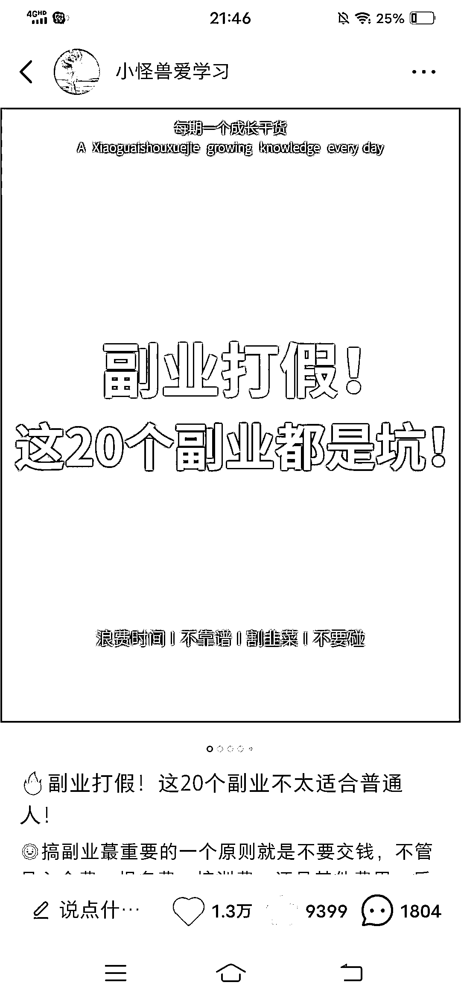

# 新手做小红书，涨粉 8000+，变现 4 位数，1 个月内找到工作的秘诀（6000 字干货）

> 原文：[`www.yuque.com/for_lazy/zhoubao/sl0gkzb6uuwfih59`](https://www.yuque.com/for_lazy/zhoubao/sl0gkzb6uuwfih59)

## (91 赞)新手做小红书，涨粉 8000+，变现 4 位数，1 个月内找到工作的秘诀（6000 字干货）

作者： 奔跑吧小怪兽

日期：2024-05-07

**大家好，我是小怪兽，一位 30 岁来深圳重启人生的终身学习者。**

今天和大家聊聊作为新手前期运营小红书的一些收获。

主要从认知、运营、变现、求职、工具、心得这几个方面去给大家拆解曾经作为自媒体小白的我如何从 0－1 运营小红书，涨粉 8000+，变现四位数，1 个月内找到工作的秘密（内容较多，全程干货，可以慢慢阅读）

这些方法都是我的实操经验，简单实用，可操作，可借鉴。

下面开始进入正题：

**Part 1** **认知篇**

**01 我是如何接触到小红书？**

我之前从来没用过小红书 app，后来为了找到适合的兼职浏览了不少【生财有术】知识星球的精华帖，通过精华帖的学习，对小红书有了基础的认知。

在看了十几篇与小红书变现相关的精华帖之后，觉得小红书运营简单易上手，可以作为普通人的副业项目之一。

**于是从 2022 年 7 月 4 日开始做自己的账号，佛系更新了 6 个月，涨粉 8000+，变现四位数。**

在运营期间，一共发了 53 篇笔记，其中一篇爆款笔记的播放量高达 63W+。

**02 我为什么做小红书？**

①小红书是内容、社交、电商为一体的消费决策平台。小红书的用户都想通过这个平台来解决自己的问题，要么了解买什么东西，要么就是提升自己。

②女性群体居多，80%以上都是一二线城市的优秀女性，消费能力高。

**③自媒体生意，变现方式多，适合普通人，人人都能发声，每个人都有机会被看到 。**

④每个人都玩手机刷视频，不如从消费者转变成创作者，抓住用户的注意力。

⑤方便做兼职，时间空间不受影响，容易产生正反馈。

**⑥方便求职转行，如果做出了一个账号，还可以利用这个账号赚钱，后期甚至可以全职操作。**

**Part 2** **运营篇**

**03 怎么做小红书？**

主要有三大思维:

**①模仿思维：**

刚开始做小红书切勿自嗨，不要想发什么就发什么，一定要向同行学习，同行是最好的老师。

模仿近期出现的爆款笔记，借鉴其选题，模仿其封面、标题、正文，整体的排版格式等，做到 80%的相似。

这些笔记都是模仿爆款笔记的选题、标题、封面排版等，在原有的基础上比爆款笔记增加了更多内容，看起来更干货满满。

**②模板思维：**

一旦出现爆款笔记，就沿用该爆款笔记的呈现形式（封面排版，内页展示、起标题的方法等），不断地发布笔记，直至这个风格无法再产生效果。

**比如我刚开始做小红书时，1.0 版本的封面是这样的：**

封面排版不统一，首图尺寸大小不一致，选题一般，标题也缺乏吸引力。

**后来经过复盘优化，出现了 2.0 版本的封面：**

变美和搞钱一直是小红书热门的话题，所以借鉴了爆款笔记的选题，模仿了当时比较火的封面形式，做了提升自己、搞钱相关的合集，开始出现自己的爆款笔记。

后来出现几篇爆款笔记后，又继续优化自己的封面，模仿了当时爆火的梨云绿封面以及内页：

**用 word 文档和稿定设计做出了 3.0 版本的封面：**

**内页展示：**

3.0 版本的封面，只要一发笔记，不是小火，就是大火，基本都成为了爆款笔记，所以到现在就一直沿用了这个模板。

**③迭代思维**

先完成再完美，先模仿再超越。新手刚开始不知道怎么做小红书就去模仿同行做得好的地方，在实践中不断复盘优化，找到感觉之后就融入自己的东西，形成自己的风格和特色。

**所以，结合我的个人经验来看，从 0－1 打造爆款账号，主要有这几个步骤：**

**🔻找定位：**

在小红书起号阶段，要做的第一件事不是发笔记，而是找准定位。

我们该如何做好精准定位？《2 小时玩转小红书》这本书的作者吕白，给我们提供了一个思路：

你可以问自己三个核心问题，认真思考后把答案写在本子上。

我是谁？

我能为用户提供什么？

我和别人有什么不一样？

我的答案是：

**终身学习者**

**个人成长方面的经验分享**

**30 岁来深圳重启人生，知识付费 4 年，累计 10W+**

一句话总结就是：一位 30 岁来深圳重启人生、知识付费累计 10w+，为用户提供个人成长干货的终身学习者。

以上三个问题有助于发现我们的优势、擅长的方向等，但是也可能存在自己的标签过多，不知道哪个定位更合适的情况，所以，我们在做定位时，可以先发散再聚焦，多发几类内容，测试后再聚焦生产一类内容。

如果你对定位还不是很清楚，还可以参考这个方法：

**逆熵增老师的定位三字诀👉“金喜善”**

这 3 个词分别是：

金是指有用户需求的

喜是指喜欢且很热爱的

善是指自己擅长的

找到这三者的交集就可以了。

三者交集的地方就是你需要关注的，可以作为个人定位参考。

**🔻学对标：**

找到定位之后，接下来就是找到对标账号进行模仿学习。

我经常关注个人成长方面的信息，所以自己前期做小红书，也是打算先从个人成长方向入手。

**那么怎么找到对标账号？**

1\. 看内容定位是否与自己的定位一致

搜想做领域的关键词，看看出现了哪些账号，他们的昵称是什么？

2\. 看笔记呈现形式以及内容输出是否容易模仿

是图文笔记还是视频笔记？选题是否太稀缺，无法借鉴？

新手一般建议先做图文笔记，制作成本低，易模仿，易坚持，容易产生正反馈。

3\. 看粉丝数量是否与现阶段的水平匹配

那些几万、十几万粉丝的博主对于刚起步的新人来说，距离遥远，对标意义不大。

可以参考 3 个月内出现爆款笔记，涨粉较快的账号，粉丝数量在 1000－5000 左右（可以分析他们近期的选题，涨粉快的原因）

**找到对标账号后要学习什么？**

改人设，要让别人记住你：头像，昵称，简介，主页。

头像：正能量的，真人照片更好。

昵称：要与你输出的内容有关，可以名字+身份、名字+领域、名字+职业、名字+技能、名字+爱好等等。

简介：要突出人设，足够吸睛，个人简介要一句话讲明白你是干什么的，有什么优势。如果不会写，可以参考同行的，结合自身情况适当修改。

**另外，粉丝还没到 5000，不建议在个人简介留自己的联系方式，容易提示违规，被折叠。**

**🔻定选题：**

在小红书广场搜索关键词比如“**个人成长**”

看排名前 20 篇的爆款笔记

看看有哪些相同的选题？

制作是否简单？内容形式是图文笔记还是视频笔记？

是否容易模仿？自己能不能模仿这个选题、封面？

如果只想看图文笔记，可以在右上角的筛选工具栏选择【图文】

参考同行的选题，学习他们是如何起标题的，把这些吸引你点开笔记的标题收藏起来，做成一个爆款选题库、标题库，方便后面自己起标题用。

**🔻作笔记：**

主要利用稿定设计创作笔记。

一旦确定了封面模板，内页模板，创作笔记的效率大大提升。

**🔻发笔记：**

可以参考爆款笔记的封面排版、行文结构、标题设置，正文结尾添加的标签，笔记的发布时间等，去发布自己的笔记，发布以后监测笔记的数据，看看小眼睛有没有破百。

如果笔记数据不佳，没有破 500 的浏览量，说明笔记的选题、封面、标题都有待优化。

**🔻改笔记：**

不建议反复修改笔记，会影响笔记的浏览量，最多修改 1－2 次。

**🔻做 sop：**

**一旦出现了爆款笔记，就要把自己的经验沉淀下来，比如：**

固定封面风格

固定文案风格

固定爆款因素

这样可以提高创作效率，也方便后期教别人，或者搞矩阵号等。

**Part 3** **变现篇**

这一节主要聊聊我的变现经历。

我的变现方式主要有两种:

**一是图书置换**

**二是接广告**

**找我合作的人数有这些：**

**部分收益截图：**

确定好定位以后，你还得想清楚你的变现方式是什么？

如果是想接广告，就得多分享一些可以涨粉的笔记，粉丝越多，广告报价的费用就会高一些。

一开始我的报价是粉丝数的 10%，不过对方也会根据你最近账号的数据表现去跟你砍价。

这里再补充一些《2 小时玩转小红书》这本书提到的小红书变现的内容：

**最适合通过小红书变现的 4 类人**

①拥有某项技能的人（画画，化妆，健身，书法等）

②在某个领域有自己心得的人（考研考公、职场沟通、运营、法律、设计等）

③有特殊经历和人生感悟的人（人生阅历丰富，有人格魅力、思考力强等）

④有实体店和线下项目的人（想要实现线上获客，卖珠宝、开民宿、理发店等实体店）

**小红书变现，不可错过的五大赛道**

①好物推荐赛道

②技能分享赛道

③心灵疗愈、心理咨询赛道

④线下线上双赢赛道

⑤女性成长赛道

**适合普通人做的 4 类博主**

①读书博主（可以实现读书自由，变现方式很多，例如广告推广、直播带书带货、知识付费、读书社群等）

②干货分享博主（利他就是最好的利己，变现途径也很多，例如接广告、业务成交、知识付费等）

③育儿博主（宝妈们建议都尝试一下，变现能力超强，如果你抓住了一位母亲，你就抓到了一个家庭的消费命脉）

④家居博主（分享一些好用的家居物件，变现方式包括接广告、带货、开网店等）

**小红书的变现方式有哪些？（6 大变现方式）**

**①报备广告**

就是通过官方的蒲公英平台来接广告，入驻蒲公英平台的条件是粉丝量 1000 以上，并且需要开通专业号。

当时合作的笔记违规发不出去，封面不能按照自己的格式来发，整体感觉跟我的内容定位和小红书风格不太相符。

**所以，为了不辜负粉丝对我的信任，我主动取消了这次报备合作。**

**②不报备广告**

品牌方通过私信的方式找你合作。

这种合作一般要求你软植入到笔记里。

这种做法有一定风险，平台一旦识别出来，会对广告进行限流。

**还有图书置换**

**③开专栏课程**

小红书平台会邀请一些在自己领域有专业积累的博主来开通专栏课程，目前开通专栏课程需要小红书粉丝数量超过 1 万。

**④引流私域**

有线下实体店，或者想要在微信进行交易。

引流私域有一定的风险，如果有产品，还是尽量放在小红书的官方店铺来进行交易。

**⑤小红书官方店铺**

需要开通专业号才能有权限申请开店。

开店铺对粉丝数量没有要求，但是需要交保证金和佣金。

目前可选的店铺有个人店铺、个体工商户、普通企业店和专卖店，不同类型店铺的保证金、佣金、经营类目和入驻要求都各有不同。

**⑥直播带货（买手合作）**

小红书官方正在扶持视频和直播类内容。

直播是能为小红书带来营收的一个重要手段，对于做直播的博主，平台会想尽办法给到大家流量支持。

**Part 4** **求职篇**

通过运营自己的小红书账号，不仅成功变现，职业空窗期两年多的我还凭借这个账号数据，在 1 个月内成功找到一份与小红书运营相关的工作。

从 2023 年 2 月 11 日孤身一人去深圳找工作

再到自己找住的地方，开始投递简历、优化简历，面试失败，复盘失败经验，再到优化面试表现，最后收到 offer，2023 年 3 月 8 日成功入职。

**Part 5** **工具篇**

工欲善其事必先利其器，想要做好小红书，一定要掌握一些基础的技能，比如拍摄剪辑、图文制作、数据分析等。

给大家分享一些小红书运营经常会用到的工具：

**视频剪辑：**剪映

**敏感词/违禁词查询：**

零克查词[`www.lingkechaci.com/`](http://www.lingkechaci.com/)

句易网[`www.ju1.cn/`](http://www.ju1.cn/)

**数据分析：**

灰豚数据

[`xhs.huitun.com/#/home`](https://xhs.huitun.com/#/home)

千瓜数据

[`www.qian-gua.com/Home/IndexAnalysisTool`](https://www.qian-gua.com/Home/IndexAnalysisTool)

**图文制作：**可画，稿定设计，黄油相机，手机备忘录

可画[`www.canva.cn/`](https://www.canva.cn/)

稿定设计[`m.gaoding.com/`](https://m.gaoding.com/)

**书籍推荐：**

奔跑小怪兽的书单「小红书」

[`weread.qq.com/misc/booklist/342448980_7Ltu1VeBs`](https://weread.qq.com/misc/booklist/342448980_7Ltu1VeBs)

奔跑小怪兽的书单「运营书籍」

[`weread.qq.com/misc/booklist/342448980_7QzD6xfp9`](https://weread.qq.com/misc/booklist/342448980_7QzD6xfp9)

**Part 6** **心得篇**

**这里给大家分享《2 小时玩转小红书》这本书提到的一些建议：**

**新手做账号，千万别踩这 10 个坑：**

①选题不够吸引人（核心是：和我有关，对我有用。如果能找到 3 个点赞数过万的相同选题，这个选题可以做）

②爆款相似度不够（研究其选题、封面、标题、内容、行文结构、评论区等，建议选取同领域 50 条爆款视频/图文，从选题，标题，开头到金句、结尾、评论区去认真拆解）

③内容杂乱，垂直度不够（不适合定位的内容别发，内容垂直度越高，账号权重就越高）

④封面难看且不统一（封面高清，背景简单，字数不要多，字要大，多模仿爆款笔记，固定自己的风格）

⑤标题平淡且无趣（一定要认真对待标题，积累那些让你点开笔记的标题库）

⑥内容质量不够好（少说废话，要么给足信息量，要么满足情绪价值，多关注相同选题的评论区，看大家在关注什么）

⑦整体视觉效果差（注意封面排版、文案排版，多看优质笔记）

⑧人设不清晰（要让别人记住你，头像，昵称，主页，简介要突出人设，足够吸睛，头像用真人照片，昵称要与内容有关，个人简介要一句话讲明白你是干什么的）

⑨不重视评论区互动（能火的笔记评论区都是吵得热火朝天，置顶一些评论，引导评论走向）

⑩经常删笔记（可以隐藏，不要删除，会影响账号权重）

**素人做博主需要具备哪些能力：**

①综合能力（比如文案创作、拍摄、剪辑、做图、调研、复盘等技能）

②学习能力（持续学习、持续思考很重要，要学会模仿借鉴）

③数据分析能力。这方面我比较弱，看爆款数据时记住这个公式：互动率＞8%（点赞+收藏+评论 x3），阅读量点击率＞5%

④选题能力。

一篇笔记能不能成为爆款，选题的决定因素可以占到 80%。所以平时一定要积累自己的选题库。

首先，可以分析与你定位相似且数据比较好的账号，新人起号阶段建议对标近三个月涨粉较快的同赛道账号。

其次，按照自己涨粉快、点赞多的笔记，找同类选题进行持续输出，或是找小红书推荐的话题以及实时热点，具体可以参考笔记灵感。

最后，可以针对用户痛点，结合自己的经验帮大家解决问题，或是和用户一起吐槽来引发共鸣。

⑤变现能力

想要持续赚钱，就得结合自己的人设持续输出优质内容。

⑥时间管理能力

先完成再完美。

建立自己的选题库、标题库、金句库等。

**这一路走来，我做对了什么：**

**先完成再完美，先模仿再超越。**

同行是最好的老师，多向同行学习，取其之长，补己之短。

抄超钞，先模仿再创新，赚钱的事自然水到渠成。

粉丝多不等于能赚钱（账号要足够垂直、足够精准，可以解决别人的问题）。

要找准适合自己的赛道（要在鱼多的地方钓鱼）。

完成比完美更重要（流水不争先，争的是滔滔不绝）。

**Part 7** **写在最后**

**这一路走来真的没想到可以通过小红书找到工作，真的非常感谢【生财有术】这个平台，感谢亦仁大大，感谢在星球里无私分享干货的圈友们~**

以上就是我的分享，感谢大家的阅读，关于小红书运营还有很多需要学习的地方，个人的认知难免有局限性，欢迎大家批评指正，一起交流学习。

在事上练，事上学，成长更快。

**扎克伯格说过：Done is better than perfect.（完成比完美更重要）**

勇气是最重要的才华，不必给自己设限。

你不需要很厉害才能开始，但你需要开始才会很厉害。

* * *

评论区：

小木 : 🐂
冯冯 : 好棒，干货满满。很多细节[强][强][强]，感谢分享
三木森 : 借鉴和模仿爆款这部分内容有助于打开新思路，感谢分享。
奔跑吧小怪兽 : 不客气[感谢您的赋能]☺
奔跑吧小怪兽 : 不客气哇[感谢小伙伴的赋能]☺
Charlie : 很用心的分享，有学习到，非常感谢您
奔跑吧小怪兽 : 不客气哈[也非常感谢您的鼓励]☺
hyf,, : 好厉害👍🏻，我感觉我也有在对标跟改进封面那些，但是流量一直卡在 500 左右，不知道是什么问题[流泪]

* * *