# 小红书 0 粉新号也能快速出单？1000 个商家的爆单思路是真牛！

> 原文：[`www.yuque.com/for_lazy/zhoubao/aonrlcuc4412scrm`](https://www.yuque.com/for_lazy/zhoubao/aonrlcuc4412scrm)

## (96 赞)小红书 0 粉新号也能快速出单？1000 个商家的爆单思路是真牛！

作者： 谢无敌🐱闪亮猫传媒

日期：2024-05-09

Hi~生财的朋友们大家好~ 我是你们的老朋友-谢无敌，小红书 MCN 闪亮猫传媒创始人。

既是实体经营者也是流量赋能者。同时也是知识星球的头部小红书社群【谢无敌的红书宝】创始人。

前几天在小红书电商学习薯做了一场小红书电商的直播，很多小伙伴都说太干了，看一遍直播吸收不了~

今天，深入和大家聊一聊，爆单笔记的创作秘诀！

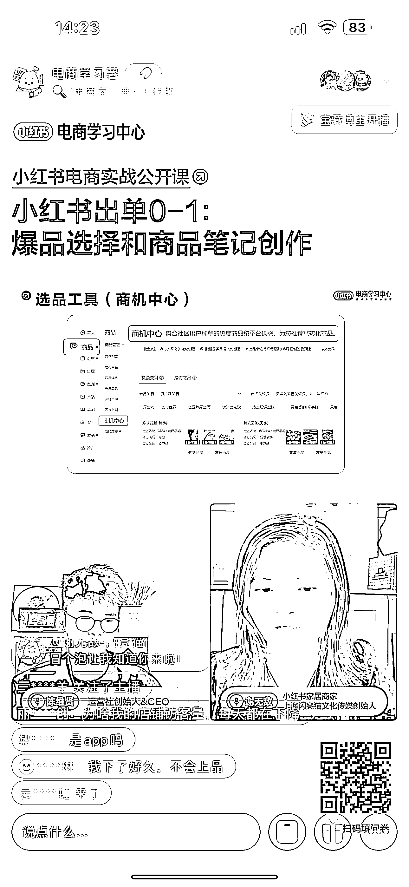

很多人都说，去年是小红书商业化的元年，对于用户和商家来说，小红书到底哪里不一样了？

拿我孵化过的老板来说，23 年之前，很多老板都是在小红书上种草，再通过引流用户到其他电商平台或者微信成交。

但，23 年开始，大部分老板开始转变策略，直接在小红书上进行销售。

比如，进口牛肉商家，账号还不到一百粉丝，店铺成交 29 人。

减脂仪器类商家，低粉成单 31 人，产品客单价还不算低。

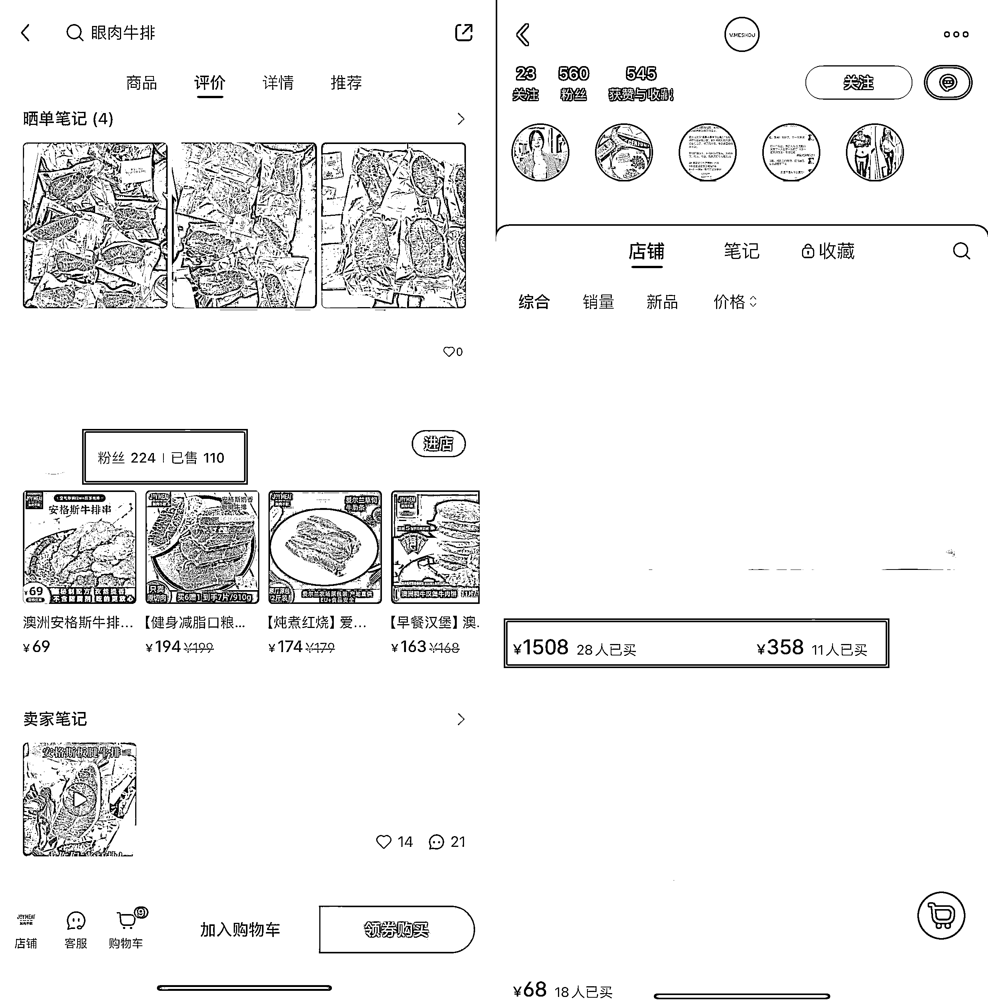

小红书可以说，是当下对商家最友好的带货平台之一，就算是新手也能轻松出单。

但还是有好多人想问：他们是怎么做到的？为什么我出不了单？

其实关键点就 2 个——选品和内容。

这篇文章，我就从选品、商品笔记的创作 2 个角度入手，一步步详细教大家如何选品、测品、选题、定标题、作图、布局关键词，从 0-1 快速掌握爆单思路，实现快速出单。

## **一、如何选品：4 个特征锁定爆品**

选品对于很多人来说是很头疼的事，能不能爆单很大程度取决于选品？

很多人不知道，其实选品也是有窍门的。

根据小红书用户的基本特征，以及过往爆品案例，我们会发现多数爆品基本都符合 4 个特征——刚需+高颜值+低价+一级电商点评且 DSR 评分高。

（ * DSR 指标 = 描述相符、服务态度、物流服务三项指标）

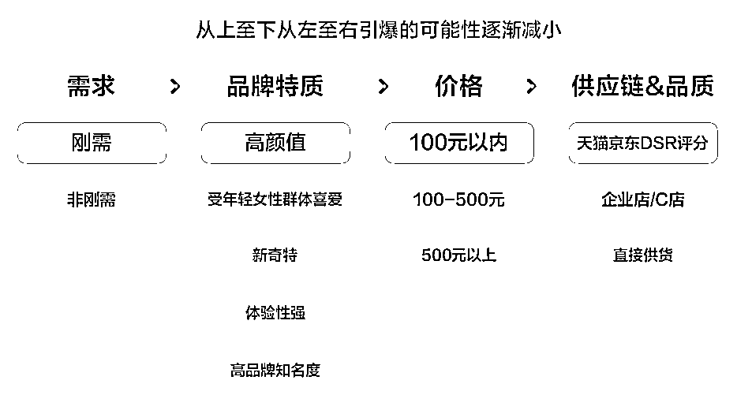

比如，毛毡手提袋、打底衫、日抛隐形眼镜，这些品在小红书都有爆款基因。

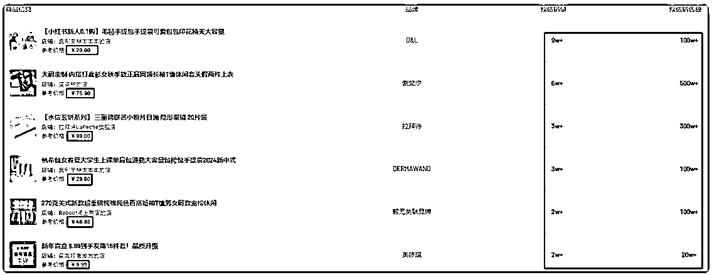

不同类目会有细微差别，但总体方向都是一致的。

举个例子，去年双十一的时候，我在直播间把一张万元的床垫卖给了七十多个人。

大多数人可能会觉得这个品类垂直，产品价格又贵，应该很难卖。

但是，基于小红书平台的调性来看，它反而具有爆款潜质：

①质价比（品质/价格）：万元级别产品杠把子

②颜值：在家居风里很受欢迎的极简风

③新奇特：智能睡具新体验

④刚需：孕妇、宝妈，或者需要缓解打鼾习惯的人群

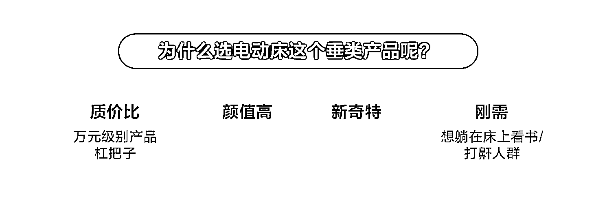

除了选品标准以外，官方也从平台层面给到了新手商家很多引导。

比如，去年推出的商家辅助工具——千帆中心，其中的商机中心包含了大量的潜力商品，都是根据当下平台内容的供需情况筛选出来的，非常有参考价值。

千帆中心操作步骤：小红书账号登录千帆中心（开店后可登录）→商品→商品管理→商机中心。

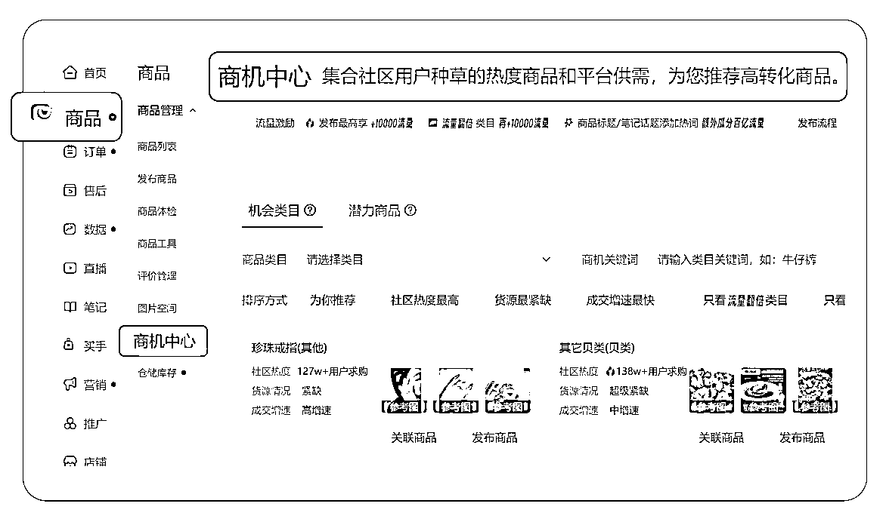

建议没有独立选品渠道、供应链，或者选品没有把握的小伙伴们一定要利用号商机中心，后续你的选品就轻松解决了~

## **二、如何测品：2 个方法验证数据**

选定了产品就直接推吗？当然不是。

我们需要进行一个初步测试，得到产品具体的销售数据，才能知道这款产品是否能为我们带来最大转化。

**①测品三步骤**

测品步骤大概可分为 3 步：多内容形式测品、重复创作+投放、若无爆款则换品测试。

同一个产品，我们可以用 3-5 种形态的笔记进行测试，如图文或视频、单品或合集、拍摄各种不同的场景等，哪种数据好我们后续笔记创作就偏向哪种。

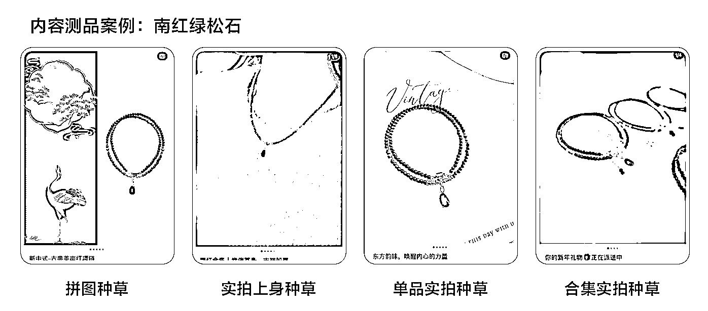

比如过年期间的爆品：南红绿松石。

商家用了拼图、模特上身实拍、单品实拍、合集实拍 4 种形式测试，结果实拍上身转化数据是最好的。

后续商家大部分都换成了实拍上身图，而且还灵活转变思路，尝试了户外、手部试戴图，数据果然都很不错。

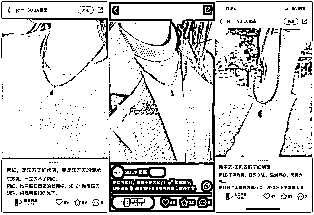

这里要提醒大家，如果在尝试了好几种形式后，数据还是没有起色，那就迅速换品测试，不要浪费精力在一个品上。

毕竟市场大、需求多，产品多得是，一个不行还有下一个，总有一个是爆品。

**②跟品**

如果不想花费太多的时间成本去测试，还有一种方式是大家可以直接上手的——跟品。

市场上有 3 种产品可以让我们抄作业。

**第 1 种：低粉账号销量超过百单的产品**

低粉账号不受粉丝量、账号人设的影响，产品的销量更多取决于产品本身。

这一类产品属于被市场验证过，所以跟品的价值很高。

比如塑身吊带内衣、穿戴甲，你会发现这些品很多人都在卖，因为只要跟着卖大概率都能出单↓

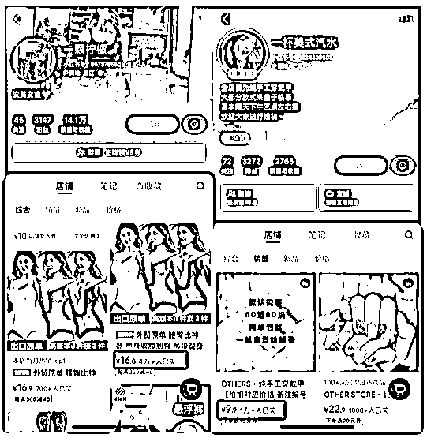

**第 2 种是短期（特殊期）内的超级爆款**

比如上面提到的南红绿松石，中式风松石饰品很适合过年期间戴，所以在这个特殊期间它很容易就爆单了。

但选这类产品一定要掐准时机，因为过了这村就没这店了~

**第 3 种是有用户需求的小众产品：**

这种品的总需求量并不大，但往往是小部分人的硬性需求，属于只要你卖就一定有人买。比如下面的沥水篮、蒸汽头改造配件。

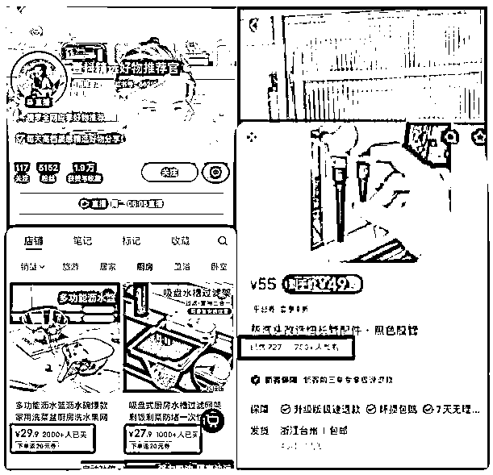

蒸汽头改造配件，我们可能听都没听说过，但销量却非常好，而且在整个平台都没有竞品。

单价 50 块，销量 700，35000 就这么轻松拿下了，这波赚得不要太香~

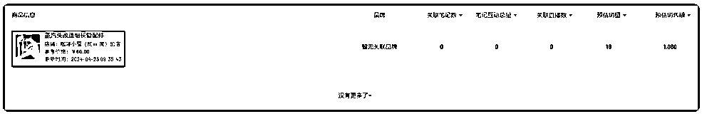

其实不管是自己选品，还是测品，核心都是挖需求：什么人想要解决什么问题？什么品能解决这个问题？

只要能挖掘到硬性需求，我们就成功了一大步，后面就是内容的事了。

## **三、内容策略：从干货到深度种草**

对初期我们一般都会用干货笔记来起号，但对于商家来说，干货笔记最多做 1-2 周，后续想卖得更多更好，就要靠内容的深度。

①起号初期*信息整理、攻略类：

为大家输出挑选产品的干货，初步吸引用户

②过渡期*单品种草：

通过图文或视频，展示产品具体的使用方法、使用场景，吸引用户购买下单

③成熟期*深度种草：

关于产品和品牌的深度挖掘，比如测评、探厂、制作流程等，让用户和你形成长期关系

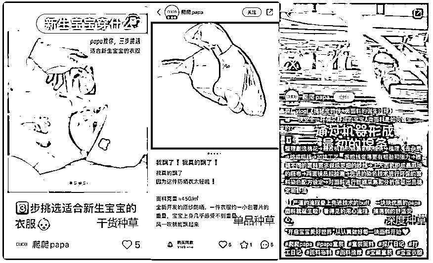

道理其实很简单，一开始我们可以用软植入的干货，吸引大家来关注你的产品。

但在账号渐渐成熟后，想让人买更多的话，就要更全面、更细节的介绍来圈住用户才行。

否则前期出单，后面没法持续也没用。

## **四、内容创作：5 步炼成爆单笔记**

虽然现在小红书的图文、视频笔记传播都不错，但为了转化，我还是建议大家优先做视频笔记，因为它能展现更多产品细节，对转化会更好。

但如果你的产品视频拍摄难度比较大的话，做图文笔记也是可以的。

不过首先我们要知道，什么样的笔记更容易爆单？

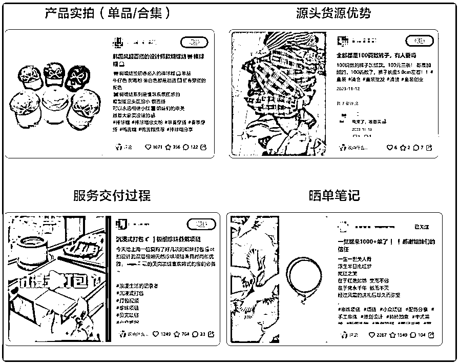

**①产品实拍（单品/合集）：**

没有严格的审美要求，图片清晰就可以，操作简单，新手好上手，而且很容易爆单。

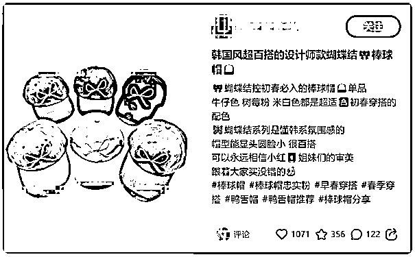

**②货源优势：**

如果你的产品货源更好、价格便宜，可以直接用有真实感的产品实拍图，突出自己的货源、价格优势。

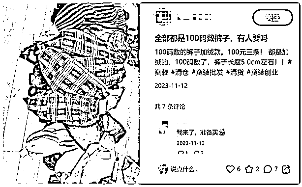

**③服务交付过程：**

给用户透露一些服务细节，会给用户一种享受精致产品、服务的体验感，比如饰品类就很适合。

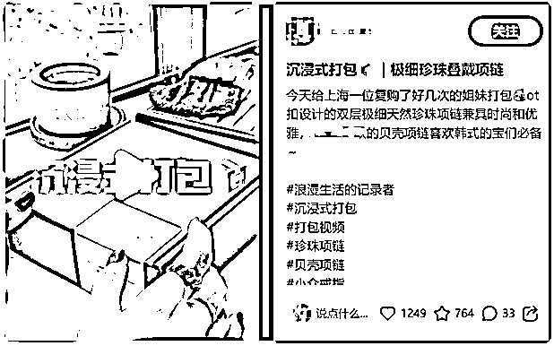

**④晒单笔记：**

用好数据为自己的产品提供“背书”，吸引用户跟着大家买。

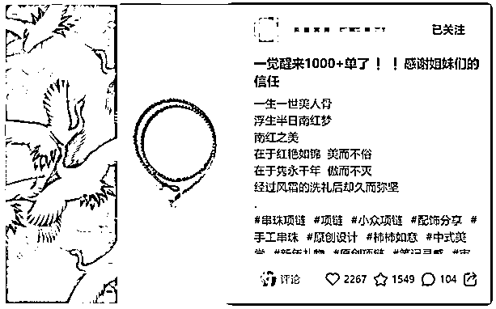

这些笔记都是容易爆，模仿难度也相对低的。

其实不止这四类，还有很多形式都可以借鉴，只要是数据好的我们都可以复刻。

参考这些高转化笔记，商品笔记的创作总结就是 5 个核心：**选题、首图、标题、图文/视频内容、关键词植入**。

### 1.选题

一篇笔记必须拥有一个好选题，它直接决定我们的点击率！选题对了，笔记就拥有了 50%爆的可能性。3 个方法教大家挑选题。

**①关键词选题法**

搜索栏反映的就是用户最想要了解的，所以看看搜索栏上的关键词，就能找到适合你业务的选题。

搜索笔记后，搜索框下显示的就是用户搜索频率最高的词——长尾词。

比如“高级感、小户型”，在家具布置领域就是经久不衰的热词，如果以它们为选题，笔记的基本曝光就有保证了。

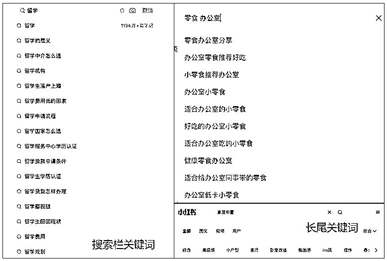

**②对标商家选题法**

同行是我们最好的榜样，没有头绪的时候，看看他们怎么做。

在千帆中心搜索相关商品，哪种选题更爆，笔记榜单上一目了然，官方可以说是把钱送到手里了~

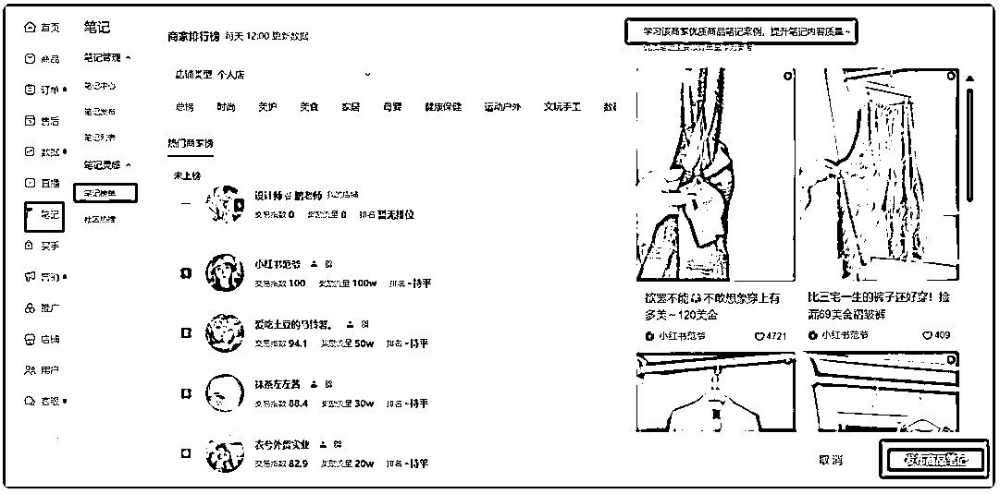

**③热门选题法**

小红书热搜榜，和“创作中心”中“创作灵感”的很多 tag，也是一个很好的选题来源。

我们可以挑选一些和产品关联度高的话题进行组合，蹭一下热度。

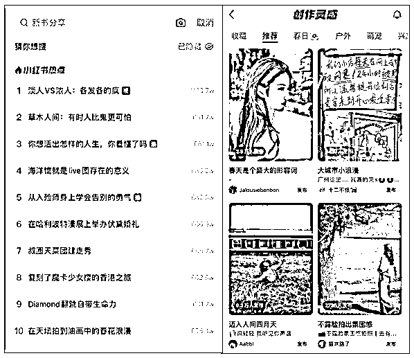

比如，马斯克在小红书的热度一直很高。

那用马斯克照片+金句做封面，带货马斯克的自传，流量、转化不就双双到手了~

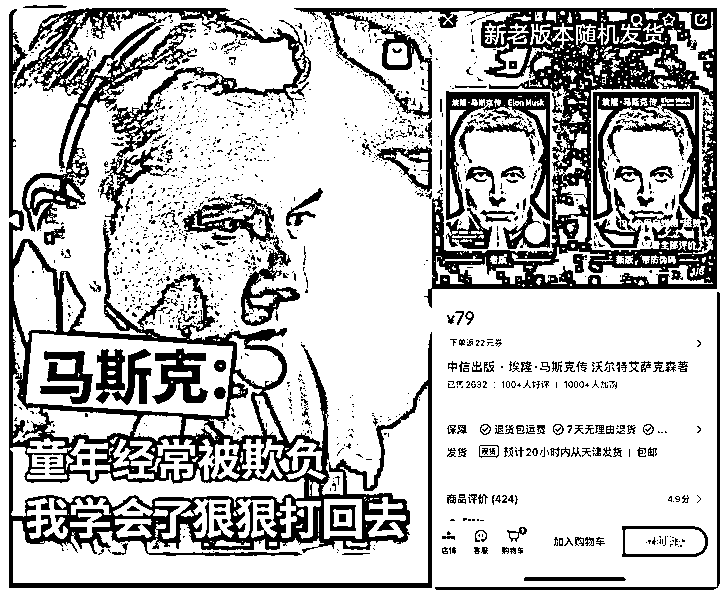

提醒大家，一定要选择和产品关联度高的话题！

太多无关热点会让笔记内容太发散、不垂直，点进来的人都冲着热度来，但对产品没有兴趣，转化当然不会好。

### 2.首图

封面和标题决定点击率：笔记能不能火，封面占了一半的因素！而封面风格取决于你的品想卖给谁。

比如卖饰品，针对的群体是 20 岁左右的小姐姐，那首图当然要精致好看才能吸引她们。

如果你卖茶叶，客户群体是 40-60 岁的偏熟龄群体，那封面可能不需要太精致，自然、纯天然更重要。

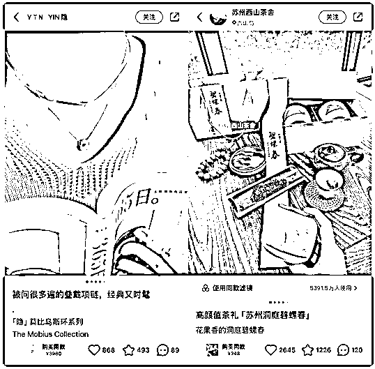

我们也可以代入商家的卖货人设，在封面上罗列产品信息、标注价格。

或者配上一些感叹开心爆单的文字，这样“真实分享”的情绪，也会感染到看笔记的人，比如像下面这样的笔记↓

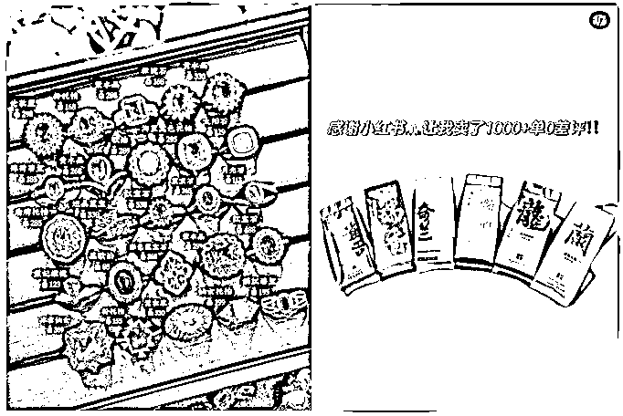

如果你的拍摄能力、审美还没有那么好的话，也可以用关键词搜索笔记，在爆款笔记里收集好看的图。

然后从拍摄、构图、制作，精细到字体、字号、位置等细节，1 比 1 像素级模仿。

但切记不要直接抄袭搬运，即便是模仿也要注意分寸，别忘了平台还是鼓励原创的。

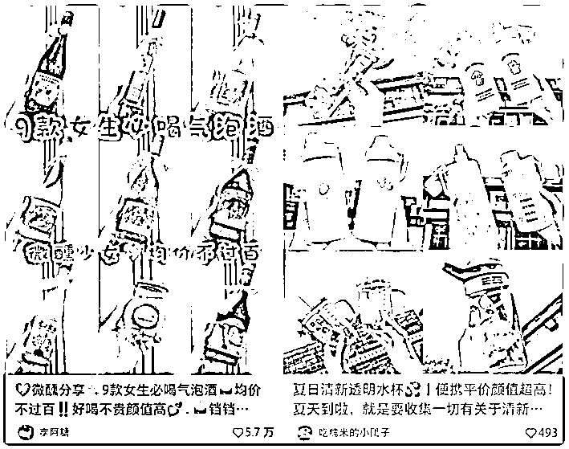

很多人觉得做首图很难，其实只要有耐心，做多了慢慢就熟能生巧了。我们的审美也会渐渐提高，之后的做图就会越来越得心应手~

### 3.标题

一个好标题实在太重要，我们要用简短有力的句式+爆款关键词，激发用户的兴趣，吸引人点开看我们的笔记。

总结以往的小红书爆款标题，大概有 4 个特点：

①有代入感、场景化、画面感

②越具体越好，有细节、要有关键词

③越简单粗暴越好，不要堆砌太多术语

④字数越少越吸睛，不要太啰嗦

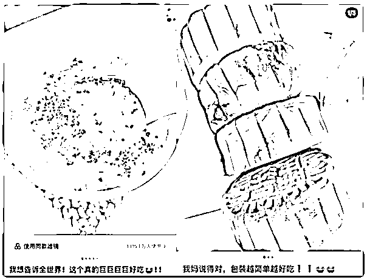

为什么这些标题点击率高？因为每一种类型的标题，都利用了用户的不同心理。

**①好奇类：**

利用用户得不到、没体验过的经历，激发他们的好奇心，用户会希望自己看完也能拥有同款体验。

例：*在阿里上班是一种什么样的体验？*

**②痛点类：**

直接以痛点切入，痛点不解决就会难受，痛点卡得越精准越有吸引力，拥有这种困扰的人会因为急于解决需求点击阅读。

例：*如果你也经常失眠？一定要点进来看看？*

**③极限类：**

用夸张的文字把抽象的内容具象化，越具体吸引力越强，有这个需求的人就会更加重视，从而被吸引。

比如“99%的人都不知道”、“人人都能用”都是对“省钱方法”的夸张描述。

例：*99%的人都不知道的省钱小技巧，人人都能用！*

**④恐吓类：**

利用大家的恐慌心理引起危机感，如果不看就要承担后果，起到警示作用。

例：*千万不要和孩子说这 4 句话，后果很严重！*

知道了什么是好标题，把握了用户心理，还要掌握定标题的方法，我们可以对同类标题进行二次整合。

先找到 2 个不同的标题，但是主关键词一致，然后对句式、关键词的位置进行调整：

例：*变白变美的（形容词）早 C 晚 A 茶，25+喝成白月光（名词）*

*养生 20+女孩的（形容词）早 C 晚 A，让你白到发光（场景词）*

↓

*养生女孩的早 C 晚 A 茶， 20+喝成白月光！*

相当于对已有数据的标题进行升华，提炼出新标题。这样点击率就有了基本保障，优化得好的话，可能还会有明显提升。

### 4.正文

在正文上我们也要有强烈的布局意识，不同的账号、人设、产品，文本结构也不一样。

**开头：**

有人设的账号，可以用固定的打招呼展开，能增强你的亲切感。

如果是大健康、养生类目等重功效的产品，可以在开头就直入痛点，垂直种草。

场景式的开头自带画面感，会增加用户对产品使用场景的联想，笔记的种草力会更强。

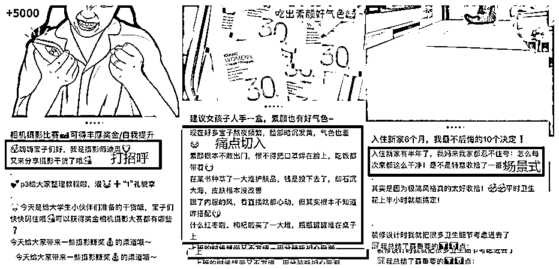

**中间：**

中间一般是产品介绍，这部分主要看你的图片和视频详不详细。

如果比较详细，只要总结笔记信息就可以了，或者引导用户看图片。千万不要重复图片或视频的内容，显得啰嗦，对转化也没有帮助。

图片不详细的话，中间部分就需要详细写，而且要有逻辑分布，让用户更容易记住你的产品卖点。

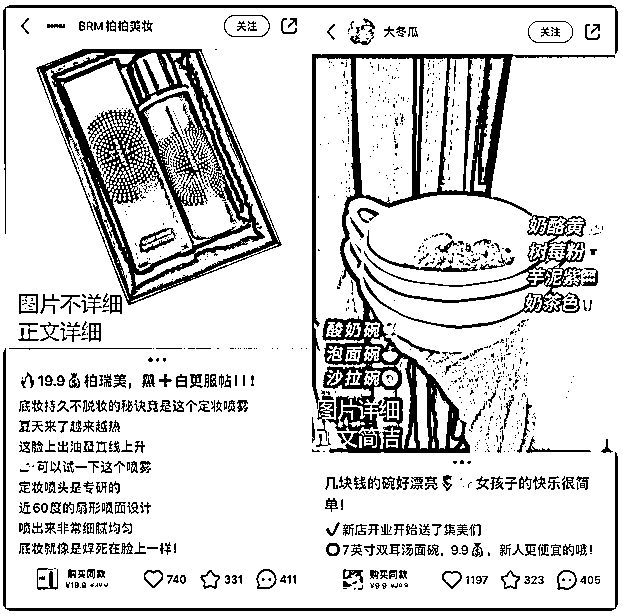

别忘了行与行之间要空格，可以适当用表情包做间隔，这样读起来更轻松。

**结尾：**

如果你的产品卖点比较多的话，最后可以做个小总结，方便读者复习卖点。

有人设的账号可以用一些固定的招牌话术，告诉用户你能为他们提供什么价值，吸引对你感兴趣的人。

品牌号比个人号限制少一点，很适合“留钩子”的办法，引导用户和品牌形成长期的互动、交易。个人号最好不要效仿，可能会有违规风险。



上面这些只是参考，大家可以根据自己自身能力和特点灵活运用。

比这些细节更重要的，其实是整个账号的内容策略。

### 5.关键词植入

小红书的流量主要就是 2 块，首页推荐和搜索，而搜索用户占比 60%。

所以搜索出的笔记越靠前，你就越能被更多人看到。而植入更多关键词，就能提升笔记“被搜到”的概率。

这一点千帆也能帮到我们，在“笔记”的“社区热搜”功能里，我们可以看到指定品类的高成交、飙升词。把它们加到笔记里，笔记的转化就会大大提升。

具体操作步骤：登录千帆中心-笔记-社区热搜-高成交、飙升词。

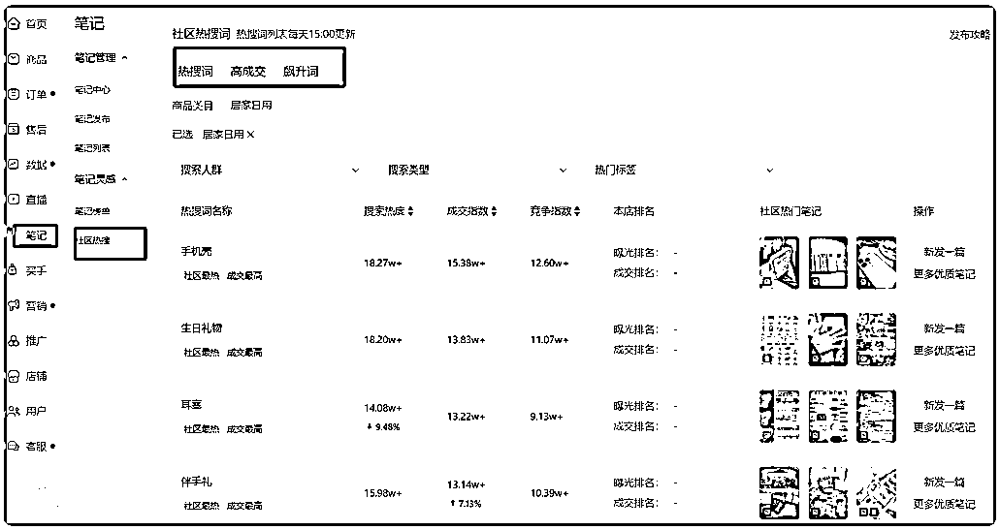

而且选定关键词发布笔记后，官方还会帮你推一波流，送上门的流量，不捡白不捡~

关键词选好了，下面教大家往哪里放。

**①昵称：**

最常见的行业关键词+IP，只要账号粉丝量和近期互动不错，很容易排在用户搜索前排。

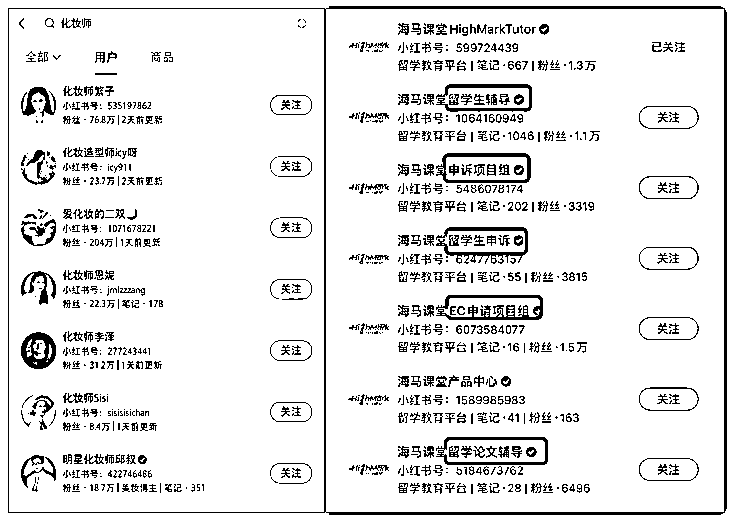

**②封面标题**

图片上的文字能被系统识别，用户也能直观看到。

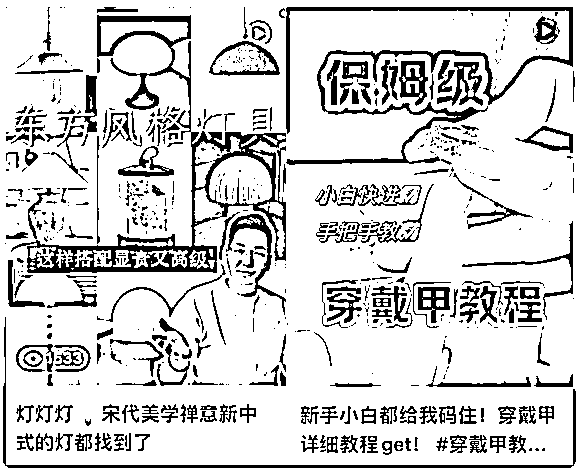

**③评论区：**

评论区文字也是参与权重搜索的，经营好评论区，对笔记权重和用户转化都会有帮助。

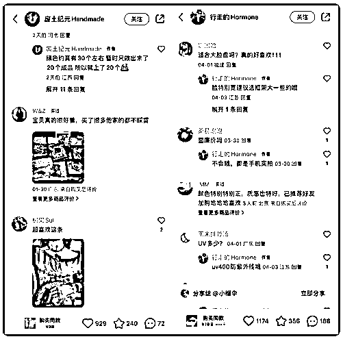

**④标签：**

笔记末端添加相关话题标签，不需要太多，10 个以内就够了，不要加一些完全不相关的话题。

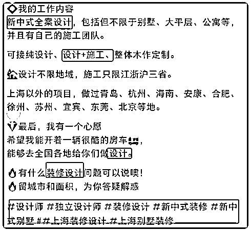

**⑤标题：**

标题是最重要的一步，正确的标题关键词布局，有利于搜索，系统会对笔记分类，推送给精准人群。

标题的关键词布局，通常需要 4 种搜索词中至少 1 种，比如↓

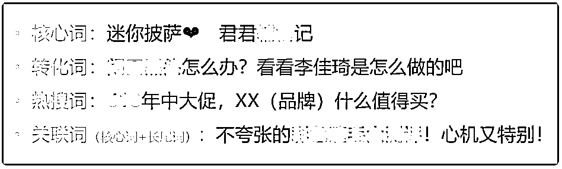

⑥**正文：**

正文中布局关键词，一定要有层次地铺词，切忌堆砌，同样的关键词隔行、分段分布。

和标题一样，每一篇笔记中，核心词、关联词、高转化词和热搜词可以组合起来使用，比如↓

但是一定要自然布局，不要密集堆砌，影响阅读体验，导致完读率差，直接影响笔记的数据和权重。

如果从标题、图片、正文、评论区，最重要的 4 步都合理植入了关键词，那搜索流量基本就稳了。

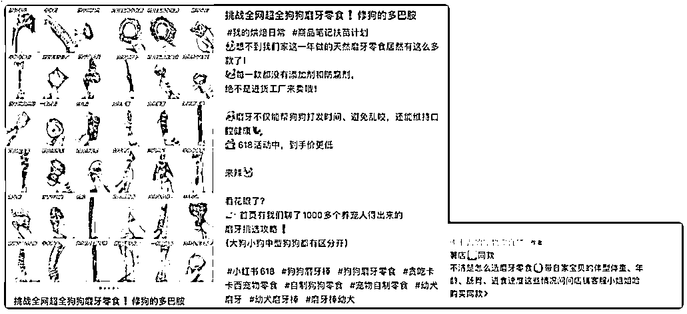

这里要提醒大家，我们不能为了搜索流量，盲目加上跟自己的产品和笔记不相关的关键词。

题文不符，用户会有被欺骗感，不利于我们的转化，平台也不鼓励。

官方提供了这么多流量扶持，其实只要有恒心和信心，能根据数据不断地调整内容，变现、爆单是迟早的事。

* * *

评论区：

似水流年 : 好棒[强][强][强]
小小朱 : 超级干货，超级无敌，感谢分享[强]
谢无敌🐱闪亮猫传媒 : 谢谢宝 加油
谢无敌🐱闪亮猫传媒 : 一起加油~
艾小飞 : 写得很细节，专业！
立熠分配学 : 如果是一些稍微敏感的行业，也可以做爆款笔记嘛
谢无敌🐱闪亮猫传媒 : 具体什么赛道呢
Rio : 受教了

* * *