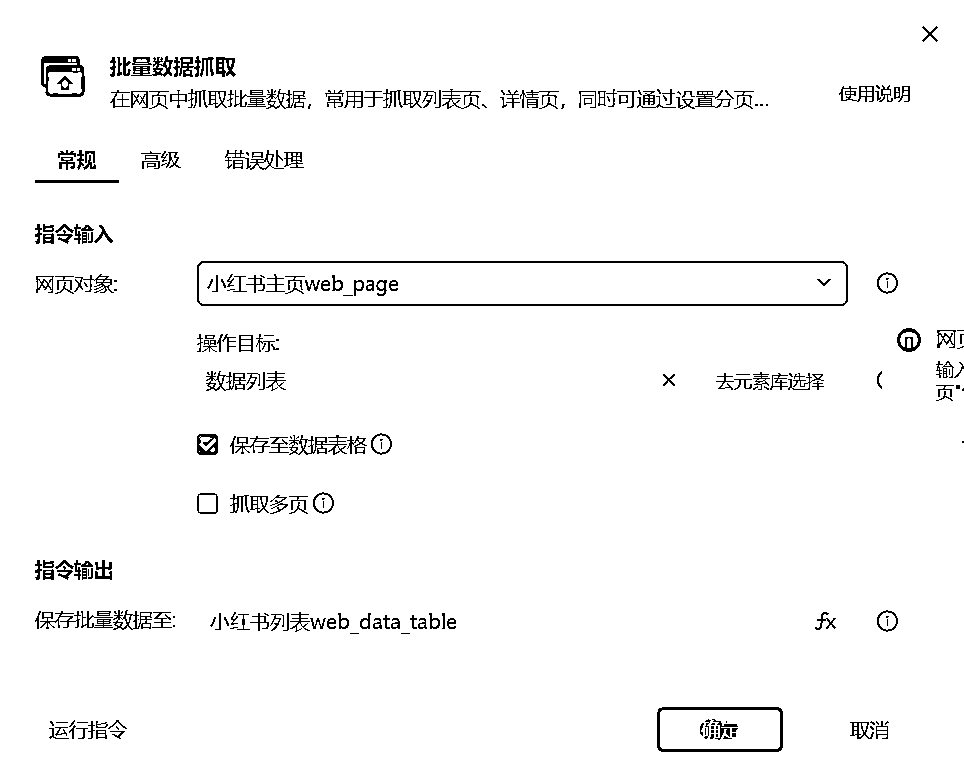

# 小红书全自动写文发文机器人-抓取爆款笔记（一）

> 原文：[`www.yuque.com/for_lazy/zhoubao/aegv3smcsu8cbl7o`](https://www.yuque.com/for_lazy/zhoubao/aegv3smcsu8cbl7o)

## (42 赞)小红书全自动写文发文机器人-抓取爆款笔记（一）

作者： 码农飞哥|RPA 定制

日期：2024-05-10

**业务场景：**

在小红书平台上创作内容，寻找并利用爆款素材对于增强内容吸引力和提升账号影响力至关重要。然而，手动筛选和分析成千上万的帖子来识别哪些内容能成为下一个爆款既耗时又低效。

使用 RPA 机器人程序，让机器人帮我们自动搜索爆款素材，可以大大节省寻找和分析爆款素材的时间，搜索好素材之后再并进行自动化仿写，从而实现整个流程的全自动化，无需人工干预既可以完成多账号多篇幅爆款笔记的发布。

## **操作流程：**

## **影刀 RPA 程序制作步骤**

**演示视频**

暂时无法在飞书文档外展示此内容

**完整步骤：**

1、**新建应用**

点击新建按钮，新建一个 PC 自动化应用

### **2.设定浏览网页**

新建一个【打开选择文件夹对话框】，这样我们可以自定义图片保存目录

再使用【打开网页】指令

浏览器类型这里我使用的是谷歌 Chrome 浏览器

在网址中输入我们要打开的地址，我们要打开网址是小红书的推荐页

[`www.xiaohongshu.com/explore?channel_id=homefeed_recommend`](https://www.xiaohongshu.com/explore?channel_id=homefeed_recommend)

### **3、批量抓取数据**

使用【批量抓取数据】指令就可以抓取前面打开的小红书的列表页的数据。该指令会将抓取的数据保存至影刀内置的数据表格中。

这里可以加上翻页功能，然后实现抓取多页数据的效果。

### 4、For 循环

使用【循环数据表格内容】指令可以对抓取的数据进行遍历。

在循环内部首先读取 第 F 列的数据获取该帖子的点赞数。

然后使用 【IF 多条件】指令 来判断该帖子是否为爆款帖子

这里的判断条件是：点赞数超过 1 千的帖子我们就认为该帖子是爆款贴。

接着就是获取该帖子主图链接，通过读取当前循环行的 A 列获取主图链接。

爆款贴我们才会下载其图片素材，这里可以使用【下载文件】指令来下载笔记中的主图，下载地址就是前面读取的 主图链接地址。下载之后的文件保存路径是 前面对话框中指定的文件夹。

本文介绍了 全自动发文机器人中的素材抓取过程，下一篇文章将介绍如何进行文案仿写。

* * *

评论区：

暂无评论

* * *