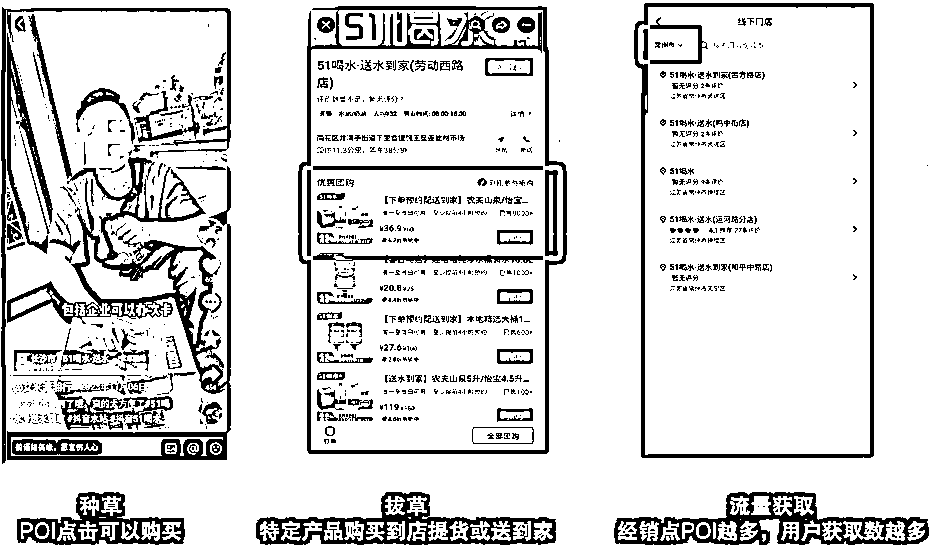
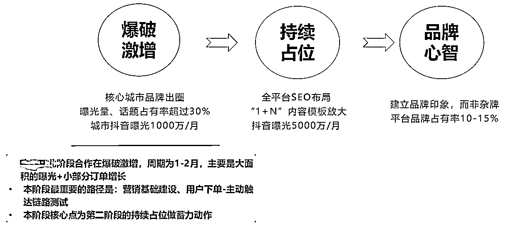
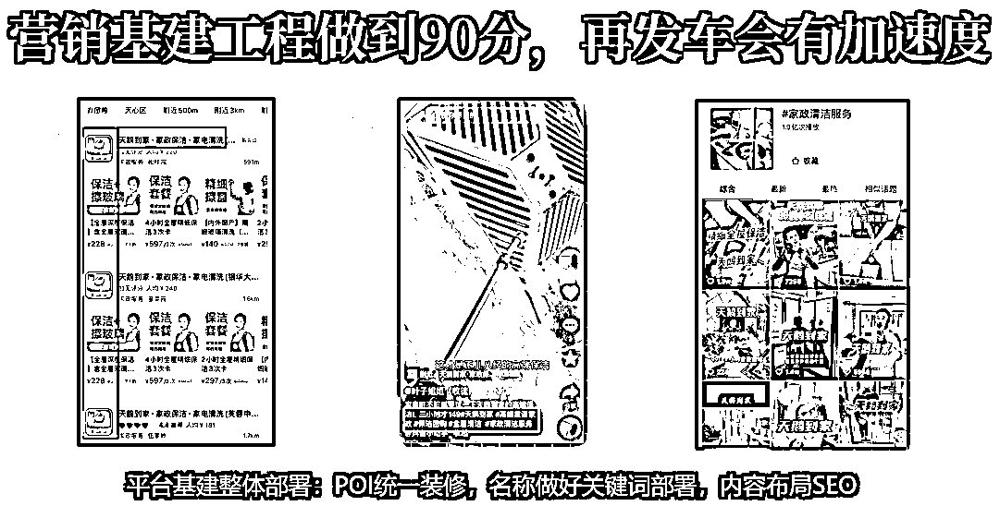

# 抖音水行业的运营拆解，适合流量团队的长线项目

> 原文：[`www.yuque.com/for_lazy/zhoubao/fsdocqc55gsech23`](https://www.yuque.com/for_lazy/zhoubao/fsdocqc55gsech23)

## (18 赞)抖音水行业的运营拆解，适合流量团队的长线项目

作者： 楚川

日期：2024-05-07

      这篇文章的原有标题为：我敢保证！水行业将是 2024 年抖音生活服务最大的黑马！（水行业流量方法论）。

这算是表达了我对水行业的看法，目前我们团队在这个行业做的动作是：营销基建+陪跑（原因是：水企业链条长，短期收益低，老板都想自己做），有准备 200 万左右（心理价位）去加入一个区域水厂，且水站直营化的团队，然后用整体流量运营的方式去做赋能。**大家可以考虑学习我们的方式去找合作水企业，做长线合作。**

下面进入正文，内容比较细，可以作为水行业的一些扫盲，起盘思考。

### 1、**前言**

2023 年抖音生活服务，家政、车后、洗衣等行业在抖音获得新生，为 2024 年 O2O 在抖音迎来更大的指数式增长，做了最好的铺垫。我是楚川，2023 年下半年联合 51 喝水、农夫山泉、雀巢等，在抖音申请行业入驻（水站/奶站），半年时间所有入驻的品牌发展低于预期，过程中暴露出履约问题、企业抖音整体运营思路失误、下单流程不流畅等，但还是给人证明了抖音水行业至少是值得期待，值得投入。

跟水行业打交道的半年，让我深刻认识到行业的信息壁垒巨大：有履约实力、资金实力的水企业难以触达互联网人群，对于最新的增长机会一无所知，反复被信息贩子收割而丧失新媒体的信心。这是一个无比传统而又焦虑的行业，上至水厂、水品牌、设备厂、耗材供应商，下至水站、SaaS 服务商都长期处于缺少增长渠道的状态，“不是不想做大，而是没有平台和机会”这是我听到重复最多的心声。

家政是一个低频次行业，线下实体覆盖面较广，过去 1 年多下单的用户有 80%为新用户，代表行业渗透率依旧有十足的增长空间。我们过去半年看到的抖音水站数据有惊喜，75%的新用户增长，并且大家要知道：有人的地方，大概率就有水站，覆盖面和密集程度会高于家政，而 75%的新用户也证明行业仍存有巨大的增量。

因此 3 月受闫崇义先生的邀请，参加中国饮水行业中部论坛，给大家拆解抖音水行业的打法和机会，希望能为这个行业带来一些启发。以下就是我大会分享的逐字稿和 PPT 关键页（**主题：水行业必须拥抱抖音：重构、可持续增长**），一家之言，仅供参考。

###   2、**正文**

#### **2.1 我们团队为什么会持续关注饮水行业的原因**

##### **团队定位：垂直孵化和服务 O2O 企业。**我们过去到现在已服务超过 5000 个实体商家和品牌，涉及到 100 多个细分的垂直行业，具备行业独一档的实操经验，能快速找到 10 亿以内体量的企业增长方法论，并能帮助搭建团队、落地运营拿结果。在 2020 年到 2024 年，我们一直在思考到底选择哪个细分赛道做到垂直，打深打透，并能持续到 10 年以上。

直到 2023 年真正在家政赛道拿到大结果后，真正意识到此类 O2O 业态适合我们的风格。我们热衷于搞流量，为企业赋能，但更多心态是希望合作伙伴能可持续增长，不习惯一锤子买卖，或者一波流直接走向灭亡。我们仔细分析 O2O 行业细分领域（*饮水、保洁、清洗、维修、招工、养老、摄影、车后、装企等*）都依赖人，需要时间长期经营，多次与客户发生交联，这种生意让品牌方会忌惮差评、长期影响，注重服务品质。

此类标签让我们欣喜，因为终于找到一个适合团队风格的赛道，并能为此付出时间、资金来探索此类企业的孵化和增长。

##### **团队的能力特点，基于过去丰富的实战经验，我们团队总结出自身特点。**

第一，抖音品牌云连锁-内部职人自运营系统的搭建。抖音本地生活的流量是网格化的，一个地址（POI）优先以 3-5 公里范围推荐给目标用户，因此需要在平台搭建云连锁体系，用 n 个 3-5 公里的流量网格联合一起，做到集群效应，吃到更多平台流量。这也是为什么第一批水站入驻抖音（51 喝水、水助理等）在招商加盟区域水站，以挂靠的形式提高营销效率，做大体量。另外就是实体行业的利润较低，必须想办法解决流量成本，于是我们就帮大量企业搭建员工职人矩阵（员工提供抖音账号），以一个运营中台剪辑、发布视频，做到长期经营，如一个品牌 100 个账号，一个账号视频发布 3 条/天，那一个月保底发布 9000 条视频，这是一个很恐怖的积累，可以真正做到降本增效，我们过去大量的合作客户也证明了这个方法的有效性。

第二，自研发 AI 批量生产视频工具：爆款“1+N”。我们擅长通过各种渠道做出爆款视频，再用自己研发的工具将视频拆解、填充新素材、合成复制 5000 条到 5 万条，再通过职人矩阵发布出去，提高再次产生爆款视频的几率。这是我们的能力点，在行业里面是属于特别的存在。

第三，抖音 SEO 部署“需求-搜索”链路：搜索成交 2000W/月。不少传统行业做推广的时候，可能会使用百度、和公众号 SEO 来获客，其实现在抖音的搜索流量实际上远高于百度。这就是我们今年一定要入手的一个维度，这也是我们团队过去几年沉淀下来的判断。我们现在操盘的项目一个月通过抖音 SEO 成交的体量在 2000 万左右，已经证明出巨大的潜力。

第四，抖音全国本地 KOC 达人与云剪渠道：品效合一。任何实体商家在抖音的推广都是以短视频种草爆破，依靠本地流量迅速实现 GMV 增长与新媒体用户拉新。这个能力无非是我们团队从业经验久，沉淀下来的一部分资源，实际上也不是很大的行业壁垒，更多还是依靠更加仔细的运营动作。

##### **楚川的背景出身。**楚川的本科专业是食品质量与安全，硕士专业为食品科学，在做新媒体搞流量这些年，真正与专业出身的相关行业合作几乎没有，所以在饮水行业摆在自己前面的时候，个人是有很大的情节想为这个行业贡献一份力量。在过去 4 年时间里，抖音水行业暂未开放，无法用高效率的方式做商业闭环，现在有了新的契机，所以就只需要去探索、调整，机会一定有，不做一定没有机会。

##### **抖音水行业的初期数据分析。**

**第一，先说说 51 喝水，我们做的投放经验做一个拆解。**

2023 年 10 月-11 月，两个月的数据统计来看：在全国货盘的分析，以农夫/怡宝（36.9 元/4 桶）的 sku 作为主打品，整体支付 ROI 可以做到 13.4（抛去基建成本，如 POI 搭建，SEO 布局等成本），核销率在 55%左右，也就是最终核销 ROI 在 6.7 左右。其实这对于 51 喝水是一个成本击穿的业务，因为全国货盘的产品毛利（平台型公司）只有 12%左右，意味着除去平台扣点 5%，提现手续费 0.4%，基本上核销 ROI 要做到 15，支付 ROI 则得做到 30 左右才是盈亏线。但这件事如果辩证来看，按照用户增长逻辑，那新增用户都是需要付出的成本，一个水站获得新用户，是否意味着要做新用户的付费，其实能平摊一部分推广费。当下阶段，如果纯粹以 GMV 和 ROI 的双保险去判断一个业务值不值，其实已经失去意义。从本人的判断来看，抖音对于水行业平台型公司其实并不友好，因为链条长到把这条线的利润都吃完了。如果非要去论证这个事情可成，我们核算出做全国盘，留出来 40%毛利是能够在抖音好好做一场，实现单月 3000 万以上的目标。

2023 年 11 月下旬，我们测试了另外一种思路：用 51 喝水扶持单城市区域水品牌，当时选的城市是宿州。这个测试有两个分歧点，我认为拿出来值得大家思考。因为上架的产品是 20 元+的景田，而当地的桶装水均价远低于这个定价，虽然抖音用户对于价格没有那么敏感，但还是超出预期。经过 15 天左右的市场培育，也在持续出单，一波流量大概带来 500 个用户，也验证我个人的判断：如果用区域职人矩阵+koc，做一个长期的生意盘子，拉长周期来看的话，一个月做到 1000 个以上的用户增长，预算在 5 万以内，都是一个划算的生意。因为平摊到单个客户的成本是 50 元，并且在产品上没有做到亏损，最终新用户增长成本在 35-40 元，只需要交付体验感做到位，是能留存在私域。

尽管 51 喝水现在的速度缓下来，但从我的理解是为这个行业做出来一个参考，这是一件了不起的事情，至少为大家找到了一个新方向。在这里还是肯定 51 喝水全员的付出和努力，从中的核心经验是：水企业做抖音一定要笃定，在所在城市把水烧开，不要浅尝辄止。无论是农夫山泉，还是 51 喝水，在初期推广的时候，市场是真的没有反馈，一定要到流量临界点，就能有收获。

**第二，我们有跟长沙玺湘源接触一段时间，在整体推广有给到一些思路。**2024 年 1 月，他们在挂靠入驻的品牌，做了一波流量测试，最终履约成交在 500 个左右的用户，单个成本约 35 元。当时主推产品是：9.9 元/4 桶水，履约前联系收取 120 元押金，其实本人是反对这种方式去伤害平台和用户。一般一桶水的价格会高于 9.9 元，平台大概率会判定这是在做站外引流，违规的可能性很大；其次是收取用户押金的方式，对于 18-40 岁用户来说，会有抵触心理，这类用户大部分就是互联网化人群，潜在的客诉压力很大，当订单爆仓后可能客户也跟着爆仓。

这种方式的经验是：只要能做增长，是否挂靠和报白入驻不重要，大家不用每天想着另立山头。因为在品牌入驻抖音的过程，需要做小程序搭建，链路测试，周期都很久，浪费大量的时间成本，还不如直接用最低成本、最快的时间做完测试和验证。另外就是我们在导私域的过程不能操之过急，需要一段时间在平台做到用户心智的教育，自然而然就会成为品牌用户，而不是强行去锁定用户，这个过程的摩擦很大。

以上就是我们在抖音水行业的实战经验分享。

#### **2.2 抖音本地生活让水行业增长的底层逻辑拆解**

1.  抖音本地生活的商业闭环分析

**C 端获客路径**

 首先跟大家拆解一下抖音水行业 C 端获客路径。大家看抖音短视频的时候，最左边的这张图片有一个绿色的标志，指的就是一个 POI，那就是一个地址，点击进去挂了一个团购套餐，选择配送的门店就是水站真实的经营地址。所以地址越多，POI 越多，经销点越多，触达用户的几率越大，这就是 C 端的获客路径。

****

**水站招商加盟**

 其次是水站做招商加盟的原因，就是要把 POI 基数做大，在平台吃流量空间越大，流量成本会摊薄。这就是当下成功入驻的水企业在做区域加盟，单水站的原因。这套模型在本地生活赛道中，功夫肩颈、小黄蜂家政等品牌已经得到了验证，水站无法是换了一个类目重新做一遍。

 这个商业模式考验团队能力最强的地方在于加盟水站的管控，因为到家业务跟到店区别很大，必须是准时准点到客户家里，而不是等待客户到店，这一块如果出现崩盘，那很可能就是连锁反应：客户投诉，加盟商造反，平台治理。另外还有一个致命的点是团队的流量运营能力，如果加盟水站无法得到稳定的订单增长，一样也会出现舆情。

**至于说这个模式的打法，能成的可能性一定是大户来玩**。在流量运营上，做到订单足够多，单个订单成本控制平衡或者略亏；加盟商的获取，以行业切入、抖音 IP 记录全程增长，两端同步进行。第一阶段至少是三个月的资金投入在 200 万-300 万之间，后续把所有水站当做零售店的场景，做水品牌的全国宣发，变成卖场逻辑，从产品赚钱，变成入驻+宣发盈利。

**水品牌供应链-水站**

 这个商业模式类似我们 2022 年做蓝龙虾供应链：供货进龙虾品牌连锁店，抖音主推品为蓝龙虾套餐，然后我们补贴流量费做推广，套餐售卖越多，蓝龙虾采购量越大。水品牌如果要做渗透率就可以用这套模式进行，水品牌进水站，用水站资质做区域连锁化经营。 但前提是有新媒体团队，可以让楚川团队来做陪跑，3-6 个月培养出一支可以稳定做抖音本地生活的团队，让水品牌逐渐提高渗透率，我们经过测算 6 个月左右，可以提高 20-30%的市场渗透率，并且是在竞争对手无法抵抗的方式。

**区域水品牌供应链-水站直营**

 这种商业模式目前是我们团队最想合作的企业，因为链条足够短，水厂直营到水站，也就是直面 C 端，会有足够多的利润能让抖音跑起来。这个只要能算清楚帐，一开始就能做到盈利，这种适合有心力做区域长期布局的企业，因为直营意味着覆盖面有限，短时间增长有天花板，那就是稳定做渗透，一个一个区域吃透，做好用户体验，长期下来就能形成稳定的阵地经营。

1.  **抖音重构流量分发逻辑给 O2O 新的增长机会**

因为全面拥抱抖音，我们亲眼见证客户、合作伙伴完成十倍、百倍、千倍的增长。最开始了解到的水行业大部分推广的动作是去社区推广，去摆摊、各种社群裂变，扫码拉单。但现在抖音来了，所有看到的探店达人，包括每一位发的门店视频都是在抖音发传单。

在 2015-2016 年，O2O 竞争白热化，各大平台做增长首先抢的都是销售，包括社区团购抢的也是地面销售，因为需要人海战术做地推，做获客。但现在抖音改变了 O2O，把水放在抖音生活服务里卖，不亏钱已经做到了增长。现在只需要用达人把视频发出去，自己的员工把视频发出去，自己的 IP 号把视频发出去，就能触达用户，就能直接购买，这些全是新用户。过去的销售千军万马在抖音变成了 n 条短视频。

#### **2.3 抖音水行业如何实现指数式增长**

1.  水行业已经被验证可放大的事实

2022 年-2024 年，相信不少人刷抖音看到过社区便利店的广告，抖音团购引流品是农夫山泉：一件 25 元的农夫山泉瓶装水，引流品只需要 19.9 元，中间价差 5 块钱，引流效果基本上都是上万人，也就证明水作为引流品是用户可接受的状态。

2023 年下半年，我们选择 36.9 元-4 桶农夫山泉或怡宝，实际上价格高于其他平台，但我们有信心。因为抖音本地生活的用户最先思考的是怎样购买方便，快速送到家，十几块钱的价差实际上没有那么重要。所以在 15 天的市场孵化期后，这个品就打爆了，农夫山泉-送水到府现在还在用这个品来做售卖。

1.  抖音水行业的机会点在哪里

**一定需要短视频-直播同频共振**

 现有短视频带货基础量，才有直播做销量规模放大，两者相辅相成，充分不必要关系。

为什么一定是短视频跟直播结合在一起，要共振？是因为直播比短视频至少要高 10 个维度的难度，做好短视频就已经让我们可以有很大的增长了。短视频的核心的逻辑在于所有的达人都是以内容为驱动，用视频呈现的卖点去触达用户，让用户去买单。

那做直播是什么？跟平台做生意，抖音直播考核的是单位时间的成交金额，成交单量。所以当下做小时达的时候，短视频都没有做好，凭什么能够做好直播？哪怕流量进来了，团队 100%也接不住。跟平台做生意，当你的流量接不住，那么流量就会变少，后期就是要付钱把用户买进来做成交，代价会无限提升。

对于初期来做抖音推广，直接上直播的成本可以做一个拆解。一个直播间的搭建，设备+场景搭下来 5 万块钱，招两到三个人的团队，加一部分流量投入，累计 10 万块钱，要卖多少桶水才能把这个赚回来？这对于普通水企业是很大的挑战。

那么从达人短视频的角度来看投入，性价比会比直播好很多。可能一批达人投入在 3 万元左右，换来 100-300 万的曝光，还有订单增长，可以很明确看出投入产出比。并且达人跟企业是甲乙方的关系，可以要求内容有标准，但直播高要求就意味花更多的钱去招更好的人。转移成本是项目初期爆破的必修课，我们团队做本地生活现在是第五年，现在团队依旧没有全职摄影师，所有摄影业务全是根据 sop 外包。

所以短视频是跟用户做生意，直播是跟平台做生意，那么我们一定要先用短视频拿下市场，等品牌势能起来，团队能力起来，再用直播做密集型成交，提高营销效率，两端才能同频共振。最后两者的定位就是：短视频是触达用户最快的方式，直播是放大规模最合适的途径。

**企业自运营是唯一出路**

行业低毛利无法支撑 DP 公司的存在。我们熟悉的家政行业，过去一年多接触或者服务家政公司有超过 600 家。不少公司都请了 DP 公司，我们发现家政不属于高频行业，且毛利较低，不少团队举步维艰。于是我又想起来抖音电商大赛道发展 3 年后，平台都在推荐，没有中间商赚差价的理念，必须是品牌自播自运营，就说明中间的利润 DP 公司是不可能存在的，于是只能鼓励品牌自营。电商的利润、毛利都比水行业要高，凭什么水行业当中还要加一个服务商？为什么不自己去干？所以自己去干是唯一的出路，不管你的企业品牌势能怎么样，自己干是唯一的出路，唯一的终局。

**产品必须有创新**

我其实没有十分懂这个行业的产品特点，我们团队内部做了沟通发现：第一次买农夫山泉一次性桶装水后就被成功种草，直接放弃了周转桶。也许在水行业人眼里，这是违背行业规律，但我想说穿云团队作为平均年龄在 25 岁的公司，购买一次，就改变了喝水习惯。我们团队一致认为桶装水量大，长期放不卫生，所以 4.5L 的一次性桶装水，这是一个好的选择。

既然年轻用户是这么理解产品的，为什么不去迎合用户做产品创新呢？因为我们在发现水企业宁愿 9.9 元 4 桶周转桶，伤害用户，强行用押金绑定用户。也不愿意自己的一次性桶装水来触达用户，真正在品质、服务上去绑定用户，那谈何未来？用户不需要高高在上的品牌，只需要跟他们坚守在一条线的品牌！

一样的道理，大家一定要思考为什么社交电商平台 4 桶农夫山泉只要 25 元，用户下单量低于 36.9 元的抖音团购。另外就是天鹅到家的站内下单 93 元可以买 2 小时保洁服务，但抖音用户依旧会选择平台的 99 元 2 小时保洁？因为用户的习惯在这里，那我们就必须要去贴近，想办法迎合他们。

**经营理念贴近用户**

从我的理解一定要深度贴合用户，主要可以从两个角度去切市场，作为企业发心，而不是嘴上说说。第一，让用户方便、安全、高性价比喝水；第二，如何缩短链条成本，让自己有利润。

前面有提到年轻消费群体对于一次性桶的接受度高，因为我们第一阶段跑出来的用户数据就是 76%是 23-40 岁的女性用户，大家在消费都希望“方便、安全、高性价比”，这个消费能力极强的人群，一定是要抓住的，任何消费品的核心用户都会优先考虑此类群体。其次就是我们在第一阶段的用户差评，几乎没有任何产品的质疑，都是没有送到家，体验感不好。那在这一块的体验感必须要做好的，用户体验在抖音是生命线。

最后就是如何缩短生意链条，提高利润。我们在 2024 年 1 月到 3 月沟通了大量水企业，在生产成本、运输成本、水站配送成本成了固定支出，超过 70%，留给运营获客端不到 20%，这其实对于流量运营来说挑战巨大。这对于这个行业在抖音的推广来讲，是极度不友好。我们作为操盘手要想着接触到用户的个环节，怎么样缩短所有的成本，就像电商一样，怎么样把快递、包装的成本降下来，把所有的空间留给自己或者是用户，这样才是一个持续可增长的生意。

#### **2.4 抖音水行业如何破局**

1.  抖音水行业的增长路径

我写了一个抖音本地生活品牌的增长路径，主要是分 3 个阶段。第一是品牌爆破期，预计是 2 个月左右，重投入在抖音获得曝光和订单增长；第二是品牌持续占位，占领用户心智，持续 4 个月左右；第三就是可持续增长，用户被教育一个周期，团队能力进入平稳期，然后就是真正在 6-10 个月真正培养用户品牌印象，跟普通品牌做区隔。

1.  营销基建工程做到 90 分

好的基础会让营销有加速度。前面的叙述讲到我们如何破局，现在讲一个最重要的点，其实也是大家都可以做到的点，每个公司都可以做到：那就是抖音营销基建。

跟大家说清楚一个道理，我们开店的时候，肯定是优先做好门店装修，再去做引流。一样的道理，我们需要在企业做推广的时候，把自身营销基建做到 90 分，如下图。

如果抖音营销基建没做好，乱七八糟的，那在推广的阶段是减分项。整体的节奏会出现：第一个月做 1000 万，第二个月掉到 100 万，后期再拉起来会难上加难。那么做好了营销基建，我们 99%的合作方，都是能做到 300 万起步，然后每月 30%的速度往上攀升，后期加速度越来越大。那在营销基建的搭建上，楚川团队一直是行业交付能力顶级的公司，大家有需求也可以随时链接。

1.  云连锁-抖音 SEO-职人矩阵化经营，做长期流量拉锯战

可以给大家设置一个小小的目标，以后要做抖音推广，一定要做抖音矩阵：单城市不能低于 100 个职能矩阵，比如覆盖 20 个城市，那目标是 2000 个矩阵账号。那怎么样拿到足够多账号？那就是所有的员工、店长、送水职员都可以成为矩阵一员。当你手里有 1000 个矩阵，一次性发布视频就是 1000 条，起步 200 播放量，那就是 20 万曝光，这可以省掉多少成本，对于品牌的宣传是非常大的价值。

那更加深度理解职人矩阵，跟大家拆解一个逻辑。当新店开业，大家都会邀请亲朋好友捧场，以及请兼职在周报 1-2 公里发传单，职人矩阵就相当于请了 n 个人在抖音做日常发传单。引流到店后，达人和直播间就做了密集成交，做了成交动作。所有的 KOL 和 KOC 就是销售经理，给日积月累的发传单势能积累，最终做大面积成交，而直播的理解就是把所有人叫到一个大卖场，然后做会销，放大规模。把这个逻辑点想清楚后，就能判断出门店或者的品牌要做推广的阶段需要的是什么。

1.  抖音水行业到底要重构什么？

**服务质量和交付质量是最大的底线。**抖音本地生活现在已经穿越了教育期和过渡期，现在只需要好的供给和交付，做好了抖音会无限给流量。现在抖音的部门变动都是在剑指服务质量，不好的平台和企业都会逐渐被淘汰，服务质量好和交付质量好的品牌一定是越来越多流量的。

1.  最重用户到底喜欢在哪买水、如何用水

所有的水企业一定要尊重每一个抖音用户，因为在哪里买水，如何用水是用户的选择自由。当我们疯狂做引流到私域的动作，抖音一定是会下场收拾的。抖音用户逐渐不会在意部分差价，而是如何舒舒服服的购买服务，减少被打扰、被营销、被消费绑架。千万不要有山头主义，忘掉自己有平台，有 APP，因为抖音用户是抖音的，而不是你的，想好自己怎么跟抖音共生，那就一定有大机会。

1.  告别品质自嗨

楚川是食品安全专业出身，对于产品品质的角度上，希望传达的点是大家一定要告别品质自嗨。中国的好产品、好品质、好水真的太多了，根本就数不清，所有水企业都会觉得自家的水好就一定有人买单，酒香也怕巷子深，所以我们一定是要告别品质自嗨，而是想着怎么样去触达用户，让用户下单，没有可持续增长都是一厢情愿。我们应该去问消费者，问买单的年轻人，水品质的好坏是不是营销购买的决策。当下的市场大家关注点不在于技术、水源，在想要获得可持续增长的时候，一定要理解用户，理解未来。

1.  抖音水行业如何可持续？

水行业如果在抖音做生意一定要坚守以下三个点去发展，一定有未来，并且可持续：

**第一，企业自运营，将利润留给自己；**

**第二，营销基建必做，职人是可持续发力的法宝，合理借力达人；**

**第三，供应链坐庄，具有产品控价权。至于说这一块的解读，上文已经有很详细的拆解。**

最后想说的就是，想一遍不如下场做，如果有相关的合作需要链接，可以深度沟通，但是拒绝白嫖。期待水行业能在抖音起飞，都有好结果，完成品牌进化。

* * *

评论区：

暂无评论

* * *