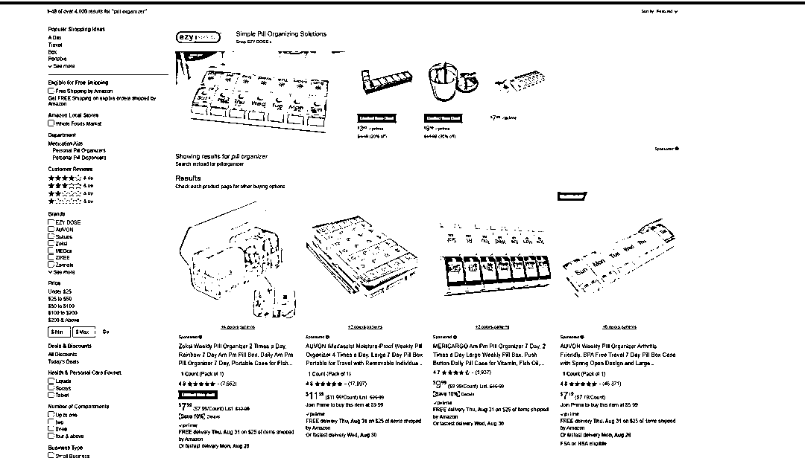
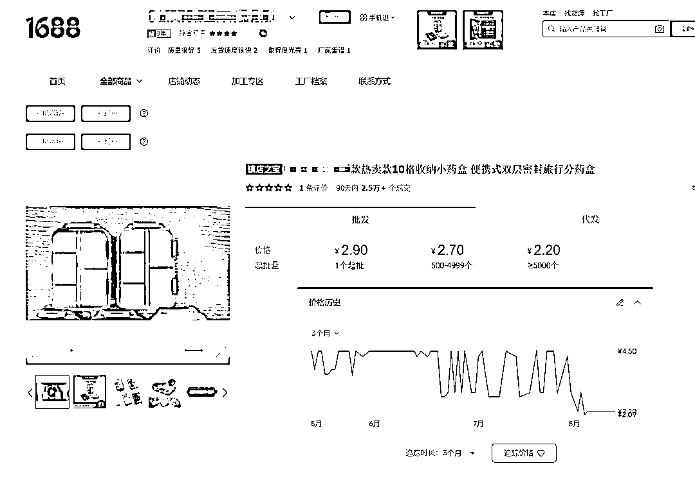

# 项目分享-通过 pipiads 两个月时间海外搬国内狂出 4000 单净利润超 10 万

> 原文：[`www.yuque.com/for_lazy/zhoubao/hxu7f3xelp3p6sot`](https://www.yuque.com/for_lazy/zhoubao/hxu7f3xelp3p6sot)

## (58 赞)项目分享-通过 pipiads 两个月时间海外搬国内狂出 4000 单净利润超 10 万

作者： 梁小伟

日期：2024-05-11

嗨咯，我是梁小伟，草根 00 后，跨境电商从业五年，Tik Tok 投放从业三年，今天给大家分享一篇实战项目经验。如何通过海外的素材到国内变现纯利润十万人民币。

**项目用时，三个月**

先上收益图

这是 2023 年 7 月通过 pipiads 选到了一款 tiktok 上爆的单品，拿到小红书上复制后的出单情况，

接下来，我会完整解析整个流程是怎么做到的。

项目逻辑：

正常我们出海商家是把国内的商品去海外曝光和销售，我反向测试，把海外的素材，海外爆的品拿到国内来进行测试复制

1：素材

一款爆品打爆，大量的海外 ugc 内容出现，出现信息差，通过简单的混剪即可

2：渠道

海外 tiktok 的调性和国内小红书抖音的调性一致，所以我当时选择了小红书

3：素材来源和选品来源

直接通过[pipiads.com](http://pipiads.com)进行选品，因为 pipiads 上面所有的数据都是 tiktok 投放的广告数据，有大量的投放素材和投放产品。可以快速的观察有结果的品和素材情况。

4：所投入的时间

每天晚上两个小时+周末

**项目从 0-1 阶段（去年五月之前，从未使用过小红书）**

皮皮从业跨境电商已经五年，tiktok 投放这个赛道已经深耕三年，是一个很喜欢折腾的人，从小有一股倔劲。

当时通过生财有术观察到大量的玩家通过小红书这个赛道拿到结果，有玩国内外旅游出行的，有达人种草渠道的，有电商带货的等等等等，自己就开始手痒了。

1.我开始研究国内的电商

最早这一批前辈通过搬抖音等平台到小红书做无货源拿到结果，我一看，不难啊。

于是 2023 年五月底开始深度研究，下载了小红书，每天去刷两个小时找找感觉

发现做自然流矩阵确实有红利，因为小红书是靠笔记去出单，一条笔记爆了可以出几百上千单

熟悉平台情况后，我发现相比其他老牌电商平台，小红书近两年才开始布局电商

例如用户电商氛围（大家更倾向于搜索经验）用户电商习惯（小红书近两年开始转型）

随着平台逐渐加大电商板块的布局

对应的，官方对于电商的补贴力度，对于新客户的下单补贴（5-30 人民币）

我顺势就开始入场。

**项目从 0-10 阶段（5 月-6 月）**

整个注册流程网上大把的资料，我就跳过了。

我注册好之后，一个个体店可以绑三个个人账号+一个主体账号

相当于四个号都可以发布内容

第一次，我测试了 pipiads 上面的一款小爆品-迷你相机

PiPiADS 关键词搜索 Mini Camera

海外最爆的是这一款迷你相机

不过我没有做，因为太爆了，国内外已经没有生存空间，我很难做起来

对应的，也是延伸了核心点。差异化赚信息差

1.国内品和素材爆，海外没有，是潜在机会

2.海外品和素材爆，国内还未来得及，是潜在机会

我第一次测试这款产品，出了 200 单

pipiads 选的，拿货 50，售价 99

当时选的这款小爆品，皮皮上只有几百条素材，后面没素材暂停。

第二次选的大爆品，迅速拉爆。相信所有看过我文章的皮友都不陌生

鲨鱼睡衣。

我写案例的时候调研这款产品很深，我迅速的就把这款产品上到了国内。

素材直接把海外的素材简单混剪，发现没几天就开始出单了。大家很喜欢

连续每天出 10 单，出一个星期的时候，我发现我的精力不太够，剪辑，发布，供应链对接。

但是我一个人很难放大，

我怎么做的呢。

**项目从 0-50 阶段(团队化运营）**

我有几个好朋友还在上大学，我就跟他们说让他们去剪辑

从 0 开始带他们

还有一个项目合伙人，去负责发货和对接供应链

带团队：

1：本身自己经验足

2：舍得让利

3：做好 sop

4：团队小伙伴执行力强

心理历程：

所有的项目，都是我亲力亲为，亲自去跑通后去复制，但因为我志不在此，仅当做一次阶段性尝试，但我又考虑到怎么样才能，既不浪费项目的同时又不占据我的时间。

我开始去做 sop，手把手的去教怎么混剪，怎么发布，怎么对接供应链

耗时半个月打磨好团队 迎来爆发期 解放了我的时间

随之一条笔记爆了，出了 1000+单

本以为顺风顺水 供应链遇到问题-踩坑篇

当时这款产品，就只有几个工厂做，几个工厂因为亚马逊爆单了，对我们一件代发比较抗拒（有量有尊严）

我们一下子爆单了，货发不过来，要超时了

团队解决不了，只有我去解决

所以我那半个月供应链上面耗费了大量的时间，去催发货，去找新的供应链，还要去给着急的客户解释。这些只能我亲自去处理

供应链：

建立稳定的合作关系帮忙一件代发，同时找 3-5 家供应链去应急

稳定的供应链拿货最便宜，质量最好，挖掘了一星期后浮现

应急供应链-基本上没赚什么利润，但可以发货

小红书打击无货源-直接通过微信建联，让工厂源头发货

超时处理：

每一个客户我都会去安抚，打电话交涉，甚至会直接现金补贴

有一说一，小红书上的用户素质真的高，我会真诚的表达货发不出来，可以进行退款，并且我补偿 5 元的代金券

又或者遇到脾气急的客户，我会先表达理解，并且表达歉意，告诉他们会优先发货，基本上都会理解。

一句话总结，细心-耐心-坚持

这些流程优化后，反复去做，三个月出了差不多 4000 单，一单净利润 30 人民币

**项目 50-100 阶段（矩阵）**

大家已经知道，所有的素材都是 pipiads 上面找的，但要供给三个账号，出现上千条，我是怎么做到的。

**1：混剪**

**2：实拍**

**3：图文**

混剪，有十条素材，我们可以混出几百条出来，这个没什么难的

实拍；从头到尾拍摄过三次，都是亲力亲为，就支撑了很长时间的素材片段

再拿实拍的和互联网素材结合。素材解决

3：图文

我是这样做的，我是加到那些给我好评的小伙伴，让他们去拍摄照片给我，我给他免单。有些小姐姐还会自己拍视频送给我们，再把这些图片拿去发布

以上就是一个项目流程。很简单粗暴。

**2024 还能这样吗？**

答案是可以的，你如果结合 pipiads 和小红书去看，或者是直接看小红书，那些外国人镜头的笔记。大概率就是这样操作的。

你需要解决的问题：

选品：

pipiads+国内电商平台

剪辑：

你自己是否有时间剪辑，或者像我那样有小团队

供应链：

你是否有启动资金，1-2 个月结算一次。期间是需要一直垫资的，又或者有成熟的供应链经验去搞定退货发货等问题。

选品：

第一步:去 pipiads 观察爆品，素材越多越好，产品符合爆款特征，这里我之前文章也有写过，可以去看一下什么是爆品特征，也可以去找皮皮客服领取选品知识文档。

第二步，去查看你找到的这个品，小红书，抖音，淘宝等电商平台的售卖情况，做了多长时间，以及做的人多不多

如果相对较少，或者没什么人做，又或者之前有人做没做起来，或者笔记较少。那你就可以尝试测品了

就是这样的笨方法，一个一个的看，一个一个的分析和搜集去找信息差

第三步,去挖掘供应链，看看是否供应链稳定，产品质量达标。产品质量差的品千万不要碰，退货率会让你哭泣

注意事项：

1.这个我个人感觉从长期来看是不适合的，适合短期打项目。

2.我自己更建议出海，因为国内比较卷

3.我自己亲自测试了之后，我发现小红书做流量很好，电商还是难以支撑一个公司，但是思维是没问题的。

4.通过 pipiads 挖掘产品，一定要细心和坚持，持续去挖掘才有机会。

5.打项目非常考验领头的人，任何项目做到极致都可以赚到

我把 PiPiADS 找品的核心选品方法论也同步给大家：

# 总结

熟能生巧，无他，唯熟悉而已。量变引起质变。

之前的一些 SOP，容易限制大家思维，所以多发散思考。

分享我之前写的投放 tiktok 广告怎么找爆品的教程，可以结合去看思路

## **关键信息**

**关键词：强度+信息差+趋势+验证**

**强度：**通过一定强度的选品，了解市场上现有当前投放的产品：**市场上的主要类目是哪些，都有哪些品过去&现在在火的，火的原因是什么，我们是否有优势可以**

**信息差：**当新品出现的时候，可以快速进行感知，比别人对于新品的敏感度更强，这就是**网感**，在第一时间发现新品，这就是信息差

**趋势：**发现新品的时候，观测产品趋势，是向上，平缓，还是下滑**，通过持续观察，发现产品趋势，选择正在上升的产品**

**验证**：多渠道验证，从 tt、亚马逊等一些海外平台，验证海外用户对于此产品是否有需求

**通过一定强度的选品，了解市场的趋势，然后及时发现新品，找到上涨趋势的新品，且通过多渠道市场验证的，如谷歌搜索指数也在暴涨的品，最后分析匹配度和优劣势，抓到匹配度高且有优势的产品进行测试**

## **皮皮选品技巧分享**

**以皮皮为锚点，发现一个好的品之后，多渠道进行验证，去伪存真**

观察到特定产品的时候 在进行分析

另外，注意皮皮数据不一定准确，也是需要通过自己网感，判断内容/选品等多个维度进行观察

### **广告搜索**

**选取纬度：**7 天+shopify/shoplazaa/shopline

适用于对于**内容**较为敏感的同学，从内容角度去分析视频爆火的原因

### **广告产品**

**选取纬度：7**天内+广告展现/广告数/广告天数

适用于对于**产品**敏感的同学，及时发现新品

结合广告展现/广告数/广告天数等维度数据，了解产品趋势，进一步判断产品可行性

### **广告主**

**选取纬度：**7 天+shopify/shoplazaa/shopline

**适用于观察特定广告主，看下他们近期开发什么新品，或者他们的内容近期如何优化**

选品案例及拆解

**01 利润是核心**

1.选品上 投放广告建议选客单高一些的广告产品  选低客单产品  某些类目投放平台单转都要十几二十多美金 你选一些低客单产品 是玩不了的 除非自然流

（基本上 pipiads 看到投的很猛的品都有利润空间）

**选客单价高的产品** 这样生命周期会长一些 成功率也会更高一点 因为利润空间大 才有可能**支撑广告费** 支撑**各种成本 02 与平台符合-打冲动消费**

1.Tiktok 是短视频娱乐平台 大家去带着**娱乐心态**去使用软件 建议找**新奇特产品开发**普普通通的品 你要和线下超市 各大电商平台竞争很卷。

2.尽量选**受众广产品测试**原因目前平台商业化标签还在积累中 **需求群体多 更容易出结果**

3.**爆款元素组合**（情绪价值、功能性、热点、节日礼品，情怀） 举例 基础产品：一件普通的白短袖 烂大街了 如果我换上刻上鸡汤文案（看世界做自己） 配上点图 赋予意义 结合节日和礼物 文案代入例如 情人节最好的礼物 亲爱的我会陪在你身边 是不是又多了不一样的感觉 相比干巴巴的卖短袖

（单一元素存在不确定性 多元素结合产生爆款）

**03 不容易在各大电商平台找到**

1.随着时间发展，越来越多的消费者会有**比价习惯**，像独立站本身还有**信任度**的问题，不知道你是否遇到过 投 spark ads 开评论 会发现有时有人来你帖子下评论骂你 骗局 原因是这个品被人发过垃圾货 或者不发 然后你背锅了... 甚至还会有一些用户评论在某某某平台更便宜 分享链接

2.尽量去**挖掘**一些平台**不容易搜到**的产品，或者就是选**质量好的产品** **结合优质服务**去打造信任链接

能搜到也无需担心 你标题改变  然后包装换一下 让消费者看不懂 不容易搜到 例如 绿色+笔记本 我标题换成 （柠檬南瓜 纯爱之光） 艺术感上来了 消费者一搜 还不容易搜到（参考国内小说推文）

**04 情绪选品 yyds 调研和了解用户的情绪是每个电商玩家都应该具备的基本技能**

情绪共鸣产生认同 调研情绪 不停的挖掘大众群体不同的情绪 挖掘他们的诉求 将**诉求和产品结合**起来是**兴趣电商**一个**关键点**

1：可从细分市场切入

（1）怎么找到细分人群刚需

（2）避开大类目竞争但不选择太冷门的品

（3） 模式的思考

（1）细分市场选品的**核心**在于**通过一款产品发散思维后精准定位**

案例：想做一款包 不确定是什么包，因为箱包是个大类目 我要通过超级发散的思维思考给这个品添加元素 挖掘细分市场

怎么发散呢

**先以 pipiads 为锚点挖掘到一款热度不错的产品**

**这款产品的爆点进行拆析节日**：母亲节、父亲节、情人节、圣诞节

**对象**：男士、女士、父亲、兄弟、上班族、朋友、闺蜜

**功能**：收纳、屏蔽 NFC/RFID 扫描、可追踪、便携性

**场景**：户外、聚会、买菜、办公

**主题**：毕业、生日、活动、周年

有了思维框架 去调**研市场 继续挖掘需求和反馈**

（2）**避开大类目竞争激烈的品 或者红海里面找蓝海**

还是以包为举例 女包各大牌竞争激烈 产品花样百出 我们一个小卖切入进去 发现很难

除了女包 还有很多分类 户外包 单肩包 手提包去延伸

需求可以去速卖通亚马逊等电商平台去看类目细分 去研究排名靠前卖家或品牌的评论和反馈

（3）**市场什么好卖卖什么** 一模一样去跟 ：他吃肉你喝汤不长久。但执行强有机会  需要**不停的找品测品**我**目前是不太建议的**

可以通过**差异化拉高上限** ：地区差异化复制 它美国市场跑爆了，你立马换未投放的国家测试 ：在它的基础上做创新优化 做新素材 加入创意 ：找类似款 功能性 同类型 一比一学习模仿

**提炼思路 找到爆点 自己开品** ：经过大量的案例和实践 总结爆单元素规律 自己去打造爆款

核心点 大市场厮杀严重 细分市场很多商家做的不够细致  我们可以思考供应链 营销等各种角度研究 看看哪些是自己的优势 先做到比他好

**接下来 我会用这款药盒爆款案例 来给大家看看 一款爆品是怎么多平台反反复复的爆产品：收纳小药盒**

最开始通过**pipiads 获取**到这款产品有轻度投放 tt 广告

我当时觉得这个品有意思 就去开始调研

**查看了 tt 自然流关键词标签**

标签：**#pillorganizer**

有**7800 万播放**再结合产品本身的属性 我初步**判断市场有需求**

但为什么会这么爆呢？我开始去亚马逊等平台查找蛛丝马迹

观察到这种小药盒 **亚马逊销量非常好**

找到了一模一样的药盒

**11438 条评论 评分 4.7 分 2019 年就开始售卖了**

到这里 我有一个思考，就是**亚马逊的药盒**是**没有**那些**收纳贴纸**的

**社媒火爆** 是不是因为**贴纸**的原因呢？

我去搜索 1688 发现**货源是没有带贴纸的**

继续挖掘和分析 etsy 平台 **etsy 平台主要特色就是售卖手工成品 和各平台都比较契合[etsyshop.ai](http://etsyshop.ai)**上**搜索**关键词**pill organizer**

（选品数据来源：[`www.etsyshop.ai/`](https://www.etsyshop.ai)）

**果不其然 上面有商家售卖药盒贴纸电子版客户购买一份自己用打印机打印出来就好 信息差出现商机也出现了**

**也就是说，独立站等其他玩家花 4.89 元买了一套 pdf 打印出来 贴在这个拿货 2 人民币的药盒上 社媒又卖爆了！**

**etsy 的品大多都契合 tiktok fb 等平台**

我观察到**很多大爆品 直接复制 etsy**爆起来的品拿到结果，当然也没有那么容易 需要测试和优化，二八定律

我继续去 tiktok 社媒评论区去调研需求

[`www.tiktok.com/@pocket_pharmacy/video/7207195991169109290`](https://www.tiktok.com/@pocket_pharmacy/video/7207195991169109290)

客户的**反应非常感兴趣** 并且不容易找到货源

**挖掘出需求实用：旅游+便携+收纳+标签情绪：标签有趣可爱好看意义：可以自己 diy 专属药盒**

继续通过**pipiads**去**查看**了**tiktok 小店**的售卖情况

**六月开始上架，到现在八月底出了 1400 单**

调研后该类目我延伸出来的机会

**1：产品本身有市场 可以复制 挖掘其他便宜药盒 设计出新的卡通好看有特色的贴纸售卖 2：我可以直接卖贴纸 pdf 无需发货 给消费者打印下载 迭代更新**

思路是相通的 其他产品我是否能够这样去构思呢？

答案是的 这就是方法

我来给大家**捋一捋时间线最早亚马逊 19 年开始售卖 没有贴纸 单盒子**

**etsy 卖家出现售卖 PDF 电子贴纸**

**独立站等玩家贴纸结合药盒开始社媒进行投放内容推广**

**小店等社媒内部电商渠道上架**

整个时间段 不同渠道或平台的差异化复制后都有了结果反馈

这就是一个**爆品的多渠道差异化思路**

**etsy**最近一个月我去深度研究后，高度契合社媒平台及兴趣电商，建议不管是亚马逊玩家 独立站玩家 还是 tiktok 小店玩家 都可以把 etsy 当做一个选品参考平台去获取信息

工具推荐：[etsyshop.ai](http://etsyshop.ai) 基本上我的精力大多花费在海外，这个项目分享给大家看看。本次分享到此结束。感谢各位前辈。

* * *

评论区：

静水流深 : 杉木老板肯定开心死了[呲牙]
梁小伟 : [呲牙]
0 封 : 厉害厉害
梁小伟 : 还需要学习，取了个巧
哲学工作室 : 这不是皮皮广告的软文呀
梁小伟 : 我就是皮皮的运营
子白 : 有没有微信，求建联

* * *