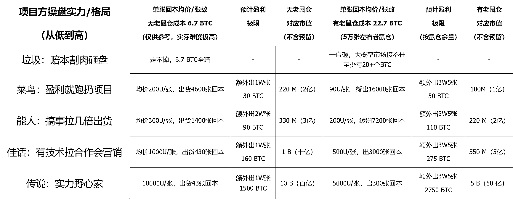
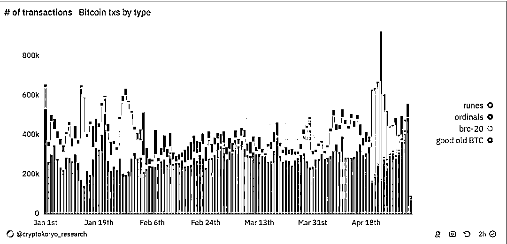
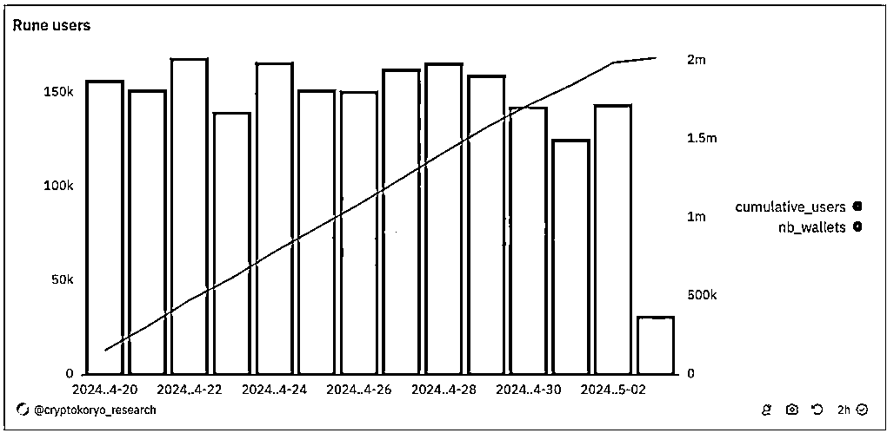
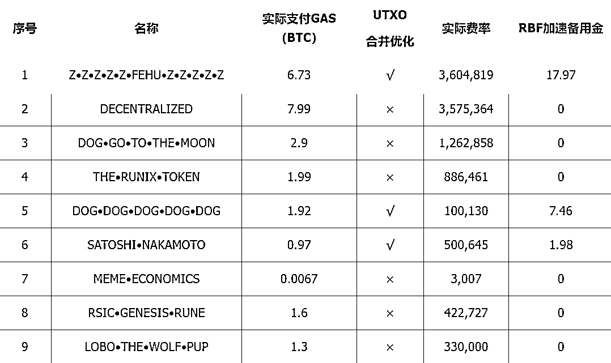
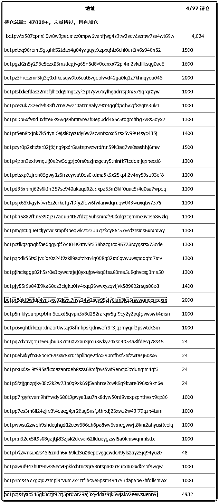
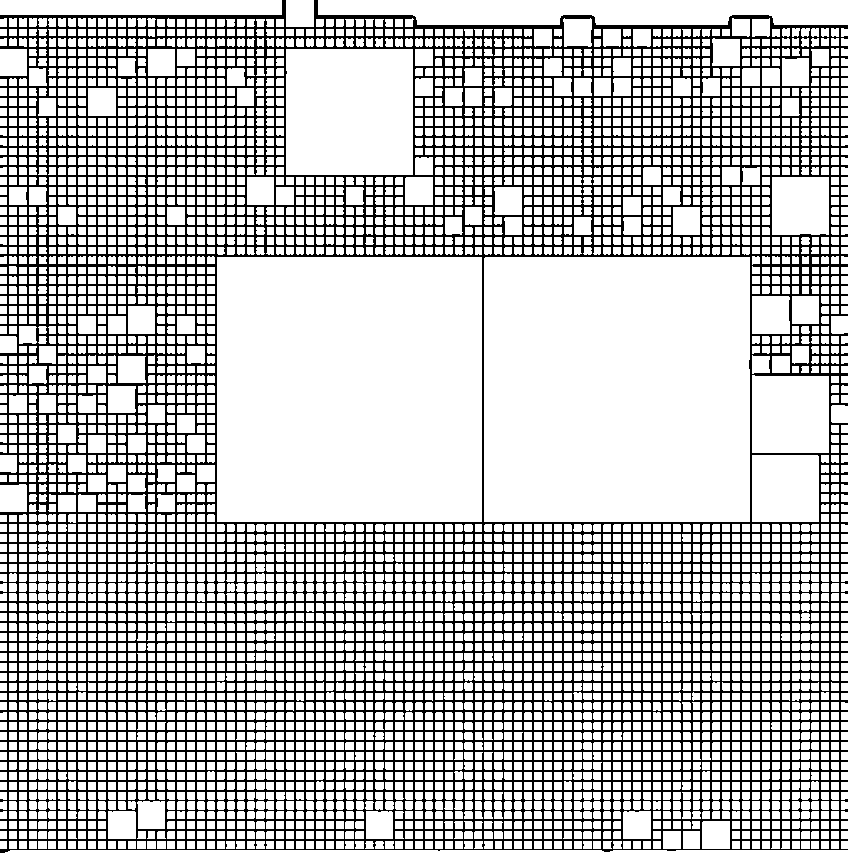
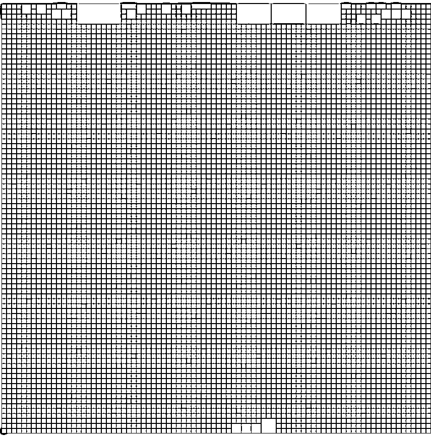
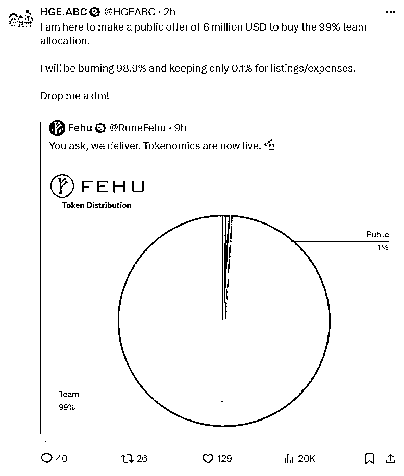
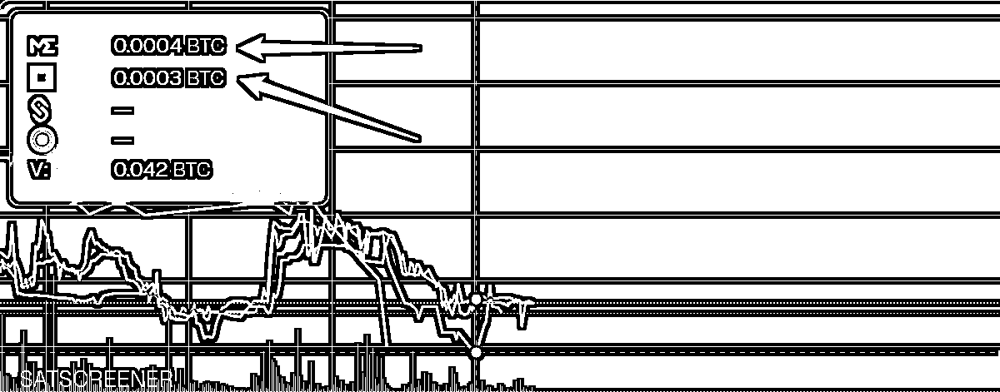

# 异常值：请反驳，实在想不出这个神盘怎么可能不赚钱！

> 原文：[`www.yuque.com/for_lazy/zhoubao/optqp7fgkcwa2mzq`](https://www.yuque.com/for_lazy/zhoubao/optqp7fgkcwa2mzq)

## (42 赞)异常值：请反驳，实在想不出这个神盘怎么可能不赚钱！

作者： 安启 Archie

日期：2024-05-09

**这篇文章的日期和 FEHU 当前价格**

**2024/5 月/9 日**

**[Z•Z•Z•Z•Z•FEHU•Z•Z•Z•Z•Z](https://unisat.io/runes/market?tick=Z%E2%80%A2Z%E2%80%A2Z%E2%80%A2Z%E2%80%A2Z%E2%80%A2FEHU%E2%80%A2Z%E2%80%A2Z%E2%80%A2Z%E2%80%A2Z%E2%80%A2Z&tab=2&p=1&at=Sold)**

**Unisat.io 当前价格【****35,550 sats/张 ≈ 22U】**

### **调研结论：30U/张以内建仓，短拿翻倍出本，长拿十倍起步**

### **风险主要是机会成本，资金占用短则一个月，长则半年**

**————短期（3 个月）FEHU 价格低于 90U/张，项目方不可能回本**

**————长期（6 个月）Runes 发展+第一序号+销毁，看到 500U/张（对应 5 亿 U 市值）**

以上推论为最低预期，都假设 FEHU 项目方十分拉跨，仅仅因为它是 Runes1 号及销毁预期

#### 利益相关：本投研报告撰写者重仓 FEHU（且逢低加仓）

#### ——深圳鱼跃 Labs/投研手 安启

> # **序、项目成本/盈利推算**
> 
> **项目方盈利单张价格推测**
> 
> **结论：****单张价格不到 90U 项目方不可能回本（但 90U 太低很难出货）不到 200U/张项目难有可观盈利**
> 
> ### **参考表格/数值说明**
> 
> 部署成本和盈利策略，其中涉及多个假设与市场操作策略
> 
> 
> 
> * * *
> 
> # **一、RUNES 符文协议/1 号潜力解读**
> 
> 
> 
> **红色部分记录了 Runes 爆炸式增长的交易量，已经远超 Ordinals 和 BRC20 代币**
> 
> **Runes 趋势是关键基本面**
> 
> Runes 正在出圈，图中红色部分记录了 Runes 爆炸式增长的交易量，已经远超 Ordinals 和 BRC20 代币，这一趋势表明该协议越来越普及，更多投资者和用户纷纷涌入
> 
> 币圈炒新不炒旧，随着 Runes 继续占据主导地位，总市值和造富效应超越 Ordinals 和 BRC20 只是时间问题
> 
> Runes 起势是必然，鸡犬升天，FEHU 作为 1 号，会持续获得关注和资金注入
> 
> **红色部分记录了 Runes 爆炸式增长的交易量，已经远超 Ordinals 和 BRC20 代币**
> 
> 1.  BTC 生态随着 ordinals 协议和 BRC20 的诞生而备受追捧，早期的投资者和参与者都获得了极高的收益
> 
> 2.  但西方社群全线踏空，BTC 生态中一直未出现形成全球共识的资产发行协议
> 
> 3.  BRC20 协议产生大量垃圾 UTXO 堵塞 BTC 内存导致广泛批评，其它 BTC 协议也后续乏力，尽管如此，比特币生态依然需要稳健的资产协议来推动前行
> 
> 4.  在过去一年多时间里，多个新的比特币协议相继出现。在设计 RUNES 协议时，Casey 综合借鉴了这些新协议的优点，并进行了长时间的预热。RUNES 协议诞生了
> 
> 5.  得益于西方社区的积极参与，RUNES 协议的推出标志着东西方首次在比特币资产协议上形成共识
> 
> 6.  随着当前牛市的推动以及比特币生态的不断发展，RUNES 协议虽然仍处于初期阶段，但已经显示出极大的潜力。在这个新兴的资产协议中，预计会诞生多个市值过亿，甚至是市值超过百亿的资产标的。因此，寻找并重仓这些潜力巨大的资产标的，将是本轮牛市中投资研究的核心任务
> 
> 
> 
> **新协议成功取决于其吸引和留住用户的能力，黑线表明 Runes 用户增长迅速**
> 
> # **1 号 FEHU ᚠ 潜力摘要**
> 
> > ### **潜力**
> > 
> > 1.  **因为是 1 号，BTC 生态非常看重 First is First，第一就是第一，永远是第一**
> > 
> > 2.  **项目方高度控盘，天然排斥游资野庄**
> > 
> > 3.  **天量销毁预期**
> > 
> > 4.  Z•Z•Z•Z•Z•FEHU•Z•Z•Z•Z•Z，名称非常成功
> > 
> > 5.  资产结构设计完美
> > 
> > 6.  筹码分布上华语区参与度低，老外含量高，结构设计天然排斥纸手和低风险偏好投资者
> > 
> > 7.  投资风险相对较小（30U/张以内建仓，保底 3 倍）
> > 
> > ### **风险**
> > 
> > 1.  项目方详细背景不明
> > 
> > 2.  运营和市场周期时间难预测
> > 
> > 3.  机会成本、资金占用时间，短则一个月，长则半年
> > 
> > 4.  销毁前价格拉升依赖符文生态发展和项目方运作
> > 
> > * * *
> > 
> > # **二、#1 FEHU ᚠ 资产设计解析**
> > 
> > ## **资产结构概览**
> > 
> > ## **资产设计思路**
> > 
> > ### **名称和符号**
> > 
> > > **符文 FEHU**
> > > 
> > > 1.  “ᚠ Fehu”是古代北欧符文字母表（Futhark）中的第 1 个符文，代表财富、物质和经济成功。
> > > 
> > > 2.  名称“Z•Z•Z•Z•Z•FEHU•Z•Z•Z•Z•Z”中，包含了重复的“Z”和北欧符文字母表中的第一个符文“FEHU”这种结构和组合暗示了一种意图和象征性，特别是在北欧符文和神秘主义中
> > > 
> > > 3.  在神秘和精神领域，Fehu 象征着财富的动力和生命力的开始，有行动带来财富的寓意
> > > 
> > > **重复的“Z”**
> > > 
> > > 1.  在“FEHU”两侧排列的“Z”象征着保护和加强中间符文的力量，类似于在符文仪式中用其他符号来加固某个特定符文的常见做法
> > > 
> > > 2.  其重复出现也是为了创造一种视觉和语义上的平衡，并用来增强中间核心符文
> > > 
> > > **占位符“•”**
> > > 
> > > 1.  占位符的设计初衷是为了分割，以避免 13 位以上的名称过长不便识别，但部署方反向利用了这一点，充分使用“•”，使得名称在前 10 名中最具辨识度
> > > 
> > > **符号“ᚠ”**
> > > 
> > > 1.  在排序前 10 的标的中，多数使用了表情符号，只有 1 号和 4 号使用了符文作为符号，【ᚠ】是符文字母表中排序第一位的符文，代表财富，在古代也代表牛和牲口，拥有牲畜的数量在古文明就代表着地位高低，在这里暗示拥有多少“ᚠ”就拥有多少财富
> > > 
> > > 0、⧉ [UNCOMMON•GOODS](https://luminex.io/rune/UNCOMMON%E2%80%A2GOODS)
> > > 
> > > 1、ᚠ [Z•Z•Z•Z•Z•FEHU•Z•Z•Z•Z•Z](https://luminex.io/rune/Z%E2%80%A2Z%E2%80%A2Z%E2%80%A2Z%E2%80%A2Z%E2%80%A2FEHU%E2%80%A2Z%E2%80%A2Z%E2%80%A2Z%E2%80%A2Z%E2%80%A2Z)
> > > 
> > > 2、⚡[DECENTRALIZED](https://luminex.io/rune/DECENTRALIZED)
> > > 
> > > 3、🐕 [DOG•GO•TO•THE•MOON](https://luminex.io/rune/DOG%E2%80%A2GO%E2%80%A2TO%E2%80%A2THE%E2%80%A2MOON)
> > > 
> > > 4、ᚱ [THE•RUNIX•TOKEN](https://luminex.io/rune/THE%E2%80%A2RUNIX%E2%80%A2TOKEN)
> > > 
> > > 5、🐶 [DOG•DOG•DOG•DOG•DOG](https://luminex.io/rune/DOG%E2%80%A2DOG%E2%80%A2DOG%E2%80%A2DOG%E2%80%A2DOG)
> > > 
> > > 6、丰 [SATOSHI•NAKAMOTO](https://luminex.io/rune/SATOSHI%E2%80%A2NAKAMOTO)
> > > 
> > > 7、$ [MEME•ECONOMICS](https://luminex.io/rune/MEME%E2%80%A2ECONOMICS)
> > > 
> > > 8、⧈ [RSIC•GENESIS•RUNE](https://luminex.io/rune/RSIC%E2%80%A2GENESIS%E2%80%A2RUNE)
> > > 
> > > 9、🐺 [LOBO•THE•WOLF•PUP](https://luminex.io/rune/LOBO%E2%80%A2THE%E2%80%A2WOLF%E2%80%A2PUP)
> > > 
> > > #### **审美和便利性**
> > > 
> > > 1.  选择这种“Z”+“•”的设计可以强调视觉对称和审美效果，使得名称在视觉上显得平衡和吸引人。
> > > 
> > > 2.  支持快速搜索：占位符在各 RUNES 交易平台搜索时是不需要输入的，也就意味着任何人只需在搜索框中输入“zz”就可以快速找到它
> > > 
> > > 3.  如果某个项目非常成功，为进一步增长和提高流动性就会考虑上交易所，但冗长的字母串不便于确定缩写名称，FEHU 的名称则已经提前考虑到这一点。
> > > 
> > > **总结**
> > > 
> > > 1.  在排序前 10 的 RUNES 项目名中，#1 FEHU 的名称设计不仅独树一帜且完美契合符文 RUNES 协议
> > > 
> > > 2.  从取名为北欧第一个符文 FEHU ᚠ 可以推测，项目方从部署之前就已经准备抢夺编号 1。
> > > 
> > > 3.  财富的寓意加上独特和让人印象深刻的名称，能引发人们好奇心和探索欲
> > > 
> > > 4.  便于搜索的同时，FEHU 的 4 字符有利于项目发展到成熟后上线各类中心化交易所
> > > 
> > > ### **总量及分配**
> > > 
> > > > 实际情况是：通过两个基本点分析，就可以知道，“项目方”设置错了这一条不成立
> > > > 
> > > > 1.  如果项目方数量设置错误，那么至少需要多打 2 个 1，也就是本来准备设置 111W，结果多打了 2 个 1，变成了 1 个亿以上（圈内人应该知道，在输入数字时，我们多输入或少输入 1 个数字是可能发生的，但多输入 2 位数的可能性极小）
> > > > 
> > > > 2.  数字没错但预留方向设置错误也不可能，因为如果项目方本来准备预留 1%，99%公平 mint，那么，1 亿的公开总量一年内也打不完，项目必死，所以设置方向错误这一条也不成立。
> > > > 
> > > > #### **部署结构设计思路解析**
> > > > 
> > > > 1.  **总量为什么是 111,111,111**：项目方在部署时就确定会拿下 RUNE 的一号位，所以用连续的 1 告示全网
> > > > 
> > > > 2.  **为什么预留一亿一千万**：首先，因为是 1 号，所以必须通过 99%的天量预留劝退多数人，否则 FOMO 带来的会是极高的初始成本和市值。谁都别想赚钱。
> > > > 
> > > > 3.  有一种观点认为，项目方过于贪心，巨量的筹码拿在手里，一砸盘价格会直接瀑布，所以投资风险很大，但在实操时，巨量预留是无法变现的，没有明确的、极强的利好，不会有人接盘。链上数据透明，除了用销毁的方式暴力拉盘，如此大额度的预留，项目方只会在两种情况下动用，一种是防御性的动作，一种是建设性动作
> > > > 
> > > > 4.  **防御性可以理解为控盘需求**，也就是如果万一市面上流通的筹码在不符合项目方运营节奏的时间点被某些大户或游资拉到非常不合理的高位（为防止之后暴跌）项目方可以通过挪动预留资产给市场提前降温（只需挪动，甚至不用释放）
> > > > 
> > > > 5.  **建设性动作分为两方面**
> > > > 
> > > > 6.  一是通过空投和互动奖励吸纳更多的参与者从而动用预留（但就目前项目方将所有预留存进冷钱包的动作来看，短期内不太可能采取这个策略）
> > > > 
> > > > 7.  二是当 FEHU 想要吸纳更高资金体量，需要大资金进场，或者对接二层后有更大需求时，若多数持有者采取惜售策略导致价格过高，项目方也可能会通过挪动或释放存量的方式压低价格，让更多新的大资金能以满意的价格进场
> > > > 
> > > > 8.  **赔率**：1 亿 1 千万以上总量+99%预留的设计，是为了劝退多数人，这样可以降低项目方和所有人拿到筹码的成本，降低 mint 的总成本才能提高未来上升倍率。
> > > > 
> > > > 9.  只有极高的总量和极大的预留比例，才能避免市场过于 FOMO，FOMO 过高就会导致 mint 1 号的 GAS 过高，赔率（回报率）就会大幅降低，散户拿到高价筹码，后期增长乏力，项目初始的走线就会高开低走，不利于项目的发展，且项目方控盘的难度大幅提升；
> > > > 
> > > > 10.  **对抗游资和市场操纵**：通过大比例预留，项目方能自然排斥游资和非项目方庄家的影响，防止他们操控市场和 1 号符文的价格，从而保护项目的基本盘和正常发展。
> > > > 
> > > > 11.  **销毁**：很多早期参与者敢于顶着 99%的天量预留参与 1 号铸造，是期望项目方会销毁 99%的预留。但就项目的长期发展来说，这些筹码没有必要急着销毁，除了在【预留】中提及的原因以外，烧毁固然可以让币价直接爆拉十倍甚至更多，但这个动作也将是 FEHU 除了 1 号序号以外唯一的强叙事，这个利好出尽，暴涨之后必然带来暴跌，白话说就是，销毁后的 FEHU 可能瞬间拉到 3~10 亿市值，但也仅此而已，不太容易有更长久且更高的市值上升和操作空间。
> > > > 
> > > > 12.  早期不销毁，通过各种运营拉升底部价格，在价格升无可升时再销毁，才是上策，在实操时还有更多其它选择，总之，销毁是这个项目的王炸，如果项目方搞砸了，或者冲百亿市值太难放弃了，若想爆拉一波赚钱跑路，那么随时可以采取销毁策略
> > > > 
> > > > 13.  **为什么公开 111 万**：为什么不是 2 万、5 万、10 万、50 万，而是 111 万？
> > > > 
> > > > 14.  项目方一定要控制老鼠仓成本，此外让拿到初始筹码参与者有高额获利，也能形成 CX 效应
> > > > 
> > > > 15.  而要做到第一点，公开 MINT 的总市值就不能太高，且持有人不能太少，项目方对 111 万初始流通的成本市值要求是 2 千万~5 千万
> > > > 
> > > > 16.  过高市值会限制上升倍数，前面已经说明
> > > > 
> > > > 17.  公开总量太少容易被大户垄断且持有者过少，总量太多市值容易太高，且 MINT 周期可能过长
> > > > 
> > > > 18.  公开张数最好可以在协议开启前五天内打完（前五天热度最高）且越快越好，但又不能太快否则 GAS 太高，市值倒推到张数正好约 100 万张
> > > > 
> > > > 19.  3~4 天 mint 完是最佳时间，每小时约 6 个块，72~96 个小时大约 370~555 个块，每个块最多约 6000 比交易，每个块中至少有一半或三分之二以上是其他项目的交易，所以推演后，111 万张理论上可以在一周内打完。
> > > > 
> > > > 20.  那么在 Casey 对名称的 FUD（贬低），加上多数人对部署方和部署规则完全摸不着头脑的情况下，如何带动大家打完呢？只需要将进度快速推进 5%，就可以做到让聪明人价值发现，而聪明人的仓位总是不小，进度就会加速，从而带动更多人 mint
> > > > 
> > > > ### **可分割度**
> > > > 
> > > > > 1.  FEHU 的分割度设定恰到好处，恰当的分割设定可以提高流动性，例如 1000U 一张的 FEHU，可以分割 100 次，分割功能上线后可以上架 0.01~1 份，单份售价最多可降低 100 倍，最低可以到 10U
> > > > > 
> > > > > 2.  无分割设定的代币的缺点是，后期价格上升后流动性会受到高单价制约
> > > > > 
> > > > > 3.  分割度设定过高也无意义，2 以上的分割对提升流动性会显著降低，因为链上 GAS 费的存在，人们不会购买分割度过低的标的，例如分割度为 3 的标的可以分割 1000 份，除非这个标的可以拉升超过数千倍，否则人们不会购买过于小份额的分割后代币
> > > > > 
> > > > > 4.  代币分割上线后，预留的 1 亿 1 千万的代币即使销毁，市面流通份数依然可以是 1 亿 1 千一百万
> > > > > 
> > > > > * * *
> > > > > 
> > > > > **三、840000，减半块 1 号争夺战**
> > > > > 
> > > > > * * *
> > > > > 
> > > > > [840000 块记录](https://mempool.space/zh/block/0000000000000000000320283a032748cef8227873ff4872689bf23f1cda83a5) 1~9 号对照表
> > > > > 
> > > > > 
> > > > > 
> > > > > ## **争夺细节解读**
> > > > > 
> > > > > 争夺 1 号涉及四个方面，以下分别解读
> > > > > 
> > > > > 它们的优先级为：RBF 加速备用金＞实际支付＞实际费率＞UTXO 合并优化
> > > > > 
> > > > > ### **1、RBF 加速备用金**
> > > > > 
> > > > > 1.  要确保争夺到 1 号，必须满足两个条件，一是会使用 RBF 技术，二是准备足够的 RBF 加速备用金
> > > > > 
> > > > > 2.  反向来说，如果项目方没有准备 RBF 加速备用金，那么只有两个可能
> > > > > 
> > > > > 3.  项目方不会使用 RBF 加速技术，一次性支付了他的预算上限，最终排序交给结果
> > > > > 
> > > > > 4.  项目方资金有限，放弃争夺 1 号
> > > > > 
> > > > > 5.  加速备用金的目的是，如果有其他项目方想要在排序上超过 FEHU，那么 FEHU 项目方可以通过预留的备用金进行 RBF 加速，而且可以反复多次加速，只要其他人的 RBF 加速备用金不超过 FEHU，或者不会使用 RBF 加速技术，就无法抢到 1 号
> > > > > 
> > > > > ### **2、实际支付成本**
> > > > > 
> > > > > 1.  实际支付 GAS 费更高者更早确认，此规则在绝大多数情况下适用
> > > > > 
> > > > > 2.  但不同矿工的上链和排序规则细节会有不同，为了提高效率，有时一些较小额度 GAS 费的交易也会被塞到较为靠前的位置，所以 7 号 MEME 能以极低的成本排序进入前 9 实属运气
> > > > > 
> > > > > 3.  想要争夺前 9，就必须支付高昂的 GAS 费，而要争夺第一，支付的实际 GAS 要高，其次实际费率要高
> > > > > 
> > > > > ### **3、实际费率+UTXO 合并优化**
> > > > > 
> > > > > 1.  FEHU 支付的实际 GAS 费，比 2 号低 1.26 个 BTC，但仍然排序在第一位，原因是 FEHU 项目方使用了 UTXO 合并优化技术，使得 FEHU 的实际费率要比 2 号高 29,455
> > > > > 
> > > > > 2.  5 号的实际费率虽然比 6 号多 40 万聪，但是 5 号支付的实际 GAS 费是 6 号的 2 倍，所以仍然是 5 号排序靠前，相比之下，2 号的实际支付 GAS 只有 1 号的 1.18 倍，所以优先级无法高过 1 号
> > > > > 
> > > > > ### **总结**
> > > > > 
> > > > > FEHU 项目方可能采用的方式是
> > > > > 
> > > > > 840000 块开始后，第一时间扫描了链上试图抢夺 1 号的项目方支付的 GAS 费和实际费率，然后精确计算到当下应该给多少 GAS 可以排序到第一，并且为了防止有后来居上者给更高 GAS，或者有项目方加 GAS，FEHU 项目方还预留了 17.97 个 BTC 作为 RBF 加速的后手。准备如此充分的 FEHU 项目方，拿到 1 号位是必然。
> > > > > 
> > > > > # **四、项目方及庄家线索**
> > > > > 
> > > > > > ## **链上确认项目方**
> > > > > > 
> > > > > > 推特：[@RuneFehu](https://twitter.com/RuneFehu)
> > > > > > 
> > > > > > 官网：[`runefehu.xyz/`](https://runefehu.xyz/)
> > > > > > 
> > > > > > 背景：不明
> > > > > > 
> > > > > > 资产：300~700BTC
> > > > > > 
> > > > > > **已否认项目方（大概率不是）**
> > > > > > 
> > > > > > 推特：[ᚠ](https://runefehu.xyz) [@FehuLayer](https://twitter.com/FehuLayer)
> > > > > > 
> > > > > > 官网：[`fehulayer.wiki/`](https://fehulayer.wiki)
> > > > > > 
> > > > > > 背景：章鱼网络 老团队
> > > > > > 
> > > > > > 资产：不明
> > > > > > 
> > > > > > 备注：虽然可能性极小，但万一是这个团队操盘，也不错
> > > > > > 
> > > > > > **持仓总量：47000+，从未减持**
> > > > > > 
> > > > > > > 
> > > > > > > 
> > > > > > > ## **抢筹事件**
> > > > > > > 
> > > > > > > 挖到 840000 减半块的全球第三大矿池 VIABTC，抢夺到 7000 张 FEHU
> > > > > > > 
> > > > > > > #### [第一次 VIABTC 矿池抢筹](https://mempool.space/block/000000000000000000004bdefb4487da3e55fae299c342341a2473897d04a1b8)（2000 张）
> > > > > > > 
> > > > > > > #### [第二次 VIABTC 矿池抢筹](https://mempool.space/block/0000000000000000000050c1c51208603a78a8bfc5004a831c020fdb64ffac54)（5000 张）
> > > > > > > 
> > > > > > > 
> > > > > > > 
> > > > > > > 
> > > > > > > 
> > > > > > > #### [第一个详细分析贴](https://twitter.com/mononautical/status/1782791176434721202)
> > > > > > > 
> > > > > > > #### [VIABTC 矿池 CEO 说，这不是官方行为贴](https://twitter.com/yhaiyang/status/1782977270828958109)
> > > > > > > 
> > > > > > > **推特 @mononautical 最早发布了详细分析此次事件的帖子 viaBTC CEO 宣称此事件不代表矿场官方行为，技术分析得知，也不是任何“漏洞”，如果不是矿场官方行为，就是 viaBTC 矿池内部人员所为**
> > > > > > > 
> > > > > > > **以官方矿池参与抢筹行为极其罕见，如果只是为了低费套利，有流动性更好的标的，大可不必抢 FEHU，剩下的可能就是掌握这种权力的人极度看好 FEHU，并且不介意别人知道**
> > > > > > > 
> > > > > > > ### **报价事件**
> > > > > > > 
> > > > > > > 大割盘 999 项目方及相关推特报价 600 万 U 买断预留
> > > > > > > 
> > > > > > > **作为 Runes#1 FEHU 会持续获得关注**
> > > > > > > 
> > > > > > > **巨鲸/大割盘/正规军的合作邀约都会有**
> > > > > > > 
> > > > > > > **请想象一下官方推特每天会收到多少私信咨询合作**
> > > > > > > 
> > > > > > > 
> > > > > > > 
> > > > > > > # **五、#1FEHU ᚠ 走势预判**
> > > > > > > 
> > > > > > > ## **吸筹阶段**
> > > > > > > 
> > > > > > > 1.  **FEHU 的运营节奏从目前来看，项目方没有显露出着急变现的迹象**
> > > > > > > 
> > > > > > > 2.  最直接的证据是，如果项目方希望一波流，那么销毁预留然后老鼠仓出货就可以直接赚到 110 个 BTC
> > > > > > > 
> > > > > > > 3.  但项目方没有选择这条路，既然没有选择拿 100 多个 BTC 走人，那么剩下的可能性就是项目方希望吃下远比 100 个 BTC 更大的利润
> > > > > > > 
> > > > > > > 4.  **项目方如果想吸筹更多，只需要推慢运营节奏或结合大盘震荡**
> > > > > > > 
> > > > > > > 5.  项目方自身主动采取“笨动作”，让散户交出自己手中的筹码
> > > > > > > 
> > > > > > > 6.  项目方有意无意推慢运营节奏，结合市场震荡或大盘回调行情，接下没耐心和急用钱的散户筹码
> > > > > > > 
> > > > > > > 7.  **FEHU 吸筹难度会逐渐提高，纸手会慢慢被洗下去，敢拿 FEHU 的多数投资者都是高风险偏好**
> > > > > > > 
> > > > > > > 8.  另一方面地板太薄，多数大户不挂单，市面上挂单的多数是单张
> > > > > > > 
> > > > > > > 9.  项目方或其它大户可能会监测价格，有符合建仓位置的大包就会出手
> > > > > > > 
> > > > > > > 10.  ME 平台应该会上线限价单功能，那时吸筹难度将进一步增加
> > > > > > > 
> > > > > > > ## **运营阶段**
> > > > > > > 
> > > > > > > > ### **叙事营销**
> > > > > > > > 
> > > > > > > > 1.  1 号从各方面设计已赢了基本面
> > > > > > > > 
> > > > > > > > 2.  从已知信息看，项目方基本功很强，极其了解市场和散户心理
> > > > > > > > 
> > > > > > > > 3.  拿好筹码准备看戏
> > > > > > > > 
> > > > > > > > **空投/交互**
> > > > > > > > 
> > > > > > > > 1.  交互空投奖励（可能性低，或分配额度很小）
> > > > > > > > 
> > > > > > > > 2.  优质社区空投奖励（有可能）
> > > > > > > > 
> > > > > > > > 3.  持有者奖励
> > > > > > > > 
> > > > > > > > 4.  持有比例空投预留（可能性低）
> > > > > > > > 
> > > > > > > > 5.  持有者获奖励/资格（可能性中）
> > > > > > > > 
> > > > > > > > 6.  HOLD OG 卡/NFT Freemint
> > > > > > > > 
> > > > > > > > 7.  限量 500~2000，量少价格很好拉
> > > > > > > > 
> > > > > > > > 8.  **建议大家提前把 fehu 分仓**
> > > > > > > > 
> > > > > > > > 9.  **至少 10 张一个号，最好 20+一个号**
> > > > > > > > 
> > > > > > > > **技术性玩法**
> > > > > > > > 
> > > > > > > > 1.  稳定币
> > > > > > > > 
> > > > > > > > 2.  BTC 二层/接 EVM
> > > > > > > > 
> > > > > > > > 3.  质押套娃/积分
> > > > > > > > 
> > > > > > > > **与其它机构合作**
> > > > > > > > 
> > > > > > > > 1.  宣布融资
> > > > > > > > 
> > > > > > > > 2.  上所
> > > > > > > > 
> > > > > > > > 3.  与其它项目联动
> > > > > > > > 
> > > > > > > > 4.  按持有数量获得资格或某种奖励/空投
> > > > > > > > 
> > > > > > > > ### **运营时间点推测**
> > > > > > > > 
> > > > > > > > 每一步的大利好放出时间点，必须先满足第 1 点+第 2 点
> > > > > > > > 
> > > > > > > > 1.  **项目方（庄家）下一步搞事基建工作准备就绪（如果有）**
> > > > > > > > 
> > > > > > > > 2.  **大盘企稳、小幅震荡或上升阶段，任何知名项目方都不会选择在市场恐慌时放利好**
> > > > > > > > 
> > > > > > > > 3.  没有其它大热点（不与其它热点撞车）
> > > > > > > > 
> > > > > > > > 4.  项目方吸筹完毕
> > > > > > > > 
> > > > > > > > 5.  项目方不会吸筹太多，如果不搞事，价格不拉高吸再多也无法出货，早期市场对 FEHU 的心理价位在 40U 以内
> > > > > > > > 
> > > > > > > > 6.  如果搞事，建仓 5~10W 张也足够了
> > > > > > > > 
> > > > > > > > ## **拉盘阶段**
> > > > > > > > 
> > > > > > > > ### **护盘**
> > > > > > > > 
> > > > > > > > 1.  若价格与运营节奏脱钩，项目方可能会护盘
> > > > > > > > 
> > > > > > > > 2.  已知项目方热钱包 300~700 个 BTC（仅部署和老鼠仓相关钱包，已排除交易所）
> > > > > > > > 
> > > > > > > > 3.  2 个 BTC 结合运营就可以起到很好的护盘作用
> > > > > > > > 
> > > > > > > > ### **拉盘**
> > > > > > > > 
> > > > > > > > 1.  运营新阶段若价格不及预期，项目方拉盘带动市场情绪
> > > > > > > > 
> > > > > > > > 2.  项目方结合运营节奏，暴力拉盘添油加火，引发市场 FOMO
> > > > > > > > 
> > > > > > > > **销毁/捐赠阶段**
> > > > > > > > 
> > > > > > > > 1.  **项目方吸筹完毕，即开始慢性销毁，例如一次 1%，保持销毁节奏让价格螺旋式上升**
> > > > > > > > 
> > > > > > > > 2.  **以各种理由阶段性销毁，比如分成 5 份、10 份销毁，若把握节奏得当加上运营，效果会更好**
> > > > > > > > 
> > > > > > > > 3.  **吸筹完毕或项目后期价格无法更高时，一次性销毁加最后一把大火**
> > > > > > > > 
> > > > > > > > 4.  **捐赠给合作交易所等**
> > > > > > > > 
> > > > > > > > 5.  **无预警突然全部销毁（项目方无计可施/或着急想套现离场）**
> > > > > > > > 
> > > > > > > > # **六、出货策略**
> > > > > > > > 
> > > > > > > > ## **主要关注点：项目方老鼠仓**
> > > > > > > > 
> > > > > > > > > 以下每一种策略前面都可以加一条【翻倍出本】
> > > > > > > > > 
> > > > > > > > > ### **低风险策略**
> > > > > > > > > 
> > > > > > > > > 1.  大庄不动我不动
> > > > > > > > > 
> > > > > > > > > 2.  大庄小跑我中跑
> > > > > > > > > 
> > > > > > > > > 3.  大庄大跑我全抛
> > > > > > > > > 
> > > > > > > > > 4.  留底仓
> > > > > > > > > 
> > > > > > > > > ### **稳健策略**
> > > > > > > > > 
> > > > > > > > > 1.  不到 60U 一张不出
> > > > > > > > > 
> > > > > > > > > 2.  60U 以上阶梯挂单
> > > > > > > > > 
> > > > > > > > > 3.  留底仓
> > > > > > > > > 
> > > > > > > > > ### **激进策略**
> > > > > > > > > 
> > > > > > > > > 1.  出本后剩余放进冷钱包
> > > > > > > > > 
> > > > > > > > > 2.  不到 200U/张不出
> > > > > > > > > 
> > > > > > > > > 3.  到 200U 开始出
> > > > > > > > > 
> > > > > > > > > 4.  留底仓在冷钱包当归零坚持不动，等疯牛
> > > > > > > > > 
> > > > > > > > > # **七、散户策略**
> > > > > > > > > 
> > > > > > > > > ## **散户抢筹**
> > > > > > > > > 
> > > > > > > > > 1.  耐心，在市场情绪极度低迷时，蹲打包低价筹码
> > > > > > > > > 
> > > > > > > > > 2.  尽量找 20 张以上的大包买，最好是百位数的包
> > > > > > > > > 
> > > > > > > > > 3.  筹码越多，操作空间越大
> > > > > > > > > 
> > > > > > > > > 4.  建仓位置，30U 以下闭眼买，建立大仓位
> > > > > > > > > 
> > > > > > > > > 5.  35~50U 建仓，第二梯队，有耐心的仍然可以上仓位，短期内可能会有波动和回调
> > > > > > > > > 
> > > > > > > > > 6.  50~90U 建仓，盈利难度逐步上升，已经开始有风险，且等待盈利的时间线可能更长
> > > > > > > > > 
> > > > > > > > > 7.  100~300U 建仓，后期防踏空的大户市场买单，此时已经完全脱离初始市值，是大户的游戏，不建议散户在这个位置接盘，单价太高也很难建大仓位
> > > > > > > > > 
> > > > > > > > > ## **套利机会**
> > > > > > > > > 
> > > > > > > > > > ### **短期套利（难度高）**
> > > > > > > > > > 
> > > > > > > > > > 通过 [`satscreener.com/`](https://satscreener.com/) 监测不同平台价格
> > > > > > > > > > 
> > > > > > > > > > 三大平台有价差，有时有较明显的套利机会
> > > > > > > > > > 
> > > > > > > > > > 
> > > > > > > > > > 
> > > > > > > > > > #### **中期套利（难度中）**
> > > > > > > > > > 
> > > > > > > > > > 1.  盯项目方运营节奏结合大盘震荡
> > > > > > > > > > 
> > > > > > > > > > 2.  低位进货 溢价 5%~10%出货
> > > > > > > > > > 
> > > > > > > > > > 3.  1 号价格要看币本位不要看 U 本位
> > > > > > > > > > 
> > > > > > > > > > 4.  市场震荡下行期间，FEHU 的 U 本位看起来跌了，但可能币本位没跌，每次 U 本位下跌也是波段机会，相当于叠加波段大饼。
> > > > > > > > > > 
> > > > > > > > > > 5.  建议用主仓位以外的仓位操作，以防主仓位卖飞不好接回
> > > > > > > > > > 
> > > > > > > > > > # **八、总结**
> > > > > > > > > > 
> > > > > > > > > > **没人能在 1 号建立不对称优势**
> > > > > > > > > > 
> > > > > > > > > > **因高度控盘，除了项目方没人能在 1 号建立不对称优势，散户不能，大户不能，科学家不能，野庄不能，所有人都是赌狗，赌 Runes 协议起飞，赌项目方足够贪婪，没人有绝对优势也是一种机会**
> > > > > > > > > > 
> > > > > > > > > > # **剃刀原理，核心看这几点**
> > > > > > > > > > 
> > > > > > > > > > ## **项目方天量预留能不能变现——不能**
> > > > > > > > > > 
> > > > > > > > > > ## **项目方想不想回本、赚大钱——想**
> > > > > > > > > > 
> > > > > > > > > > ## **项目方会怎么做——吸筹、销毁、拉盘、卖**
> > > > > > > > > > 
> > > > > > > > > > ## **市场会不会买账——会，因为是 BTC 生态，因为是 RUNES，因为是 1 号**
> > > > > > > > > > 
> > > > > > > > > > 参考资料
> > > > > > > > > > 
> > > > > > > > > > [DUNE 的 Runes 数据看板](https://dune.com/cryptokoryo/runes)
> > > > > > > > > > 
> > > > > > > > > > [币安研究院 Runes 投研报告](https://www.binance.com/en/research/analysis/the-future-of-bitcoin-2-tokens)下载
> > > > > > > > > > 
> > > > > > > > > > [Runes 业内玩家分析/观点](https://www.ignasdefi.com/p/navigating-runes-protocol-launch)
> > > > > > > > > > 
> > > > > > > > > > [Runes 分析/观点](https://medium.com/coinmonks/what-next-after-bitcoin-runes-launch-will-it-outshine-ordinals-and-brc20-tokens-39def69781fb)
> > > > > > > > > > 
> > > > > > > > > > * * *
> > > > > > > > > > 
> > > > > > > > > > 评论区：
> > > > > > > > > > 
> > > > > > > > > > 犀牛 : 哇，大哥写的内容真够详细，有没有推，想关注一波
> > > > > > > > > > 阿冲 : 牛！！！！！
> > > > > > > > > > Start9527 : 好奇，不懂 Web3 的能看懂不？
> > > > > > > > > > 但这篇帖子确实把一个项目分析的很透彻了。
> > > > > > > > > > 晨阳 : 牛掰！
> > > > > > > > > > 安启 Archie : 当前价格：39,000 sats，昨晚看到信息上车的，已经能赚 10%。但这是长期项目，资金押不住的有的赚就套利离场，或者用利润跑就好
> > > > > > > > > > 李浩天 : 太厉害了，膜拜膜拜
> > > > > > > > > > 霖霖 : 优秀，给大佬点赞
> > > > > > > > > > 天蓝 : 牛 B , 脉络清晰
> > > > > > > > > > 
> > > > > > > > > > 
> > > > > > > > > > 
> > > > > > > > > > * * *