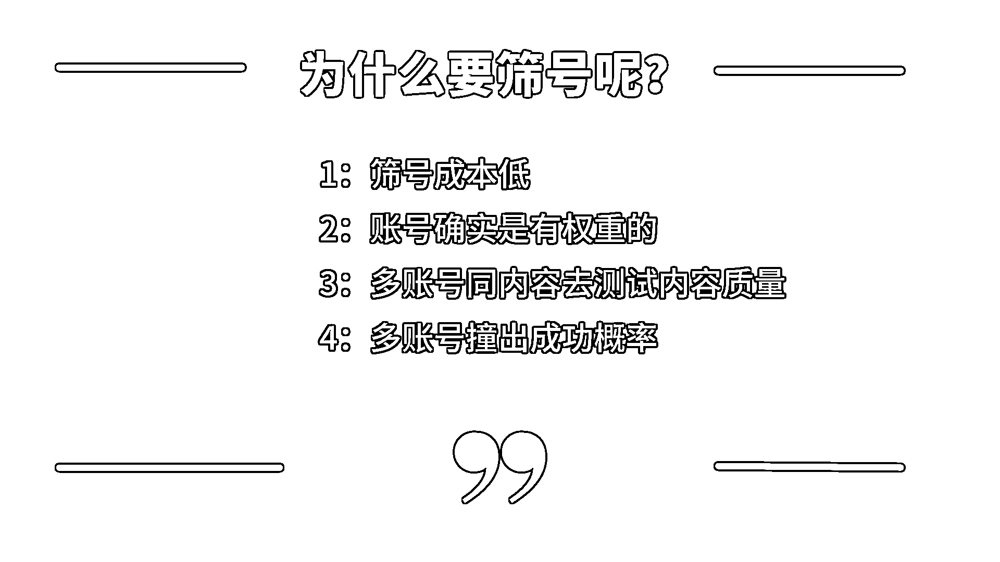

# tiktok 自然流账号实战运营篇

> 原文：[`www.yuque.com/for_lazy/zhoubao/cu4d716n7sevvth0`](https://www.yuque.com/for_lazy/zhoubao/cu4d716n7sevvth0)

## (35 赞)tiktok 自然流账号实战运营篇

作者： 梁小伟

日期：2024-05-08

自然流对于很多商家来说是一个不太划算的事情，投入成本大，收获反馈小。

我自己操盘了一批账号，接下来跟大家分享自然流怎么去做。一些简单的基础的知识，网上有很多，我这篇文章就不分享了，大家自己去互联网搜索相关信息。

这是最近几天跑的一个新号，4 天 7000 粉，纯自然流，蹭到一个热度。

# tiktok 自然流的核心玩法-筛号

**相比国内运营，海外 Tik Tok 自然流的运营难度大大降低很多商家入场带着国内运营的思维，死磕一两个账号，连续发三个月，发现播放 200-800，起不来还是起不来。又或者不熟悉海外生态，不懂制作内容，劣质内容疯狂投流花几千上万的成本，买一堆无效粉丝。你是否遇到这些痛点所以，海外运营的第一个思维，学会筛号。**

## 为什么要筛号呢？

**1：筛号成本低 2：账号确实是有权重的 3：多账号同内容去测试内容质量 4：多账号撞出成功概率**

1.筛号成本

tiktok 注册简单，不需要相关认证。一个邮箱即可，起不来可以随时丢掉，换下一个，

2：账号权重

举例来说，同样的内容脚本，发到不同的账号，会发现一个很明显的情况

A 账号 200 B 账号 500 C 账号 1000

对应的不同账号，基础权重是不一样的。低权重的账号一直发，你会发现账号播放很难上去，除非长期深耕内容，内容优质的基础下，才有小概率可能养起来，弊端是很耗时间

通过多账号去筛选的基础上，先筛选出高权重账号，再去运营。这样是来的比较快的，也是适合 tiktok 的。

3：内容测试

内容是需要不断优化和深耕的，首先，tiktok 是赛马机制。你的标签会和其他同类型内容创作者的视频进行 pk。

接着，新入场玩家或剪辑师大多是国人，不了解 tiktok 热点，热门音乐，热门梗，当地文化，导致无用功。这个时候需要通过不断测试内容， 持续去尝试文案、片段、音乐进行优化。

而这个过程会遇到限流，或者不符合平台的内容，又或者没有爆点的内容号，这种号就可以直接丢掉，换号重头再来。

而测出爆款，就可以多账号复制，尝试将偶然变成必然。

4：多账号撞出成功概率

多账号装成功率，就是与时间赛跑，同样的三十条内容。一台手机每天三条，连续发十天和十台手机发一天。哪一个的成功率会更高一些呢，又或者这个横向时间维度降低的试错成本和时间成本是完全不成正比的。

## 怎么筛号

网络-设备-注册-养号-发布是有规律的。这个规律大多数商家都处于一个模糊状态，接下来会给你分享，我们团队的做法。

1：网络

一条网络最多三台手机用

2：设备

推荐手机，苹果 8 以上。

3：注册

邮箱注册

4：养号

分几个环节去分析，接下来我们一起去看。

### 养号方法

养号类型-手机

新账号准备几台手机：刚注册的账号注册后不要立马发视频，养三天，直接很容易风控和 0 波。

新号注册后，正常去刷十分钟视频，同时去搜索你要做的赛道关键词进行浏览-点赞-关注-互动

累计半小时左右，连续养 2-3 天。

直到 foryou 的内容，高频出现同类型内容，养号成功。

开始发内容-养号连续发三天每天三条视频

第一天：

第二天：

第三天：

发布内容期 观察数据情况，你会发现以下几个问题

1.直接 0 播放

2.第一条八九百，七八千，后面的 200-500

3.前几条两三百，第七条风控（英区比较常见）

我是这样筛的

第一天：

三台手机，连续发三条，间隔发布，第一天连续 0 播，刷机换号重来。

低于 200 播放，几十波，连续三条没有 200+的，刷机换号重来。

高于 200+，留到下一批

第二天:

活到第二天但多账号全是连续 200+，不卡 200 的，例如 200-1000 的，内容问题，优化和分析内容后放第三天测试。

流量卡 200 播，刷机重来。

第三天：

第 7-9 条视频发完，没有出现破千播放的，直接不要。

出现破千播放的，分析脚本和内容，观察原因，提炼爆点后复制。

持续+反复去筛号=成功

筛掉的号，放一个月后，又可以重新拿来发布测试。变成低活跃度的满月号

这个满月号要重新养号。养号补充：

养号方法

同样三天

1.  内容专一性：确保账号的视频内容主题专一，以便系统更精确地识别并打上合适的标签。

2.  账号活跃度：每天至少花半小时搜索对标视频做哪条赛道，就搜对标的内容刷，确保部分视频完播率高。

3.  个人资料的完善：在账号垂直化后，仔细填写和完善头像、昵称和签名等账号信息。

4.  海外社交媒体的绑定：提高账号权重的一个方法是绑定 Facebook 等海外社交媒体账号。

5.  互动：积极回复评论区的观众，并通过提问的方式引导他们再次进行互动。

注意：如果是降权或处罚的账号：一旦账号受到官方警告或降权，这种不是粉丝很多的号，直接不要了。

筛号是怎么去提高成功率，本质一定是内容。

### 制作视频

##### 原创视频

原创视频适合那些经验丰富、具有高度创造力的内容创作者。

1.  创意与创新：原创内容往往需要独到的想法和创意，这对于有丰富想象力的创作者或团队来说是一个优势。

2.  资源投入：可能需要更多的时间、技术和资源投入，包括高质量的拍摄设备、编辑软件以及可能的场景布置。

3.  品牌建设：原创视频有助于建立独特的品牌声音和风格，长期来看可以积累忠实的观众群。

5.  这些是公式化的说法，我来教你降低难度。

6.  本质上，从做事角度上来看，设备上一台手机就可以搞定。什么拍摄设备其实不是太重要。

7.  创意上，就是去模仿那些容易复制，流量又很好的对标账号。1:1 翻拍。可以去 pipiads 广告数据平台，或者 tikstar 小店数据分析平台去挖掘对标

8.  品牌建设：矩阵一铺，最少的成本，去实现做大的流量曝光。

**二次剪辑视频**

对于新手来说，二次剪辑是一个很好的起点：

1.  易于上手：通过编辑现有的视频内容，如达人素材，国内素材，新手可以更快地掌握基本的视频编辑技巧，而不必从零开始。

2.  批量生产：二次剪辑允许创作者快速制作多个视频，这是在短时间内增加内容量的有效策略。

剪辑视频标签

 系统会随机抽帧 然后视频截图打标签打完标签 系统会根据这些标签推送人群 所以素材就要尽量做到 视频标签的准确性 不要有太多干扰标签

 使用热门话题标签，结合如[#foryoupage 或](https://www.xiaohongshu.com/search_result?keyword=foryoupage%25E6%2588%2596&type=54&source=web_note_detail_r10)[#fyp](https://www.xiaohongshu.com/search_result?keyword=fyp&type=54&source=web_note_detail_r10)，增加曝光。

利用趋势查询工具，融入热门话题、热词、歌曲。tikstar 可查询 tiktok 近期热门标签和音乐

剪辑技巧：

1.  剪映就可以，不需要太多技巧。剪辑基本功

4.  总结一下：

二创的素材常见问题：

1：限流

2：风控

这些都可以解决，跟你的剪辑手法有关系，我二次剪辑，没有一条 0 播的或者限流的内容。

实操工具推荐和 ai 结合，我用的所有 ai 工具通过这里找到。

[toolify.ai](http://toolify.ai)

发布时间：

1.  将视频分散在不同的时间段发布，测试哪个时间段能带来最多的流量和互动。

2.  观察和记录哪些时间段的视频能在 10 分钟至 2 小时内开始获得播放，以及哪些时间段的视频播放速度较慢。

分析播放数据：

1.  正常的播放量应该在发布后的 200-300 播放之间。如果只有几十次播放，可能视频遭到了限流。

2.  查看 tiktok 账号后台数据，可以查看视频的来源，特别是来自“For You”页面的流量是否超过 70%，超过则表示流量分配正常。

无论是选择原创内容制作还是二次剪辑，最关键的是要不断更新高质量内容、定期账号数据反馈迭代视频脚本。

无论是选择原创内容制作还是二次剪辑，最关键的是要不断更新高质量内容、定期账号数据反馈迭代视频脚本。

在 TikTok 上，标签不仅仅是简单的分类符号，它们是连接内容与观众的桥梁。合理地使用标签可以显著提高视频的曝光率和互动性。尤其是在账号成长的初期，正确地使用标签对于建立观众基础尤为重要。

### 不同类型的标签

1.  国家标签：如#US（美国），使用国家标签有助于将内容精准定位到特定地区的用户，避免流量误导，尤其对于地域敏感的商业账号来说更是必需。

2.  流量标签：如#foryou、#tiktok 和#fyp，这些广泛使用的标签虽然定位不精确，但极大地增加了内容的普及率，是推动视频进入更多用户“推荐页”的关键。

3.  细分市场标签：如#cat，针对特定的兴趣领域使用标签，可以帮助内容吸引到真正感兴趣的观众，增强内容的相关性和吸引力。

### 编写视频标题

一个好的标题可以是疑问式的，激发观众的好奇心，例如，“你知道怎么解决 xxx 吗？”；也可以是陈述式的，直接突出产品特点，如，“2024 送给妈妈最难忘的礼物！”利用标题引发话题和讨论，是提高视频活跃度的有效策略。

1.  基于问题的标题：通过提问激发好奇心并鼓励观众互动，例如“有见过让你哭泣的东西吗？”或“新发现！榨汁机你这样试过吗？”

2.  肯定的标题：使用自信且清晰的语言描述你的视频，如“全班同学都买的水杯”或“全世界都在用的钱包”。这些类型的标题可以增强视频中展示的内容或产品的感知价值。

### 使用流行短语和趋势

紧跟 TikTok 上的热门话题和趋势，将这些元素融入标题和内容中，可以有效提升视频的参与度和传播力。例如，在视频标题和描述中加入时下流行的挑战或话题，可以迅速吸引用户的注意力和兴趣。

### 选择对标账号的关键因素

在选择对标账号时，需要从几个关键维度进行考虑：

1.  避免选择老账号：老账号虽然可能拥有大量的内容和一定的粉丝基础，但如果这些账号的视频普遍流量一般且少有爆款，那么这些账号的拆解价值并不高。另一方面，那些流量和粉丝都很高的老账号，往往因为已有的高权重而不易模仿，它们发布任何内容都可能自然获得高流量，这样的账号也不适合作为对标对象。

2.  规避品牌账号：除非你自身也是品牌账号，否则一般不建议选择品牌账号作为对标对象。品牌账号因为有品牌效应，其内容的成功很大程度上依赖于品牌本身的影响力和广告投入，这些因素是个人账号难以复制的。

3.  避开带有水印和高曝光人物的账号：这类账号的内容通常带有强烈的个人或版权标识，不适合直接拷贝或修改使用，因此，从这些账号获取灵感或素材的难度较大。

**寻找合适的对标账号**

1.  目标同赛道或类似粉丝群体的新账号：选择视频数量不超过 100 条，但粉丝数量在千以上的新兴账号。这样的账号通常拥有较高的素材可用性和多个爆款视频，是模仿的理想对象。

2.  利用 TikTok 的搜索功能：通过搜索相关的类目标签、产品标签或热门关键词来找到潜在的对标账号。此外，平时刷视频时也应保持警觉，留意可能适合作为对标的账号。

3.  建立对标账号名单：建议找到 20-30 个潜在的对标账号并进行关注，这不仅有助于持续分析它们的内容策略，还可以及时获取这些账号的成功经验和创意点。

### 拆解对标账号的三个关键要素

1.  账号简介的优化：账号简介是吸引关注的第一步。通过研究成功账号的简介，你可以学习如何更有效地表达自己账号的核心价值，增强目的性。注意简介中使用的关键词和描述方式，这些都是吸引特定观众的重要因素。

2.  账号名的策略：一个好的账号名不仅能提升品牌记忆度，还能增加账号的搜索可见性。分析对标账号的命名方式，看它们是否使用了包含关键词的策略，或是如何结合品牌和趣味性来吸引用户。

3.  提高账号活跃度：查看并分析对标账号在评论区的互动情况。一个活跃的评论区可以极大提升账号的用户参与度和内容的曝光率。学习对方如何回复评论，特别是他们如何通过回复增加更多的用户互动。

### 拆解爆款视频

1.  标语与标题：记录下爆款视频中反复出现的标语或标题，分析其结构和用词，尝试找出吸引点击的共同点。

2.  标签策略：详细记录哪些标签与高观看量视频相关联。不仅要复制这些标签，更要分析为什么这些标签能带来流量。

3.  封面和字幕：研究爆款视频使用的封面图片和字幕样式。有效的封面往往直观展示视频核心内容，而引导性字幕则直接刺激用户的好奇心。

4.  音乐与流量

5.  热门音乐的筛选：在浏览时注意哪些音乐频繁出现在高流量视频中。利用这些音乐可以帮助视频快速获得曝光，因为 TikTok 的算法倾向于推广使用热门音乐的内容。

6.  动态调整与实验

7.  不断实验：将收集到的策略应用于新制作的视频，制定测试计划，比如连续几天发布不同风格的测试视频，观察哪种类型的内容反响最佳。

8.  分析数据与优化：利用 TikTok 的内建分析工具监控视频表现，根据数据调整内容策略。

### 如何快速增粉并提高账号活跃度

1.  积极互动评论：

2.  回复所有评论：确保回复视频下的每一条评论，这不仅能增加用户的满意度和忠诚度，还能提高视频的互动率，从而被 TikTok 算法更频繁地推荐。

3.  专注于热门评论：特别关注前 20-30 条热门评论，对这些评论进行回复和点赞，可以增加这些互动的可见性，吸引更多观众的注意。

4.  活跃于同行和对标账号：

5.  多评论同行账号的视频：这一策略不仅可以帮助你与行业内的其他创作者建立联系，还可能吸引他们的粉丝注意到你的账号。

6.  在爆款视频下留言：在其他账号的爆款视频下留下有见地的评论，尤其是对顶部热评进行回复，这可以显著增加你的曝光率。

7.  关注新粉丝：

8.  检查新粉丝的主页：对新关注你的粉丝进行个人主页查看，如果判断为潜在客户或有共同兴趣的用户，发起友好的互动，比如发送表情或打招呼。

9.  给予粉丝点赞和认可：定期查看你的粉丝内容，并给予点赞和评论，这种积极的互动可以增强粉丝的忠诚度，促使他们更频繁地与你的内容互动。

### 如何分析账号粉丝画像

1.  使用 TikTok 内置分析工具：TikTok 提供的分析工具可以帮助你了解粉丝的基本信息，如性别分布、地理位置、活跃时间等。

2.  观察粉丝的互动内容：分析粉丝通常点赞和评论的内容类型，这可以帮助你了解他们的喜好和兴趣。

3.  直接互动询问：通过发起投票或问答，直接从粉丝那里获取关于他们偏好和兴趣的信息。

4.  监控粉丝增长趋势和来源：了解粉丝是如何发现你的账号的，哪些内容带来了最多的新粉丝，这可以优化未来的内容发布策略。

* * *

评论区：

声声瀲 : 想请问一下 一个账号被封了会影响同一 IP 下的其他账号吗[皱眉] 需要换 IP 吗
梁小伟 : 不影响
声声瀲 : 谢谢[握手]
哲学工作室 : 影响的吧 封 ip

* * *