# tiktok 中视频可以做哪些赛道？为什么我推荐解说类赛道

> 原文：[`www.yuque.com/for_lazy/zhoubao/xwkhpx3l68843fxb`](https://www.yuque.com/for_lazy/zhoubao/xwkhpx3l68843fxb)

## (32 赞)tiktok 中视频可以做哪些赛道？为什么我推荐解说类赛道

作者： A   😇路途

日期：2024-05-10

近半年来，TIKTOK 的变化很快，基本每个月都会有点变化，有时候是平台风控比如近期的漂亮国问题，但是不变的是，中视频这个项目的方向依然还是很坚挺。这已经是我从业 TK 的近第四个年头了，TK 依然是一个非常有活力和潜力的平台。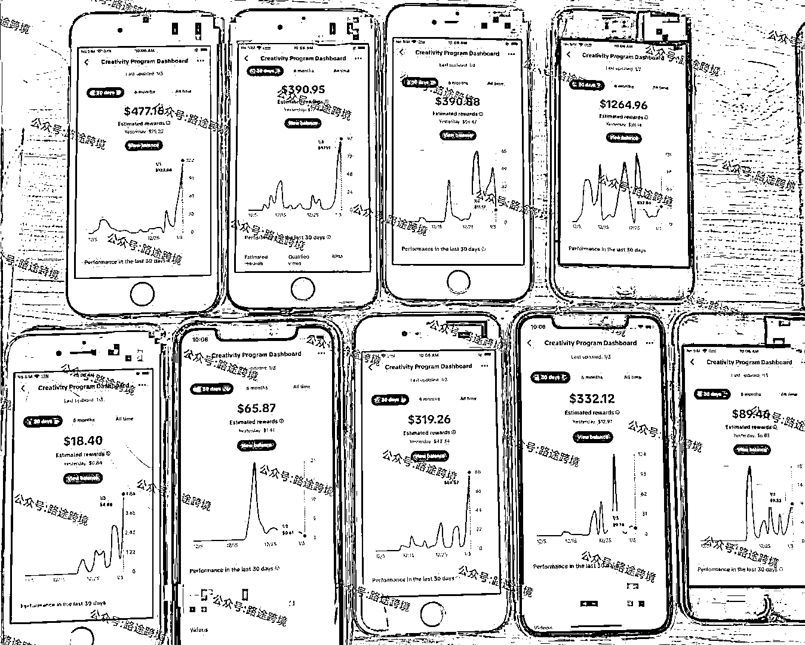 常常有很多小伙伴会问我，现在想入局玩 TIKTOK 中视频，还来得及吗，可以做什么赛道呢？

其实关于玩法赛道之前带大家测试过很多了，比较有潜力的可以看下面这些赛道，给大家简单做了一个汇总。

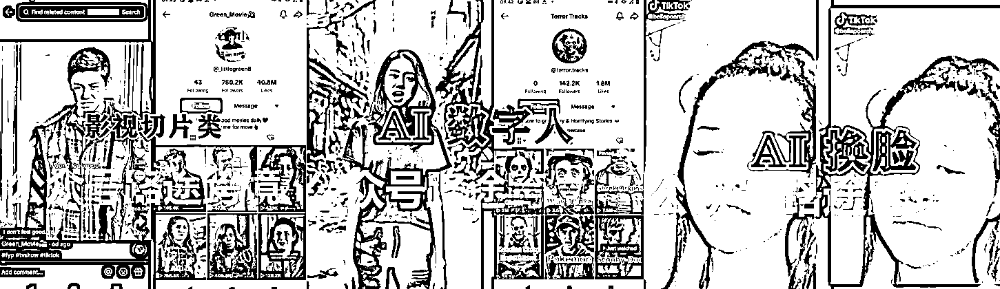

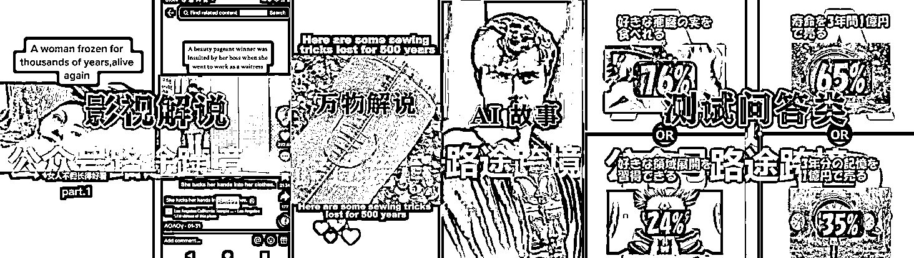

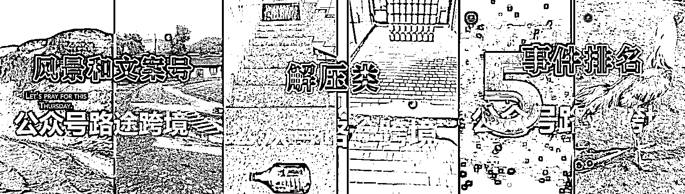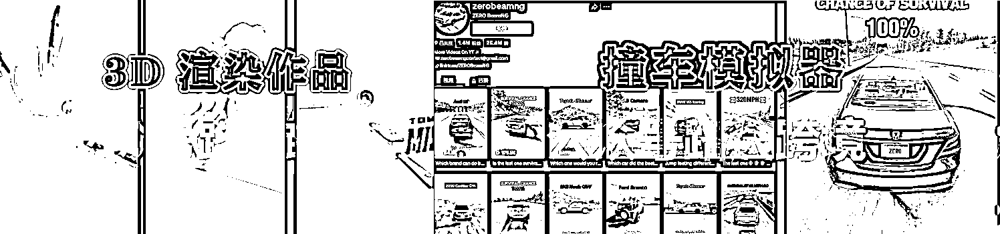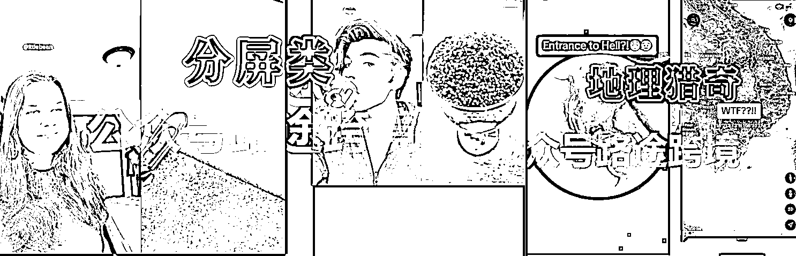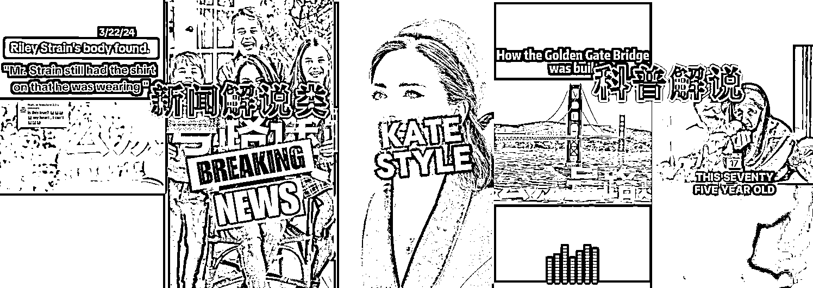那么如果是新人，这么多赛道，建议做什么赛道呢？

我的建议是，做解说！

如果你经常浏览国内外的短视频平台，你看见的最多的作品表现形式是什么？

没错，是解说！

影视的有影视解说、新闻时事也有解说、带货产品，也会有旁白解说，不管是真人还是 AI 解说，少不了需要有解说这种“旁白"的力量来给短视频注入灵魂。同时好的素材是有限的，但是加上了解说以后，他就可以变成一个全新的原创作品。

就上面我举例的一些赛道中，比如说，新闻解说、科普解说、影视解说、AI 数字人和 AI 讲故事等等，其实本质上的表现形式都是解说。

所以，如果你能把解说玩明白，你就可以解锁 90%的作品赛道。

**那什么是解说？一般我们做解说是什么流程？  **

一般来说，解说类的视频，主要表现是解说的声音配上一个画面对吧。比如说影视解说，那不就是电影画面配上一段解说的文案旁边，有画面了把。

那我们生产这类视频，有个取巧的方式，那就是直接把国内做解说的一些作品，做一个翻译配音，再剪辑好就可以发布到 TIKTOK 了。

简单的来说，解说的流程就是上面写的四部曲。先使用剪映，或者 Capcut（海外版剪映）这类剪辑工具把字幕提取出来。（使用自带的识别字幕功能就行了）

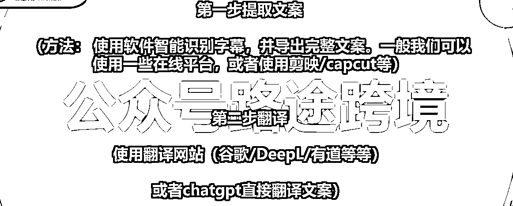

之后把我们识别出来的字幕，使用翻译工具，或者使用 chatgpt 翻译一下

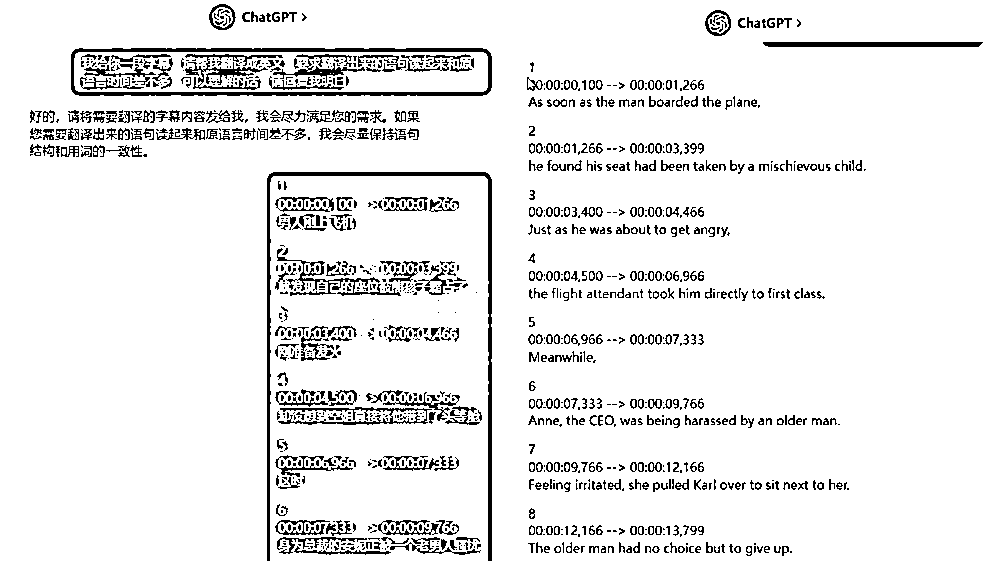

再拿着翻译好的文案，使用配音工具，比如微软的配音，或者一些 AI 配音的网站

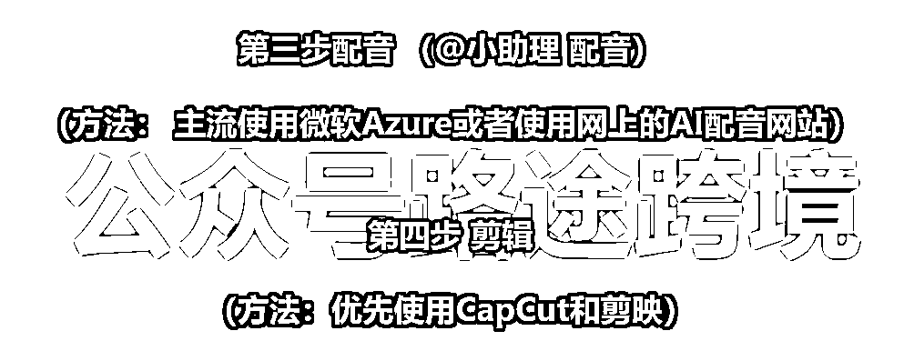

比如说使用在线配音网站

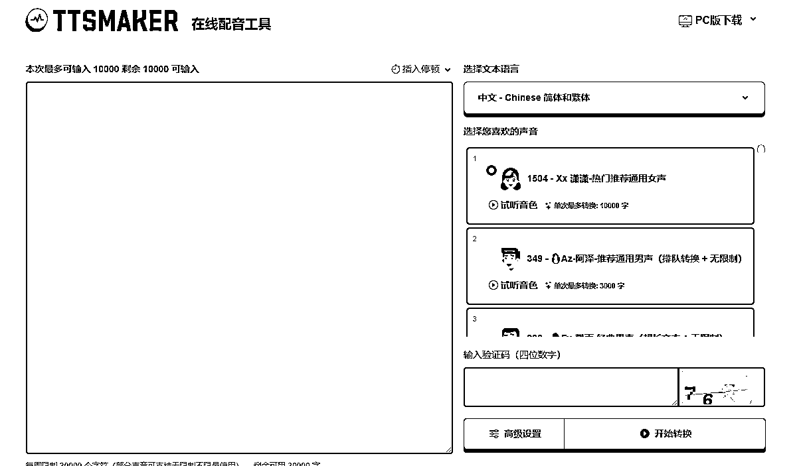

或者配音软件，输入我们翻译好的字幕，之后生成语音就行了

配音的网站和工具我一般推荐大家用这几个哈，比较好用

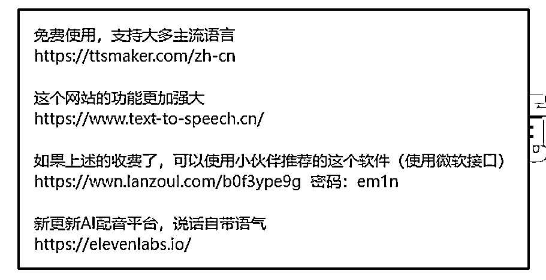

然后就是剪辑了，我们把配音和字幕跟画面剪辑融合在一起就大功告成了。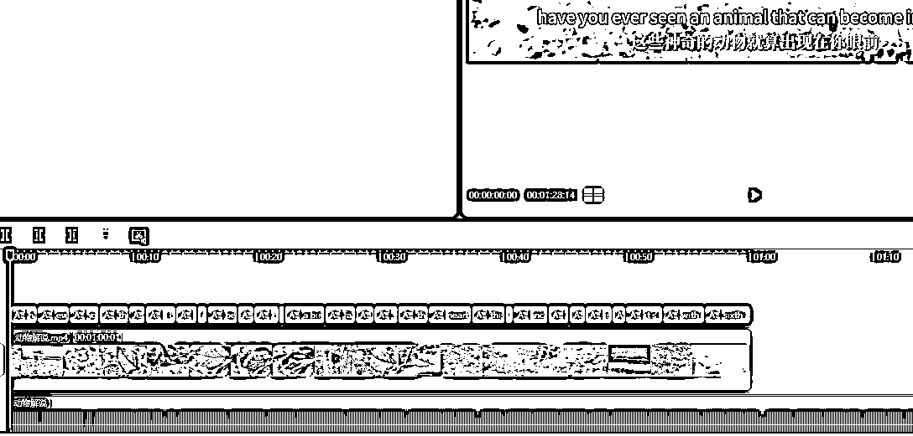 怎么样很简单吧，但其实需要剪辑出比较好的效果恰恰剪辑这一步是最麻烦的 ，比如你看下图，我们做好了翻译的字幕，和配音的片段以后。会发现他和原素材是对不上的。

很正常，比如你原来的文案是中文，你翻译配音成英文以后，从语言表达上，英语的长度自然会更长。

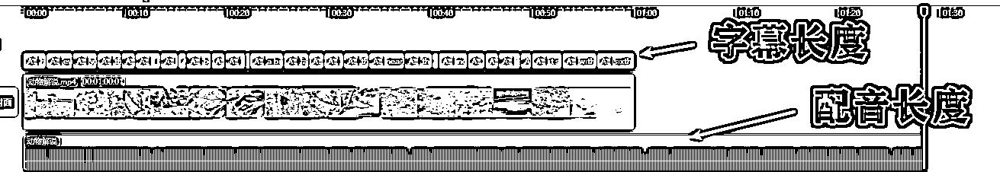

那这个时候怎么做呢？

我们会其实每一句字幕配音是会有停顿的，所以我们需要把停顿的地方和对应的原素材片段进行匹配，再慢慢调整，就可以得到一条解说视频了。

但这个方法无疑还是太麻烦了，无疑要花很多时间去匹配，遇到看不懂的语言字幕就更慢了。

所以，效率上不来，就影响我们的起号速度，也就没办法做矩阵了，你的弹药跟不上啊老铁。不能放大的项目都不是好项目。

那怎么办呢？如果有软件能够一键完成上面那些繁琐的工作就好了，只要负责选材就好了。

这个时候就可以借助工具了，为了解决大家这个问题，所以之前特地找大佬给我定制了一个，大家用起来反响还是很不错的

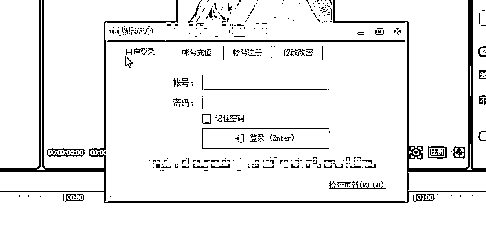

具体怎么用呢？能有多快？给大家演示一下

首先呢，我们还是需要先把要剪辑的视频文案提取出来，使用剪映几十秒就能搞定

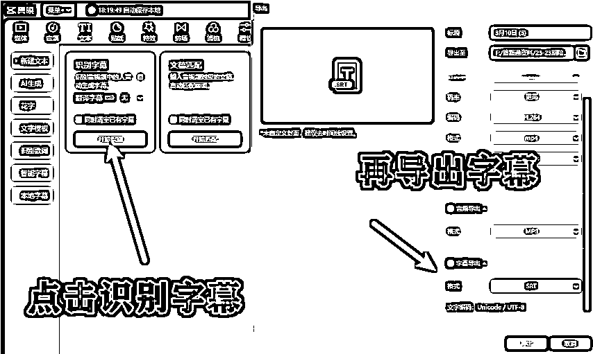

然后把输入刚刚要做的视频和字幕，之后直接点击创建任务，就完成了。如果想要一些去重效果还可以设置一下画面翻转和锐化，对比度之类的。

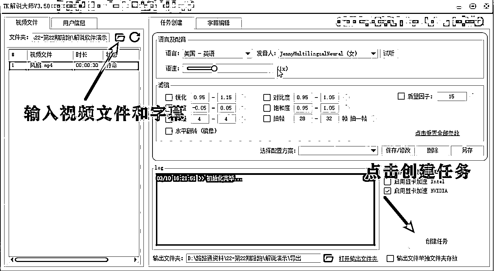

我们来看看效果，处理前的作品是中文原声，处理后直接就是你要配音的目标语言了。之后你拿到剪辑软件一键识别加个好看的字幕，就完成了。而且完成的效果很不错。

一个视频从导入到完成，快的话 1-2 分钟就完成了！

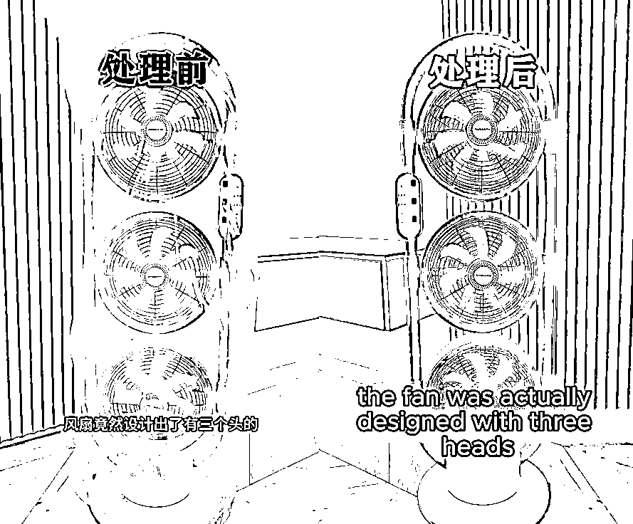

软件的下载地址：TK 解说大师

[`share.feijipan.com/s/xSUmSzDX`](https://share.feijipan.com/s/xSUmSzDX)

大家感兴趣的可以自己去试试哈。其实我认真的看了软件，实现的原理也算不复杂，上面我们不说了做解说最费时的是剪辑过程的字幕和视频素材匹配嘛。

比如说英文解说的音频是 3 分钟长度，但是你要把它配套到 2 分钟的中文解说视频上。这就导致了音画不同步。

所以这个软件就是实现了先通过原来的字幕时间轴拆分原作品画面，同时匹配要配音的音频之后通过降速，或者提速去视频匹配画面，最后再把所有的画面拼接在一起

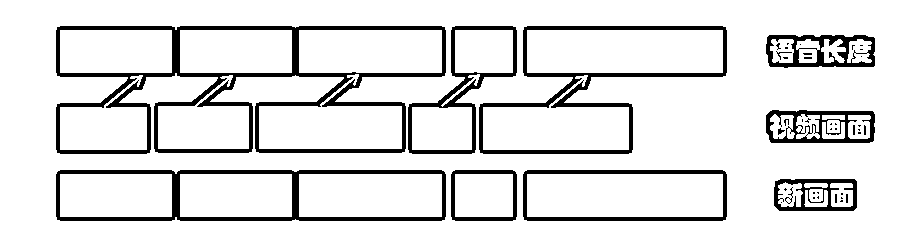

所以如果有这方面能力的小伙伴，也可以自己去做一个哦~

* * *

评论区：

子白 : [坏笑][坏笑][坏笑]
REALDP : capcut 咋导出字幕啊大佬
啊明 : 这样就能达到 tiktok 去重的效果吗？搬运国内解说视频对视频去重要求比较高的。
A   😇路途 : 可以达到的，文字翻译成英语，语言对画面的过程已经是属于是去重了
A   😇路途 : 海外剪映 capcut 跟国内其实是一样的，导出的时候只选择文本
A   😇路途 : 子白大佬来了

* * *