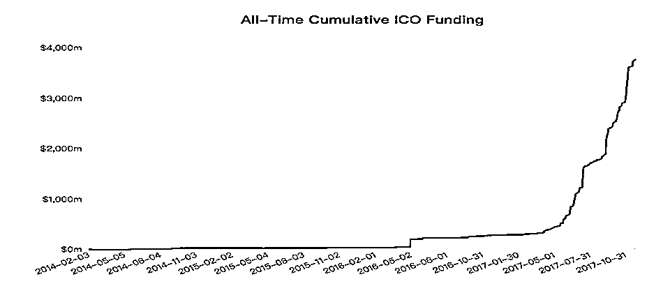
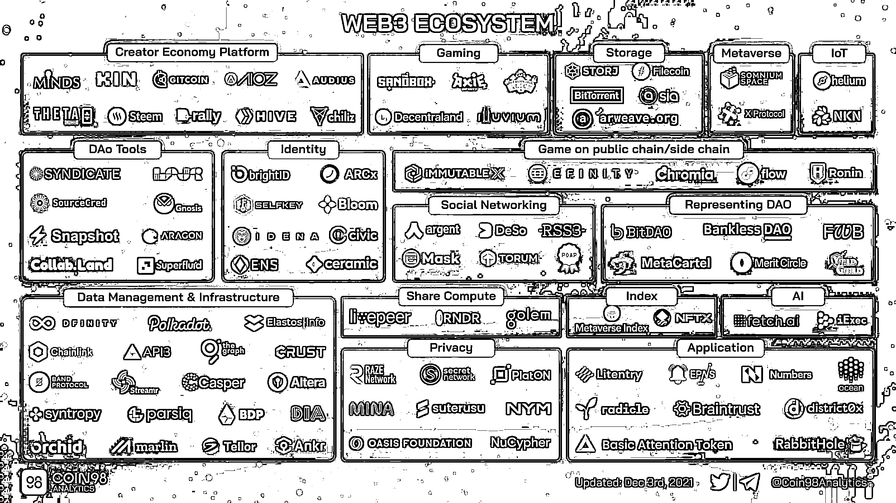

# 我是如何通过参与 web3 一年内赚到千倍门票

> 原文：[`www.yuque.com/for_lazy/zhoubao/xnwyol81vru5enrc`](https://www.yuque.com/for_lazy/zhoubao/xnwyol81vru5enrc)

## (30 赞)我是如何通过参与 web3 一年内赚到千倍门票

作者： dayu

日期：2024-05-07

大家好，我是 dayu，最近一直都在创业的路上。

过去两年多时间里，我和伙伴们都在比较深度的参与 web3 赛道，今天跟大家分享一下我所发现的这条赛道里的一些财富机会（图比较少，多放些经历和干货吧）。

首次进入 web3（或者说加密行业）是在 16、17 年，那个时候刚毕业，血气方刚，也赶上那一轮的牛市。

当时 ico 盛行，热钱横流，如果能够在一级市场抢到额度的话，上线就可以立马翻几倍，所以当时整个市场处于一种过度兴奋的状态，到了最后只要是带字母的都会一堆人抢。但是击鼓传花的游戏总会有泡沫打破的那一天，我清楚的记得，那天是大年初二的晚上，当时我所投资的一个项目（做图书馆里面书籍的上链），开盘上线第一个十分钟就暴跌 99.9%，好在当时投入的本金也并不多，但是从这以后有种预感整个行业就要进入一种崩溃的边缘了，所以慢慢从里面撤本金和剩余的利润出来。果然市场也很快转熊，之前龙飞凤舞变成一地鸡毛。

当时为了买房，还低价卖掉了手上的十几个 eth，以及两台显卡矿机（如果能拿到现在，应该也接近 50w 了）。算是比较彻底的和加密分手。

**nft 项目打新**

再一次回到 web3 是 22 年初了，当时 nft 火的一塌糊涂，有点热度的 nft 抢到就是几倍甚至几十倍的收益。我人生中第一个 nft 也就是这个时候，通过纯手工，战胜了一众科学家抢到的小幽灵 nft，最高的时候涨到上千美金。

而 nft 在发售的时候大部分是白名单机制，也就是用户通过抽奖或者做任务等等，获得比其他人提前铸造 nft 的白名单机会，从而锁定名额，锁定利润，业界也称作“肝白”，当时也有很多工作室在批量获取白名单进行变现，利润可观。

当发现这里面有不错的财富机会后，我也开始去规模化获取 nft 项目的白名单，包括按照项目方的要求，进行 nft 形象的二次创造（闲鱼找美工），写文章，在项目社区聊天提升等级等等，这其中最容易实现批量化操作的是抽奖，而抽奖本质上是概率问题，以及如何批量模拟多套不同的身份和浏览器环境（做外贸的应该很熟这一套）。所以这里通过指纹浏览器+三件套的模式搭建了几十套单独的环境来抽奖，期间陆续抽到了很多项目的白名单，比如国潮、yogapetz 等等，每个中奖名额的利润也都比较丰厚，不少单号在 0.5eth 甚至 1eth 以上。

在参与抽奖去获取项目白名单的同时，也会积极去参与 nft 的一级打新，这主要分为两部分，一部分是在推特或者 alpha 社区等地方收集 alpha 项目的信息，然后在项目上线的第一时间参与，从而获取利润；另一部分是观察链上的项目行为，如果发现链上有新项目并且全网参与的速度很快，则第一时间参与，往往也能够获取到不错的利润。

同时，也正是因为参与 nft 打新这段时期的多环境搭建以及链上数据分析的经历，给后面参与到撸空投的事情打下了坚实的基础。

**参与 web3 建设**

22 年底-23 年众所周知是一段惨淡的熊市，惨淡到 nft 也渐渐无人问津了。

这期间我们也深度去参与了 web3 的建设，创业做了一个工具类型的项目。毕竟团队大部分在正规互联网大厂待过，所以还是梦想会去做一个有情怀能够真正被使用起来的产品，而不是那种单纯割韭菜的 ponzi，但熊市之下焉有完卵，现实也让我们交了一笔深刻的学费。

我们也深刻的意识到，目前这个行业几乎所有产品还是以能够让参与者（特别是早期）赚钱为终点，主要是 web3 的群体相对于 web2 来说会小很多，行业整体的发展也处于很早期。但我们也看到，随着越来越多更专业的产品、市场和开发者进场建设，这个目标也会越来越近了。比较明显的一个现象就是如果在几年前，gamefi（链游）就是一堆破烂不堪，画质低端的游戏，基本都是资金盘子，但是现在有越来越多的 3A 大作从业者和专业的游戏工作室进场沉下心做项目，离真正的 play to earn 越来越近了。

**转战空投**

去年年初我们搭建了空投工作室，也就是所谓的“撸毛”——在早期交互 web3 项目方的产品，作为早期的种子用户，获取项目方上线后的初始的代币空投。相当于作为早期的体验者和“顾问”，通过对未上线项目的体验、反馈等等，来获得公司的原始“股份”。

在工作室里每人会负责 100-150 套环境和对应的账号，核心的思路其实和 nft 抽奖类似，使用指纹浏览器，模拟 100 个不同的个体与产品进行交互从而获取未来预期的空投，这其中会涉及到指纹浏览器、IP、女巫等等概念。

整体来看，空投是一个长期的，周期要以月或者季度为单位来核算的项目，也就是必须有我们常说的延迟满足感。如果想要在非常短期内通过空投的方式获得一笔可观的收益确实有难度，但是也存在运气爆表的 case。比如认识的一位朋友，22 年 12 月份进入这个行业，次年 3 月份就通过 arb 的空投获得 500w+的收益，自此一战成名。

**所以，短期内暴富需要运气和勇气的加持，但是长期坚持耕耘肯定会有不错的收益。经常看到有人会说，空投可能是一个人通过自己努力实现比较大的财富积累的一个机会，而且是投入不大但是确定性相对又比较高的机会。**

此外，空投也是个厚积薄发的过程，因为随着账号链上行为的不断积累，账号的质量和权重会更加丰富。这个很好理解，就好比你是一个美食测评新人，逐渐成长为资深探店专家，成为专家后所获得的探店收益也会成倍增加。比如我们最近的 btc 账户，因为之前积累了比较优质的链上交互，因此最近基本上每隔几天就会有新的项目方空投，价值在几十几百到几千美金不等，完全是白捡。而且如果你的账号有一定的数量，每天被几千美金空投砸中的感觉是不是也很爽。

正是因为空投的周期可能会存在不确定性，所以我目前的策略是空投+1/1.5 级的打新机会，这样会在过程中增加很多的确定性，同时也会使枯燥的撸毛生活变得有趣。

**1/1.5 级，抓住铭文的万倍机会**

23 年开启的铭文牛市是一波新的生态级别的机会，从第一波 ordi 的造富神话开始，新的协议如雨后春笋，我们陆续打中了 eths，atom，pipe，sols 等等，分别都有几千-上万倍的涨幅。这其实也是币圈一个很显著的特点，**当一个生态的一个模式爆火特别是产生足够大的财富效应之后，会被快速复制到其他的生态上**。铭文也是一样的，从 btc 生态开始，基本上所有的链都被轮番上阵了一遍（基本上每条链都突如其来的巨大流量被打垮了）。

举个例子，当时打 atom 铭文的时候，晚上一点协议上线，中间被打崩了好几次，我和 partner 一直干到凌晨三点多，最终收获接近 80 张，最高峰的价格在 1.5 万美金一张，虽然有部分做了钻石手，但是也收获了非常可观的收益。

**而且，这也只是这个行业众多热点中的其中的一个热点，像这样的热点，基本上每一段时间都会在发生，而且会给到普通人非常足够的机会去参与**。

**总结**

**所以总结下来我发现这个行业大概率是一个可以穿越周期和长久去做的事情，只要 web3 行业还存在，只要这个行业的模式还在运转，就持续不断会有新的热点和赛道出来。**从当初的一无所有到 defi 到 nft，再到铭文，depin，最近的 btc 生态、符文等等，可能参与的方式会发生变化，但是首先空投的机会一直都会存在，并且 1/1.5 级一直也都会有足够的机会存在。而且还有一点，肉眼可见整个行业也在不断的进步和丰富，相信后面的体量也会越来越大。**普通人只要能在这么多的机会中抓住 1-2 个赛道级别的机会，应该就会有非常可观的收益。**

**说在最后**

经过这么多的风雨起伏，结合我自己踩过的一些坑，对普通人想要在这个行业扎根并且赚到钱的一些认识。

**找对志同道合的人，这个行业信息差很重要，第一手信息，或者优质的 alpha 信息，是获得足够利润，并且最大化减少损耗的关键。**甚至有时候比拼的可能是分钟或者秒级别。举个例子，马斯克发推喊单，胜负可能就在一瞬间。

**学会卖出，俗话说“会卖的是师傅”，因为这个行业的热点轮动很快，几乎每隔一段时间就会有一个新的热点，而场内整体的资金体量是有限的，所以板块轮动带来的是快速的 fomo 和热点过后的跌落神坛。**

**超强学习能力和执行力**，因为板块在轮动，新的叙事会不断出现，快速的学习能力是基础。同时，**学到了就要去用力的执行，如果是笃定的好的机会，就要非常用力的去执行，才能换取最大化的收益。**

再有就是足够的耐心和毅力，可能有时候熬夜是常有的事情（项目方里外国人会比较多），但是毕竟拿到就是赚到，赚钱的事情总是快乐的并且不知疲倦的。

好了就这么多，希望有机会和大家一起在 web3 这条路上生财有术，持续精进！

* * *

评论区：

暂无评论

* * *