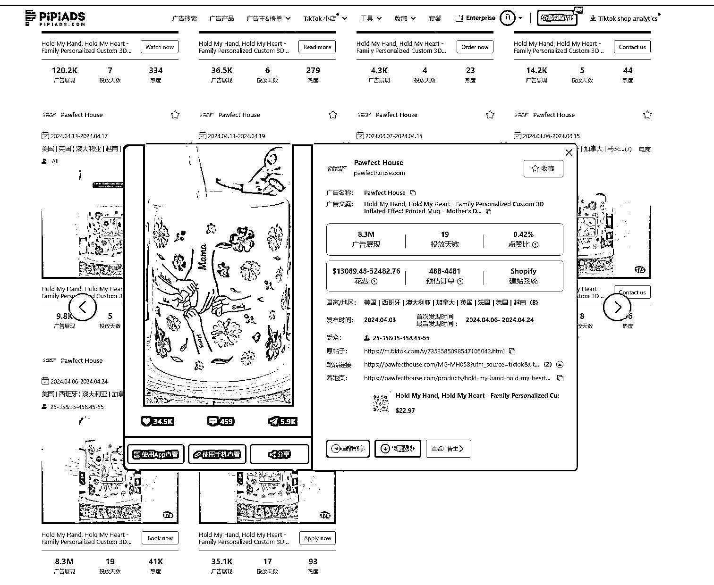
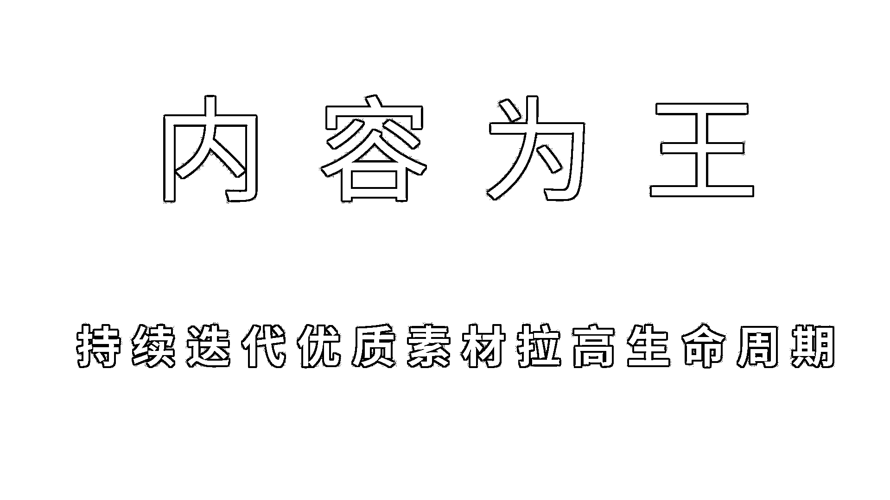

# TikTok 广告算法（百万消耗优化总结篇）

> 原文：[`www.yuque.com/for_lazy/zhoubao/ta0w5y7cig6hyi84`](https://www.yuque.com/for_lazy/zhoubao/ta0w5y7cig6hyi84)

## (18 赞)TikTok 广告算法（百万消耗优化总结篇）

作者： 梁小伟

日期：2024-05-07

大家好，我是梁小伟，最近深度研究和探索了 Tik Tok 的算法机制，并和多位投放大佬和算法大佬共同分析后，给大家同步一篇 Tik Tok Shop 广告算法的干货文档。

品好素材好，通投拉满，到底什么是品好，什么是素材好呢？

接下来我会告诉你答案

首先据分析观察，Tik Tok 闭环电商投放模型主要以商品维度为主

（1）TikTok Shop 的算法并不是简单通过视频内容理解商品，而是基于视频上的商品标签（锚点）进行推荐。

也就是说 Tiktok shop 算法是通过识别商品属性，然后推对应人群。

怎么理解呢，就是说，实际上大家都说品很重要。品它从算法实际生效的逻辑，并不是说发布一条视频，或者素材，机器可以知道你这个视频在拍什么，而是基于你视频上挂的这个锚点。通过挂车商品来进行人群推荐。

（2）视频本身并不直接决定内容推荐，而是标签上的商品信息起主要作用。算法初始依赖于商品的基本属性推送给相关人群，但对视频内容的解析能力有限。

主要的原因还是目前 TT 的模型，对于视频标签不精准。机器对于视频拍什么内容的理解，还没有那么强大的能力

商品的后验特征=广告数据反馈：

第一，商品标题、特性和属性用于定位投放的目标群体。

随后，根据用户对视频的实际反应（如观看时间，完播率，互动，转化）算法进行调整推荐，

如完播率和其他用户反应指标就是后验特征。

这些后验指标对广告的最终表现至关重要，决定广告是否成功和与其他广告的竞争力。（这个后验的指标就会决定你这一条广告最后能不能投起来，以及说你是否能竞争过别人，因为本质广告还是是通过 ECPM 去计算）

同样的，这里有两个关键点

（1）首先我们清楚了投放模型以商品为主

然后模型的第二批特征就开始发挥作用，就是素材的后验特征，

以这款杯子举例

再以我和看文章的你举例

首先商品属性上，是杯子+定制礼品

算法会基于这个属性（杯子+定制礼品）推给我们俩。

然后呢，广告主测素材

我们俩分别看到两条不同的视频：

你看到这一条 35.1K 的广告素材

暂时无法在飞书文档外展示此内容

我看这一条 8.3M 广告展现的素材

暂时无法在飞书文档外展示此内容

可能我看了五秒，你就看了一秒就划走了，这么循环往复，可能前 1000 次，或者说过了前 1000 次展现之后。这个模型就可以算出来，就是说这个后验的这个完播率，包括这些各种的这种后验的指标。

这就验证了，为什么我们要通过大量复制组去撞人群的核心投法。

也可以这样简单理解

这个机器预估的 CTR 和预估的 CPA 啊，一部分是通过预测你商品和这个用户的购买，

商品可能的购买。

另外一个很大的一个部分就是看你这条视频过去的转化比例，

所以说你会看到很经典的一个现象，就可能这同一个素材你再重新用一遍，重新复制下去，可能你再投下一次的时候就效果就不一样了。也就是模型跑稳定了。

商品的类别和其他填写的属性（如邮费信息和折扣）对算法有显著影响。

（1）同一素材在不同时间的效果可能不同，因用户对素材的兴趣程度和反应不同。折扣和邮费信息是影响商品吸引力的关键属性，尤其是在电商平台上，这些因素可以大幅影响用户的购买决策。

所以闭环小店包邮和不包邮，包邮顺利跑出的广告概率可能三倍左右

第二个是折扣，平台算法层面很难判断这个品到底是贵的还是便宜的

所以设置折扣胜利跑出的广告概率也是要高于不设置折扣的概率

也就是说，再以这个产品举例

这个商品的平台算法视角，可能主要就是到一个品类汽车&摩托车类目-汽车香薰

这个品类，多少钱的香薰算贵，多少钱香薰算便宜，算法是不知道的

但折扣就不一样，因为折扣是个单独的信息，所以说折扣会变成一个单独的特征加到模型里面。

这也是供应链有优势，上去就上折扣，同样的产品，差不多竞争的素材，它会更快拿到投放结果，跑出去的原因之一。

但有意思的点是，卖的最好的，未必是最便宜的。

首先你作为商家端，这个品的市场定价自己能明确知道就其他人卖多少钱，你卖多少钱。

但是对于相对早期的这种平台来说，对于这种价格信息的把握是是比较缺失的，

所以说在这个时候，并不是定一个比较便宜的价格，平台一定能够捕捉到这个信息，

你去 pipiads 看广告数据，或者去 tikstar 分析小店数据，会发现很多品，它其实反而那个卖的比较好的链接，不一定是最便宜的那个。

同样的产品-不同的素材平台会进行 pk

素材层面上，为什么说要去持续迭代素材测试

平台推荐的人群，同样的产品，不同的商家

推给同样的人群，购买人群始终就这么多

再以我和看文章的你举例子。

继续以 pipiads 上观察到的这个品来分析

pipiads 有个其他同产品素材（竞品分析）非常好用

找到一款产品，产品下方会有不同广告主的投放素材。

这些素材，我和你的兴趣，搜索等行为被平台记录，又或者我对类似的礼品和定制类的产品感兴趣（详情看第一篇算法文章）

算法会把做这个品的素材，反反复复的推送给我，

可能是相同商家的不同素材

也可能是不同商家的相同产品及相同素材

素材最好的商家，就会把你跟我洗掉

这里还有一个有意思的事情。

去 pipiads 查看广告数据，这里以独立站玩家作为主要案例，

观察到优秀品，但投放消耗不出去，是可以直接尝试抢量的

也就是说，市场的鱼池就这么大，你拉爆后，后续进场的人大概率尝试喝汤

但是也不要灰心

例如，一款清洁剂可以清晰车身，家里的玻璃，地板

市面上打爆汽车的内容，洗的是汽车人群

你打室内玻璃，打的又是另外一个人群，去迭代素材，同样有机会

以这款产品举例

tikstar 上看到的杯子

最早这款保温杯爆的是户外品牌 Stanley 16 年推出，**早期以工人、露营及徒步旅行等户外人群为主要受众人群。一直不温不火，今年转型女性市场，一下拉爆整个北美市场后续超多店铺跟品拿到结果**

这个就是很典型的人群新定向的经典爆款案例，目前 tikstar 数据显示，依旧热卖。

附带一个简单的算法流程图

* * *

评论区：

唔知 K : 先验算法原来这么蠢[偷笑]哈哈。产品一样，不同人群的打法有意思，等于是发觉了产品层面上的"蓝海"
梁小伟 : 先验算法是这样的，目前视频标签还不准滴
凯辉 : 之前在小红书就经常刷你的笔记，哈哈 ，没想到你也在生财啊
梁小伟 : 哈哈，这么巧，对呀。
卡顿 : 千次播放就建立模型了啊
凯辉 : 希望有机会能面基[旺柴]

* * *