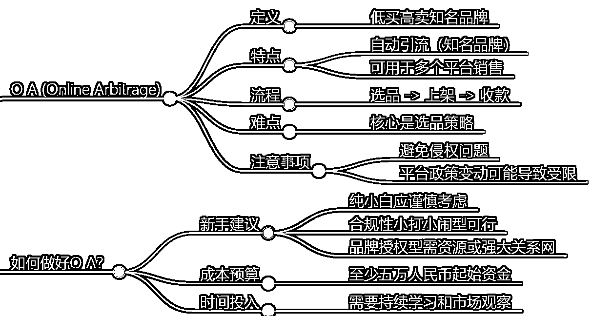

# 亚马逊 OA 是什么？普通人还能入局吗？

> 原文：[`www.yuque.com/for_lazy/zhoubao/yyrzt9ilqzqwws3d`](https://www.yuque.com/for_lazy/zhoubao/yyrzt9ilqzqwws3d)

## (11 赞)亚马逊 OA 是什么？普通人还能入局吗？

作者： 希声

日期：2024-05-07

和大龙哥做了一场直播连麦，主题是《亚马逊 OA 怎么做？普通人还能入局吗？》

下面是我整理出的这场直播连麦的主要内容。

# 什么是亚马逊 OA？

亚马逊 OA，就是 Online Arbitrage，是一种线上套利的模式。

整个模式流程是：在其他网站上购买低价商品，然后在亚马逊平台上以更高的价格销售，从而获得利润。

# 亚马逊 OA 和 FBA，FBM 有什么区别？

亚马逊 OA（Online Arbitrage）：卖家在其他网站上购买低价商品，然后在亚马逊平台上以更高的价格销售，从而获得利润。这种模式的优势在于亚马逊平台自带大量的流量，可以帮助卖家快速打开市场。然而，这种模式也存在竞争激烈、品牌限制等问题。

FBA（Fulfillment by Amazon）：这种模式下，卖家将商品存储在亚马逊的仓库，由亚马逊负责订单处理、发货和客户服务。这种模式的优势在于可以利用亚马逊的物流体系提高配送效率，同时还可以享受亚马逊提供的其他服务，如退货处理等。然而，这种模式需要卖家承担一定的仓储费用，并且对商品有一定的要求。

FBM（Fulfillment by Merchant）：这种模式下，卖家自行处理订单的发货和客户服务。这种模式的优势在于卖家可以更好地控制商品和物流过程，同时不需要承担仓储费用。然而，这种模式下卖家需要自行处理物流和客服问题，流程较为繁琐。

# 亚马逊 OA 的流程是什么？

OA 的流程非常简单，可以简化为：

1.寻找具有价格差的商品；

2.下单购买，然后发货到第三方物流换标签；

3.在亚马逊后台上架商品；

4.产品卖出之后回款赚钱。

而在整个流程开始之前，需要准备一个可以销售的亚马逊账户，一个国际信用卡或者是美区 paypal 用来采购商品。

# 做亚马逊 OA 的最难的是什么？要注意什么？

在整个过程中，最难的就是选品。

选品的最基础要求是：

1.有利润

2.不侵权

3.店铺有销售资格（新的亚马逊账号想要销售许多大品牌产品是没有资格的）

# 亚马逊 OA 适合新手吗？

现阶段来说，亚马逊 OA 并不是很适合新手。

原因有三个：

第一是品牌受限。

很多品牌原先是允许在亚马逊上销售的，但是现在亚马逊不让我们销售了。

主要原因是亚马逊上有太多 OA 卖家，扰乱了品牌商家的价格体系，用过低的价格去销售产品。

第二是亚马逊扫号问题。

如果你的亚马逊账号是新账号，当你的销量激增的时候，平台会觉得你是在销售假货，那么平台就会发起审核，要求你提供许多的文件来证明你的产品是正规的。

第三是客户或者同行的投诉。

有的时候客户一句无心的评论：这个产品好像是假的，都有可能触发亚马逊对于这个产品乃至整个亚马逊账户的审核。

同时亚马逊对于中国身份信息开设的店铺，管控会更加严格。严厉到需要提供整个产品全链路的证明。

# 做亚马逊 OA 起步资金要求是多少？

大概五万。

要注册美国公司，要搞定美国信用卡，美国银行，美国地址。

然后还要有充足的资金来进行产品采购和资金周转。

我们采购一个产品，一般一个月才能卖出去，再加上回款时间，资金压力是会比较大。

# 亚马逊 OA 之路接下来怎么走？

1.如果你是纯小白，没有任何跨境甚至电脑网络经验。

那么不建议入局。

2.如果你已经在做了，但是规模不大。

要往合规的方向走。

从选品的开始就尽量从那些大网站上面选品，因为如果你从小网站上选品采购，触发审核的时候，你提交的资料大概率亚马逊是不会认可的。

同时要确保你进货产品的品牌是没有侵权，这些品牌是允许你在亚马逊上销售的。

同时在进货的过程中，一定要保留所有文件，单据等，避免触审后缺乏申诉文件。

3.如果你的 OA 规模已经比较大了。

要争取拿到越来越多的品牌授权，那么这条路就可以越走越顺。

当然对于资金量和资源要求比较大。

# 如何构建亚马逊 OA 运营壁垒？

重点是能否拿到品牌授权。

比如某个产品卖的不错，销量也很大，我们可以尝试能否直接和品牌联系，签合同，成为品牌的批发商。

当然，这里面需要谈判技巧，也需要你自身有一定的资源。

前期要先从从小品牌开始积累，那些家喻户晓的大品牌我们也很难谈的下来。

# 做亚马逊 OA 推荐和不推荐的产品

不推荐的产品：

1.玩具，很容易侵权。

2.大品牌的服装，很容易侵权。

3.保健品，最近扫号很严重。

推荐两个适合新手做的类目：办公家具、户外工具。

# OA 问答

## 为什么要用护照注册亚马逊账号？

因为用国内身份信息注册的账号天生是有缺陷的。

最好用美国公司，美国银行账号，美国信用卡这样的方式来做 OA，才能最大限度地打开账号的销售资质问题。

## 别的国家身份信息能注册亚马逊账号吗？

可以的。

## 想做 OA 没有亚马逊账号怎么办？

不推荐买账号，风险很大。

也不推荐用国内信息注册的亚马逊账号。

如果你能找到美国 ssn 注册的亚马逊账号，那么也是可以的，但是也要注意风险问题，不要投入太多，防止账号被封损失太大。

## 开了美国公司只能用来做亚马逊吗？

还可以用来注册 ebay 店铺，申请沃尔玛账号等。

收款方面还能用来注册 stripe，paypal business 等，适合用来做独立站。

# 给新手的四点建议

**1.不要被思维困住。**

亚马逊 oa 本质是什么？

就是倒买倒卖。

那么我不一定要在亚马逊上卖，也不一定必须卖实体产品。

大龙哥讲了一个案例，销售 google voice。

进货价 3 美元，销售价 59 美元，利润已经比大多数 oa 产品的利润还高了。

甚至你不一定在国外卖，也可以在国内卖。

国外采购，国内在淘宝闲鱼等平台上销售。

或者可以更进一步，直接和销售这些产品的商家谈，说我给你们供货，你们来卖，转型小 b 商家。

**2.网上的课程其实都是基础的。**

不管是什么行业的课程，网上的课程其实都是基础的。

想要进阶的技能/方法，那么必须要自己去实操，自己去摸索。

**3.新手入行最快的方法是上班。**

对于新手如果要学习一个技能，入门一个行业，最快的办法其实不是自己摸索，也不是学习课程。最快的方式就是找一份这方面的工作，然后一边学，一边还有人给你发工资。

**4.如果你没有自己独立摸索和解决问题的能力，那么不要轻易辞职创业。**

**如果分享对你有帮助希望点个赞哦~**

**————————**

**我在生财的精华文章**

[跨境创业？新手下场前必看的赚钱指南！](https://articles.zsxq.com/id_n97vrpiahx5w.html)

[一个工具管理 100 个 fb 社媒账号？指纹浏览器使用全攻略！](https://articles.zsxq.com/id_u2ub0iv60p1g.html)

**我在生财的其他文章链接：**

[快速分析一个产品在海外有多大市场？B 端和 C 端市场分析](https://articles.zsxq.com/id_nh64drgxukw8.html)

[1 天内如何启动电商/外贸/跨境网站？ChatGPT 来助力！](https://articles.zsxq.com/id_1azlnfovac6q.html)

[白嫖！3000 元的谷歌广告优惠你要吗？](https://articles.zsxq.com/id_sa1bz4dckqeq.html)

[Etsy 注册最新最全指南！一文回答如何注册、需要哪些材料、如何避免封店、如何申诉](https://articles.zsxq.com/id_590wii7jr4iu.html)

[批量做小红书图片/视频的方法-canva 批量创建](https://articles.zsxq.com/id_pnpv1g2m5fi6.html)

[一个 ChatGPT 高效使用技巧—编辑原有内容](https://articles.zsxq.com/id_5twbrd3idlbw.html)

[效率飙升！跨境电商领域的 ChatGPT 应用指南 v1.0](https://articles.zsxq.com/id_7wu5dtpkh4m4.html)

[《零编程知识怎么在 AI 帮助做一个贪吃蛇的游戏》](https://articles.zsxq.com/id_nqxxc79whz1t.html)

[快速获取谷歌 SEO 流量的一个策略](https://articles.zsxq.com/id_txli3kufpvig.html)

[ChatGPT 4.0 新功能，让你的数据和设计工作事半功倍！](https://articles.zsxq.com/id_it0blu6we0p4.html)

[打造转化率页面的 13 个技巧大公开](https://articles.zsxq.com/id_ohdbfoxwndkx.html)

[什么是跨境电商独立站？有哪些运营模式？](https://articles.zsxq.com/id_3lz2mf370csx.html)

[公众号想要 10 万+？试试这几招！](https://articles.zsxq.com/id_4mnsrw79as1d.html)

[《新手如何入场 Tiktok》—Sky 老思的直播记录](https://articles.zsxq.com/id_d7qg98gocnvh.html)

[4 个技巧获取无限个邮箱账号！](http://xn--4!-hy2ca373eyfm37d9uii0h032dppse2zzfk0zt/)

[新加坡有哪些商业机会？-附 2024 新加坡免签入境指南](https://articles.zsxq.com/id_7q5dj0lt0tjq.html)

[免费批量搞定 Canva 的 VIP 账号](https://articles.zsxq.com/id_hkn02uwf6b1e.html)

[保姆级教程！注册 Midjourney 并开通付费订阅功能](https://articles.zsxq.com/id_gnm2x96buu9t.html)

[跨境电商的 ChatGPT 应用指南全集 v3.0](https://articles.zsxq.com/id_eh50cr4chn8a.html)

[跨境新蓝海！中亚跨境机会分析](https://articles.zsxq.com/id_8s8j1u8fojb1.html)

[生财的 12 种搞钱思维，人人都能学会](https://articles.zsxq.com/id_9ozhgeqn0foi.html)

**我在生财的读书笔记链接：**

[《段永平投资问答录-商业逻辑篇》精华金句摘录](https://articles.zsxq.com/id_xrltpwocer4p.html)

[《段永平投资问答录-投资逻辑篇》精华金句摘录](https://articles.zsxq.com/id_2k5d3mdace44.html)

[《穷查理宝典》精华金句摘录](https://articles.zsxq.com/id_er7b3dm8lx7w.html)

[《华与华品牌五年计划》精华金句整理](https://articles.zsxq.com/id_objd6xv8dd9p.html)

* * *

评论区：

暂无评论

* * *