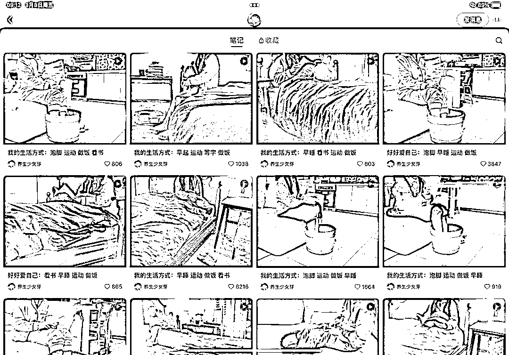
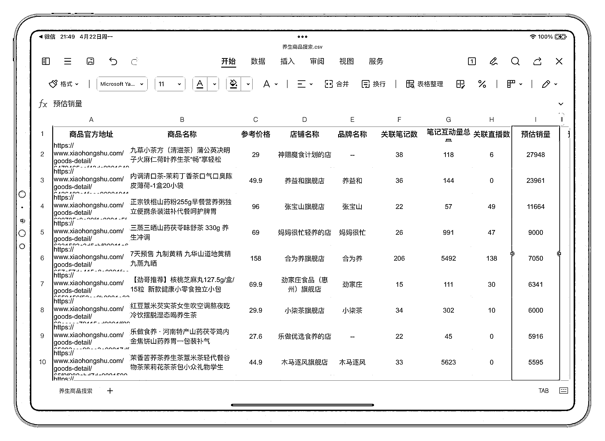
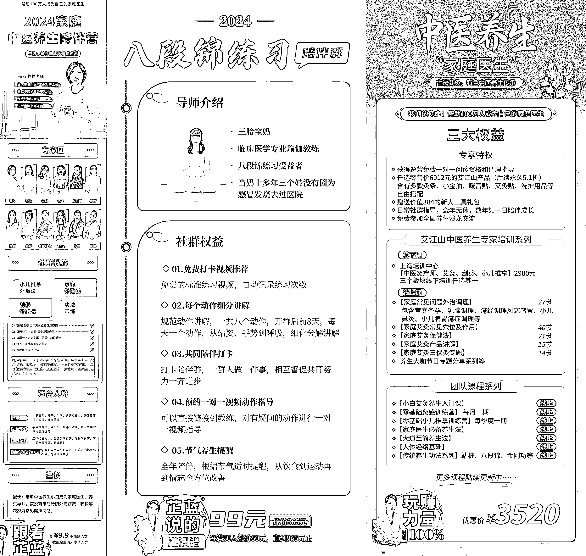
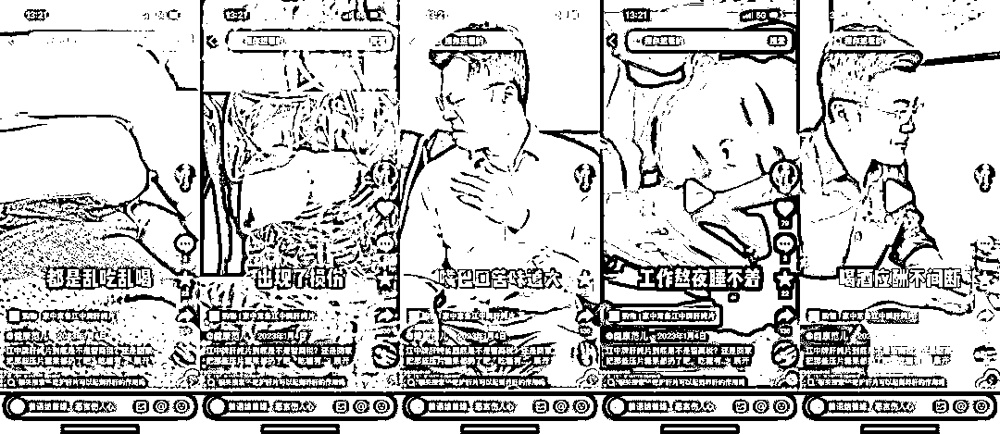

# 如何打造养生博主 IP 变现流程？

> 原文：[`www.yuque.com/for_lazy/zhoubao/tbv96b63d678ogye`](https://www.yuque.com/for_lazy/zhoubao/tbv96b63d678ogye)

## (107 赞)如何打造养生博主 IP 变现流程？

作者： 芷蓝

日期：2024-05-07

给生财的小伙伴分享一篇关于养生赛道个人 IP 商业化的内容，我将会从养生博主的**定位、产品和流量**这 3 大模块来做分析并给出案例、数据和操作方法，希望对大家有所启发和版主。

# **一、定位**

很多人一想到定位就头疼，其实是因为你看了太多讲定位的，反而不知道自己该做啥好了。

我建议你，抛开定位这个系统概念，不要去想我应该如何定位？怎样才能通过正确的定位赚到钱？而是先问问自己，为啥你会产生“我要做一个养生博主”这个想法？

每个人想去做一件事，肯定都有原因的，我做个人 IP 营销教练 2 年多来，接触了 1000 多个合伙人，每当对方跟我说“想做一个什么什么博主”或者“我觉得什么博主”可能赚钱，无外乎是以下 3 个原因：

1、在自媒体平台刷到了某个博主的账号，看到他们的内容数据很好

2、自己身边有某个人在做这件事，看到他们朋友圈晒单很赚钱

3、自己非常喜欢去做某件事情，也没考虑过其他的

我们只需要用一种方法去验证自己的想法对不对就行了，没必要去听别人的一套逻辑，听多了反而让你陷入困境，无法快速去实践。

**那如何验证自己是否能够去做养生博主呢？可以根据以下几个维度：**

**1、你喜不喜欢做这件事？**

比如说你自己就在养生嘛？你坚持养生多长时间了？养生对于你来说，有什么正反馈嘛？

**2、你适不适合做这件事？**

啥叫适不适合？就是看你干这件事的成本有多高，养生跟社群运营似的，可以轻养生，也可以重养生，这就得具体看你有多长时间，或者说是否具备某个专业技能了。

比如说你每天上班坚持喝养生茶，这个茶包就是别处买的，特别方便，每天坚持喝 2 杯，这就叫做轻养生，你去做内容的时候，就好做啊，拍自己每天喝养生茶的日程动作+养生茶的成分介绍就行了。

再比如说，你每天晚上睡觉前坚持泡脚也是轻养生啊，倒水+放药包+泡脚这 3 个动作就完事了，你拍视频的时候，找个第三方视角，完全记录自己泡脚的过程就行了，甚至不需要说话，这就是小红书和抖音上常见的「沉浸式养生」内容记录方法。

那如果你本身就是一个中医，或者说家里有人是中医，或者从事这方面的工作，你就可以自己来制作养生茶，或者自己来做每天的艾灸保健，这就需要耗费很长时间了，而且在记录这些过程中的时候，对于你的拍摄动作也有要求，必须从 3 个视角来展示。

第一个视角是操作视角，比如说选品，调制和成品。

第二个视角是使用视角，比如说怎么去喝这个养生茶，有什么讲究，什么人要喝什么茶等等类似的内容。

第三个视角是产品视角，你要给给大家去介绍产品养生的原理，这就涉及专业知识了，你的身份必须匹配专业知识，大家看了才会信赖你。

**3、市场是否有真实的需求？**

喜欢做，做的好，值得做。

以上这 3 个就是定位的基础逻辑

比如说我特别喜欢在家做鸡蛋炒西红柿，然后我做的也贼好吃，那我是不是就能写一个鸡蛋炒西红柿的教程来卖呢？我就指着这个来赚钱呢？

答案是不能，因为市场对这个没啥需求，就算有需求，就算真的有人想在家里把鸡蛋炒西红柿做好，但是他不会为这个付费，不是强痛点啊。

但是，养生这件事就是强痛点，因为：

• 中年人不敢去医院做体检，他们因为害怕所以去养生，想着通过养生来调理好身体。

• 年轻人每天作息规律不正常，他们靠养生来续命，主要是养生简单，喝点茶泡泡脚，再练练八段锦，身体也许就好了。

• 肥胖人士减不下来肥，他们是相信因为身体湿气太重的，所以要喝一些养生茶去除身体里的湿气，然后就好减肥了。

你看，这就是市场的真实需求，也是用户的真实想法，那做养生博主这件事就值得去做。

那我总结一下，如何才能无痛的给自己去做定位呢？方法很简单。

**第一步：先看这件事值不值得做？**

方法很简单，去自媒体平台看这个赛道的产品销量。值得做，是我们做个人 IP 营销变现的第一个参考维度，值得做，但是不会做，我们可以慢慢修炼，甚至是当一个工具人和陪伴者，随时时间的拉长，你会慢慢擅长，在这个过程中也是可以赚钱的。

但是不值得做，那就算你做的再好，最后没有商业反馈，也一定长久不了。

**第二步：再看这件事我喜不喜欢做？**

尽量选择自己喜欢做的事情，这样你就能干的更长，在时间这个维度上，任何事情都会改变，最终赚到钱的人，一定是坚持时间足够长的人。

**第三步：最后看自己能做到什么地步？你有啥资源？你是不是专业身份？**

专业身份有一套玩法，日常爱好者有另外一套玩法。

**定位公式：**

**你的身份+你的用户画像+你能为他们解决的问题，或者提供的价值**

举例子，如果你是一个普通人，没啥专业背景，也没有稀缺资源，那你就养生博主定位就可能是：

95 后养生少女，坚持每天喝茶泡脚练八段锦，陪你一起闪闪发亮变精致。

那如何你是专业选手，你的定位可能就是：

8 年中医从业经验，擅长调理脾胃（或者其他的）帮助职场人士缓解慢性疾病，走出亚健康状态。

这里注意啊，你的身份一定要写出来，很多人在做定位的时候，总是瞄着目标用户，忽略了自己的身份，但从一个读者角度来看，他们既需要解决方案，还需要身份认同，就好像我在小红书上看养生类的内容，就肯定不看那种老中医的，就算他是真的，我也总觉得是骗人的，反而会去看那种养生少女的养生方法，就算没那么专业，但是我觉得很适合我这种“文艺女青年”的生活方式。

# **二、产品**

当你根据我上面的方法，确定自己要做养生博主，且确定了自己做养生博主的具体定位后，我们就要思考 1 个问题，到底要做什么产品来变现呢？

做养生博主，无外乎以下几种变现方式：

**1、卖和养身相关的用品**

比如养生书籍、养生茶、养泡脚桶、泡脚草药包等等，我用灰豚导出了最近 30 天养生赛道的产品销售，大家可以看下，排名靠前的都是养生茶，这里还跟季节有关系，比如说现在春季，蒲公英相关的养生茶就会卖的比较好。

**2、接广告**

广告无非也是养生产品相关的，只不过你如果是奔着着接广告去的，那就得在自己的内容里为品牌方留出足够展示空间。

**我的建议是：空间+时间**

啥意思？就是说你的内容可以按照这 2 个维度来展示，这样品牌方就能对你的内容有一个预测，预测到她们产品的展示方法和展示成都。

举个例子，比如说你的定位是素人养生或者懒人养生，那么从时间这个维度上，你的内容就可以是：

5:30 起床喝一杯养生清体饮料（饮品线可广告）

6:00 可以去做一些晨间运动，中式的就是八段锦（衣服鞋子可广告），西式的就是瑜伽之类的。

7:00 早点也可以养生，比如说小红书上有卖的粥类早点，或者如果你不嫌麻烦可以告别快手餐，自己去做，那做的原材料也可以广告，例如江中牌的各种养胃食品，不过我还是建议大家做快手餐养生，毕竟懒人多。

9:00 到达单位就可以喝养生茶了，这个大家都懂，养生茶是现在最主要的养生产品。

剩下就不一一列举了，包括下午的养生零食，晚上回家后泡脚等等，这些时间和空间的场景，都为品牌方构建出了广告位。

如果你要做这类内容，一定记得要稳定输出，就是你每天都发自己在固定的时间做固定的事情，这种就最受品牌方喜爱了。

就上面我举例子的账号，叫做「养生少女芽」，我推荐素人类养生博主可以去看看，反正我自己很喜欢，我就是跟着她来泡脚吃养生食品的。

而且这个账号还有一个吸引点，就是切中了「独居少女」这个关键词，现在全国有多少人都是这种生活方式，所以生活方式的同频就可以获得更多的点击量和关注率。

**3、知识付费**

任何赛道，都可以用知识付费产品来变现，但是养生赛道的知识产品并不好做，因为它需要专业性。

这个不必写作课，兴趣爱好类，或者科普类的，其他类型的知识付费产品可以走专业路线，也可以走信息差，还可以走特立独行，比如说你叫写作用这种方法，那我就写作业可以用其他方法，只要我自己通过这个写作做出成绩，我就能够去教别人。

但是养生这个赛道，你必须在某一个细分领域有相对的专业技能，比如说最早的唯库大课堂，推我一系列的养生课程。

比如：徒手瘦脸课，给普通人的八段锦课程，逆龄养颜课程等等。

这些课程主理人都是有专业证书和服务过很多用户的，如果你是一个普通人就很难去做这种课程来销售，就算做出来了，就算你之前用这种方法对自己是有效的，那么别人也很难相信你。

如果你真的有这个技能的话，比如说你是学中医的，甚至是在三甲医院任职，比如说我有一个私教是从中医院出来的。

她从事刮痧理疗按摩等工作很多年了，有多年的临床经验，那就可以去找到一个细分的痛点场景来做课程。

  

重点来了，如果你拥有一技之长，打算把它做成养生课程，你一定要注意以下 3 个问题：

**第一：不要做成系统养生课**

很多人做课程喜欢按照书籍大纲的逻辑去操作，一本书通常都会从原理开始给你解释，拿养生类书籍来说：

> 这种内容，我猜你在读书的时候，也会觉得很无聊吧，那我们做课程就是为了给使用者后者说学习者节省时间的，所以尽可能的不要去讲系统讲原理，直接亮出痛点+你的观点+解决方案，就可以了。
> 
> 我在得到 app 里看到过一个**做内容产品的简单方法，那就是：建立挑战+给出解决方案**。
> 
> 举一个例子，比如说你想做一套养生课程，那你的标题就应该是：
> 
> > 你看，上面每一个标题都可以做成一套课程，每个标题的前半句都是建立真实的挑战，而后半句就非常吸引你来购买这套课程。
> > 
> > 如果是我来做这套养生课程，我就会先调研，找到课程目标用户的 7-9 个痛点场景，然后为每一个痛点场景建立一个挑战，作为这套课程的标题。
> > 
> > 系统课程肯定不会少于 20 节的，先不说好不好卖，我敢肯定它一定不好做，20 节课以上的知识付费产品，需要你花费很长时间来打磨，这个成本你是要追加到课程价格上来的，而贵的课程本身就不好卖，而且就算卖出去了，这么多节课，能学完的学员我估计也就 30% 就不错了。
> > 
> > 而你要知道，知识产品的完学率非常重要，因为它决定着你的传播率，只要用户学完了，他才能感知到有没有用，有用他才会推荐给你其他的小伙伴去看。
> > 
> > **第二：课程大纲一定要具有网感**
> > 
> > 我接触过很多专业技能很强的人，包括我的一些私教学员，他们都是硕博毕业，要论内容输出能力或者说垂直专业素养，特别强。
> > 
> > 但是为啥他们做的课程不好卖呢？一个原因是没有掺水，过于专业，普通用户不喜欢看，看不懂，只能给同行看了，而同行又不会为你买单。
> > 
> > 其次就是标题设置的过于严肃，就有一种写论文的感觉，没有价值感，用户就没有购买冲动。
> > 
> > 举个例子：
> > 
> > > 你觉的这 2 个标题，如果你想买课程的话，如果你有减肥的话，你会选择哪一个呢？肯定还是第一个会好一些吧。
> > > 
> > > 这个就是你要时刻站在用户角度上去思考怎么做产品？你的用户画像是谁？他们的年龄？他们的文化喜好？
> > > 
> > > 这就是网感，你得和用户感受互联网的体验一致，才能让他们对你感兴趣，继而购买你的产品。
> > > 
> > > **第三：内容填充一定要遵循 3 要素**
> > > 
> > > 当你确定好了课程的选题，制作出了一个有网感的针对解决问题的课程大纲之后，接下来要做的就是往自己的每一节课程里面去填充内容，这个也是最考验课程制作能力的一个环节。
> > > 
> > > 那一节课程里面到底应该写什么呢？很多人在写课程的时候只专注发现问题，以及调动用户的情绪，但最终并没有去解决用户的问题。
> > > 
> > > 这就好像你做这套养生课程，只告诉用户养生非常好，只告诉用户谁谁谁适合去养生，但是并没有告诉他具体应该怎么去养生，没有操作流程步骤，也没有给到他一个案例，让他能够更好地理解养生对于他的价值，这样的课程就是失败的。
> > > 
> > > 在内容填充环节，一定要注重三个要素：
> > > 
> > > **观点+案例+流程**
> > > 
> > > 只要你能够把这三个要素添入到一节课程里面，用户就会觉得这节课程很丰满，既能让他对养生有一个正确的认知，还能通过案例，让他了解到养生的好处，或者说不养生的危害，最后又给到他一个标准的操作流程，方便他去按照 123456 步骤去进行实操。
> > > 
> > > 我举个例子，比如说这节课的标题是：
> > > 
> > > > 那你在去填充内容的时候，就可以分为 3 个段落。首先第一个段落你要告诉大家冬天手脚冰凉是因为 xx 的原因，这个就是观点；其次你要给大家举例子，可以是自己，也可以是你的朋友，分享曾经手脚冰凉的痛苦，自己因为这个要忍受什么，身体受到了哪些危害；最后你就要写流程，比如说你要如何去选择适合自己的药包来泡脚，比如说你应该在睡前按摩身体哪个穴位，比如说你应该做一些什么运动等等。
> > > > 
> > > > 这 3 个要素写全，这套课程就差不多了，记得如果是音频的话，不要超过 13 分钟，这个也是得到 app 产品手册里写到的，太长的内容，用户就没办法用碎片时间来学完这节课了，而下次再拿起来的时候，就会把之前的内容忘掉，还需要从新听。
> > > > 
> > > > 当然，知识付费产品不一定非得是标准网课，还有可能是付费社群，一次 15 分钟的电话咨询，季度私教卡，或者年度私教卡等等。
> > > > 
> > > > 至于做什么，也要看你擅长什么，以及当前这个阶段你适合做什么。
> > > > 
> > > > 之前写过《[100 个知识付费心法](https://articles.zsxq.com/id_nlphdwt6j0rn.html)》系列文章，大家也可以去看看。
> > > > 
> > > > # **三、流量**
> > > > 
> > > > 聊完定位和产品，我们再来说说大家最关心的流量话题。
> > > > 
> > > > **流量=好内容+引流技巧+不断重复**
> > > > 
> > > > 在这个公式里，引流技巧不重要，因为无论你做啥平台，引流技巧没啥新鲜的，无非是在简介处留微信号，在评论区引导私聊，在私聊引导加微信，或者用小号引导进群聊，再在群聊里去引导加微信这几种。
> > > > 
> > > > 说出大天去，也就是以上这些方法来不停的对抗平台规则，不停的躲避平台处罚。没啥可分享的，去网上一查全都看到了，而真正难的，依然是持续不断的输出好内容。
> > > > 
> > > > 只要有优质的内容持续供给，用户就会一直愿意关注你，就连平台对你的宽容度也会提升。
> > > > 
> > > > 那养生赛道适合写什么样的内容呢？什么样的内容会比较容易爆呢？我研究了大量的养生账号，以及跟我的一些做养生赛道的合伙人聊过后，总结了以下 3 个选题维度：
> > > > 
> > > > **1、人群**
> > > > 
> > > > 只要是中国人，都知道养生的好处，没人会去反驳养生，只不过是程度不同而已。人人养生，但是每个人养生的目的是不同的。
> > > > 
> > > > **年轻人：**经常熬夜，喜欢抽烟，习惯饮酒，随时加班，虽然身体恢复的快，但是长期折腾也受不了，所以现在年轻人养生已经成为一个趋势了，尤其是那些虽然年纪轻轻，就已经掉发严重，满脸蜡黄，甚至出现基础代谢疾病的人，他们对于养生是拯救自己的希望的，而且养生所需要的成本远低于专业治疗。
> > > > 
> > > > **中年人：**主要来源于工作和生活的压力，还有日渐衰退的身体机能，不说别人，我自己也是这样，35 岁之后，明显感觉身体机能的下降，你说熬夜做项目这种事，我就干不了，只能在自己白天精力充沛的时间段里多写写内容，交付好自己的用户。
> > > > 
> > > > 那我一个全职自媒体创业者已经是这样，对于那些职场中年人，既要照顾好上有老下有小的家庭，还要去努力拼搏事业，甚至是保住自己的饭碗，身体和精神的压力是双重的。
> > > > 
> > > > **老年人：**知命之年，60 岁之后，虽然没有啥工作压力了，但是还要带小孩，很多人还有慢性疾病，那养生的目的也很明显，说白了就是想环境身体的痛苦，然后尽可能延年益寿，多活几年。
> > > > 
> > > > **2、痛点**
> > > > 
> > > > 引导出用户的痛点，就可以让他们看到自己的焦虑，哪怕用户现在还不焦虑，看到你的标题后，他们也会感到焦虑。
> > > > 
> > > > 我举个例子，最近在小红书和抖音上被“江中牌护肝片”刷屏了，肚子大、有口臭、失眠、掉发、喝酒应酬，各种常见的亚健康场景，基本上它都提了个遍，只要你有其中 1-2 个问题，就会对这个视频感兴趣，因为切中自己痛点了嘛。
> > > > 
> > > >   
> > > > 
> > > > **记住一个逻辑，如果你想卖产品，痛点永远比愿景更好用，而且更容易让普通人下单。**为啥呢？因为痛点是正在发生的，而愿景是还没发生的，你说让他养生，3 年后自己的人生会变得更好，但是这些好一定是细微的改变，比如说气色更好了，这个就很难界定，啥叫气色好？红润？有光泽？有弹性？这些不好确定啊。
> > > > 
> > > > 但是如果你切痛点就不一样了，就像对于我们女性来说，小腹的脂肪，包括失眠这些一定会有，而且大概率人人都会有，你也不知道是不是因为肝的问题，因为中医养生本身和西医就是 2 套理论，中医讲究的是表里和系统，说你 a 毛病，其实是因为 b 脏器导致的。
> > > > 
> > > > 所以，痛点+不好判定的因果，就会让你上头，再加上价格有不贵，少吃点也不会吃坏，你就下单了。
> > > > 
> > > > 我看了大量的养生博主的账号，总结了他们最爱提及的 7 个关键词和 7 种常见疾病，分享给大家：
> > > > 
> > > > **7 个关键词：阳虚、阴虚、气虚、痰湿、湿热、血瘀、气淤**
> > > > 
> > > > **7 个常见病：头疼、失眠、口臭、掉发、虚胖、无力、便秘**
> > > > 
> > > > 注意，我不是学中医的，以上这些关键词和常见病是我用灰豚导出养生赛道 30 天爆款话题后，对其标题内容分析得出来的结果。
> > > > 
> > > > 你只需要把这些关键词带入到标题和文章里，就可以增加被用户搜索到的概率。
> > > > 
> > > > 尤其是 7 个关键词，很多人都是从别处看到一个词，比如说气虚，然后就用这个词来往自己身上琢磨，找找自己生活中气虚的场景，发现还真有，然后就拿着这个词去小红书或者抖音上搜索。
> > > > 
> > > > 如果你的内容里有这个词，那就有概率被搜索到，就是这么个逻辑。
> > > > 
> > > > **3、权威**
> > > > 
> > > > 我特别喜欢华杉（华与华咨询）老师在他的课程里提到的 1 个概念，叫做文化母体。
> > > > 
> > > > 啥叫文化母体，不如说华与华给固安新城做的广告：我爱北京天安门正南 50 公里。
> > > > 
> > > > 可能有人不知道固安新城，但是没人不知道北京天安门吧，这个天安门就是文化母体，借助文化母体的影响力和传播力，就可以帮自己去宣传新产品。
> > > > 
> > > > 养生赛道也一样，你是一个素人，你是 nobody，你写自己的一套养生方法，别人就懒得看，但是如果你能借助李时珍，孙思邈，华帝内经，扁鹊这些养生母体，那效果就不一样了。
> > > > 
> > > > 甚至，你在选题里面加上一个「老中医」的关键词（当然，这个要慎重，容易被平台判定违规，不建议没有做职业认证的人去用）也会让用户在你的帖子上多停留几秒。
> > > > 
> > > > 好啦，说到这，既然我们已经知道了人群的分类，以及他们的痛点，还有借助文化母体的方法，我们就可以根据自身情况+用户画像+用户需求来做选题了。
> > > > 
> > > > 这个方法就很简单了，只需要拼凑即可，我在之前的《[时间管理赛道 IP 变现方法](https://articles.zsxq.com/id_lecl44ukkeb3.html)》这篇文章里详细分析过，感兴趣的小伙伴可以去看我的星球时间轨迹。
> > > > 
> > > > 举例子：
> > > > 
> > > > > 类似于这种选题，你可以根据自己要卖的产品来进行组合即可，非常简单，当然做自媒体无论什么赛道，底层逻辑还是模仿，找到一个自己的对标账号，在做选题的时候，可以用我这个方法来拆解和重构对标账号的选题。
> > > > > 
> > > > > 很多人总是行不明白，模仿和抄袭的边界在哪，其实就在于你能看清对标账号的结构，然后对结构进行模仿即可。
> > > > > 
> > > > > 好啦，以上就是养生赛道的做个人 IP 营销变现的 3 大模块，分别是定位、产品和流量，至于成交和交付，还要根据你的自己的业务模式来确定，如果有啥问题，欢迎随时沟通交流。
> > > > > 
> > > > > * * *
> > > > > 
> > > > > 评论区：
> > > > > 
> > > > > 咿呀花花 : 优秀，收藏了，独居少女养生，确实可以
> > > > > Fancy : 写太好了，收藏了
> > > > > 杜稀饭 : 写的真好[强]
> > > > > 舢润 : 写的很详细[强][强][强]
> > > > > 泡泡菜 : 请问这个赛道怎么避免违规啊[流泪]
> > > > > 阿盖 : 来看看
> > > > > 艾小飞 : 写得很好，多谢芷蓝姐的分享
> > > > > 老彭 : 写得很好，多谢芷蓝姐的分享
> > > > > 
> > > > > 
> > > > > 
> > > > > * * *